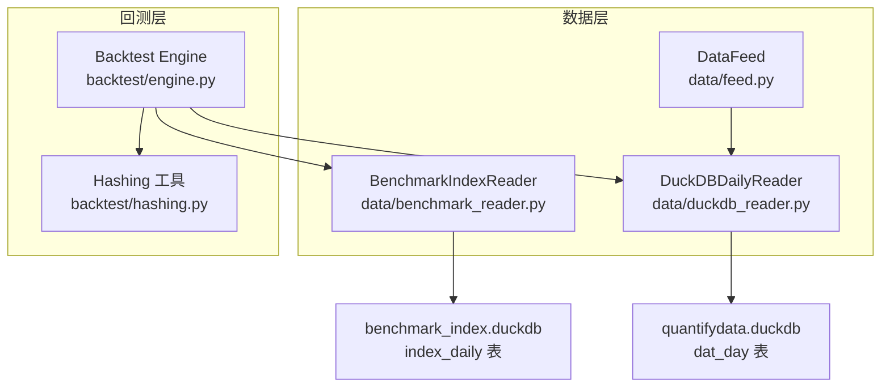
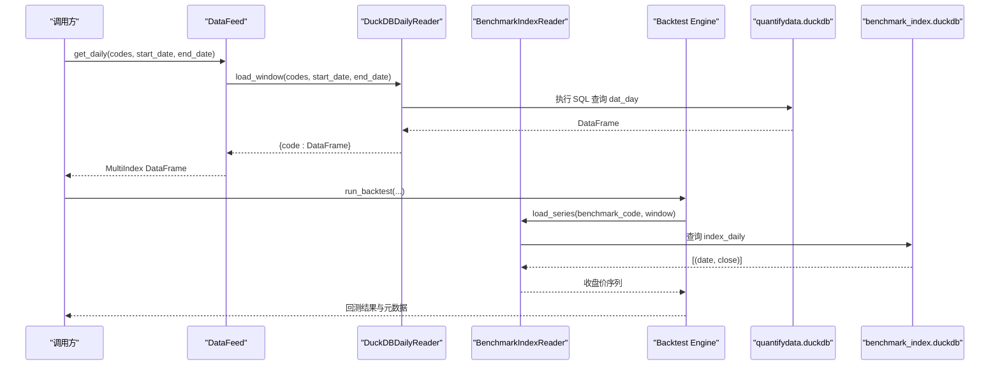
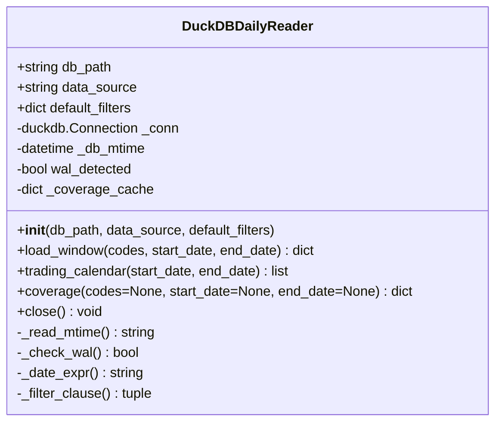
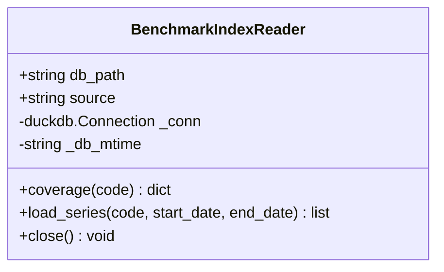
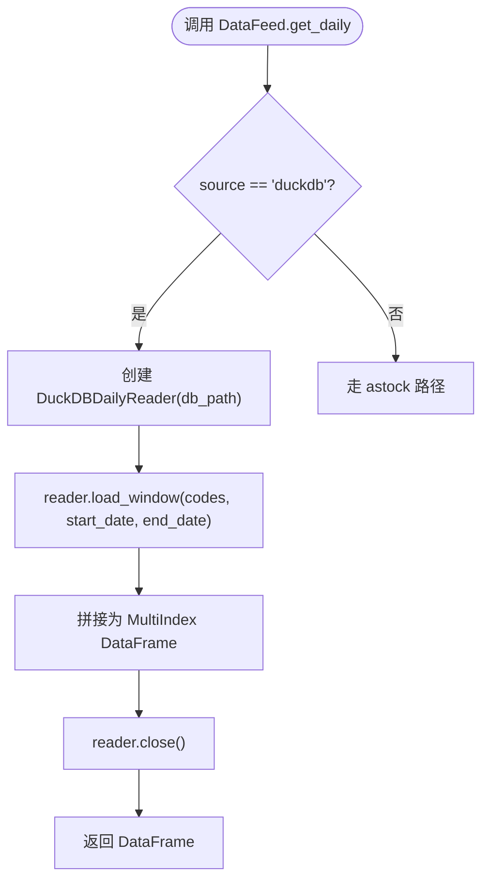
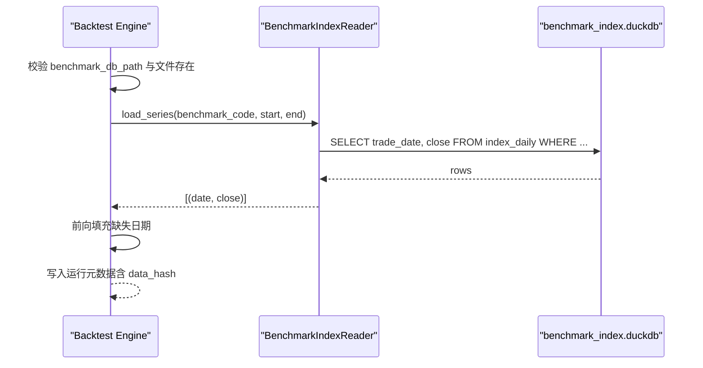
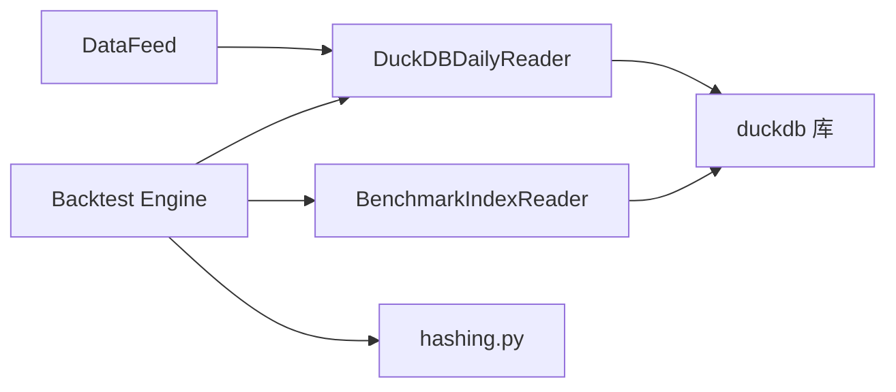

# DuckDB数据库配置

<cite>
**本文引用的文件**   
- [data/duckdb_reader.py](file://data/duckdb_reader.py)
- [data/benchmark_reader.py](file://data/benchmark_reader.py)
- [data/feed.py](file://data/feed.py)
- [backtest/engine.py](file://backtest/engine.py)
- [backtest/hashing.py](file://backtest/hashing.py)
</cite>

## 目录
1. [简介](#简介)
2. [项目结构](#项目结构)
3. [核心组件](#核心组件)
4. [架构总览](#架构总览)
5. [详细组件分析](#详细组件分析)
6. [依赖关系分析](#依赖关系分析)
7. [性能考虑与优化](#性能考虑与优化)
8. [故障排查指南](#故障排查指南)
9. [结论](#结论)
10. [附录](#附录)

## 简介
本文件面向 QuantLab 的 DuckDB 数据层，系统性说明：
- DuckDB 的安装与初始化（数据库文件、表结构与字段定义）
- 数据导入流程与批量插入优化建议
- 查询性能调优与索引策略
- 数据库维护与备份策略
- duckdb_reader.py 的实现原理与使用方法（连接管理、查询优化、错误处理等）

本项目中的 DuckDB 使用为只读模式，通过专用 Reader 类统一封装访问逻辑，确保回测与因子计算的数据一致性。

## 项目结构
与 DuckDB 相关的关键代码集中在 data 模块与 backtest 引擎中：
- data/duckdb_reader.py：A 股日线数据的只读 DuckDB Reader，支持多 schema 路径切换
- data/benchmark_reader.py：指数基准数据的只读 Reader，独立于 A 股日线 Reader
- data/feed.py：统一数据源接口，内部可切换到 DuckDB 读取日线
- backtest/engine.py：回测主循环，集成基准数据加载与运行元数据记录
- backtest/hashing.py：数据哈希计算，用于结果可复现性校验

图表来源 
- [data/duckdb_reader.py:35-58](file://data/duckdb_reader.py#L35-L58)
- [data/benchmark_reader.py:21-35](file://data/benchmark_reader.py#L21-L35)
- [data/feed.py:106-124](file://data/feed.py#L106-L124)
- [backtest/engine.py:38-100](file://backtest/engine.py#L38-L100)
- [backtest/hashing.py:10-20](file://backtest/hashing.py#L10-L20)

章节来源
- [data/duckdb_reader.py:1-215](file://data/duckdb_reader.py#L1-L215)
- [data/benchmark_reader.py:1-73](file://data/benchmark_reader.py#L1-L73)
- [data/feed.py:1-197](file://data/feed.py#L1-L197)
- [backtest/engine.py:1-200](file://backtest/engine.py#L1-L200)
- [backtest/hashing.py:1-23](file://backtest/hashing.py#L1-L23)

## 核心组件
- DuckDBDailyReader：统一 A 股日线数据读取器，支持两种 schema 路径（金策智算 v0.2 与 qmt_self_owned v0.3），对外输出统一列名 date/open/high/low/close/vol/amount
- BenchmarkIndexReader：指数基准数据读取器，仅读 index_daily 表，返回按日期升序的收盘价序列
- DataFeed：统一数据源接口，可按 source="duckdb" 切换至 DuckDB 读取日线
- Backtest Engine：回测主循环，负责基准数据加载、窗口切片、指标聚合与运行元数据记录
- Hashing：基于数据库路径、mtime、调整因子、时间窗口、覆盖率等信息生成数据哈希，保障结果可复现

章节来源
- [data/duckdb_reader.py:35-58](file://data/duckdb_reader.py#L35-L58)
- [data/benchmark_reader.py:21-35](file://data/benchmark_reader.py#L21-L35)
- [data/feed.py:17-41](file://data/feed.py#L17-L41)
- [backtest/engine.py:38-100](file://backtest/engine.py#L38-L100)
- [backtest/hashing.py:10-20](file://backtest/hashing.py#L10-L20)

## 架构总览
下图展示从上层调用到 DuckDB 的完整数据流，包括基准数据与 A 股日线的读取路径。

图表来源 
- [data/feed.py:106-124](file://data/feed.py#L106-L124)
- [data/duckdb_reader.py:90-132](file://data/duckdb_reader.py#L90-L132)
- [data/benchmark_reader.py:52-63](file://data/benchmark_reader.py#L52-L63)
- [backtest/engine.py:38-100](file://backtest/engine.py#L38-L100)

## 详细组件分析

### DuckDBDailyReader 实现原理与用法
- 连接管理
  - 构造时以 read_only=True 打开 DuckDB 文件，禁止写操作与 ATTACH
  - 记录数据库 mtime，便于缓存失效与数据哈希
  - 针对金策智算路径检测 .wal 文件并发出同步警告
- 双 schema 支持
  - jince_zhisuan：trade_time TIMESTAMP WITH TIME ZONE，同日多条需 QUALIFY ROW_NUMBER() 去重
  - qmt_self_owned：trade_date DATE，上游保证唯一，默认过滤 adjustment='hfq' 与 source='xtquant'
- 查询优化
  - 参数化 IN 列表与 BETWEEN 范围过滤
  - 对 qmt_self_owned 直接按 trade_date 筛选；对 jince_zhisuan 在 SQL 内完成去重
  - 覆盖度缓存 coverage()，避免重复统计
- 错误处理
  - 空 codes、不在覆盖范围内、文件不存在均抛出明确异常
  - close() 与析构函数确保连接释放

图表来源 
- [data/duckdb_reader.py:35-58](file://data/duckdb_reader.py#L35-L58)
- [data/duckdb_reader.py:77-88](file://data/duckdb_reader.py#L77-L88)
- [data/duckdb_reader.py:90-132](file://data/duckdb_reader.py#L90-L132)
- [data/duckdb_reader.py:146-205](file://data/duckdb_reader.py#L146-L205)

章节来源
- [data/duckdb_reader.py:1-215](file://data/duckdb_reader.py#L1-L215)

### BenchmarkIndexReader 实现原理与用法
- 只读模式打开 benchmark_index.duckdb，不写不 ATTACH
- 提供 coverage(code) 与 load_series(code, start_date, end_date)
- 返回 (date_str, close_float) 升序序列，缺失值转为 None

图表来源 
- [data/benchmark_reader.py:21-35](file://data/benchmark_reader.py#L21-L35)
- [data/benchmark_reader.py:40-63](file://data/benchmark_reader.py#L40-L63)

章节来源
- [data/benchmark_reader.py:1-73](file://data/benchmark_reader.py#L1-L73)

### DataFeed 与 DuckDB 集成
- DataFeed.get_daily(source="duckdb") 内部创建 DuckDBDailyReader 并调用 load_window
- 将 {code: DataFrame} 转换为 MultiIndex DataFrame（date, code）
- 自动关闭 reader 连接

图表来源 
- [data/feed.py:106-124](file://data/feed.py#L106-L124)

章节来源
- [data/feed.py:1-197](file://data/feed.py#L1-L197)

### Backtest Engine 与基准数据加载
- 默认基准数据库路径常量
- 加载基准序列时向前填充缺失，保证长窗口指标计算
- 记录运行元数据（含数据哈希、覆盖率、WAL 检测等）

图表来源 
- [backtest/engine.py:38-100](file://backtest/engine.py#L38-L100)
- [data/benchmark_reader.py:52-63](file://data/benchmark_reader.py#L52-L63)

章节来源
- [backtest/engine.py:1-200](file://backtest/engine.py#L1-L200)

## 依赖关系分析
- DuckDBDailyReader 依赖 duckdb 库，以只读方式连接 quantifydata.duckdb
- BenchmarkIndexReader 依赖 duckdb 库，以只读方式连接 benchmark_index.duckdb
- DataFeed 在 source="duckdb" 时依赖 DuckDBDailyReader
- Backtest Engine 依赖 BenchmarkIndexReader 与 DuckDBDailyReader（间接通过 feed）
- Hashing 模块被 Engine 用于生成数据哈希，确保结果可复现

图表来源 
- [data/feed.py:106-124](file://data/feed.py#L106-L124)
- [data/duckdb_reader.py:26-58](file://data/duckdb_reader.py#L26-L58)
- [data/benchmark_reader.py:16-35](file://data/benchmark_reader.py#L16-L35)
- [backtest/engine.py:38-100](file://backtest/engine.py#L38-L100)
- [backtest/hashing.py:10-20](file://backtest/hashing.py#L10-L20)

章节来源
- [data/duckdb_reader.py:1-215](file://data/duckdb_reader.py#L1-L215)
- [data/benchmark_reader.py:1-73](file://data/benchmark_reader.py#L1-L73)
- [data/feed.py:1-197](file://data/feed.py#L1-L197)
- [backtest/engine.py:1-200](file://backtest/engine.py#L1-L200)
- [backtest/hashing.py:1-23](file://backtest/hashing.py#L1-L23)

## 性能考虑与优化
- 查询层面
  - 使用参数化 IN 与 BETWEEN 减少解析开销
  - 对 jince_zhisuan 路径在 SQL 内完成去重，避免 Python 侧排序与分组
  - coverage() 结果缓存，避免重复统计
- 内存与 I/O
  - 只读模式降低锁竞争与 WAL 写入开销
  - 合理选择 codes 与时间窗口，避免全表扫描
- 索引建议（需在数据导入阶段创建）
  - 对 dat_day 表：(code, trade_date)、(code, trade_time) 复合索引
  - 对 index_daily 表：(code, trade_date)、(source) 复合索引
- 批处理导入优化
  - 使用 DuckDB 的 COPY 或 INSERT 批量写入，避免逐行提交
  - 导入前禁用索引，导入后再重建索引
  - 控制事务大小，分批提交，降低内存峰值

[本节为通用指导，不直接分析具体文件]

## 故障排查指南
- 文件不存在
  - DuckDBDailyReader/BenchmarkIndexReader 构造时检查文件存在性，不存在则抛出 FileNotFoundError
- 覆盖范围不足
  - load_window 会校验请求区间是否在 min_date/max_date 范围内，越界抛错
- WAL 同步冲突
  - jince_zhisuan 路径检测到 .wal 文件时发出警告，提示数据不稳定，应等待同步完成后重跑
- 基准数据缺失
  - Engine 加载基准序列时若为空或缺失过多前期数据，将返回失败原因

章节来源
- [data/duckdb_reader.py:47-56](file://data/duckdb_reader.py#L47-L56)
- [data/duckdb_reader.py:63-75](file://data/duckdb_reader.py#L63-L75)
- [data/duckdb_reader.py:90-98](file://data/duckdb_reader.py#L90-L98)
- [data/benchmark_reader.py:27-35](file://data/benchmark_reader.py#L27-L35)
- [backtest/engine.py:45-99](file://backtest/engine.py#L45-L99)

## 结论
QuantLab 的 DuckDB 数据层通过只读 Reader 抽象了不同数据源的差异，提供了统一的查询接口与健壮的错误处理。结合合理的索引设计与批处理导入策略，可在大规模回测场景中保持稳定的查询性能与结果可复现性。建议在数据同步完成后进行回测，以避免 WAL 带来的不确定性。

[本节为总结性内容，不直接分析具体文件]

## 附录

### DuckDB 安装与初始化步骤
- 安装 DuckDB 与 Python 绑定（如 pip install duckdb）
- 准备数据库文件路径（例如 quantifydata.duckdb、benchmark_index.duckdb）
- 创建表结构与字段类型（见下节“表结构设计”）
- 导入数据（参考“数据导入与批量插入优化”）
- 验证覆盖范围与查询性能（使用 coverage() 与典型查询）

[本节为通用指导，不直接分析具体文件]

### 表数据结构设计
- quantifydata.duckdb.dat_day
  - code: 股票代码（字符串）
  - trade_time: 交易时间戳（TIMESTAMP WITH TIME ZONE，jince_zhisuan 路径）
  - trade_date: 交易日期（DATE，qmt_self_owned 路径）
  - open/high/low/close: 价格字段（数值）
  - vol: 成交量（数值）
  - amount: 成交额（数值）
  - adjustment: 复权因子（数值，qmt_self_owned 默认 hfq）
  - source: 数据来源（字符串，qmt_self_owned 默认 xtquant）
- benchmark_index.duckdb.index_daily
  - code: 指数代码（字符串）
  - trade_date: 交易日期（DATE）
  - close: 收盘价（数值）
  - source: 数据来源（字符串）

[本节为通用指导，不直接分析具体文件]

### 数据导入与批量插入优化
- 使用 DuckDB 的 COPY INTO 或 INSERT 批量写入
- 导入前禁用索引，导入后重建索引
- 控制事务大小，分批提交，避免内存溢出
- 导入完成后校验行数与覆盖范围

[本节为通用指导，不直接分析具体文件]

### 查询性能调优与索引创建建议
- 为高频查询字段创建复合索引（如 code+trade_date）
- 使用 BETWEEN 与 IN 参数化查询，减少解析开销
- 避免在 Python 侧做大规模排序与分组，尽量在 SQL 内完成
- 使用 coverage() 缓存结果，避免重复统计

[本节为通用指导，不直接分析具体文件]

### 数据库维护与备份策略
- 定期备份 quantifydata.duckdb 与 benchmark_index.duckdb
- 监控 .wal 文件状态，避免在同步期间进行回测
- 清理无用索引与临时文件，保持数据库体积可控
- 建立版本化管理，便于回溯与对比

[本节为通用指导，不直接分析具体文件]

### duckdb_reader.py 使用示例（概念性）
- 初始化 Reader：传入数据库路径与 data_source（jince_zhisuan 或 qmt_self_owned）
- 获取覆盖范围：调用 coverage() 查看 min_date/max_date/n_codes 等
- 加载窗口数据：调用 load_window(codes, start_date, end_date) 获取 {code: DataFrame}
- 获取交易日历：调用 trading_calendar(start_date, end_date)
- 关闭连接：调用 close() 或在 finally 块中释放资源

[本节为概念性说明，不直接分析具体文件]