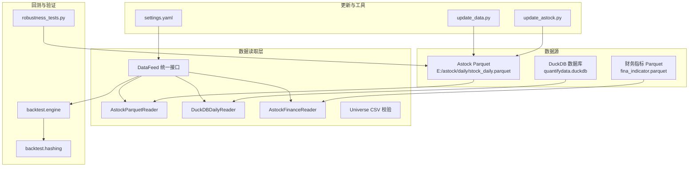
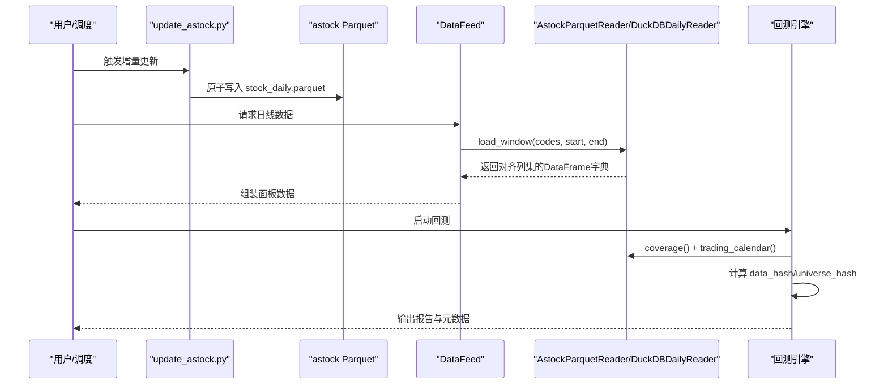
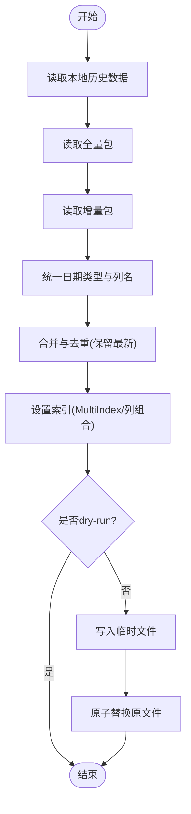
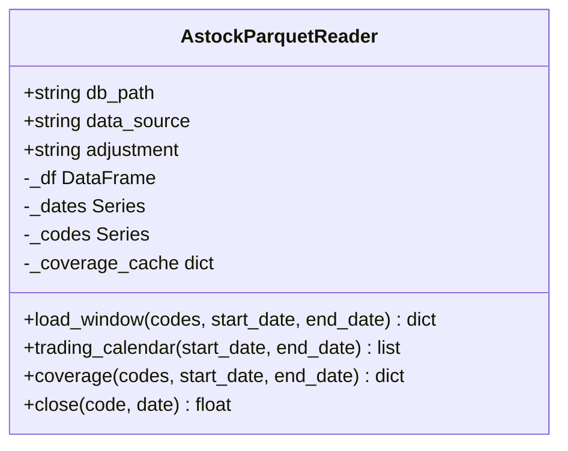
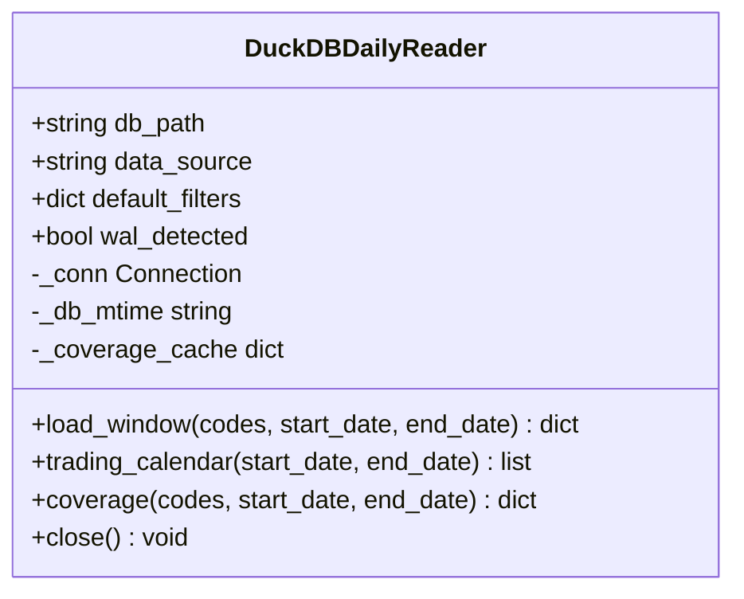
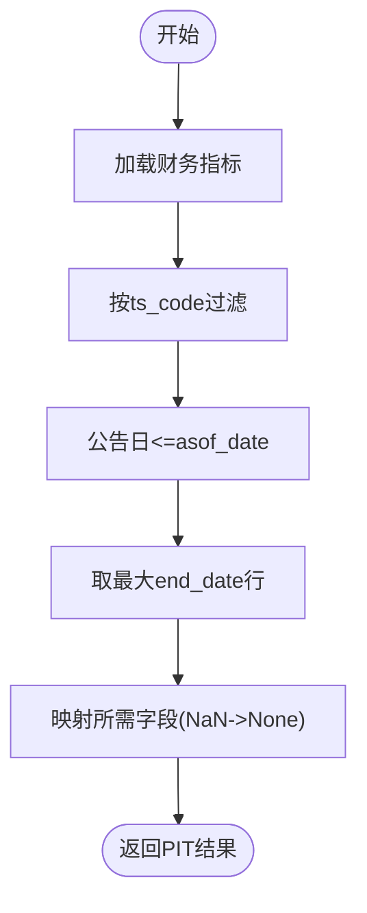
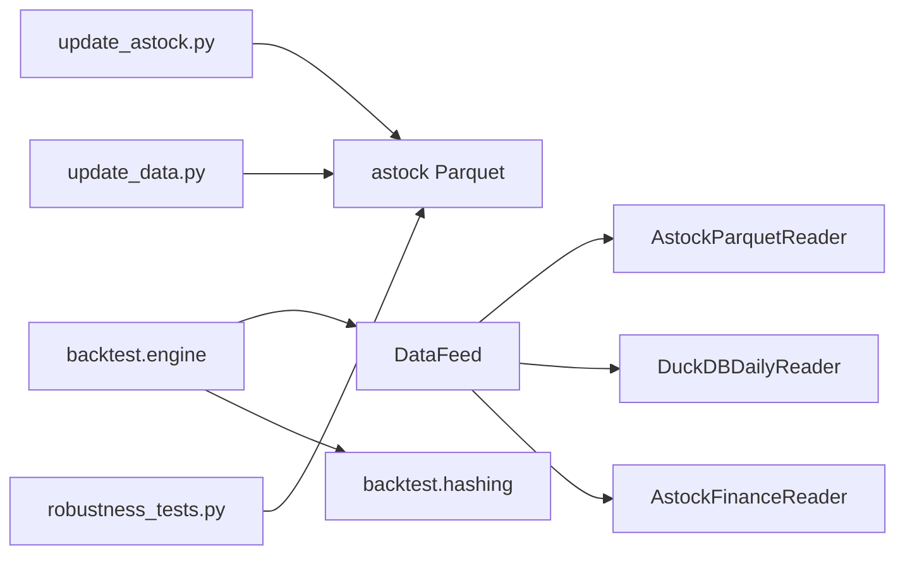

# 数据准备

<cite>
**本文引用的文件**   
- [astock_reader.py](file://data/astock_reader.py)
- [duckdb_reader.py](file://data/duckdb_reader.py)
- [astock_finance_reader.py](file://data/astock_finance_reader.py)
- [feed.py](file://data/feed.py)
- [universe.py](file://data/universe.py)
- [update_astock.py](file://scripts/update_astock.py)
- [update_data.py](file://scripts/update_data.py)
- [settings.yaml](file://config/settings.yaml)
- [engine.py](file://backtest/engine.py)
- [hashing.py](file://backtest/hashing.py)
- [robustness_tests.py](file://projects/verification/robustness_tests.py)
</cite>

## 目录
1. [简介](#简介)
2. [项目结构](#项目结构)
3. [核心组件](#核心组件)
4. [架构总览](#架构总览)
5. [详细组件分析](#详细组件分析)
6. [依赖关系分析](#依赖关系分析)
7. [性能考虑](#性能考虑)
8. [故障排查指南](#故障排查指南)
9. [结论](#结论)
10. [附录](#附录)

## 简介
本文件面向 QuantLab 的数据准备阶段，系统化说明 A 股（astock）数据的下载、清洗与 Parquet 转换流程；DuckDB 数据库的初始化、表结构与导入、索引优化建议；数据验证与质量检查方法；增量更新策略与备份方案；以及数据缓存机制与性能优化技巧。文档以仓库现有实现为依据，提供可追溯的文件来源与图示，帮助读者快速理解并落地执行。

## 项目结构
与数据准备相关的代码主要分布在以下模块：
- data 层：统一读取接口与具体 Reader（Parquet/DuckDB）、财务 PIT 读取、股票池校验
- scripts 层：增量更新脚本（日线/分钟线/基础信息）、一键更新脚本
- config：全局配置（数据源路径、缓存开关等）
- backtest：回测引擎对数据哈希与覆盖度的记录
- verification：健壮性测试（幸存者偏差等）

图表来源 
- [astock_reader.py:1-192](file://data/astock_reader.py#L1-L192)
- [duckdb_reader.py:1-215](file://data/duckdb_reader.py#L1-L215)
- [astock_finance_reader.py:1-200](file://data/astock_finance_reader.py#L1-L200)
- [feed.py:1-197](file://data/feed.py#L1-L197)
- [update_astock.py:1-219](file://scripts/update_astock.py#L1-L219)
- [update_data.py:1-135](file://scripts/update_data.py#L1-L135)
- [settings.yaml:1-69](file://config/settings.yaml#L1-L69)
- [engine.py:554-578](file://backtest/engine.py#L554-L578)
- [hashing.py:1-23](file://backtest/hashing.py#L1-L23)
- [robustness_tests.py:192-218](file://projects/verification/robustness_tests.py#L192-L218)

章节来源
- [feed.py:1-197](file://data/feed.py#L1-L197)
- [settings.yaml:1-69](file://config/settings.yaml#L1-L69)

## 核心组件
- AstockParquetReader：只读读取 astock 日线 Parquet，支持复权调整（raw/qfq/hfq），输出与 DuckDB 读取器一致的列集合，便于无感切换。
- DuckDBDailyReader：只读连接 DuckDB，按 data_source 选择不同 schema 路径，默认过滤 adjustment/source，返回统一列集。
- AstockFinanceReader：PIT 安全的财务指标读取，结合日频 PE 快照，避免未来函数。
- DataFeed：统一入口，根据 source 路由到 astock 或 duckdb 读取器，并提供面板数据构建能力。
- Universe CSV 加载器：严格校验代码格式、去重、启用标记等。
- update_astock.py / update_data.py：增量更新与一键更新脚本，保障原子写入与幂等合并。

章节来源
- [astock_reader.py:1-192](file://data/astock_reader.py#L1-L192)
- [duckdb_reader.py:1-215](file://data/duckdb_reader.py#L1-L215)
- [astock_finance_reader.py:1-200](file://data/astock_finance_reader.py#L1-L200)
- [feed.py:1-197](file://data/feed.py#L1-L197)
- [universe.py:1-62](file://data/universe.py#L1-L62)
- [update_astock.py:1-219](file://scripts/update_astock.py#L1-L219)
- [update_data.py:1-135](file://scripts/update_data.py#L1-L135)

## 架构总览
下图展示从原始数据到回测使用的端到端流程：增量更新脚本将外部更新包合并为本地 Parquet；DataFeed 作为统一入口，按需调用 AstockParquetReader 或 DuckDBDailyReader；回测引擎在运行期记录数据哈希与覆盖度，确保结果可复现与可审计。

图表来源 
- [update_astock.py:1-219](file://scripts/update_astock.py#L1-L219)
- [astock_reader.py:1-192](file://data/astock_reader.py#L1-L192)
- [duckdb_reader.py:1-215](file://data/duckdb_reader.py#L1-L215)
- [feed.py:1-197](file://data/feed.py#L1-L197)
- [engine.py:554-578](file://backtest/engine.py#L554-L578)
- [hashing.py:1-23](file://backtest/hashing.py#L1-L23)

## 详细组件分析

### Astock 日线数据：下载、清洗与 Parquet 转换
- 增量更新策略
  - daily：本地历史（早于截止日）+ 全量包（指定年份区间）+ 增量包（近期区间），按 (trade_date, ts_code) 去重，保留最新值。
  - minute：按周期与 code 拆分处理，保持 MultiIndex (trade_date, trade_time)，逐 code 合并后原子替换。
  - basic：按 ts_code 去重，日期字段统一为字符串格式。
- 原子写入
  - 先写 .tmp_update 临时文件，校验成功后 os.replace 原子替换，避免部分写入导致损坏。
- 列与索引规范
  - 统一 MultiIndex 或显式列组合，保证读取器能正确构建索引与筛选。
- 关键路径参考
  - 增量主流程与原子写入：[update_astock.py:42-92](file://scripts/update_astock.py#L42-L92)、[update_astock.py:95-118](file://scripts/update_astock.py#L95-L118)
  - 一键更新（简单增量）：[update_data.py:37-82](file://scripts/update_data.py#L37-L82)

图表来源 
- [update_astock.py:42-92](file://scripts/update_astock.py#L42-L92)
- [update_astock.py:95-118](file://scripts/update_astock.py#L95-L118)
- [update_data.py:37-82](file://scripts/update_data.py#L37-L82)

章节来源
- [update_astock.py:1-219](file://scripts/update_astock.py#L1-L219)
- [update_data.py:1-135](file://scripts/update_data.py#L1-L135)

### Astock 日线读取器（Parquet）
- 设计要点
  - 只读访问，仅加载必要列以降低内存占用。
  - 自动构建 (trade_date, ts_code) 的 MultiIndex，兼容历史格式。
  - 支持 raw/qfq/hfq 复权调整，按 adj_factor 计算价格修正。
  - 提供 load_window/trading_calendar/coverage/close 四方法，与 DuckDB 读取器一致。
- 性能与约束
  - 通过列裁剪与索引筛选减少 I/O 与内存。
  - 空范围或无数据时抛出明确异常，便于上层处理。
- 关键路径参考
  - 构造与列裁剪：[astock_reader.py:35-66](file://data/astock_reader.py#L35-L66)
  - 窗口加载与复权逻辑：[astock_reader.py:71-116](file://data/astock_reader.py#L71-L116)
  - 交易日历与覆盖度：[astock_reader.py:118-161](file://data/astock_reader.py#L118-L161)
  - 收盘价查询与清理：[astock_reader.py:163-192](file://data/astock_reader.py#L163-L192)

图表来源 
- [astock_reader.py:25-192](file://data/astock_reader.py#L25-L192)

章节来源
- [astock_reader.py:1-192](file://data/astock_reader.py#L1-L192)

### DuckDB 读取器（v0.2/v0.3 双路径）
- 设计要点
  - 只读连接，禁止写操作与 ATTACH。
  - 通过 data_source 区分 schema：jince_zhisuan（需 QUALIFY 去重）与 qmt_self_owned（默认过滤 adjustment/source）。
  - WAL 检测：当存在 .wal 文件时发出警告，提示同步未完成前数据哈希不稳定。
  - 统一对外列：date, open, high, low, close, vol, amount。
- 关键路径参考
  - 初始化与默认过滤：[duckdb_reader.py:42-57](file://data/duckdb_reader.py#L42-L57)
  - WAL 检测与时间戳：[duckdb_reader.py:59-75](file://data/duckdb_reader.py#L59-L75)
  - SQL 生成与去重策略：[duckdb_reader.py:77-132](file://data/duckdb_reader.py#L77-L132)
  - 覆盖度统计与缺失检测：[duckdb_reader.py:146-205](file://data/duckdb_reader.py#L146-L205)

图表来源 
- [duckdb_reader.py:35-215](file://data/duckdb_reader.py#L35-L215)

章节来源
- [duckdb_reader.py:1-215](file://data/duckdb_reader.py#L1-L215)

### 财务数据与 PIT 安全读取
- 设计要点
  - 基于 fina_indicator.parquet 与 stock_daily.parquet 的 pe/pe_ttm 快照。
  - PIT 规则：公告日（ann_date/f_ann_date）<= asof_date 可见，取最大 end_date 的最新季度。
  - 日频 PE 自然反前瞻，要求 trade_date <= asof_date。
- 关键路径参考
  - 财务指标 PIT 查询：[astock_finance_reader.py:66-129](file://data/astock_finance_reader.py#L66-L129)
  - 日频 PE 快照：[astock_finance_reader.py:135-174](file://data/astock_finance_reader.py#L135-L174)
  - 评分便捷接口：[astock_finance_reader.py:180-191](file://data/astock_finance_reader.py#L180-L191)

图表来源 
- [astock_finance_reader.py:66-129](file://data/astock_finance_reader.py#L66-L129)

章节来源
- [astock_finance_reader.py:1-200](file://data/astock_finance_reader.py#L1-L200)

### 统一数据接口与面板构建
- DataFeed 根据 source 路由到 astock 或 duckdb 读取器，封装常用方法 get_daily/get_universe/get_financials。
- 面板构建示例：选取最近交易日，按成交额排序获取股票池，再拉取日线与财务数据，进行透视与前向填充。
- 关键路径参考
  - 统一接口与路由：[feed.py:17-41](file://data/feed.py#L17-L41)
  - astock 日线读取：[feed.py:71-104](file://data/feed.py#L71-L104)
  - DuckDB 日线读取：[feed.py:106-124](file://data/feed.py#L106-L124)
  - 面板构建与财务透视：[feed.py:137-181](file://data/feed.py#L137-L181)

章节来源
- [feed.py:1-197](file://data/feed.py#L1-L197)

### 股票池校验（Universe CSV）
- 规则
  - 首列必须为 code，匹配正则 ^\d{6}\.(SZ|SH)$。
  - enabled 可选，默认 true；false/0/no/空视为 false。
  - 重复 code 保留首次，后续跳过并告警。
  - 空结果抛错。
- 关键路径参考
  - 校验与去重逻辑：[universe.py:27-61](file://data/universe.py#L27-L61)

章节来源
- [universe.py:1-62](file://data/universe.py#L1-L62)

## 依赖关系分析
- 数据读取层依赖
  - DataFeed 依赖 AstockParquetReader 与 DuckDBDailyReader，二者实现相同契约，便于无缝切换。
  - AstockFinanceReader 依赖 astock 日线与财务 Parquet。
- 更新脚本依赖
  - update_astock.py 依赖 pandas/pyarrow，负责增量合并与原子写入。
  - update_data.py 提供简单增量与 CSV 再生成。
- 回测与验证
  - engine.py 使用 reader.coverage() 与 mtime 等信息计算 data_hash 与 universe_hash，记录 WAL 状态。
  - hashing.py 提供哈希计算工具。
  - robustness_tests.py 用于幸存者偏差等数据质量检查。

图表来源 
- [feed.py:1-197](file://data/feed.py#L1-L197)
- [astock_reader.py:1-192](file://data/astock_reader.py#L1-L192)
- [duckdb_reader.py:1-215](file://data/duckdb_reader.py#L1-L215)
- [astock_finance_reader.py:1-200](file://data/astock_finance_reader.py#L1-L200)
- [update_astock.py:1-219](file://scripts/update_astock.py#L1-L219)
- [update_data.py:1-135](file://scripts/update_data.py#L1-L135)
- [engine.py:554-578](file://backtest/engine.py#L554-L578)
- [hashing.py:1-23](file://backtest/hashing.py#L1-L23)
- [robustness_tests.py:192-218](file://projects/verification/robustness_tests.py#L192-L218)

章节来源
- [engine.py:554-578](file://backtest/engine.py#L554-L578)
- [hashing.py:1-23](file://backtest/hashing.py#L1-L23)

## 性能考虑
- Parquet 列裁剪与索引
  - AstockParquetReader 仅读取必要列，降低内存占用；通过 MultiIndex 加速日期与代码筛选。
- 只读与最小化 I/O
  - DuckDB 读取器以 read_only 模式连接，避免锁竞争与写放大。
- 增量与并行
  - update_astock.py 对分钟级数据按 code 拆分，支持多进程并行处理，缩短整体耗时。
- 缓存策略
  - settings.yaml 中开启 cache 并设置过期天数；DataFeed 内部也维护短期缓存以减少重复读取。
- 数据哈希与稳定性
  - engine.py 记录 data_hash/universe_hash/db_mtime，配合 WAL 检测，确保回测结果稳定可复现。

章节来源
- [astock_reader.py:35-66](file://data/astock_reader.py#L35-L66)
- [duckdb_reader.py:42-57](file://data/duckdb_reader.py#L42-L57)
- [update_astock.py:121-178](file://scripts/update_astock.py#L121-L178)
- [settings.yaml:16-19](file://config/settings.yaml#L16-L19)
- [engine.py:554-578](file://backtest/engine.py#L554-L578)

## 故障排查指南
- WAL 同步冲突
  - DuckDB 读取器检测到 .wal 文件会发出警告，建议在同步完成后重新运行回测，避免 data_hash 不稳定。
- 数据缺失与覆盖度
  - 使用 coverage() 检查 min_date/max_date/n_codes/n_rows_after_dedup/dedup_count；针对特定 codes/date 范围检查 missing 列表。
- 幸存者偏差与退市标记
  - 通过 robustness_tests.py 检查初始股票数与退市标记，必要时引入 delist_date/is_delist 字段。
- 字段缺失与一致性
  - check_fields.py 可用于核对策略所需财务字段与 CSV 列的一致性。
- 常见错误
  - 路径不存在、文件格式不匹配、日期类型不一致、空范围请求等，均会在读取器或脚本中抛出明确异常。

章节来源
- [duckdb_reader.py:59-75](file://data/duckdb_reader.py#L59-L75)
- [astock_reader.py:118-161](file://data/astock_reader.py#L118-L161)
- [robustness_tests.py:192-218](file://projects/verification/robustness_tests.py#L192-L218)
- [check_fields.py:1-32](file://scripts/check_fields.py#L1-L32)

## 结论
QuantLab 的数据准备体系以 Parquet 与 DuckDB 为核心，提供高可靠、高性能且可复现的数据管道。增量更新脚本采用原子写入与幂等合并，读取器遵循统一契约，回测引擎记录数据哈希与覆盖度，确保结果稳定与可审计。通过严格的校验与稳健的质量检查，系统能够有效规避常见数据问题，支撑因子研究与策略回测的高效迭代。

## 附录
- 数据源路径与缓存配置
  - 全局配置位于 settings.yaml，包含 astock 路径、finance/basic 路径、缓存开关与过期策略。
- 一键更新命令
  - 使用 scripts/update_data.bat 或 python scripts/update_data.py 执行一键更新。
- 增量更新参数
  - update_astock.py 支持 --dry 预览、--periods 指定分钟周期、--workers 控制并行度。

章节来源
- [settings.yaml:1-69](file://config/settings.yaml#L1-L69)
- [update_data.py:117-135](file://scripts/update_data.py#L117-L135)
- [update_astock.py:201-218](file://scripts/update_astock.py#L201-L218)