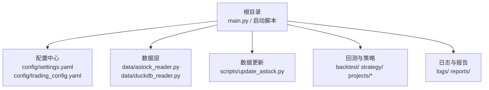
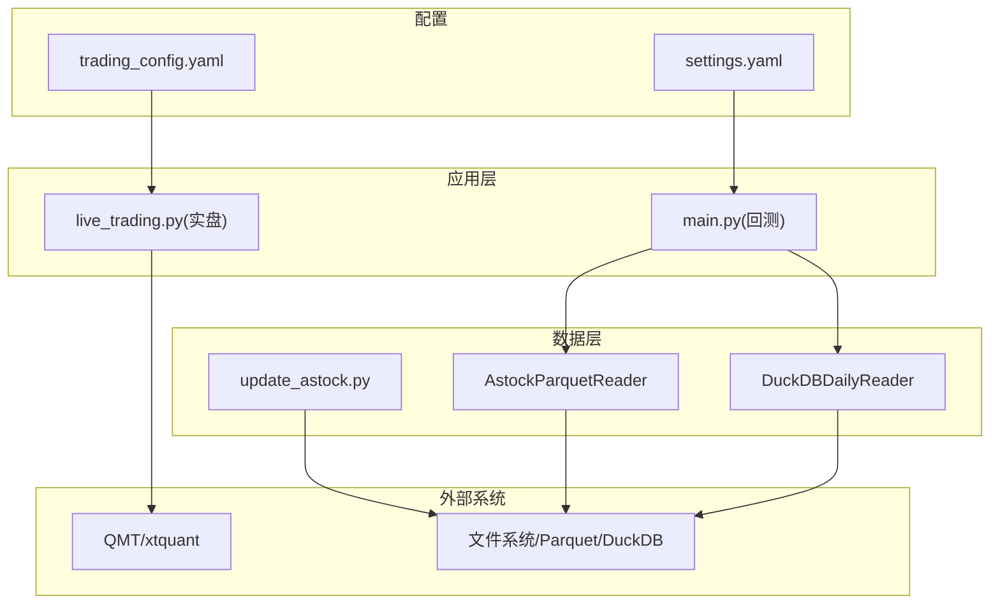
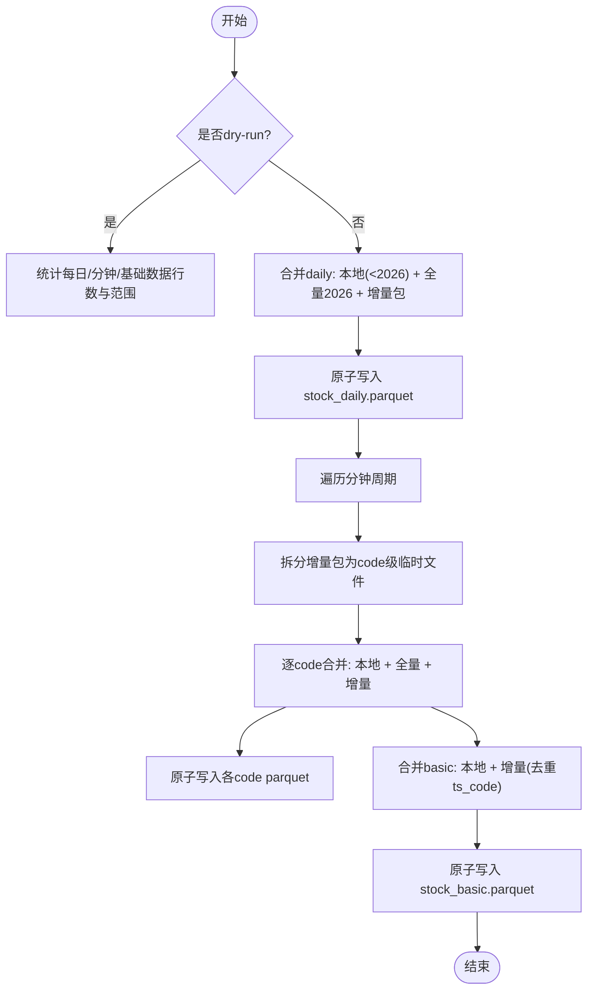
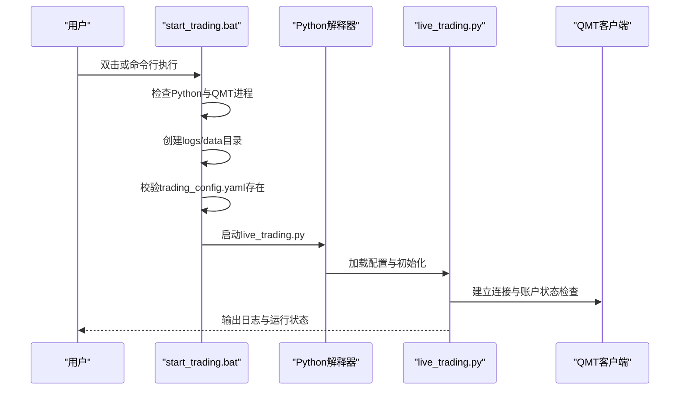
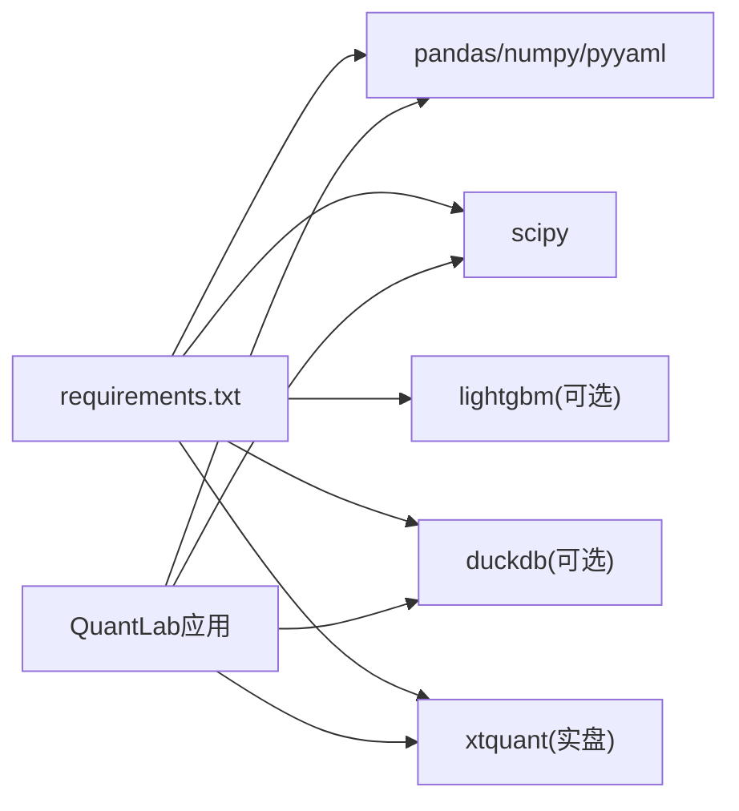

# 环境部署

<cite>
**本文引用的文件**
- [requirements.txt](file://requirements.txt)
- [setup.py](file://setup.py)
- [config/settings.yaml](file://config/settings.yaml)
- [config/trading_config.yaml](file://config/trading_config.yaml)
- [main.py](file://main.py)
- [scripts/update_astock.py](file://scripts/update_astock.py)
- [data/astock_reader.py](file://data/astock_reader.py)
- [data/duckdb_reader.py](file://data/duckdb_reader.py)
- [start_trading.bat](file://start_trading.bat)
- [start_trading_qmt.bat](file://start_trading_qmt.bat)
- [scripts/update_data.bat](file://scripts/update_data.bat)
- [AGENTS.md](file://AGENTS.md)
- [实盘配置指南.md](file://实盘配置指南.md)
- [miniQMT实盘对接_生产级完善方案.md](file://miniQMT实盘对接_生产级完善方案.md)
</cite>

## 目录
1. [简介](#简介)
2. [项目结构](#项目结构)
3. [核心组件](#核心组件)
4. [架构总览](#架构总览)
5. [详细组件分析](#详细组件分析)
6. [依赖关系分析](#依赖关系分析)
7. [性能考虑](#性能考虑)
8. [故障排查指南](#故障排查指南)
9. [结论](#结论)
10. [附录](#附录)

## 简介
本文件面向 QuantLab 的环境部署与初始化，覆盖系统要求、依赖安装、虚拟环境与源码安装流程、配置文件说明（settings.yaml、trading_config.yaml）、数据源准备（astock 下载与更新、DuckDB 初始化与读取）、生产环境部署要点（服务器配置、权限与安全加固），以及容器化部署建议。文档同时给出关键流程图与架构图，帮助不同技术背景的读者快速上手并稳定运行。

## 项目结构
QuantLab 采用“策略/因子/回测/数据/交易”分层组织：
- 根目录入口与脚本：main.py、批处理脚本、一键配置脚本等
- 配置中心：config/settings.yaml（全局）、config/trading_config.yaml（实盘）
- 数据层：data/astock_reader.py、data/duckdb_reader.py、scripts/update_astock.py
- 策略与回测：backtest/、strategy/、projects/...
- 日志与报告：logs/、reports/

图表来源
- [main.py:1-104](file://main.py#L1-L104)
- [config/settings.yaml:1-69](file://config/settings.yaml#L1-L69)
- [config/trading_config.yaml:1-59](file://config/trading_config.yaml#L1-L59)
- [data/astock_reader.py:1-192](file://data/astock_reader.py#L1-L192)
- [data/duckdb_reader.py:1-215](file://data/duckdb_reader.py#L1-L215)
- [scripts/update_astock.py:1-219](file://scripts/update_astock.py#L1-L219)

章节来源
- [main.py:1-104](file://main.py#L1-L104)
- [AGENTS.md:83-109](file://AGENTS.md#L83-L109)

## 核心组件
- 配置系统
  - settings.yaml：项目信息、数据源路径、回测参数、因子预处理、默认股票池、日志输出等
  - trading_config.yaml：账号与 QMT 路径、交易参数、风控阈值、委托管理、调度计划、通知、数据源与缓存路径
- 数据读取器
  - AstockParquetReader：从 astock parquet 中按窗口加载 OHLCV 等字段，支持复权计算与只读访问
  - DuckDBDailyReader：统一读取两种 DuckDB schema（jince_zhisuan、qmt_self_owned），提供交易日、覆盖率与窗口查询
- 数据更新
  - update_astock.py：增量合并 daily/minute/basic 数据，原子写入避免损坏
- 启动与运行
  - main.py：回测入口，加载配置并执行指定策略
  - start_trading.bat / start_trading_qmt.bat：检查环境、创建目录、校验配置后启动实盘

章节来源
- [config/settings.yaml:1-69](file://config/settings.yaml#L1-L69)
- [config/trading_config.yaml:1-59](file://config/trading_config.yaml#L1-L59)
- [data/astock_reader.py:1-192](file://data/astock_reader.py#L1-L192)
- [data/duckdb_reader.py:1-215](file://data/duckdb_reader.py#L1-L215)
- [scripts/update_astock.py:1-219](file://scripts/update_astock.py#L1-L219)
- [main.py:1-104](file://main.py#L1-L104)
- [start_trading.bat:1-51](file://start_trading.bat#L1-L51)
- [start_trading_qmt.bat:1-66](file://start_trading_qmt.bat#L1-L66)

## 架构总览
QuantLab 的运行时由“配置 → 数据 → 策略/回测 → 日志/报告”构成；实盘模式通过 QMT 接口完成下单与风控。

图表来源
- [config/settings.yaml:1-69](file://config/settings.yaml#L1-L69)
- [config/trading_config.yaml:1-59](file://config/trading_config.yaml#L1-L59)
- [data/astock_reader.py:1-192](file://data/astock_reader.py#L1-L192)
- [data/duckdb_reader.py:1-215](file://data/duckdb_reader.py#L1-L215)
- [scripts/update_astock.py:1-219](file://scripts/update_astock.py#L1-L219)
- [main.py:1-104](file://main.py#L1-L104)

## 详细组件分析

### 系统要求与依赖安装
- Python 版本与环境
  - 建议使用 Python 3.9+（结合 pandas>=2.0、numpy>=1.24 的要求）
  - 推荐使用虚拟环境隔离依赖
- 操作系统兼容性
  - Windows 为主（批处理脚本、QMT 客户端路径均为 Windows 风格）
  - Linux/macOS 可运行纯 Python 部分，但 QMT 集成需适配
- 必要系统库与可选依赖
  - 核心：pandas、numpy、pyyaml
  - 回测：scipy
  - ML（可选）：lightgbm 等
  - 可视化（可选）：streamlit、plotly
  - 数据源（可选）：tushare、akshare
  - QMT 实盘：xtquant（从 QMT 安装目录复制）

章节来源
- [requirements.txt:1-29](file://requirements.txt#L1-L29)

### 安装流程（pip、源码、虚拟环境）
- 使用 pip 安装依赖
  - 在项目根目录执行依赖安装命令
- 源码安装与目录准备
  - 运行 setup.py 进行一键配置（查找 xtquant 源路径、复制到 site-packages、验证导入、创建 logs/data/cache 目录）
- 虚拟环境建议
  - 创建独立虚拟环境，激活后再安装依赖与运行脚本

章节来源
- [setup.py:1-82](file://setup.py#L1-L82)

### 配置文件设置与最佳实践
- settings.yaml（全局配置）
  - project：项目名称、版本、根路径
  - data：数据源类型与 astock 路径、缓存开关与过期天数
  - backtest：回测起止日期、初始资金、手续费与滑点、基准指数
  - logging：日志级别、目录、文件大小与备份数量
  - factors：中性化、标准化、去极值方法与参数
  - strategy：默认股票池与市值区间
  - trading：指向 trading_config.yaml，默认关闭实盘
- trading_config.yaml（实盘配置）
  - account：账号 ID、QMT 路径、会话 ID
  - trading：初始资金、仓位上限、佣金印花税、滑点
  - risk：止损、最大回撤、最长持有天数、单日换手上限
  - order：委托超时、重试次数、价格容差、未成交自动撤单
  - schedule：盘前、开盘、午后检查、风控间隔、尾盘时间
  - notification：通知开关、方式与 webhook
  - data：主数据源、astock 路径、缓存目录
  - strategy：示例策略名称、股票池、调仓频率与因子权重

最佳实践
- 将敏感信息（如路径、webhook）与业务参数分离，便于多环境切换
- 生产环境默认关闭实盘开关，仅在确认无误后开启
- 日志目录与缓存目录需具备写权限且定期清理

章节来源
- [config/settings.yaml:1-69](file://config/settings.yaml#L1-L69)
- [config/trading_config.yaml:1-59](file://config/trading_config.yaml#L1-L59)
- [AGENTS.md:83-109](file://AGENTS.md#L83-L109)

### 数据源准备（astock 与 DuckDB）
- astock 数据更新
  - 使用 scripts/update_astock.py 合并 daily/minute/basic 数据
  - 支持 dry-run 统计不落盘，分钟周期可按 code 并行处理
  - 原子写入保证数据一致性
- DuckDB 读取
  - DuckDBDailyReader 支持两种 schema（jince_zhisuan、qmt_self_owned）
  - 提供 load_window、trading_calendar、coverage、close 方法
  - WAL 检测与警告，确保数据同步期间的一致性提示
- Astock Parquet 读取
  - AstockParquetReader 以 MultiIndex 形式加载 OHLCV 等字段
  - 支持复权（hfq/qfq/raw），仅读取必要列降低内存占用

图表来源
- [scripts/update_astock.py:1-219](file://scripts/update_astock.py#L1-L219)

章节来源
- [scripts/update_astock.py:1-219](file://scripts/update_astock.py#L1-L219)
- [data/duckdb_reader.py:1-215](file://data/duckdb_reader.py#L1-L215)
- [data/astock_reader.py:1-192](file://data/astock_reader.py#L1-L192)

### 启动与运行（回测与实盘）
- 回测入口
  - main.py 加载 settings.yaml，选择策略并执行回测
  - 支持命令行参数指定策略名称与日期范围
- 实盘启动
  - start_trading.bat：检查 Python、QMT 进程、创建目录、校验配置后启动 live_trading.py
  - start_trading_qmt.bat：使用 QMT 内置 Python 运行，自动检测并可选启动 QMT

图表来源
- [start_trading.bat:1-51](file://start_trading.bat#L1-L51)
- [start_trading_qmt.bat:1-66](file://start_trading_qmt.bat#L1-L66)
- [main.py:1-104](file://main.py#L1-L104)

章节来源
- [main.py:1-104](file://main.py#L1-L104)
- [start_trading.bat:1-51](file://start_trading.bat#L1-L51)
- [start_trading_qmt.bat:1-66](file://start_trading_qmt.bat#L1-L66)

### 生产环境部署指南
- 服务器配置
  - 使用独立用户与最小权限原则运行服务
  - 固定 Python 版本与依赖环境（虚拟环境或容器）
  - 日志与数据目录分离到高性能磁盘
- 权限与安全加固
  - 限制对 QMT 路径与数据目录的读写权限
  - 配置文件中的敏感信息加密或环境变量注入
  - 启用防火墙与网络白名单，仅允许必要的端口通信
- 监控与告警
  - 启用通知模块（企业微信/钉钉 webhook）
  - 定期巡检日志与数据完整性（WAL 检测、覆盖率检查）

章节来源
- [config/trading_config.yaml:1-59](file://config/trading_config.yaml#L1-L59)
- [AGENTS.md:83-109](file://AGENTS.md#L83-L109)
- [实盘配置指南.md:82-158](file://实盘配置指南.md#L82-L158)

### 容器化部署方案（建议）
- Docker 镜像构建
  - 基于官方 Python 镜像，安装依赖（requirements.txt）
  - 拷贝项目代码与配置文件，设置工作目录与入口命令
  - 挂载数据卷（astock、DuckDB、日志、缓存）
- 编排配置（docker-compose）
  - 定义服务：数据更新任务、回测任务、实盘服务
  - 环境变量注入敏感配置（路径、webhook）
  - 健康检查与重启策略
- 注意事项
  - QMT 客户端通常为 Windows 专有，容器内无法直接运行；可在 Windows 主机上运行 QMT，容器通过 API 或文件交换与主机交互
  - 数据持久化必须通过卷挂载，避免容器重建丢失

[本节为概念性指导，不直接映射具体代码文件]

## 依赖关系分析
- 核心依赖
  - pandas、numpy、pyyaml：数据处理与配置解析
  - scipy：科学计算
  - lightgbm：机器学习（可选）
  - duckdb：高性能嵌入式数据库（可选）
  - xtquant：QMT 接口（实盘必需）
- 外部系统
  - QMT 客户端：提供交易接口与行情通道
  - astock 数据源：parquet 格式的历史与财务数据
  - DuckDB：结构化历史数据存储

图表来源
- [requirements.txt:1-29](file://requirements.txt#L1-L29)

章节来源
- [requirements.txt:1-29](file://requirements.txt#L1-L29)

## 性能考虑
- 数据读取优化
  - AstockParquetReader 仅读取必要列，减少内存占用
  - DuckDB 使用 read_only 模式与索引过滤，提升查询效率
- 并发与并行
  - update_astock.py 支持分钟周期按 code 并行处理，提高大数据量更新速度
- 缓存与过期
  - 启用缓存目录与过期策略，减少重复 IO 压力
- 日志轮转
  - 合理设置日志文件大小与备份数量，避免磁盘占满

章节来源
- [data/astock_reader.py:1-192](file://data/astock_reader.py#L1-L192)
- [data/duckdb_reader.py:1-215](file://data/duckdb_reader.py#L1-L215)
- [scripts/update_astock.py:1-219](file://scripts/update_astock.py#L1-L219)
- [config/settings.yaml:1-69](file://config/settings.yaml#L1-L69)

## 故障排查指南
- xtquant 导入失败
  - 检查 setup.py 是否正确复制 xtquant 到 site-packages
  - 确认 QMT 已启动且路径正确
- 数据不一致或覆盖不足
  - 运行 update_astock.py 的 dry-run 查看统计信息
  - 检查 DuckDB WAL 是否存在，等待同步完成
- 配置错误
  - 校验 settings.yaml 与 trading_config.yaml 的路径与参数
  - 确认日志与缓存目录存在且有写权限
- 启动失败
  - 使用 start_trading.bat 与 start_trading_qmt.bat 的输出定位问题
  - 检查 Python 版本与依赖是否满足 requirements.txt

章节来源
- [setup.py:1-82](file://setup.py#L1-L82)
- [scripts/update_astock.py:1-219](file://scripts/update_astock.py#L1-L219)
- [data/duckdb_reader.py:1-215](file://data/duckdb_reader.py#L1-L215)
- [start_trading.bat:1-51](file://start_trading.bat#L1-L51)
- [start_trading_qmt.bat:1-66](file://start_trading_qmt.bat#L1-L66)
- [实盘配置指南.md:82-158](file://实盘配置指南.md#L82-L158)

## 结论
QuantLab 提供了完整的数据、回测与实盘能力，通过清晰的配置体系与模块化设计，便于在不同环境中快速部署与扩展。遵循本文的安装、配置与运维建议，可确保系统在开发与生产环境下稳定运行。对于容器化与跨平台场景，建议结合企业实际进行适配与加固。

## 附录
- 常用命令
  - 数据更新：scripts/update_data.bat
  - 回测运行：python main.py --strategy project_01
  - 实盘启动：start_trading.bat 或 start_trading_qmt.bat
- 参考文档
  - AGENTS.md：配置系统与文件通信规范
  - miniQMT实盘对接_生产级完善方案.md：生产级配置与流程

章节来源
- [scripts/update_data.bat:1-15](file://scripts/update_data.bat#L1-L15)
- [main.py:1-104](file://main.py#L1-L104)
- [AGENTS.md:83-109](file://AGENTS.md#L83-L109)
- [miniQMT实盘对接_生产级完善方案.md:26-72](file://miniQMT实盘对接_生产级完善方案.md#L26-L72)