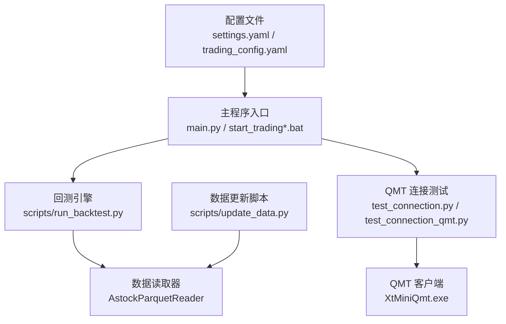
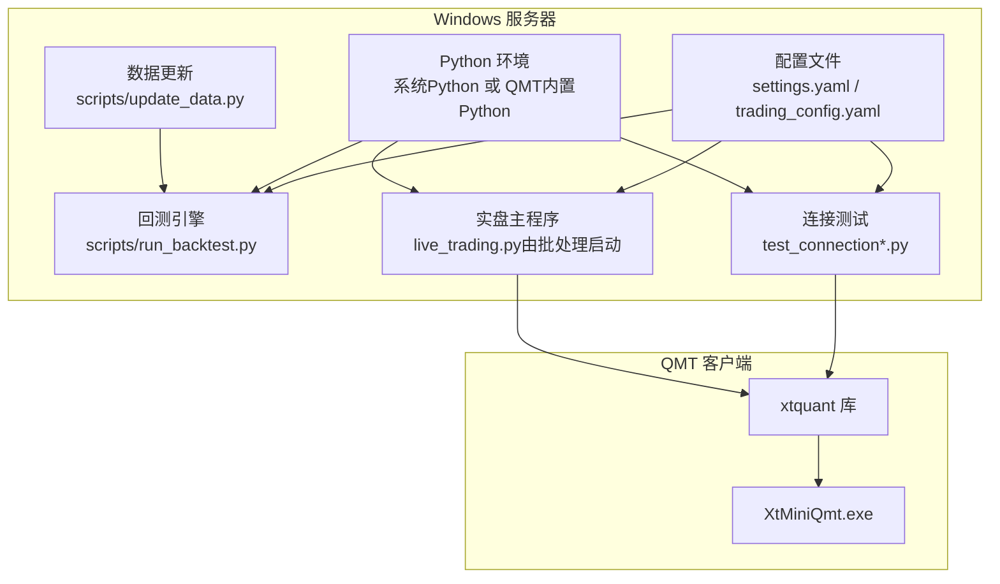
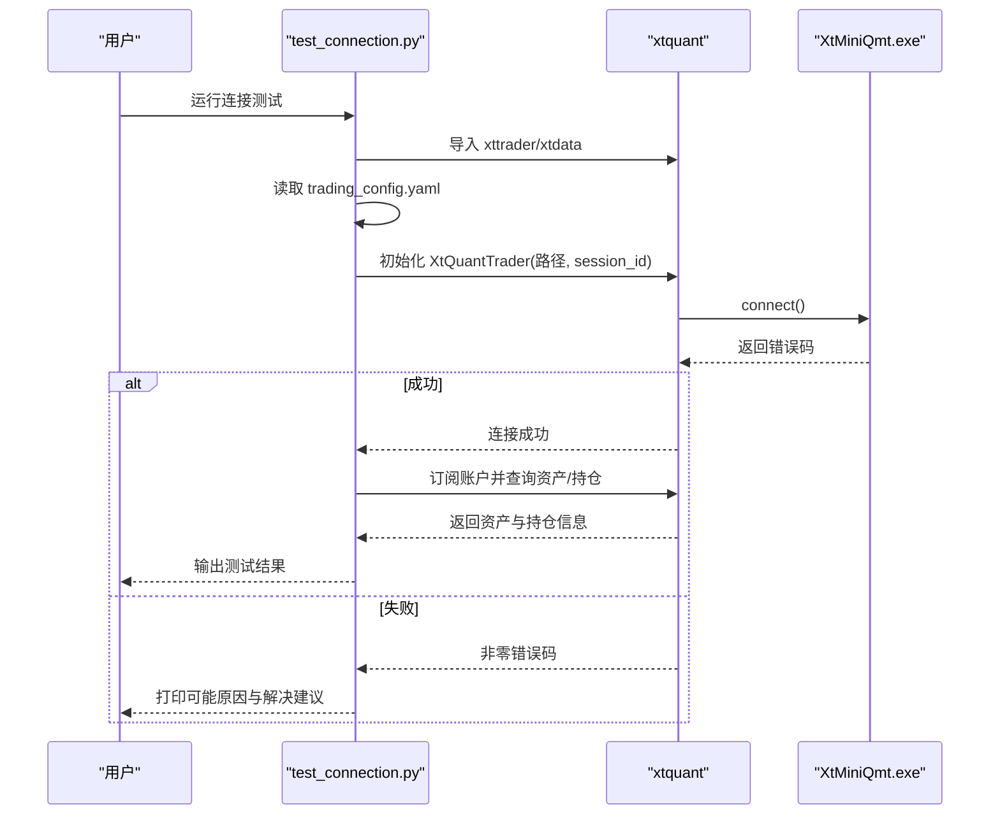
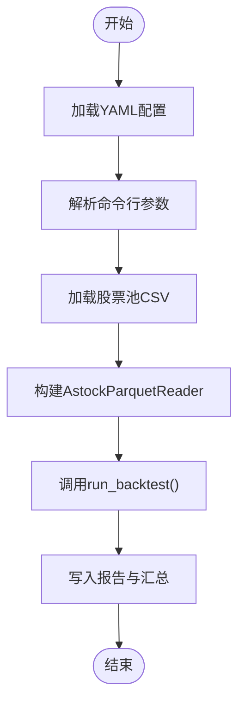
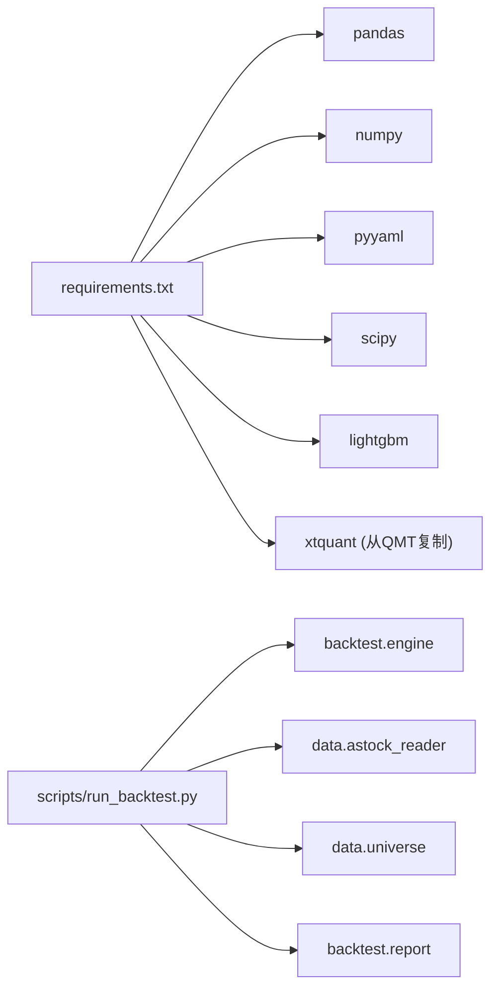

# 服务器配置

<cite>
**本文引用的文件**   
- [requirements.txt](file://requirements.txt)
- [setup.py](file://setup.py)
- [config/settings.yaml](file://config/settings.yaml)
- [config/trading_config.yaml](file://config/trading_config.yaml)
- [main.py](file://main.py)
- [start_trading.bat](file://start_trading.bat)
- [start_trading_qmt.bat](file://start_trading_qmt.bat)
- [test_connection.py](file://test_connection.py)
- [test_connection_qmt.py](file://test_connection_qmt.py)
- [scripts/run_backtest.py](file://scripts/run_backtest.py)
- [scripts/update_data.py](file://scripts/update_data.py)
- [scripts/daily_order_test.py](file://scripts/daily_order_test.py)
- [实盘配置指南.md](file://实盘配置指南.md)
- [快速启动.md](file://快速启动.md)
</cite>

## 目录
1. [简介](#简介)
2. [项目结构](#项目结构)
3. [核心组件](#核心组件)
4. [架构总览](#架构总览)
5. [详细组件分析](#详细组件分析)
6. [依赖关系分析](#依赖关系分析)
7. [性能与监控](#性能与监控)
8. [故障排查](#故障排查)
9. [结论](#结论)
10. [附录](#附录)

## 简介
本文件面向 QuantLab 的服务器部署与运维，覆盖 Windows 环境下的 Python 与 QMT 客户端安装、权限与防火墙设置；Linux 服务器的容器化部署、进程管理与资源限制；以及性能调优与监控指标配置。同时提供 QMT 客户端安装与连接测试步骤，确保从本地到交易端的链路畅通。

## 项目结构
QuantLab 采用“策略/回测/数据/配置/脚本”分层组织：
- 配置层：settings.yaml（全局）、trading_config.yaml（实盘）
- 运行入口：main.py（回测）、start_trading*.bat（Windows 启动）、scripts/*（工具脚本）
- 数据层：astock parquet、CSV 更新脚本
- 交易对接：xtquant/QMT 连接测试与下单脚本

图表来源
- [config/settings.yaml:1-69](file://config/settings.yaml#L1-L69)
- [config/trading_config.yaml:1-62](file://config/trading_config.yaml#L1-L62)
- [main.py:1-104](file://main.py#L1-L104)
- [scripts/run_backtest.py:1-132](file://scripts/run_backtest.py#L1-L132)
- [test_connection.py:1-117](file://test_connection.py#L1-L117)
- [test_connection_qmt.py:1-117](file://test_connection_qmt.py#L1-L117)
- [scripts/update_data.py:1-135](file://scripts/update_data.py#L1-L135)

章节来源
- [config/settings.yaml:1-69](file://config/settings.yaml#L1-L69)
- [config/trading_config.yaml:1-62](file://config/trading_config.yaml#L1-L62)
- [main.py:1-104](file://main.py#L1-L104)

## 核心组件
- 环境与依赖
  - requirements.txt 定义核心库与可选依赖（pandas、numpy、pyyaml、scipy、lightgbm 等），并标注 xtquant 需从 QMT 安装目录复制。
- 一键配置
  - setup.py 自动查找 xtquant 源路径、复制到系统 Python site-packages、验证导入并创建必要目录。
- 配置管理
  - settings.yaml 统一项目根路径、数据源、缓存、日志、因子处理、策略默认池与实盘开关。
  - trading_config.yaml 定义账号、QMT 路径、会话ID、资金风控、委托参数、调度时间、通知与数据源路径。
- 运行入口
  - main.py 加载配置并驱动回测流程（支持多策略分支）。
  - start_trading.bat 与 start_trading_qmt.bat 分别使用系统 Python 或 QMT 内置 Python 启动 live_trading.py，并检查 QMT 进程与配置文件。
- 连接测试
  - test_connection.py 与 test_connection_qmt.py 分两步校验 xtquant 可用性、QMT 路径、会话连接、账户查询与持仓展示。
- 数据与工具
  - scripts/run_backtest.py 解析 YAML 配置、构建回测、写入报告。
  - scripts/update_data.py 增量更新 astock parquet 并生成 CSV。
  - scripts/daily_order_test.py 在 miniQMT 策略编辑器中执行每日限价单+超时撤单改市价追单的测试流程。

章节来源
- [requirements.txt:1-29](file://requirements.txt#L1-L29)
- [setup.py:1-82](file://setup.py#L1-L82)
- [config/settings.yaml:1-69](file://config/settings.yaml#L1-L69)
- [config/trading_config.yaml:1-62](file://config/trading_config.yaml#L1-L62)
- [main.py:1-104](file://main.py#L1-L104)
- [start_trading.bat:1-51](file://start_trading.bat#L1-L51)
- [start_trading_qmt.bat:1-66](file://start_trading_qmt.bat#L1-L66)
- [test_connection.py:1-117](file://test_connection.py#L1-L117)
- [test_connection_qmt.py:1-117](file://test_connection_qmt.py#L1-L117)
- [scripts/run_backtest.py:1-132](file://scripts/run_backtest.py#L1-L132)
- [scripts/update_data.py:1-135](file://scripts/update_data.py#L1-L135)
- [scripts/daily_order_test.py:1-227](file://scripts/daily_order_test.py#L1-L227)

## 架构总览
下图展示了 Windows 环境下 QuantLab 与 QMT 的交互关系，包括回测与实盘两条主线。

图表来源
- [config/settings.yaml:1-69](file://config/settings.yaml#L1-L69)
- [config/trading_config.yaml:1-62](file://config/trading_config.yaml#L1-L62)
- [scripts/run_backtest.py:1-132](file://scripts/run_backtest.py#L1-L132)
- [test_connection.py:1-117](file://test_connection.py#L1-L117)
- [test_connection_qmt.py:1-117](file://test_connection_qmt.py#L1-L117)
- [scripts/update_data.py:1-135](file://scripts/update_data.py#L1-L135)

## 详细组件分析

### Windows 服务器环境配置
- Python 环境安装
  - 通过 requirements.txt 安装核心依赖；xtquant 需从 QMT 安装目录复制到系统 Python 的 site-packages，或使用 QMT 内置 Python 运行。
  - setup.py 提供自动化复制与验证流程，并创建 logs、data、data/cache 目录。
- 系统权限设置
  - 以管理员身份运行 PowerShell 进行目录复制与路径写入；确保对 E:/QuantLab 与 E:/astock 有读写权限（E:/astock 为只读数据源）。
- 网络与防火墙规则
  - 放行 QMT 客户端对外通信端口（行情与交易通道），允许 Python 进程访问交易所网关；建议在出站规则中仅放行必要域名/IP。
- 启动与运行
  - start_trading.bat 检查 Python、QMT 进程、配置文件后启动 live_trading.py。
  - start_trading_qmt.bat 强制使用 QMT 内置 Python 运行，兼容性更佳。

章节来源
- [requirements.txt:1-29](file://requirements.txt#L1-L29)
- [setup.py:1-82](file://setup.py#L1-L82)
- [start_trading.bat:1-51](file://start_trading.bat#L1-L51)
- [start_trading_qmt.bat:1-66](file://start_trading_qmt.bat#L1-L66)
- [scripts/update_data.py:1-135](file://scripts/update_data.py#L1-L135)

### Linux 服务器部署方案（Docker 容器化）
- 镜像构建
  - 基于轻量 Python 镜像，安装 requirements.txt 依赖；将 xtquant 二进制与依赖一并打包或通过共享卷挂载 QMT 运行时。
- 容器编排
  - 使用 docker-compose 定义服务：backtest、live_trading、data_update；挂载数据卷与日志卷，隔离存储。
- 进程管理
  - 使用 systemd 或 supervisord 管理容器内进程；结合健康检查与重启策略保障稳定性。
- 资源限制
  - 通过 cgroup 限制 CPU、内存与 I/O；为回测与实盘任务分配不同配额，避免争抢。
- 数据与缓存
  - 将 E:/astock 对应路径映射为只读卷；cache 目录映射为可写卷，设置过期清理策略。

[本节为概念性说明，不直接分析具体代码文件]

### QMT 客户端安装与配置
- 安装与登录
  - 启动 XtMiniQmt.exe，登录账号 67014907，确认行情界面正常显示。
- 连接测试
  - 使用 test_connection.py 或 test_connection_qmt.py 校验 xtquant 导入、QMT 路径、会话连接、账户与持仓查询。
- 下单测试
  - 在 miniQMT 策略编辑器粘贴 daily_order_test.py，设置为全天运行、1分钟K线，验证限价单、超时撤单与市价追单逻辑。

章节来源
- [test_connection.py:1-117](file://test_connection.py#L1-L117)
- [test_connection_qmt.py:1-117](file://test_connection_qmt.py#L1-L117)
- [scripts/daily_order_test.py:1-227](file://scripts/daily_order_test.py#L1-L227)

### 连接测试序列图

图表来源
- [test_connection.py:1-117](file://test_connection.py#L1-L117)
- [config/trading_config.yaml:1-62](file://config/trading_config.yaml#L1-L62)

### 回测执行流程图

图表来源
- [scripts/run_backtest.py:1-132](file://scripts/run_backtest.py#L1-L132)

## 依赖关系分析
- 外部依赖
  - pandas、numpy、pyyaml、scipy、lightgbm 等用于数据处理与模型计算。
  - xtquant 作为 QMT 的 Python 接口，必须与 QMT 客户端版本匹配。
- 内部模块
  - backtest.engine、data.astock_reader、data.universe 等被 run_backtest.py 调用。
  - 配置由 settings.yaml 与 trading_config.yaml 共同驱动。

图表来源
- [requirements.txt:1-29](file://requirements.txt#L1-L29)
- [scripts/run_backtest.py:1-132](file://scripts/run_backtest.py#L1-L132)

章节来源
- [requirements.txt:1-29](file://requirements.txt#L1-L29)
- [scripts/run_backtest.py:1-132](file://scripts/run_backtest.py#L1-L132)

## 性能与监控
- 性能调优建议
  - 数据读取：优先使用 Parquet 列式存储，减少 IO 与内存占用；启用缓存目录并设置合理过期天数。
  - 因子计算：利用 numpy/pandas 向量化操作，避免逐行循环；必要时开启并行（如 lightgbm 线程数）。
  - 回测与实盘分离：将重负载回测与低延迟实盘分配到不同进程/容器，避免资源竞争。
  - 磁盘与缓存：SSD 存放 astock 与 cache；定期清理过期缓存与日志。
- 监控指标配置
  - 进程级：CPU、内存、句柄数、GC 次数（Python）。
  - 应用级：回测耗时、因子计算耗时、订单成功率、滑点统计、回撤阈值触发次数。
  - 基础设施：磁盘 IO、网络延迟、QMT 连接状态与心跳。
  - 告警：关键指标越界时通过企业微信/钉钉 webhook 推送。

[本节为通用指导，不直接分析具体代码文件]

## 故障排查
- xtquant 导入失败
  - 检查是否已从 QMT 安装目录复制至系统 Python 的 site-packages；或使用 QMT 内置 Python 运行。
- 连接失败（错误码非0）
  - 确认 QMT 已启动且账号已登录；核对 trading_config.yaml 中的 account.path、session_id、account.id。
- 查询账户返回空或0
  - 账号 ID 不正确；在 QMT 右上角查看实际账号并修改配置。
- 程序崩溃恢复
  - 状态持久化到 data/broker_state.json；重启后自动加载上次状态并对账持仓差异。
- 停止程序
  - 优雅退出会撤销未完成委托、保存状态并断开连接；后台进程可通过任务管理器结束 pythonw.exe。

章节来源
- [test_connection.py:1-117](file://test_connection.py#L1-L117)
- [test_connection_qmt.py:1-117](file://test_connection_qmt.py#L1-L117)
- [实盘配置指南.md:1-258](file://实盘配置指南.md#L1-L258)

## 结论
QuantLab 在 Windows 环境下通过明确的配置与脚本实现稳定的回测与实盘运行；在 Linux 环境下推荐容器化部署以实现资源隔离与弹性扩展。配合严格的权限与防火墙策略、完善的连接测试与监控告警，可保障生产环境的可靠性与可观测性。

## 附录
- 快速启动清单
  - 安装 xtquant、启动 QMT、测试连接、启动实盘。
- 常用命令
  - 连接测试：python test_connection.py
  - 使用 QMT Python：start_trading_qmt.bat
  - 数据更新：python scripts/update_data.py

章节来源
- [快速启动.md:1-67](file://快速启动.md#L1-L67)
- [实盘配置指南.md:1-258](file://实盘配置指南.md#L1-L258)