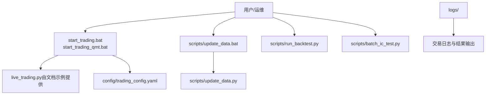
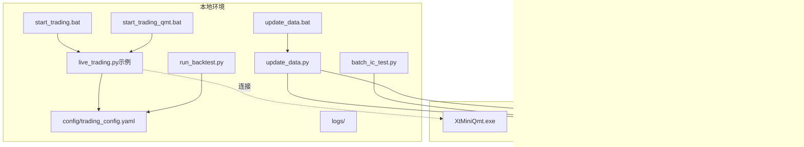
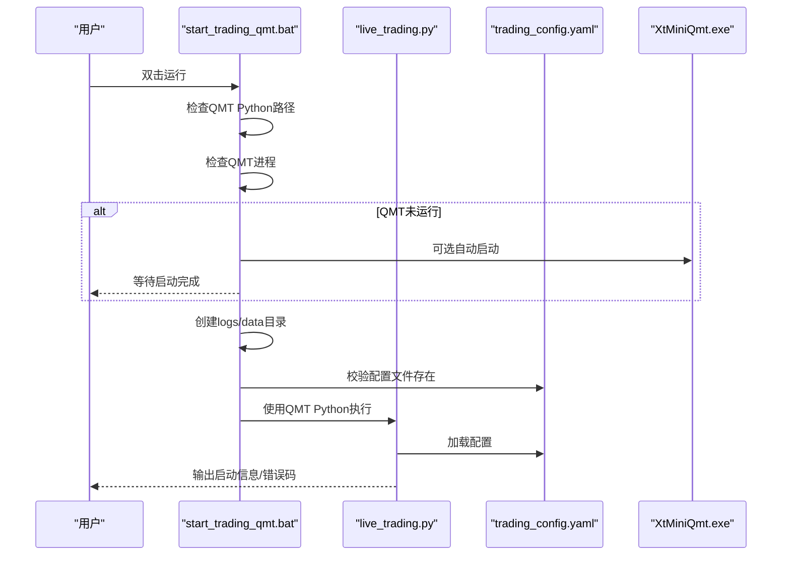
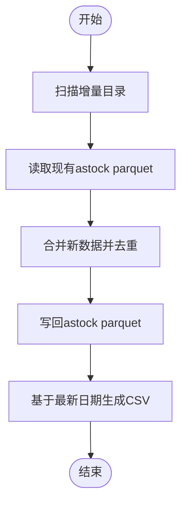
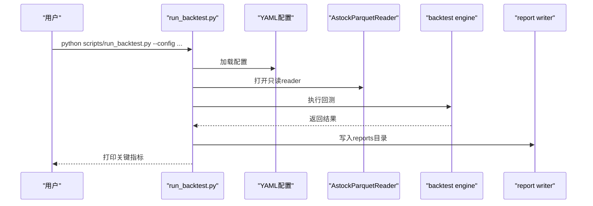
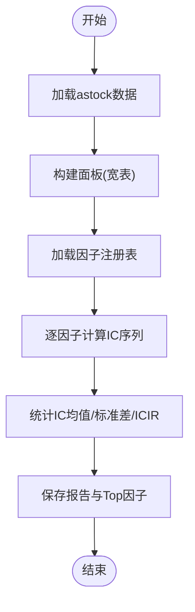
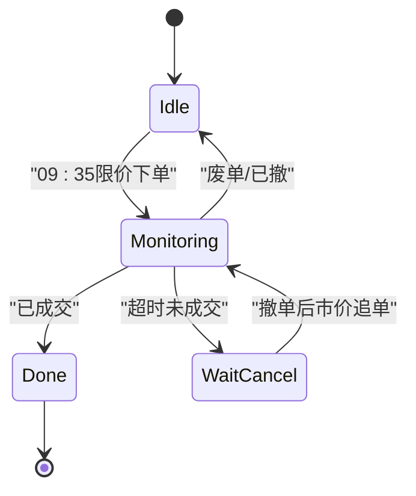
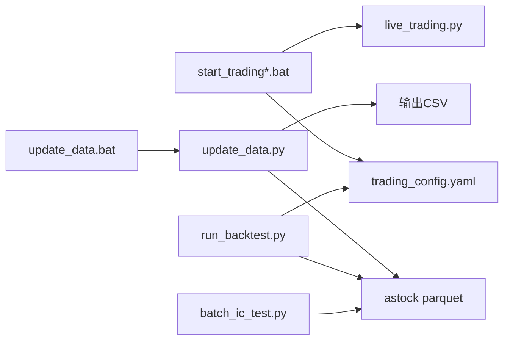

# 服务管理

<cite>
**本文引用的文件**   
- [start_trading.bat](file://start_trading.bat)
- [start_trading_qmt.bat](file://start_trading_qmt.bat)
- [trading_config.yaml](file://config/trading_config.yaml)
- [update_data.py](file://scripts/update_data.py)
- [update_data.bat](file://scripts/update_data.bat)
- [run_backtest.py](file://scripts/run_backtest.py)
- [batch_ic_test.py](file://scripts/batch_ic_test.py)
- [run_batch_ic_test.bat](file://scripts/run_batch_ic_test.bat)
- [daily_order_test.py](file://scripts/daily_order_test.py)
- [test_passorder_with_monitor.py](file://scripts/test_passorder_with_monitor.py)
- [miniQMT实盘对接_生产级完善方案.md](file://miniQMT实盘对接_生产级完善方案.md)
</cite>

## 目录
1. [简介](#简介)
2. [项目结构](#项目结构)
3. [核心组件](#核心组件)
4. [架构总览](#架构总览)
5. [详细组件分析](#详细组件分析)
6. [依赖关系分析](#依赖关系分析)
7. [性能与稳定性建议](#性能与稳定性建议)
8. [故障排查指南](#故障排查指南)
9. [结论](#结论)
10. [附录](#附录)

## 简介
本文件面向 QuantLab 的“服务管理”，聚焦于自动化启动脚本、环境变量与日志配置、服务启停流程、进程监控与健康检查、日志轮转与清理策略、故障自动恢复机制，以及 systemd 服务与 cron 任务的最佳实践。内容基于仓库中的批处理脚本、Python 脚本与配置文件进行系统化整理，帮助读者在生产环境中稳定运行量化交易与数据更新服务。

## 项目结构
QuantLab 的服务管理主要围绕以下三类资源：
- 启动脚本（Windows 批处理）：用于一键启动实盘交易系统与数据更新任务
- Python 脚本：实现数据更新、回测执行、因子批量测试、委托测试等
- 配置文件：集中管理账号、交易参数、风控、调度、通知与数据源路径

图表来源
- [start_trading.bat:1-51](file://start_trading.bat#L1-L51)
- [start_trading_qmt.bat:1-66](file://start_trading_qmt.bat#L1-L66)
- [trading_config.yaml:1-62](file://config/trading_config.yaml#L1-L62)
- [update_data.bat:1-15](file://scripts/update_data.bat#L1-L15)
- [update_data.py:1-135](file://scripts/update_data.py#L1-L135)
- [run_backtest.py:1-132](file://scripts/run_backtest.py#L1-L132)
- [batch_ic_test.py:1-266](file://scripts/batch_ic_test.py#L1-L266)

章节来源
- [start_trading.bat:1-51](file://start_trading.bat#L1-L51)
- [start_trading_qmt.bat:1-66](file://start_trading_qmt.bat#L1-L66)
- [trading_config.yaml:1-62](file://config/trading_config.yaml#L1-L62)
- [update_data.bat:1-15](file://scripts/update_data.bat#L1-L15)
- [update_data.py:1-135](file://scripts/update_data.py#L1-L135)
- [run_backtest.py:1-132](file://scripts/run_backtest.py#L1-L132)
- [batch_ic_test.py:1-266](file://scripts/batch_ic_test.py#L1-L266)

## 核心组件
- 实盘启动脚本
  - start_trading.bat：检测 Python、QMT 进程、创建日志目录、校验配置文件后启动 live_trading.py
  - start_trading_qmt.bat：使用 QMT 内置 Python 启动 live_trading.py，并支持自动拉起 QMT 客户端
- 数据更新脚本
  - update_data.bat + update_data.py：增量更新 astock parquet 并重新生成 CSV，供策略与回测使用
- 回测与因子测试
  - run_backtest.py：按 YAML 配置执行回测，写入 reports 目录
  - batch_ic_test.py：批量计算 alpha101/gtja191 因子的 IC/ICIR，输出报告
- 委托与下单测试
  - daily_order_test.py：在 miniQMT 中定时限价下单、超时撤单改市价追单、收盘汇总
  - test_passorder_with_monitor.py：最小化委托测试与状态监控

章节来源
- [start_trading.bat:1-51](file://start_trading.bat#L1-L51)
- [start_trading_qmt.bat:1-66](file://start_trading_qmt.bat#L1-L66)
- [update_data.py:1-135](file://scripts/update_data.py#L1-L135)
- [run_backtest.py:1-132](file://scripts/run_backtest.py#L1-L132)
- [batch_ic_test.py:1-266](file://scripts/batch_ic_test.py#L1-L266)
- [daily_order_test.py:1-227](file://scripts/daily_order_test.py#L1-L227)
- [test_passorder_with_monitor.py:1-75](file://scripts/test_passorder_with_monitor.py#L1-L75)

## 架构总览
下图展示了从批处理脚本到 Python 程序、配置文件与外部系统（QMT、数据源）的整体交互。

图表来源
- [start_trading.bat:1-51](file://start_trading.bat#L1-L51)
- [start_trading_qmt.bat:1-66](file://start_trading_qmt.bat#L1-L66)
- [update_data.bat:1-15](file://scripts/update_data.bat#L1-L15)
- [update_data.py:1-135](file://scripts/update_data.py#L1-L135)
- [run_backtest.py:1-132](file://scripts/run_backtest.py#L1-L132)
- [batch_ic_test.py:1-266](file://scripts/batch_ic_test.py#L1-L266)
- [trading_config.yaml:1-62](file://config/trading_config.yaml#L1-L62)

## 详细组件分析

### 实盘交易系统启动流程
- 启动入口
  - Windows 批处理负责环境检查（Python/QMT）、目录初始化、配置文件校验，然后调用 live_trading.py
  - 两种模式：系统 Python 或 QMT 内置 Python
- 关键行为
  - 若 QMT 未运行，提示并可选择自动拉起
  - 创建 logs 与 data 目录
  - 校验 config/trading_config.yaml 是否存在
  - 记录启动信息与错误码

图表来源
- [start_trading_qmt.bat:1-66](file://start_trading_qmt.bat#L1-L66)
- [trading_config.yaml:1-62](file://config/trading_config.yaml#L1-L62)
- [miniQMT实盘对接_生产级完善方案.md:1131-1344](file://miniQMT实盘对接_生产级完善方案.md#L1131-L1344)

章节来源
- [start_trading.bat:1-51](file://start_trading.bat#L1-L51)
- [start_trading_qmt.bat:1-66](file://start_trading_qmt.bat#L1-L66)
- [trading_config.yaml:1-62](file://config/trading_config.yaml#L1-L62)
- [miniQMT实盘对接_生产级完善方案.md:1131-1344](file://miniQMT实盘对接_生产级完善方案.md#L1131-L1344)

### 数据更新服务（astock + CSV）
- 功能要点
  - 增量读取“增量”目录下的 parquet 文件，合并去重后写回 astock 主文件
  - 基于最新交易日生成财务指标 CSV（PB/PE/ROE/流通市值/成交额）
- 部署方式
  - 通过 update_data.bat 调用 update_data.py
  - 可纳入 cron 定时任务每日执行

图表来源
- [update_data.py:1-135](file://scripts/update_data.py#L1-L135)
- [update_data.bat:1-15](file://scripts/update_data.bat#L1-L15)

章节来源
- [update_data.py:1-135](file://scripts/update_data.py#L1-L135)
- [update_data.bat:1-15](file://scripts/update_data.bat#L1-L15)

### 回测执行器
- 输入
  - YAML 配置文件（包含 backtest、data、universe、execution、strategy_params 等）
  - astock parquet（只读）
- 输出
  - reports/<run_id>/<config>/ 目录下的一批结果文件（权益曲线、交易明细、摘要等）
- 特性
  - 支持覆盖结果目录
  - 计算配置哈希与股票池哈希，便于复现实验

图表来源
- [run_backtest.py:1-132](file://scripts/run_backtest.py#L1-L132)

章节来源
- [run_backtest.py:1-132](file://scripts/run_backtest.py#L1-L132)

### 批量因子IC测试
- 目标
  - 对 alpha101 与 gtja191 全量因子计算 IC/ICIR，筛选高 alpha 因子
- 流程
  - 读取 astock parquet，构建面板
  - 按月滚动计算前向收益与因子值
  - 输出完整报告与 Top 因子清单

图表来源
- [batch_ic_test.py:1-266](file://scripts/batch_ic_test.py#L1-L266)

章节来源
- [batch_ic_test.py:1-266](file://scripts/batch_ic_test.py#L1-L266)

### 委托与下单测试（miniQMT）
- 功能
  - 指定时间限价买入，超时未成交则自动撤单并以卖一价市价追单
  - 每根K线查询委托状态，收盘汇总当日成交
- 部署
  - 粘贴至 miniQMT 策略编辑器，设置为全天运行，1分钟K线周期

图表来源
- [daily_order_test.py:1-227](file://scripts/daily_order_test.py#L1-L227)
- [test_passorder_with_monitor.py:1-75](file://scripts/test_passorder_with_monitor.py#L1-L75)

章节来源
- [daily_order_test.py:1-227](file://scripts/daily_order_test.py#L1-L227)
- [test_passorder_with_monitor.py:1-75](file://scripts/test_passorder_with_monitor.py#L1-L75)

## 依赖关系分析
- 启动脚本依赖
  - start_trading*.bat 依赖 Python 环境与 QMT 客户端进程
  - 依赖 config/trading_config.yaml 的存在与正确性
- 数据更新依赖
  - update_data.py 依赖 astock parquet 与增量目录结构
  - 输出 CSV 路径需可写
- 回测与因子测试依赖
  - run_backtest.py 依赖 astock parquet（只读）与 YAML 配置
  - batch_ic_test.py 依赖 astock parquet 与因子注册表

图表来源
- [start_trading.bat:1-51](file://start_trading.bat#L1-L51)
- [start_trading_qmt.bat:1-66](file://start_trading_qmt.bat#L1-L66)
- [update_data.py:1-135](file://scripts/update_data.py#L1-L135)
- [run_backtest.py:1-132](file://scripts/run_backtest.py#L1-L132)
- [batch_ic_test.py:1-266](file://scripts/batch_ic_test.py#L1-L266)
- [trading_config.yaml:1-62](file://config/trading_config.yaml#L1-L62)

章节来源
- [start_trading.bat:1-51](file://start_trading.bat#L1-L51)
- [start_trading_qmt.bat:1-66](file://start_trading_qmt.bat#L1-L66)
- [update_data.py:1-135](file://scripts/update_data.py#L1-L135)
- [run_backtest.py:1-132](file://scripts/run_backtest.py#L1-L132)
- [batch_ic_test.py:1-266](file://scripts/batch_ic_test.py#L1-L266)
- [trading_config.yaml:1-62](file://config/trading_config.yaml#L1-L62)

## 性能与稳定性建议
- 启动与运行
  - 优先使用 QMT 内置 Python 以兼容其依赖库
  - 确保 QMT 客户端先于策略启动并保持登录态
- 数据更新
  - 增量更新前先校验增量目录结构与 parquet 格式一致性
  - 大文件读写建议使用 pyarrow 引擎，避免内存峰值过高
- 回测与因子测试
  - 合理设置 results-dir 避免覆盖历史结果
  - 因子测试可按主题分批执行，降低单次运行时长
- 日志与存储
  - 将日志与数据分离到不同磁盘，减少IO竞争
  - 定期归档与清理旧日志，保留最近 N 天

[本节为通用建议，不直接分析具体文件]

## 故障排查指南
- 常见问题定位
  - Python 未安装或未加入 PATH：检查系统环境变量与命令行 python --version
  - QMT 未运行：确认 XtMiniQmt.exe 进程存在且已登录
  - 配置文件缺失：确保 config/trading_config.yaml 存在且路径正确
  - 数据路径不可写：检查 astock 与 CSV 输出目录权限
- 日志查看
  - 批处理脚本会在控制台输出错误码与提示信息
  - live_trading.py（参考文档示例）默认将日志输出到 logs 目录并按日分割
- 委托测试
  - 使用 daily_order_test.py 验证下单、撤单、追单逻辑
  - 使用 test_passorder_with_monitor.py 快速验证 passorder 与订单状态查询

章节来源
- [start_trading.bat:1-51](file://start_trading.bat#L1-L51)
- [start_trading_qmt.bat:1-66](file://start_trading_qmt.bat#L1-L66)
- [trading_config.yaml:1-62](file://config/trading_config.yaml#L1-L62)
- [daily_order_test.py:1-227](file://scripts/daily_order_test.py#L1-L227)
- [test_passorder_with_monitor.py:1-75](file://scripts/test_passorder_with_monitor.py#L1-L75)
- [miniQMT实盘对接_生产级完善方案.md:1131-1344](file://miniQMT实盘对接_生产级完善方案.md#L1131-L1344)

## 结论
QuantLab 的服务管理以批处理脚本为核心入口，配合 Python 脚本与 YAML 配置，形成“启动—运行—监控—维护”的闭环。通过规范化的日志输出、数据更新与回测流程，以及完善的委托测试手段，可在生产环境中实现稳定、可观测、可恢复的交易与研究工作流。建议在 Linux 环境下进一步采用 systemd 与 cron 进行统一编排，并结合日志轮转与告警机制提升可靠性。

[本节为总结性内容，不直接分析具体文件]

## 附录

### 批处理文件参数与环境变量
- start_trading.bat
  - 作用：检查 Python、QMT 进程、创建日志目录、校验配置文件后启动 live_trading.py
  - 环境变量：PATH（含 Python）、当前工作目录（logs/data 相对路径）
- start_trading_qmt.bat
  - 作用：使用 QMT 内置 Python 启动 live_trading.py，支持自动拉起 QMT
  - 环境变量：QMT_PYTHON（指向 QMT Python 可执行文件）
- update_data.bat
  - 作用：调用 update_data.py 执行数据更新
  - 环境变量：PATH（含 Python）

章节来源
- [start_trading.bat:1-51](file://start_trading.bat#L1-L51)
- [start_trading_qmt.bat:1-66](file://start_trading_qmt.bat#L1-L66)
- [update_data.bat:1-15](file://scripts/update_data.bat#L1-L15)

### 配置文件说明（trading_config.yaml）
- account：账号 ID、QMT 路径、session_id
- trading：初始资金、仓位限制、佣金、印花税、滑点
- risk：止损比例、最大回撤、最长持有天数、单日最大换手
- order：委托超时、重试次数、价格容差、自动撤单
- schedule：盘前、开盘、午后、风控间隔、尾盘时间
- notification：通知开关、渠道、webhook
- data：数据源类型、astock 路径、缓存目录
- strategy：策略名称、股票池、选股数量、调仓频率、因子权重

章节来源
- [trading_config.yaml:1-62](file://config/trading_config.yaml#L1-L62)

### 日志输出与轮转策略
- 日志位置
  - 批处理脚本在控制台输出错误码与提示信息
  - live_trading.py（参考文档示例）默认将日志输出到 logs 目录并按日分割
- 轮转建议
  - 按日切分日志文件，保留最近 N 天
  - 超过阈值的日志归档压缩并迁移至冷存储
  - 清理策略：删除超过保留期的日志文件，释放磁盘空间

章节来源
- [miniQMT实盘对接_生产级完善方案.md:1131-1344](file://miniQMT实盘对接_生产级完善方案.md#L1131-L1344)

### 进程监控与健康检查
- 进程监控
  - Windows：tasklist 检查 XtMiniQmt.exe 是否运行
  - Linux：ps/systemctl status 监控服务进程
- 健康检查
  - 检查 logs 目录是否有新增日志文件
  - 检查 astock parquet 最新日期是否更新
  - 检查 CSV 输出是否按时生成
  - 检查委托测试脚本是否成功执行

章节来源
- [start_trading_qmt.bat:1-66](file://start_trading_qmt.bat#L1-L66)
- [update_data.py:1-135](file://scripts/update_data.py#L1-L135)
- [daily_order_test.py:1-227](file://scripts/daily_order_test.py#L1-L227)

### 故障自动恢复机制
- 重启策略
  - 使用 systemd 的 Restart=always 与 RestartSec 实现自动重启
  - 结合 OnFailure 钩子发送告警
- 状态恢复
  - live_trading.py（参考文档示例）在启动时尝试恢复上次异常退出的状态
  - 委托测试脚本具备重试与自动撤单逻辑
- 数据一致性
  - update_data.py 在合并数据时去重并排序，保证一致性

章节来源
- [miniQMT实盘对接_生产级完善方案.md:1131-1344](file://miniQMT实盘对接_生产级完善方案.md#L1131-L1344)
- [update_data.py:1-135](file://scripts/update_data.py#L1-L135)
- [daily_order_test.py:1-227](file://scripts/daily_order_test.py#L1-L227)

### systemd 服务配置示例（Linux）
- 服务单元文件（/etc/systemd/system/quantlab-trading.service）
  - Description=QuantLab 实盘交易系统
  - ExecStart=/usr/bin/python3 /path/to/live_trading.py
  - WorkingDirectory=/path/to/QuantLab
  - Environment=PYTHONPATH=/path/to/QuantLab
  - Restart=always
  - RestartSec=10
  - StandardOutput=append:/var/log/quantlab/trading.log
  - StandardError=append:/var/log/quantlab/trading-error.log
- 启用与查看
  - systemctl enable quantlab-trading.service
  - systemctl status quantlab-trading.service
  - journalctl -u quantlab-trading.service -f

[本节为概念性配置示例，不直接映射到仓库文件]

### cron 任务设置（Linux）
- 每日数据更新
  - 0 2 * * * /usr/bin/python3 /path/to/scripts/update_data.py >> /var/log/quantlab/update_data.log 2>&1
- 工作日因子测试
  - 0 3 * * 1-5 /usr/bin/python3 /path/to/scripts/batch_ic_test.py >> /var/log/quantlab/ic_test.log 2>&1
- 回测任务（按需）
  - 0 4 * * 1 /usr/bin/python3 /path/to/scripts/run_backtest.py --config /path/to/config.yaml >> /var/log/quantlab/backtest.log 2>&1

[本节为概念性任务示例，不直接映射到仓库文件]