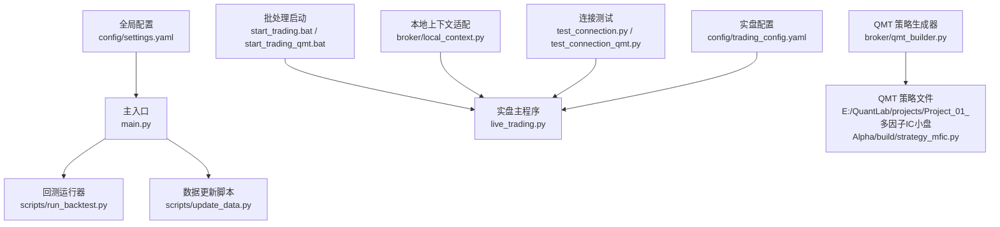
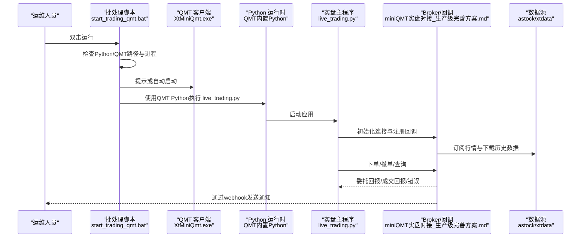
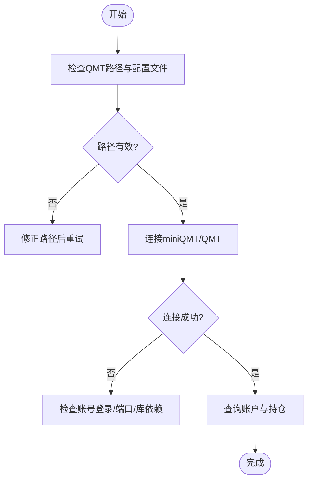
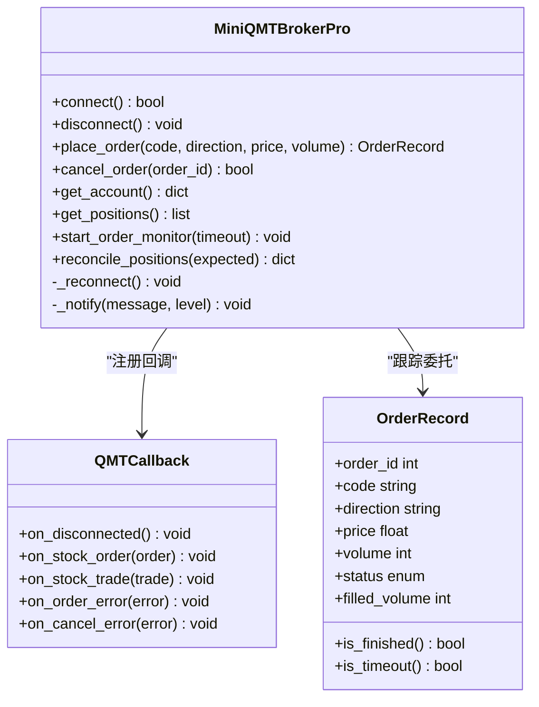
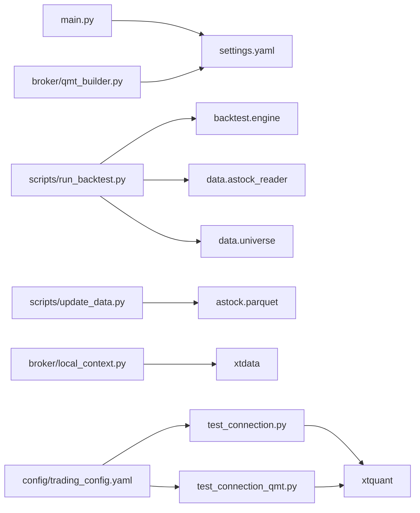

# 生产部署

<cite>
**本文引用的文件**   
- [main.py](file://main.py)
- [start_trading.bat](file://start_trading.bat)
- [start_trading_qmt.bat](file://start_trading_qmt.bat)
- [test_connection.py](file://test_connection.py)
- [test_connection_qmt.py](file://test_connection_qmt.py)
- [config\trading_config.yaml](file://config\trading_config.yaml)
- [config\settings.yaml](file://config\settings.yaml)
- [broker\qmt_builder.py](file://broker\qmt_builder.py)
- [broker\local_context.py](file://broker\local_context.py)
- [scripts\run_backtest.py](file://scripts\run_backtest.py)
- [scripts\update_data.py](file://scripts\update_data.py)
- [miniQMT实盘对接_生产级完善方案.md](file://miniQMT实盘对接_生产级完善方案.md)
</cite>

## 目录
1. [简介](#简介)
2. [项目结构](#项目结构)
3. [核心组件](#核心组件)
4. [架构总览](#架构总览)
5. [详细组件分析](#详细组件分析)
6. [依赖关系分析](#依赖关系分析)
7. [性能考虑](#性能考虑)
8. [故障排查指南](#故障排查指南)
9. [结论](#结论)
10. [附录](#附录)

## 简介
本文件面向 QuantLab 的生产环境部署，覆盖服务器环境准备、权限与防火墙配置、QMT 客户端连接与测试、自动化启动（批处理与 systemd）、监控告警集成、日志管理与排障、以及生产环境的性能调优与安全加固建议。文档内容严格基于仓库现有脚本与配置文件进行说明，并给出可操作的步骤与图示。

## 项目结构
QuantLab 采用“策略/回测/数据/交易”分层组织：
- 入口与运行：main.py 提供回测入口；scripts 下包含回测与数据更新脚本
- 交易与 QMT：broker 提供 QMT 策略生成器与本地上下文适配；start_trading*.bat 用于启动实盘
- 配置：config/settings.yaml 为全局配置；config/trading_config.yaml 为实盘账户与风控参数
- 数据：scripts/update_data.py 负责增量更新 astock parquet 与 CSV 产物
- 验证与测试：test_connection*.py 用于 miniQMT/QMT Python 环境连通性检查

图表来源
- [main.py:1-104](file://main.py#L1-L104)
- [scripts\run_backtest.py:1-132](file://scripts\run_backtest.py#L1-L132)
- [scripts\update_data.py:1-135](file://scripts\update_data.py#L1-L135)
- [start_trading.bat:1-51](file://start_trading.bat#L1-L51)
- [start_trading_qmt.bat:1-66](file://start_trading_qmt.bat#L1-L66)
- [broker\qmt_builder.py:1-386](file://broker\qmt_builder.py#L1-L386)
- [broker\local_context.py:1-137](file://broker\local_context.py#L1-L137)
- [test_connection.py:1-117](file://test_connection.py#L1-L117)
- [test_connection_qmt.py:1-117](file://test_connection_qmt.py#L1-L117)
- [config\settings.yaml:1-69](file://config\settings.yaml#L1-L69)
- [config\trading_config.yaml:1-62](file://config\trading_config.yaml#L1-L62)

章节来源
- [main.py:1-104](file://main.py#L1-L104)
- [config\settings.yaml:1-69](file://config\settings.yaml#L1-L69)
- [config\trading_config.yaml:1-62](file://config\trading_config.yaml#L1-L62)

## 核心组件
- 回测入口与配置加载：main.py 读取 settings.yaml，支持多策略入口与参数化运行
- 回测执行器：scripts/run_backtest.py 统一解析 YAML、加载数据、执行回测并输出报告
- 数据更新：scripts/update_data.py 增量更新 astock parquet 并生成 QMT 所需 CSV
- QMT 策略生成：broker/qmt_builder.py 将因子与策略逻辑打包为 GBK 编码的 QMT 单文件策略
- 本地上下文：broker/local_context.py 将 QMT 的 C.* 调用映射到 xtdata，便于本地验证
- 连接测试：test_connection.py 与 test_connection_qmt.py 分别校验 miniQMT 与 QMT Python 环境连通性
- 启动脚本：start_trading.bat 与 start_trading_qmt.bat 完成环境检查、路径设置与进程拉起

章节来源
- [main.py:1-104](file://main.py#L1-L104)
- [scripts\run_backtest.py:1-132](file://scripts\run_backtest.py#L1-L132)
- [scripts\update_data.py:1-135](file://scripts\update_data.py#L1-L135)
- [broker\qmt_builder.py:1-386](file://broker\qmt_builder.py#L1-L386)
- [broker\local_context.py:1-137](file://broker\local_context.py#L1-L137)
- [test_connection.py:1-117](file://test_connection.py#L1-L117)
- [test_connection_qmt.py:1-117](file://test_connection_qmt.py#L1-L117)

## 架构总览
下图展示从启动到交易执行的端到端流程，包括环境检查、QMT 连接、策略执行与通知回调。

图表来源
- [start_trading_qmt.bat:1-66](file://start_trading_qmt.bat#L1-L66)
- [test_connection_qmt.py:1-117](file://test_connection_qmt.py#L1-L117)
- [miniQMT实盘对接_生产级完善方案.md:73-756](file://miniQMT实盘对接_生产级完善方案.md#L73-L756)

## 详细组件分析

### 服务器环境与操作系统配置
- 操作系统建议
  - Windows Server（与 QMT 客户端兼容），或 Linux + Wine（不推荐，稳定性差）
  - 建议使用独立主机隔离交易与研发环境
- 用户与权限
  - 以普通用户运行 Python 与 QMT 客户端，避免管理员权限
  - 确保对 logs、data、reports 目录有读写权限
- 网络与防火墙
  - 放行 QMT 客户端端口（默认由客户端管理）
  - 若启用 webhook 通知，放行出站 HTTPS 访问
- 时区与时间同步
  - 系统时间与交易所一致，避免调度偏差

章节来源
- [config\settings.yaml:1-69](file://config\settings.yaml#L1-L69)
- [config\trading_config.yaml:1-62](file://config\trading_config.yaml#L1-L62)

### QMT 客户端配置与连接测试
- 安装与路径
  - 确认 XtMiniQmt.exe 路径与 userdata_mini 目录存在
  - 在 trading_config.yaml 中正确配置 account.path、account.id、account.session_id
- 连接测试
  - 使用 test_connection.py 校验 miniQMT 连接与账户信息
  - 使用 test_connection_qmt.py 校验 QMT 内置 Python 与 xtquant 库可用性
- 常见问题
  - 未登录账号、路径错误、缺少 xtquant 库、非交易时段限制

图表来源
- [test_connection.py:1-117](file://test_connection.py#L1-L117)
- [test_connection_qmt.py:1-117](file://test_connection_qmt.py#L1-L117)
- [config\trading_config.yaml:1-62](file://config\trading_config.yaml#L1-L62)

章节来源
- [test_connection.py:1-117](file://test_connection.py#L1-L117)
- [test_connection_qmt.py:1-117](file://test_connection_qmt.py#L1-L117)
- [config\trading_config.yaml:1-62](file://config\trading_config.yaml#L1-L62)

### 自动化启动脚本使用方法
- Windows 批处理
  - start_trading.bat：使用系统 Python 启动 live_trading.py，检查 Python 与 QMT 进程
  - start_trading_qmt.bat：使用 QMT 内置 Python 启动，自动检测并可选启动 QMT 客户端
- systemd 服务（Linux 示例思路）
  - 创建 service 文件，指定 WorkingDirectory=项目根，ExecStart=python live_trading.py
  - 配置 Restart=always，RestartSec=5，LimitNOFILE=65535
  - 启用并启动服务，journalctl 查看日志

章节来源
- [start_trading.bat:1-51](file://start_trading.bat#L1-L51)
- [start_trading_qmt.bat:1-66](file://start_trading_qmt.bat#L1-L66)

### 监控告警系统集成方案
- 回调与重连
  - 实现 QMTCallback 处理断线、委托回报、成交回报与错误
  - 指数退避自动重连，保障连接鲁棒性
- 订单监控
  - 超时未成交自动撤单，部分成交记录与通知
- 通知渠道
  - 企业微信/钉钉 webhook，关键事件推送（连接异常、下单失败、持仓差异等）
- 状态持久化
  - 保存委托与成交快照，崩溃恢复用

图表来源
- [miniQMT实盘对接_生产级完善方案.md:73-756](file://miniQMT实盘对接_生产级完善方案.md#L73-L756)

章节来源
- [miniQMT实盘对接_生产级完善方案.md:73-756](file://miniQMT实盘对接_生产级完善方案.md#L73-L756)

### 日志管理与故障排查方法
- 日志位置与轮转
  - 系统日志：Windows Event Log（QMT 客户端）
  - 应用日志：logs 目录，按大小与数量轮转（settings.yaml 中 logging.dir 与备份策略）
- 关键日志
  - QMT 客户端日志：XtClient_FormulaOutput_*.log，确认“初始化完成”
  - 实盘日志：下单、成交、错误、重连、通知
- 排查步骤
  - 先跑连接测试脚本，确认 xtquant 与路径正确
  - 检查非交易时段限制与资金/持仓约束
  - 核对策略权重与因子口径一致性
  - 查看委托监控与对账结果

章节来源
- [config\settings.yaml:1-69](file://config\settings.yaml#L1-L69)
- [test_connection.py:1-117](file://test_connection.py#L1-L117)
- [test_connection_qmt.py:1-117](file://test_connection_qmt.py#L1-L117)

### 生产环境的性能调优与安全加固建议
- 性能调优
  - 数据层：优先使用 astock parquet 增量更新，减少 IO；合理设置缓存过期
  - 计算层：因子计算向量化，避免全量扫描；控制选股范围与频率
  - 交易层：批量获取行情与价格，减少 API 调用；委托监控间隔合理设置
- 安全加固
  - 最小权限原则运行；敏感配置（账号、路径）加密或环境变量注入
  - 网络白名单与出站 HTTPS 仅允许必要域名
  - 定期审计日志与委托记录，发现异常立即熔断

[本节为通用建议，不直接分析具体文件]

## 依赖关系分析
- 模块耦合
  - main.py 依赖 settings.yaml 与策略模块
  - run_backtest.py 依赖 backtest.engine、data.astock_reader、data.universe
  - update_data.py 依赖 pandas/numpy 与 astock parquet
  - broker/qmt_builder.py 依赖 settings.yaml 与因子权重
  - broker/local_context.py 依赖 xtdata 与 xttrader
  - 连接测试脚本依赖 xtquant 与 trading_config.yaml
- 外部依赖
  - xtquant（QMT Python 库）
  - astock 数据源（parquet）
  - 通知 webhook（HTTP POST）

图表来源
- [main.py:1-104](file://main.py#L1-L104)
- [scripts\run_backtest.py:1-132](file://scripts\run_backtest.py#L1-L132)
- [scripts\update_data.py:1-135](file://scripts\update_data.py#L1-L135)
- [broker\qmt_builder.py:1-386](file://broker\qmt_builder.py#L1-L386)
- [broker\local_context.py:1-137](file://broker\local_context.py#L1-L137)
- [test_connection.py:1-117](file://test_connection.py#L1-L117)
- [test_connection_qmt.py:1-117](file://test_connection_qmt.py#L1-L117)
- [config\settings.yaml:1-69](file://config\settings.yaml#L1-L69)
- [config\trading_config.yaml:1-62](file://config\trading_config.yaml#L1-L62)

章节来源
- [scripts\run_backtest.py:1-132](file://scripts\run_backtest.py#L1-L132)
- [scripts\update_data.py:1-135](file://scripts\update_data.py#L1-L135)
- [broker\qmt_builder.py:1-386](file://broker\qmt_builder.py#L1-L386)
- [broker\local_context.py:1-137](file://broker\local_context.py#L1-L137)
- [test_connection.py:1-117](file://test_connection.py#L1-L117)
- [test_connection_qmt.py:1-117](file://test_connection_qmt.py#L1-L117)

## 性能考虑
- 数据更新
  - 使用 scripts/update_data.py 增量更新 astock parquet，避免全量重建
  - 控制 CSV 生成频率，仅在必要时重新计算
- 回测与因子计算
  - 合理设置 top_n、rebalance_freq，降低计算压力
  - 因子标准化与中性化按需开启，避免不必要开销
- 交易执行
  - 批量获取行情与价格，减少 API 调用次数
  - 委托监控线程间隔与超时阈值平衡实时性与资源占用

[本节为通用建议，不直接分析具体文件]

## 故障排查指南
- 连接问题
  - 检查 xtquant 是否可用；确认 QMT 路径与 session_id
  - 使用 test_connection.py 与 test_connection_qmt.py 逐步定位
- 非交易时段限制
  - 确认当前时间是否在交易时段内；避免盘前/盘后误下单
- 资金与持仓约束
  - 检查可用资金与可卖数量；自动取整到 100 股
- 委托与成交
  - 查看委托监控日志与回调记录；关注超时与错误码
- 策略与因子口径
  - 核对策略权重与因子定义一致性；确保构建产物为 GBK 编码

章节来源
- [test_connection.py:1-117](file://test_connection.py#L1-L117)
- [test_connection_qmt.py:1-117](file://test_connection_qmt.py#L1-L117)
- [miniQMT实盘对接_生产级完善方案.md:73-756](file://miniQMT实盘对接_生产级完善方案.md#L73-L756)

## 结论
QuantLab 的生产部署围绕 QMT 客户端与 xtquant 生态展开，通过批处理与可能的 systemd 服务实现自动化启动，结合完善的回调与监控机制保障稳定性。建议在部署前完成环境检查、连接测试与数据更新，并在上线后持续监控日志与委托状态，及时响应异常。

[本节为总结，不直接分析具体文件]

## 附录
- 每日调度建议
  - 盘前准备：检查连接、下载数据、查询账户、撤销遗留委托
  - 开盘执行：计算因子 → 目标组合 → 先卖后买
  - 盘中巡检：止损与回撤检查
  - 日终处理：对账、保存状态、发送日报
- 部署红线
  - 构建产物必须 GBK 编码与语法兼容
  - 改代码后需经过 MOCK+单测→rebuild+validate→模拟端过 checklist→才上实盘

章节来源
- [miniQMT实盘对接_生产级完善方案.md:73-756](file://miniQMT实盘对接_生产级完善方案.md#L73-L756)