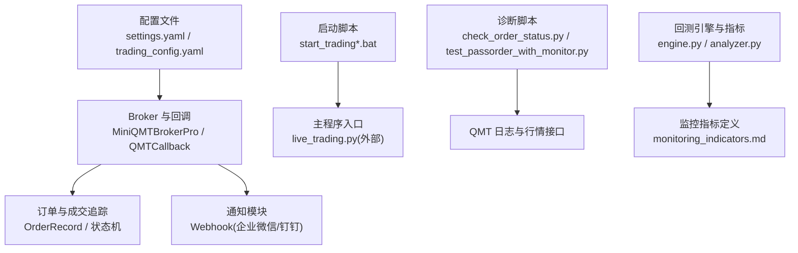
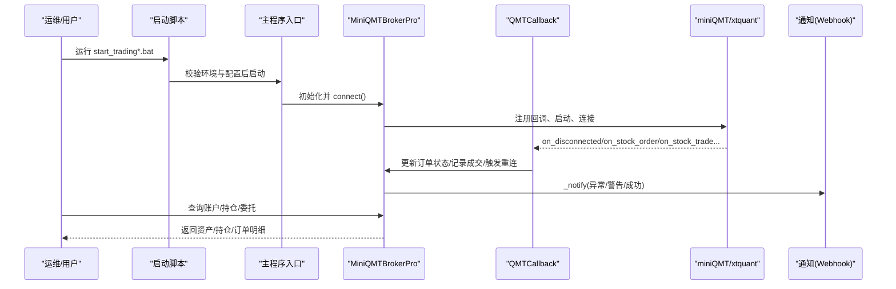
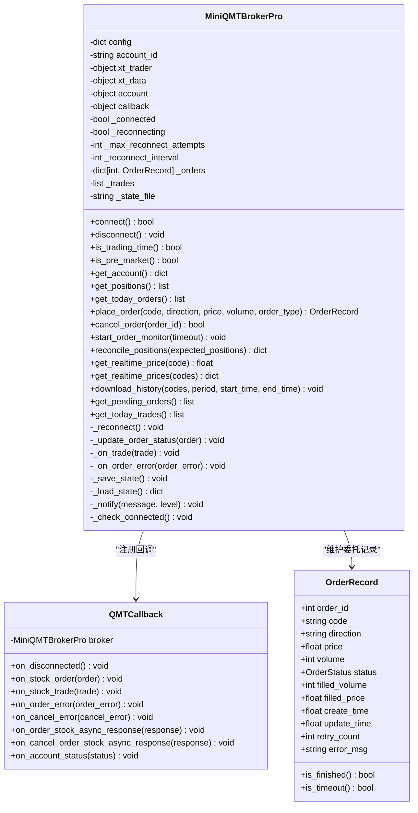
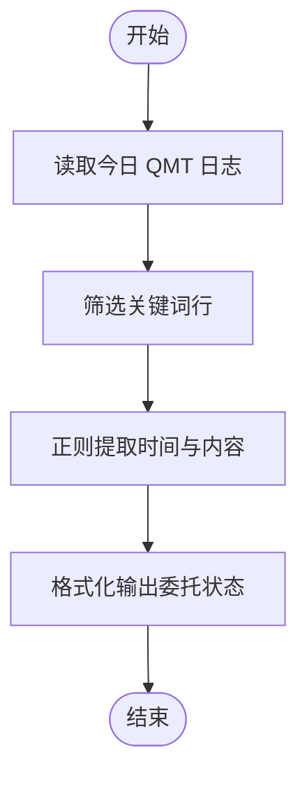
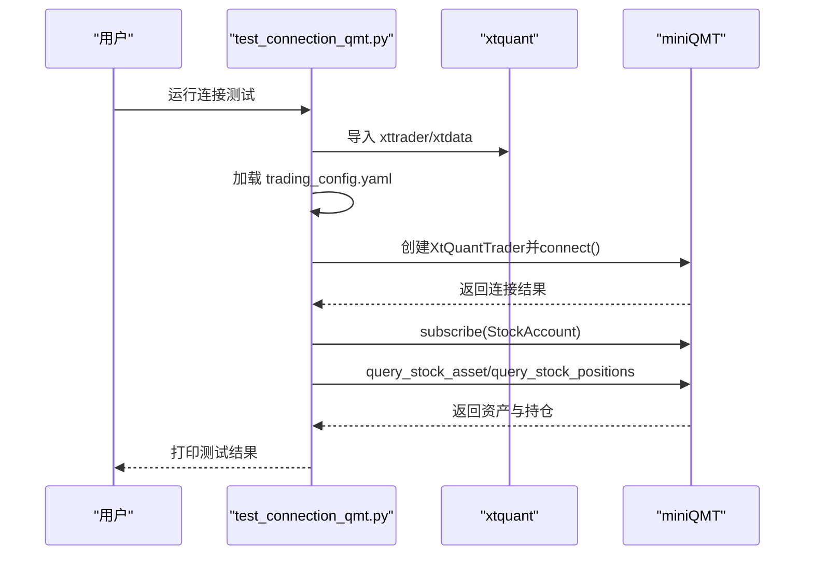
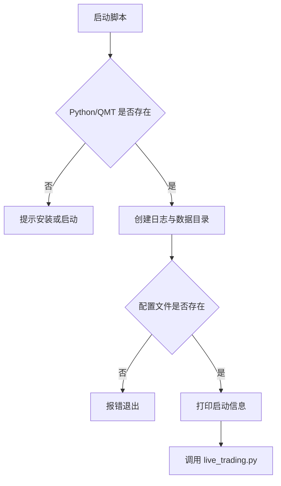
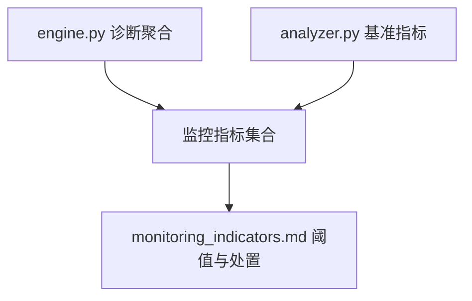
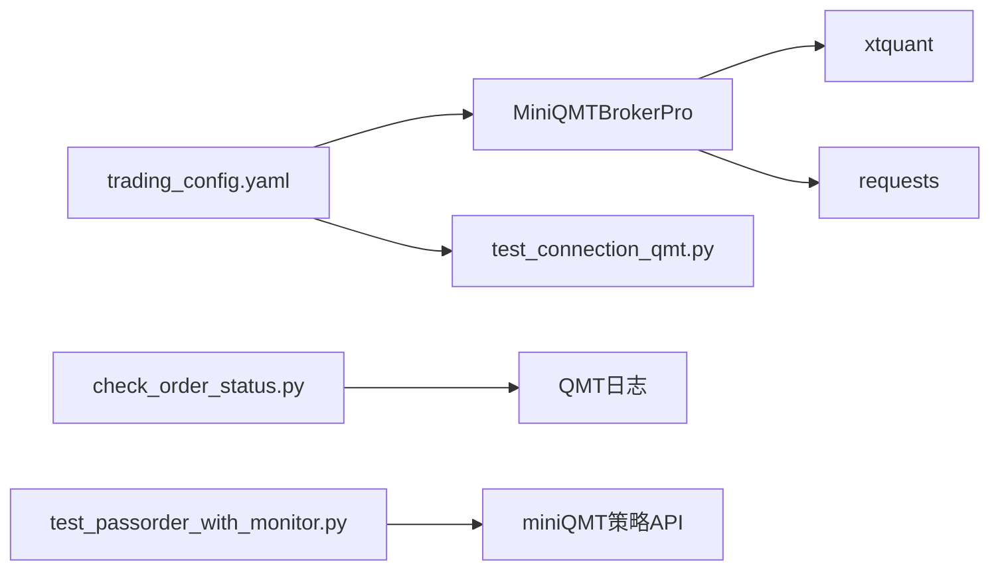

# 监控告警

<cite>
**本文引用的文件**   
- [main.py](file://main.py)
- [config/settings.yaml](file://config/settings.yaml)
- [config/trading_config.yaml](file://config/trading_config.yaml)
- [miniQMT实盘对接_生产级完善方案.md](file://miniQMT实盘对接_生产级完善方案.md)
- [scripts/check_order_status.py](file://scripts/check_order_status.py)
- [scripts/test_passorder_with_monitor.py](file://scripts/test_passorder_with_monitor.py)
- [test_connection_qmt.py](file://test_connection_qmt.py)
- [start_trading.bat](file://start_trading.bat)
- [start_trading_qmt.bat](file://start_trading_qmt.bat)
- [backtest/engine.py](file://backtest/engine.py)
- [backtest/analyzer.py](file://backtest/analyzer.py)
- [projects/verification/results/monitoring_indicators.md](file://projects/verification/results/monitoring_indicators.md)
</cite>

## 目录
1. [简介](#简介)
2. [项目结构](#项目结构)
3. [核心组件](#核心组件)
4. [架构总览](#架构总览)
5. [详细组件分析](#详细组件分析)
6. [依赖关系分析](#依赖关系分析)
7. [性能与瓶颈分析](#性能与瓶颈分析)
8. [故障排查指南](#故障排查指南)
9. [结论](#结论)
10. [附录](#附录)

## 简介
本文件为 QuantLab 监控告警系统的完整文档，覆盖系统健康监控指标配置（CPU、内存、磁盘使用率）、交易状态监控（连接状态、订单状态、持仓监控）、日志监控与错误告警、性能监控与瓶颈分析方法、告警通知渠道配置（企业微信、钉钉、邮件等），以及故障排查工具与常用诊断命令。内容基于仓库现有实现与配置进行系统化整理，便于非技术读者也能快速上手。

## 项目结构
QuantLab 的监控与告警能力由“配置 + Broker 回调 + 脚本工具 + 启动脚本”共同构成：
- 配置层：全局设置与实盘参数集中在 YAML 文件中，包含日志、数据源、策略、风控、通知等。
- Broker 层：通过 miniQMT 回调机制捕获委托、成交、撤单、断线事件，并触发重连、超时处理与通知。
- 脚本层：提供连接测试、订单状态检查、委托测试与监控等实用工具。
- 启动层：批处理脚本负责环境检查、进程检测与程序启动。

图表来源
- [config/settings.yaml:1-69](file://config/settings.yaml#L1-L69)
- [config/trading_config.yaml:1-62](file://config/trading_config.yaml#L1-L62)
- [miniQMT实盘对接_生产级完善方案.md:196-756](file://miniQMT实盘对接_生产级完善方案.md#L196-L756)
- [scripts/check_order_status.py:1-50](file://scripts/check_order_status.py#L1-L50)
- [scripts/test_passorder_with_monitor.py:1-75](file://scripts/test_passorder_with_monitor.py#L1-L75)
- [start_trading.bat:1-51](file://start_trading.bat#L1-L51)
- [start_trading_qmt.bat:1-66](file://start_trading_qmt.bat#L1-L66)
- [backtest/engine.py:479-522](file://backtest/engine.py#L479-L522)
- [backtest/analyzer.py:78-99](file://backtest/analyzer.py#L78-L99)
- [projects/verification/results/monitoring_indicators.md:1-63](file://projects/verification/results/monitoring_indicators.md#L1-L63)

章节来源
- [config/settings.yaml:1-69](file://config/settings.yaml#L1-L69)
- [config/trading_config.yaml:1-62](file://config/trading_config.yaml#L1-L62)

## 核心组件
- 配置中心
  - settings.yaml：全局配置（数据路径、缓存、回测参数、日志级别与目录、因子与策略默认值、实盘开关）。
  - trading_config.yaml：实盘关键参数（账号、交易风控、订单超时与重试、调度时间、通知 Webhook、数据源与策略权重）。
- Broker 与回调
  - MiniQMTBrokerPro：封装连接管理、账户查询、下单/撤单、委托监控、持仓对账、状态持久化、通知发送。
  - QMTCallback：承接 xtquant 回调（委托回报、成交回报、撤单回报、断线通知），驱动内部状态更新与自动重连。
- 诊断与测试脚本
  - check_order_status.py：解析 QMT 日志，输出当日委托与成交状态摘要。
  - test_passorder_with_monitor.py：在 miniQMT 策略编辑器中执行 passorder 并逐 K 线打印委托状态。
  - test_connection_qmt.py：验证 Python 环境、xtquant 库、QMT 连接与账户信息。
- 启动脚本
  - start_trading.bat / start_trading_qmt.bat：检查 Python/QMT 进程、创建日志目录、加载配置并启动主程序。

章节来源
- [config/settings.yaml:1-69](file://config/settings.yaml#L1-L69)
- [config/trading_config.yaml:1-62](file://config/trading_config.yaml#L1-L62)
- [miniQMT实盘对接_生产级完善方案.md:196-756](file://miniQMT实盘对接_生产级完善方案.md#L196-L756)
- [scripts/check_order_status.py:1-50](file://scripts/check_order_status.py#L1-L50)
- [scripts/test_passorder_with_monitor.py:1-75](file://scripts/test_passorder_with_monitor.py#L1-L75)
- [test_connection_qmt.py:1-117](file://test_connection_qmt.py#L1-L117)
- [start_trading.bat:1-51](file://start_trading.bat#L1-L51)
- [start_trading_qmt.bat:1-66](file://start_trading_qmt.bat#L1-L66)

## 架构总览
下图展示从配置到 Broker、回调、通知与诊断工具的端到端流程。

图表来源
- [start_trading.bat:1-51](file://start_trading.bat#L1-L51)
- [start_trading_qmt.bat:1-66](file://start_trading_qmt.bat#L1-L66)
- [miniQMT实盘对接_生产级完善方案.md:236-313](file://miniQMT实盘对接_生产级完善方案.md#L236-L313)
- [miniQMT实盘对接_生产级完善方案.md:140-193](file://miniQMT实盘对接_生产级完善方案.md#L140-L193)
- [config/trading_config.yaml:37-41](file://config/trading_config.yaml#L37-L41)

## 详细组件分析

### 组件A：Broker 与回调（连接、订单、持仓、通知）
- 连接管理
  - connect()：创建交易对象、注册回调、启动、连接、订阅账户、验证连接并输出资产摘要。
  - _reconnect()：指数退避自动重连，失败时发出严重告警通知。
- 订单与成交
  - place_order()：交易时段检查、数量取整、资金/持仓校验、下单、记录 OrderRecord。
  - cancel_order()：撤单并更新状态。
  - start_order_monitor()：后台线程每10秒扫描未完成委托，超时自动撤单并通知。
  - _update_order_status()/_on_trade()/_on_order_error()：映射券商状态码至内部状态机。
- 持仓与对账
  - get_positions()：获取当前持仓及盈亏比例。
  - reconcile_positions()：对比预期与实际持仓，输出差异报告并告警。
- 通知
  - _notify()：按配置的 webhook 发送企业微信/钉钉消息，失败不影响主流程。

图表来源
- [miniQMT实盘对接_生产级完善方案.md:99-127](file://miniQMT实盘对接_生产级完善方案.md#L99-L127)
- [miniQMT实盘对接_生产级完善方案.md:129-193](file://miniQMT实盘对接_生产级完善方案.md#L129-L193)
- [miniQMT实盘对接_生产级完善方案.md:196-756](file://miniQMT实盘对接_生产级完善方案.md#L196-L756)

章节来源
- [miniQMT实盘对接_生产级完善方案.md:196-756](file://miniQMT实盘对接_生产级完善方案.md#L196-L756)

### 组件B：订单状态监控与诊断
- check_order_status.py：读取 QMT 日志目录中的 FormulaOutput 日志，筛选关键词（委托/买入/卖出/passorder/成交/废单），输出当日委托状态摘要。
- test_passorder_with_monitor.py：在 miniQMT 策略编辑器中执行 passorder 下单，并在 handlebar 中循环查询委托详情，打印状态与成交价。

图表来源
- [scripts/check_order_status.py:1-50](file://scripts/check_order_status.py#L1-L50)
- [scripts/test_passorder_with_monitor.py:1-75](file://scripts/test_passorder_with_monitor.py#L1-L75)

章节来源
- [scripts/check_order_status.py:1-50](file://scripts/check_order_status.py#L1-L50)
- [scripts/test_passorder_with_monitor.py:1-75](file://scripts/test_passorder_with_monitor.py#L1-L75)

### 组件C：连接测试与账户信息查询
- test_connection_qmt.py：检查 Python 版本与路径、导入 xtquant、加载 trading_config.yaml、连接 QMT、订阅账户、查询资产与持仓、打印结果并断开。

图表来源
- [test_connection_qmt.py:1-117](file://test_connection_qmt.py#L1-L117)
- [config/trading_config.yaml:1-62](file://config/trading_config.yaml#L1-L62)

章节来源
- [test_connection_qmt.py:1-117](file://test_connection_qmt.py#L1-L117)

### 组件D：启动流程与环境检查
- start_trading.bat / start_trading_qmt.bat：检查 Python/QMT 进程、创建 logs/data 目录、校验配置文件存在性、输出启动信息并调用 live_trading.py。

图表来源
- [start_trading.bat:1-51](file://start_trading.bat#L1-L51)
- [start_trading_qmt.bat:1-66](file://start_trading_qmt.bat#L1-L66)

章节来源
- [start_trading.bat:1-51](file://start_trading.bat#L1-L51)
- [start_trading_qmt.bat:1-66](file://start_trading_qmt.bat#L1-L66)

### 组件E：回测指标与监控指标定义
- backtest/engine.py：汇总诊断指标（未成交订单数、候选通过率等），计算绩效指标。
- backtest/analyzer.py：计算超额收益、信息比率、跟踪误差等基准相关指标。
- monitoring_indicators.md：定义净值、回撤、持仓集中度、行业集中度、换手率、信号质量、业绩归因、容量检查、策略有效性等监控阈值与处置动作。

图表来源
- [backtest/engine.py:479-522](file://backtest/engine.py#L479-L522)
- [backtest/analyzer.py:78-99](file://backtest/analyzer.py#L78-L99)
- [projects/verification/results/monitoring_indicators.md:1-63](file://projects/verification/results/monitoring_indicators.md#L1-L63)

章节来源
- [backtest/engine.py:479-522](file://backtest/engine.py#L479-L522)
- [backtest/analyzer.py:78-99](file://backtest/analyzer.py#L78-L99)
- [projects/verification/results/monitoring_indicators.md:1-63](file://projects/verification/results/monitoring_indicators.md#L1-L63)

## 依赖关系分析
- 配置依赖
  - settings.yaml 提供全局路径与日志级别；trading_config.yaml 提供实盘账号、风控、订单、调度与通知配置。
- 运行时依赖
  - xtquant（xttrader/xtdata）用于连接 QMT、订阅账户、查询资产/持仓/订单、下载历史数据。
  - requests 用于发送 Webhook 通知。
- 脚本依赖
  - check_order_status.py 依赖 QMT 日志目录与正则解析。
  - test_passorder_with_monitor.py 依赖 miniQMT 策略编辑器的 API（passorder/get_trade_detail_data）。
  - test_connection_qmt.py 依赖 xtquant 与 trading_config.yaml。

图表来源
- [config/trading_config.yaml:1-62](file://config/trading_config.yaml#L1-L62)
- [miniQMT实盘对接_生产级完善方案.md:196-756](file://miniQMT实盘对接_生产级完善方案.md#L196-L756)
- [scripts/check_order_status.py:1-50](file://scripts/check_order_status.py#L1-L50)
- [scripts/test_passorder_with_monitor.py:1-75](file://scripts/test_passorder_with_monitor.py#L1-L75)
- [test_connection_qmt.py:1-117](file://test_connection_qmt.py#L1-L117)

章节来源
- [config/trading_config.yaml:1-62](file://config/trading_config.yaml#L1-L62)
- [miniQMT实盘对接_生产级完善方案.md:196-756](file://miniQMT实盘对接_生产级完善方案.md#L196-L756)

## 性能与瓶颈分析
- 系统健康监控指标（CPU、内存、磁盘）
  - 建议采集维度：CPU 使用率、内存占用、磁盘 I/O 与空间、网络延迟与丢包。
  - 采集方式：操作系统工具（如 Windows 任务管理器/性能监视器、Linux top/htop/iostat）、进程级监控（psutil）、日志轮转与大小限制（settings.yaml logging.max_file_size/backup_count）。
  - 告警阈值：CPU > 85% 持续 5 分钟、内存 > 90%、磁盘剩余 < 10%、I/O 等待 > 30%。
- 交易状态监控
  - 连接状态：QMT 连接成功/失败、断线重连次数与耗时。
  - 订单状态：未成交订单数、超时订单占比、部分成交比例、拒绝原因分布。
  - 持仓监控：持仓数量、单股占比、行业集中度、组合回撤与日收益率。
- 日志监控与错误告警
  - 日志级别：INFO/WARNING/ERROR/CRITICAL；按天滚动与备份。
  - 关键字过滤：委托失败、撤单失败、断线、重连失败、持仓对账差异。
- 性能瓶颈定位
  - 下单链路：网络延迟（QMT 连接）、xtquant 调用开销、回调处理阻塞。
  - 数据处理：历史数据下载与解析、因子计算与面板构建。
  - 资源竞争：多线程锁（_order_lock）争用、日志写入 IO 压力。
  - 优化建议：批量请求、异步回调、减少锁粒度、日志异步落盘、缓存热点数据。

[本节为通用指导，不直接分析具体文件]

## 故障排查指南
- 常见问题与解决
  - xtquant 导入失败：确认使用 QMT 内置 Python 路径，或从 QMT 安装目录复制 xtquant 到 site-packages。
  - QMT 未运行：先启动 XtMiniQmt.exe 并登录账号 67014907。
  - 连接失败：检查 account.path、session_id、账号登录状态。
  - 委托失败：查看 QMT 日志与错误码，核对价格与数量、交易时段与资金/持仓。
  - 持仓对账差异：核对预期与实际持仓，检查是否发生手工干预或系统异常。
- 诊断命令与脚本
  - 连接测试：python test_connection_qmt.py
  - 订单状态检查：python scripts/check_order_status.py
  - 委托测试与监控：在 miniQMT 策略编辑器中粘贴 scripts/test_passorder_with_monitor.py 并执行
  - 启动实盘：start_trading.bat 或 start_trading_qmt.bat

章节来源
- [test_connection_qmt.py:1-117](file://test_connection_qmt.py#L1-L117)
- [scripts/check_order_status.py:1-50](file://scripts/check_order_status.py#L1-L50)
- [scripts/test_passorder_with_monitor.py:1-75](file://scripts/test_passorder_with_monitor.py#L1-L75)
- [start_trading.bat:1-51](file://start_trading.bat#L1-L51)
- [start_trading_qmt.bat:1-66](file://start_trading_qmt.bat#L1-L66)

## 结论
QuantLab 的监控告警体系以配置为中心、Broker 回调为核心、脚本工具为辅助，形成“可观测、可告警、可恢复”的生产级闭环。通过完善的连接与重连、订单状态追踪、持仓对账与通知机制，结合回测指标与监控阈值定义，能够有效保障实盘交易的稳定性与可控性。建议在生产环境中启用通知、完善日志轮转与资源监控，并定期演练故障恢复流程。

[本节为总结，不直接分析具体文件]

## 附录
- 监控指标定义参考
  - 净值与回撤阈值、持仓集中度、行业集中度、换手率、信号质量、业绩归因、容量检查、策略有效性等详见 monitoring_indicators.md。
- 配置项速查
  - settings.yaml：日志级别与目录、数据路径、回测参数、因子与策略默认值、实盘开关。
  - trading_config.yaml：账号、交易风控、订单超时与重试、调度时间、通知 Webhook、数据源与策略权重。

章节来源
- [projects/verification/results/monitoring_indicators.md:1-63](file://projects/verification/results/monitoring_indicators.md#L1-L63)
- [config/settings.yaml:1-69](file://config/settings.yaml#L1-L69)
- [config/trading_config.yaml:1-62](file://config/trading_config.yaml#L1-L62)