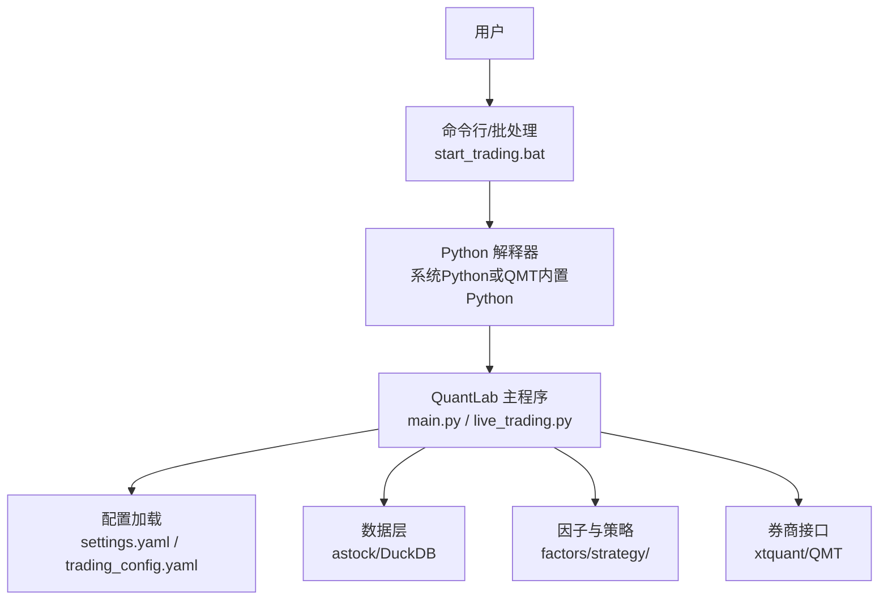
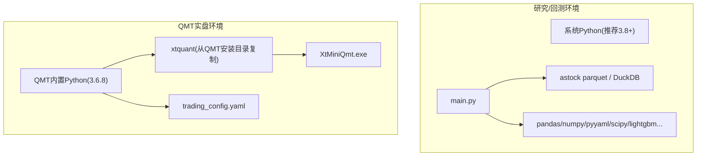
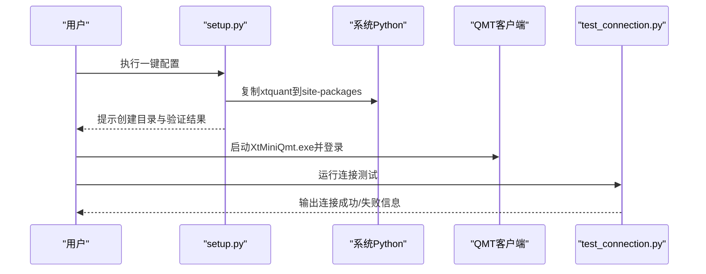
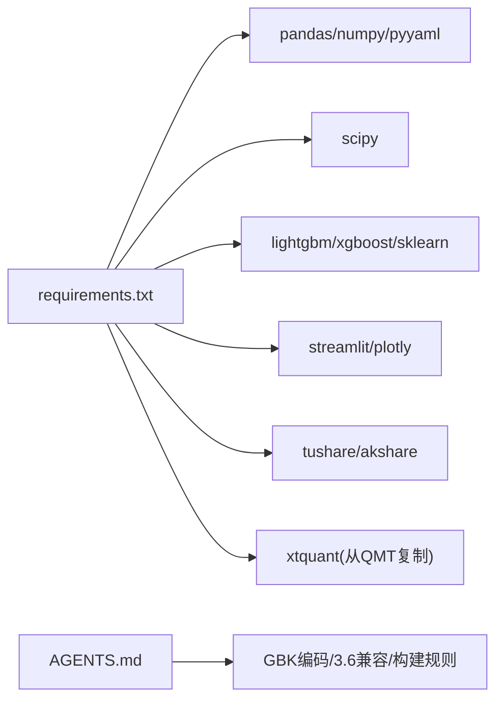

# 系统要求

<cite>
**本文引用的文件**   
- [requirements.txt](file://requirements.txt)
- [setup.py](file://setup.py)
- [main.py](file://main.py)
- [快速启动.md](file://快速启动.md)
- [实盘配置指南.md](file://实盘配置指南.md)
- [test_connection.py](file://test_connection.py)
- [start_trading.bat](file://start_trading.bat)
- [config/settings.yaml](file://config/settings.yaml)
- [AGENTS.md](file://AGENTS.md)
- [config/trading_config.yaml](file://config/trading_config.yaml)
- [test_connection_qmt.py](file://test_connection_qmt.py)
</cite>

## 目录
1. [简介](#简介)
2. [项目结构](#项目结构)
3. [核心组件](#核心组件)
4. [架构总览](#架构总览)
5. [详细组件分析](#详细组件分析)
6. [依赖分析](#依赖分析)
7. [性能与硬件建议](#性能与硬件建议)
8. [安装前检查清单](#安装前检查清单)
9. [故障排除指南](#故障排除指南)
10. [结论](#结论)

## 简介
本章节面向 QuantLab 系统的部署与运行环境，明确支持的操作系统、Python 版本、硬件配置建议、必要系统依赖（含 C++ 编译器与数据库引擎）、QMT 交易客户端的安装与兼容性要求，并提供多环境的安装前检查清单与常见故障排除指引。QuantLab 同时支持研究/回测环境与 QMT miniQMT 实盘对接，两套环境对 Python 版本与依赖库的要求存在差异，需分别满足。

## 项目结构
- 根目录包含回测主入口、配置文件、数据读取器、因子库、策略项目、脚本与文档等。
- 关键路径：
  - 回测入口：main.py
  - 全局配置：config/settings.yaml
  - 实盘配置：config/trading_config.yaml
  - 依赖声明：requirements.txt
  - 一键配置脚本：setup.py
  - 连接测试：test_connection.py、test_connection_qmt.py
  - 启动批处理：start_trading.bat
  - 开发规范与约束：AGENTS.md

图表来源 
- [main.py:1-104](file://main.py#L1-L104)
- [config/settings.yaml:1-69](file://config/settings.yaml#L1-L69)
- [config/trading_config.yaml:1-62](file://config/trading_config.yaml#L1-L62)
- [start_trading.bat:1-51](file://start_trading.bat#L1-L51)

章节来源
- [main.py:1-104](file://main.py#L1-L104)
- [config/settings.yaml:1-69](file://config/settings.yaml#L1-L69)
- [config/trading_config.yaml:1-62](file://config/trading_config.yaml#L1-L62)
- [start_trading.bat:1-51](file://start_trading.bat#L1-L51)

## 核心组件
- 依赖管理：通过 requirements.txt 声明 Python 依赖；setup.py 提供 xtquant 的一键复制与验证流程。
- 回测入口：main.py 负责加载配置、构建面板数据并执行回测。
- 实盘配置：trading_config.yaml 定义账号、路径、风控阈值、调度计划与通知等。
- 连接测试：test_connection.py（外部 Python）与 test_connection_qmt.py（QMT 内置 Python）用于验证 xtquant 与 QMT 连接。
- 启动脚本：start_trading.bat 检查 Python、QMT 进程、配置文件并启动实盘。

章节来源
- [requirements.txt:1-29](file://requirements.txt#L1-L29)
- [setup.py:1-82](file://setup.py#L1-L82)
- [main.py:1-104](file://main.py#L1-L104)
- [config/trading_config.yaml:1-62](file://config/trading_config.yaml#L1-L62)
- [test_connection.py:1-117](file://test_connection.py#L1-L117)
- [test_connection_qmt.py:1-117](file://test_connection_qmt.py#L1-L117)
- [start_trading.bat:1-51](file://start_trading.bat#L1-L51)

## 架构总览
QuantLab 在研究/回测环境使用系统 Python 与第三方库，在 QMT 实盘环境使用 QMT 内置 Python（兼容 Python 3.6.8）。两者通过 xtquant 与 QMT 客户端通信，数据源以 astock parquet 为主，辅以 DuckDB 本地缓存。

图表来源 
- [requirements.txt:1-29](file://requirements.txt#L1-L29)
- [AGENTS.md:50-81](file://AGENTS.md#L50-L81)
- [config/trading_config.yaml:1-62](file://config/trading_config.yaml#L1-L62)
- [setup.py:15-34](file://setup.py#L15-L34)

## 详细组件分析

### 操作系统与Python版本
- 支持的操作系统：Windows（默认，批处理与路径均为 Windows 风格）、Linux/macOS（可通过等效命令与路径适配，但仓库内脚本与示例为 Windows）。
- Python 版本：
  - 研究/回测环境：建议使用 Python 3.8+（requirements.txt 中的 pandas>=2.0、numpy>=1.24 等依赖在 3.8+ 下稳定）。
  - QMT 实盘环境：必须使用 QMT 内置 Python 3.6.8（AGENTS.md 明确要求），产物需 GBK 编码且语法兼容 3.6。

章节来源
- [AGENTS.md:50-81](file://AGENTS.md#L50-L81)
- [requirements.txt:1-29](file://requirements.txt#L1-L29)
- [test_connection_qmt.py:1-117](file://test_connection_qmt.py#L1-L117)

### 硬件配置建议
- CPU：建议多核处理器（回测与因子计算可并行化，LightGBM 训练亦受益于多线程）。
- 内存：建议 16GB 起步，若进行全市场面板数据与多因子计算，建议 32GB 或以上。
- 存储：SSD 优先；astock 数据集较大（日线/财务/基础字段），建议预留足够空间（数百 GB 级别），并保留缓存目录 data/cache。

[本节为通用指导，不直接分析具体文件]

### 必要的系统依赖库
- Python 依赖（研究/回测）：
  - 核心：pandas、numpy、pyyaml
  - 回测：scipy
  - ML：lightgbm（可选 xgboost、scikit-learn）
  - 可视化（可选）：streamlit、plotly
  - 数据源（可选）：tushare、akshare
  - QMT 实盘：xtquant（从 QMT 安装目录复制，非 pip 安装）
- C++ 编译器：
  - 当安装 lightgbm、xgboost、scikit-learn 等需要编译的包时，系统需具备 C++ 编译器（Windows 上通常为 MSVC 工具链）。
- 数据库引擎：
  - DuckDB：本地缓存与查询加速（duckdb_reader.py 使用 DuckDB 只读模式）。

章节来源
- [requirements.txt:1-29](file://requirements.txt#L1-L29)
- [data/duckdb_reader.py:39-68](file://data/duckdb_reader.py#L39-L68)

### QMT 交易客户端安装与兼容性
- 客户端：XtMiniQmt.exe（位于 QMT 安装目录 bin.x64 下）。
- 路径配置：trading_config.yaml 中 account.path 指向 userdata_mini 或 bin.x64 下的路径。
- xtquant 安装：
  - 方案A：复制到系统 Python site-packages（setup.py 与快速启动文档提供步骤）。
  - 方案B：使用 QMT 内置 Python 运行（兼容性最好，避免第三方库缺失）。
- 兼容性要点：
  - QMT 生产环境使用 Python 3.6.8，禁止使用 3.6 不支持的语法（如 walrus、类型注解、match/case）。
  - 产物必须 GBK 编码，首行 # coding=gbk。
  - passorder() 为全局函数，订单号需反查 get_trade_detail_data。

章节来源
- [setup.py:15-34](file://setup.py#L15-L34)
- [快速启动.md:1-67](file://快速启动.md#L1-L67)
- [AGENTS.md:50-81](file://AGENTS.md#L50-L81)
- [config/trading_config.yaml:1-62](file://config/trading_config.yaml#L1-L62)

### 安装前检查清单（按环境）
- 研究/回测环境（系统 Python 3.8+）：
  - 已安装 Python 3.8+ 并加入 PATH
  - 已安装 pandas、numpy、pyyaml、scipy、lightgbm 等依赖
  - 已准备 astock 数据路径（E:/astock）与缓存目录（E:/QuantLab/data/cache）
  - main.py 可正常执行回测
- QMT 实盘环境（QMT 内置 Python 3.6.8）：
  - 已启动 XtMiniQmt.exe 并登录账号
  - 已复制 xtquant 到系统 Python 或使用 QMT 内置 Python
  - config/trading_config.yaml 中 account.path、account.id、session_id 正确
  - test_connection.py 或 test_connection_qmt.py 连接测试通过
  - start_trading.bat 能检测到 QMT 进程并启动实盘

章节来源
- [快速启动.md:1-67](file://快速启动.md#L1-L67)
- [test_connection.py:1-117](file://test_connection.py#L1-L117)
- [test_connection_qmt.py:1-117](file://test_connection_qmt.py#L1-L117)
- [config/trading_config.yaml:1-62](file://config/trading_config.yaml#L1-L62)
- [start_trading.bat:1-51](file://start_trading.bat#L1-L51)

### 不同环境下的安装与启动流程
- Windows（推荐）：
  - 使用 setup.py 一键复制 xtquant
  - 启动 QMT 客户端并登录
  - 运行 test_connection.py 验证连接
  - 使用 start_trading.bat 启动实盘
- Linux/macOS（概念性）：
  - 使用等效命令安装依赖与复制 xtquant
  - 使用等效路径与命令启动 QMT 客户端与测试脚本
  - 将批处理脚本替换为 shell 脚本

图表来源 
- [setup.py:15-34](file://setup.py#L15-L34)
- [快速启动.md:1-67](file://快速启动.md#L1-L67)
- [test_connection.py:1-117](file://test_connection.py#L1-L117)

## 依赖分析
- Python 依赖关系：
  - 核心：pandas、numpy、pyyaml
  - 回测：scipy
  - ML：lightgbm（可选 xgboost、scikit-learn）
  - 可视化：streamlit、plotly（可选）
  - 数据源：tushare、akshare（可选）
  - QMT：xtquant（从 QMT 安装目录复制）
- 构建与产物：
  - QMT 策略构建器生成 GBK 编码单文件，禁止 3.6+ 语法
  - 研究环境使用 UTF-8 源码，构建时转码为 GBK

图表来源 
- [requirements.txt:1-29](file://requirements.txt#L1-L29)
- [AGENTS.md:50-81](file://AGENTS.md#L50-L81)

章节来源
- [requirements.txt:1-29](file://requirements.txt#L1-L29)
- [AGENTS.md:50-81](file://AGENTS.md#L50-L81)

## 性能与硬件建议
- 回测性能：
  - 使用 SSD 提升 parquet 读取速度
  - 合理设置缓存目录与过期时间（settings.yaml 中 data.cache）
  - 因子计算与 IC 评估可利用多线程（lightgbm、numpy）
- 实盘稳定性：
  - 确保 QMT 客户端稳定运行，避免网络中断
  - 日志与状态持久化（logs/、data/broker_state.json）有助于崩溃恢复
  - 定期备份配置与数据（config/、data/）

[本节为通用指导，不直接分析具体文件]

## 故障排除指南
- xtquant 导入失败：
  - 检查是否已从 QMT 安装目录复制 xtquant 到系统 Python
  - 或使用 QMT 内置 Python 运行
- 连接失败（错误码非 0）：
  - 确认 QMT 已启动并登录
  - 检查 trading_config.yaml 中 account.path、account.id、session_id
- 查询账户返回 0：
  - 账号 ID 不正确，需在 QMT 中查看并修改配置
- 程序崩溃后恢复：
  - 自动加载 broker_state.json 状态，重启后对账持仓
- 停止程序：
  - 控制台 Ctrl+C 优雅退出，后台进程结束 pythonw.exe

章节来源
- [test_connection.py:1-117](file://test_connection.py#L1-L117)
- [test_connection_qmt.py:1-117](file://test_connection_qmt.py#L1-L117)
- [实盘配置指南.md:154-208](file://实盘配置指南.md#L154-L208)

## 结论
QuantLab 在研究/回测环境推荐使用 Python 3.8+ 与主流科学计算库，在 QMT 实盘环境严格遵循 Python 3.6.8 与 GBK 编码要求。通过清晰的依赖声明、一键配置脚本与连接测试工具，用户可在 Windows 环境下快速完成部署与验证。结合合理的硬件配置与故障排除流程，可保障回测与实盘的稳定运行。