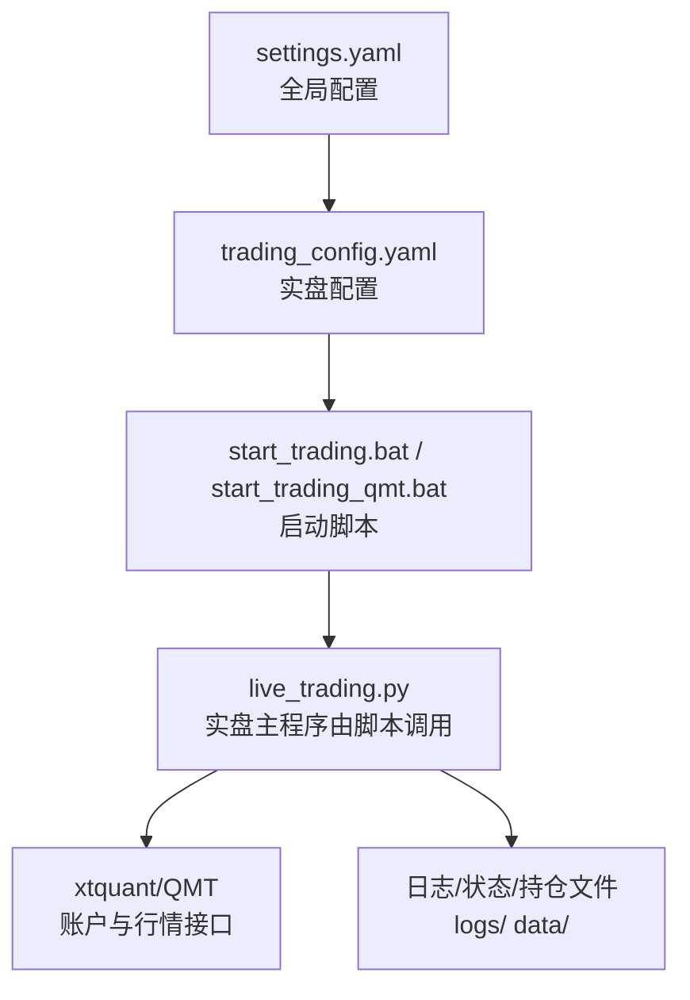
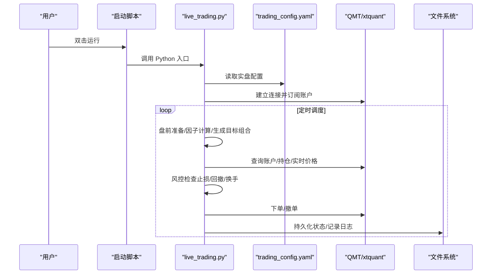
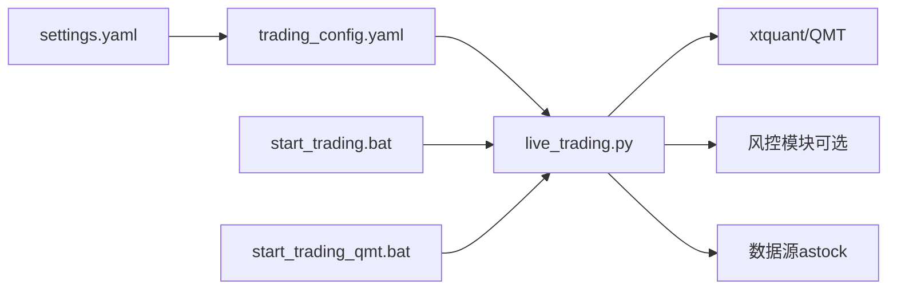

# 交易配置

<cite>
**本文引用的文件**   
- [config/trading_config.yaml](file://config/trading_config.yaml)
- [config/settings.yaml](file://config/settings.yaml)
- [broker/qmt_builder.py](file://broker/qmt_builder.py)
- [strategy/schedule.py](file://strategy/schedule.py)
- [start_trading.bat](file://start_trading.bat)
- [start_trading_qmt.bat](file://start_trading_qmt.bat)
- [test_connection.py](file://test_connection.py)
- [test_in_qmt.py](file://test_in_qmt.py)
- [实盘配置指南.md](file://实盘配置指南.md)
- [快速启动.md](file://快速启动.md)
- [miniQMT实盘对接_生产级完善方案.md](file://miniQMT实盘对接_生产级完善方案.md)
</cite>

## 目录
1. [简介](#简介)
2. [项目结构](#项目结构)
3. [核心组件](#核心组件)
4. [架构总览](#架构总览)
5. [详细组件分析](#详细组件分析)
6. [依赖关系分析](#依赖关系分析)
7. [性能考虑](#性能考虑)
8. [故障排查指南](#故障排查指南)
9. [结论](#结论)
10. [附录](#附录)

## 简介
本文件面向 QuantLab 的实盘交易配置，围绕 trading_config.yaml 中的各项参数进行系统化说明，涵盖 QMT 账户连接、风控、调度计划、订单管理、资金管理、通知与数据源等。同时给出安全配置建议（敏感信息保护）、动态更新与热重载机制说明、常见场景示例与故障排查方法，帮助使用者在生产环境中稳定运行。

## 项目结构
QuantLab 将“全局配置”和“实盘配置”分离：
- settings.yaml：全局设置（路径、缓存、日志、回测默认值、是否启用实盘等）
- trading_config.yaml：实盘交易相关的具体参数（账户、交易成本、风控、订单、调度、通知、数据源、策略）

图表来源
- [config/settings.yaml:1-69](file://config/settings.yaml#L1-L69)
- [config/trading_config.yaml:1-62](file://config/trading_config.yaml#L1-L62)
- [start_trading.bat:1-51](file://start_trading.bat#L1-L51)
- [start_trading_qmt.bat:1-66](file://start_trading_qmt.bat#L1-L66)

章节来源
- [config/settings.yaml:1-69](file://config/settings.yaml#L1-L69)
- [config/trading_config.yaml:1-62](file://config/trading_config.yaml#L1-L62)

## 核心组件
- 账户与连接（account）
  - id：QMT 账号
  - path：QMT userdata_mini 路径
  - session_id：会话标识
- 交易参数（trading）
  - initial_capital：初始资金
  - max_single_position：单股最大仓位比例
  - max_total_position：总仓位上限
  - commission_rate：佣金率
  - stamp_tax：印花税
  - slippage：滑点
- 风控（risk）
  - stop_loss_pct：个股止损比例
  - max_drawdown：组合最大回撤
  - max_holding_days：最长持有天数
  - max_daily_turnover：单日最大换手
- 订单（order）
  - timeout_seconds：委托超时时间
  - max_retry：最大重试次数
  - price_tolerance：价格容差
  - cancel_unfilled：超时未成交自动撤单
- 调度（schedule）
  - pre_market/morning_open/afternoon_check/end_of_day：关键时间点
  - risk_check_interval：风控检查间隔（分钟）
- 通知（notification）
  - enabled/method/webhook_url：企业微信/钉钉 webhook
- 数据（data）
  - source/astock_path/cache_dir：数据源与缓存路径
- 策略（strategy）
  - name/universe/top_n/rebalance_freq/factors：因子权重与调仓频率

章节来源
- [config/trading_config.yaml:1-62](file://config/trading_config.yaml#L1-L62)

## 架构总览
实盘系统通过批处理脚本启动，加载 trading_config.yaml，初始化 xtquant 连接 QMT，按 schedule 执行任务，结合 risk/order 控制下单与风控，持久化状态并输出日志与报表。

图表来源
- [start_trading.bat:1-51](file://start_trading.bat#L1-L51)
- [start_trading_qmt.bat:1-66](file://start_trading_qmt.bat#L1-L66)
- [config/trading_config.yaml:1-62](file://config/trading_config.yaml#L1-L62)
- [miniQMT实盘对接_生产级完善方案.md:236-313](file://miniQMT实盘对接_生产级完善方案.md#L236-L313)

## 详细组件分析

### 账户与连接配置（account）
- id：用于 xttype.StockAccount 的账号标识
- path：QMT userdata_mini 路径，用于 XtQuantTrader(path, session_id) 初始化
- session_id：会话 ID，需与 QMT 客户端一致

使用要点
- 确保 QMT 已登录对应账号
- path 必须指向有效的 userdata_mini 目录
- session_id 与 QMT 启动会话一致

章节来源
- [config/trading_config.yaml:4-8](file://config/trading_config.yaml#L4-L8)
- [test_in_qmt.py:10-27](file://test_in_qmt.py#L10-L27)
- [miniQMT实盘对接_生产级完善方案.md:236-289](file://miniQMT实盘对接_生产级完善方案.md#L236-L289)

### 交易参数（trading）
- initial_capital：用于资金管理与仓位计算基准
- max_single_position：限制单只股票的最大权重
- max_total_position：限制组合总仓位上限
- commission_rate/stamp_tax/slippage：交易成本与滑点估算

使用要点
- 成本参数影响净值曲线与回测/实盘一致性
- 仓位上限需与策略选股数量 top_n 匹配，避免过度分散或集中

章节来源
- [config/trading_config.yaml:10-16](file://config/trading_config.yaml#L10-L16)

### 风控参数（risk）
- stop_loss_pct：个股止损阈值
- max_drawdown：组合最大回撤触发清仓或降仓
- max_holding_days：最长持有期强制退出
- max_daily_turnover：单日最大换手率限制

使用要点
- 可结合 ATR 自适应止损（在策略层实现），但配置文件提供固定阈值基线
- 分层回撤策略可在策略层扩展（如 Project_10 的风控模块）

章节来源
- [config/trading_config.yaml:18-22](file://config/trading_config.yaml#L18-L22)
- [projects/Project_10_价值小盘V2/strategy/risk.py:15-126](file://projects/Project_10_价值小盘V2/strategy/risk.py#L15-L126)

### 订单管理（order）
- timeout_seconds：委托超时时间（秒）
- max_retry：失败重试次数
- price_tolerance：限价委托的价格容差
- cancel_unfilled：超时未成交自动撤单

使用要点
- 配合 Broker 层的委托监控线程，实现超时撤单与部分成交处理
- 价格容差用于避免极端行情下的无效委托

章节来源
- [config/trading_config.yaml:24-28](file://config/trading_config.yaml#L24-L28)
- [miniQMT实盘对接_生产级完善方案.md:510-546](file://miniQMT实盘对接_生产级完善方案.md#L510-L546)

### 调度计划（schedule）
- pre_market/morning_open/afternoon_check/end_of_day：盘中关键时点
- risk_check_interval：风控检查间隔（分钟）

使用要点
- 开盘执行避开集合竞价（如 09:35）
- 尾盘处理包含对账与状态保存

章节来源
- [config/trading_config.yaml:30-35](file://config/trading_config.yaml#L30-L35)
- [strategy/schedule.py:10-47](file://strategy/schedule.py#L10-L47)

### 通知（notification）
- enabled：开关
- method：wechat/dingtalk/email
- webhook_url：Webhook 地址

使用要点
- 生产环境建议开启，异常与重要事件即时推送
- Webhook 需妥善保管，避免泄露

章节来源
- [config/trading_config.yaml:37-40](file://config/trading_config.yaml#L37-L40)
- [实盘配置指南.md:82-102](file://实盘配置指南.md#L82-L102)

### 数据源（data）
- source：主数据源（astock）
- astock_path：本地数据路径
- cache_dir：缓存目录

使用要点
- 确保路径存在且可读
- 缓存过期策略与磁盘空间需关注

章节来源
- [config/trading_config.yaml:43-46](file://config/trading_config.yaml#L43-L46)
- [config/settings.yaml:10-19](file://config/settings.yaml#L10-L19)

### 策略（strategy）
- name/universe/top_n/rebalance_freq：策略名称、股票池、选股数量、调仓频率
- factors：因子权重字典（与策略代码保持一致）

使用要点
- 权重口径需与策略实现一致（如 Project_01 的 FACTOR_WEIGHTS）
- 双月调仓（2M）需结合交易日日历判断

章节来源
- [config/trading_config.yaml:51-62](file://config/trading_config.yaml#L51-L62)
- [broker/qmt_builder.py:48-52](file://broker/qmt_builder.py#L48-L52)
- [strategy/schedule.py:10-47](file://strategy/schedule.py#L10-L47)

## 依赖关系分析
- settings.yaml 作为全局配置，trading_config.yaml 作为实盘配置，两者共同驱动 live_trading.py
- 启动脚本负责环境检查与调用入口
- xtquant/QMT 为外部依赖，提供账户、行情与下单能力
- 策略与风控逻辑可由不同模块实现（如 Project_10 的风险控制器）

图表来源
- [config/settings.yaml:1-69](file://config/settings.yaml#L1-L69)
- [config/trading_config.yaml:1-62](file://config/trading_config.yaml#L1-L62)
- [start_trading.bat:1-51](file://start_trading.bat#L1-L51)
- [start_trading_qmt.bat:1-66](file://start_trading_qmt.bat#L1-L66)

章节来源
- [config/settings.yaml:1-69](file://config/settings.yaml#L1-L69)
- [config/trading_config.yaml:1-62](file://config/trading_config.yaml#L1-L62)

## 性能考虑
- 数据读取与缓存：合理设置 cache_dir 与过期策略，减少重复 IO
- 因子计算：尽量向量化与批量获取行情，降低延迟
- 下单与回调：利用异步回调与最小化同步阻塞，提高吞吐
- 日志与状态持久化：控制日志级别与滚动策略，避免 I/O 瓶颈

[本节为通用指导，不直接分析具体文件]

## 故障排查指南
常见问题与定位步骤
- xtquant 导入失败
  - 检查 QMT 安装路径与 site-packages 位置
  - 参考“复制 xtquant 到系统 Python”的步骤
- 连接失败（错误码非 0）
  - 确认 QMT 已启动并登录账号
  - 核对 account.path 与 session_id
- 查询账户返回 0
  - 核对 account.id 是否正确
- 程序崩溃后恢复
  - 查看 data/broker_state.json 的状态恢复
  - 对账持仓差异并告警
- 如何优雅停止
  - Ctrl+C 或结束进程；退出时自动撤销未完成委托、保存状态、断开连接

章节来源
- [实盘配置指南.md:154-208](file://实盘配置指南.md#L154-L208)
- [test_connection.py:93-116](file://test_connection.py#L93-L116)
- [miniQMT实盘对接_生产级完善方案.md:650-686](file://miniQMT实盘对接_生产级完善方案.md#L650-L686)

## 结论
trading_config.yaml 提供了实盘交易的核心参数集，配合 settings.yaml 的全局设置与启动脚本，形成完整的实盘运行链路。通过合理的账户连接、风控、订单与调度配置，以及完善的通知与数据源管理，可以在生产环境中稳健运行。建议严格遵循安全配置建议，并结合策略层的风控扩展（如 ATR 自适应止损与分层回撤）提升鲁棒性。

[本节为总结，不直接分析具体文件]

## 附录

### 安全配置建议与敏感信息保护
- 密码与密钥
  - 避免明文写入配置文件；建议使用环境变量或加密存储（如 KMS、Vault）
  - 若必须使用配置文件，限制文件权限（仅运行用户可读写）
- 配置文件权限
  - Windows：限制文件夹访问权限，仅允许服务账户读取
  - Linux/macOS：chmod 600 配置文件，chown 至运行用户
- 网络与通信
  - Webhook URL 应使用 HTTPS，并定期轮换
  - 限制对外网访问范围（防火墙/白名单）
- 日志脱敏
  - 避免打印账号、密钥、完整委托详情
  - 日志轮转与保留策略（大小/时间）

[本节为通用指导，不直接分析具体文件]

### 配置参数的动态更新与热重载
- 当前实现
  - 启动时加载 trading_config.yaml；运行时未内置热重载
- 建议实现
  - 引入配置监听器（如 watchdog）检测文件变更
  - 增量更新：仅更新必要字段（如风控阈值、调度时间）
  - 原子替换：新配置生效前保持旧配置运行，切换时加锁
  - 校验与回滚：更新前校验格式与业务约束，失败回滚并告警

[本节为概念性说明，不直接分析具体文件]

### 常见配置场景示例
- 小市值多因子策略（双月调仓）
  - strategy.name: multi_factor_ic
  - strategy.universe: small_cap
  - strategy.top_n: 80
  - strategy.rebalance_freq: 2M
  - factors: BP、reversal_1m、volatility_60d、ROE、vwap_volume_corr 权重
- 风控强化
  - risk.stop_loss_pct: 0.08（可结合 ATR 自适应）
  - risk.max_drawdown: 0.15（可启用分层降仓）
  - risk.max_daily_turnover: 0.30
- 订单稳健
  - order.timeout_seconds: 300
  - order.cancel_unfilled: true
  - order.price_tolerance: 0.005

章节来源
- [config/trading_config.yaml:51-62](file://config/trading_config.yaml#L51-L62)
- [config/trading_config.yaml:18-28](file://config/trading_config.yaml#L18-L28)
- [strategy/schedule.py:10-47](file://strategy/schedule.py#L10-L47)

### 启动与测试流程
- 一键启动
  - 使用 start_trading.bat 或 start_trading_qmt.bat
- 连接测试
  - 运行 test_connection.py 验证 xtquant 与 QMT 连接
  - 在 QMT 中运行 test_in_qmt.py 进行内嵌测试

章节来源
- [start_trading.bat:1-51](file://start_trading.bat#L1-L51)
- [start_trading_qmt.bat:1-66](file://start_trading_qmt.bat#L1-L66)
- [test_connection.py:93-116](file://test_connection.py#L93-L116)
- [test_in_qmt.py:10-27](file://test_in_qmt.py#L10-L27)