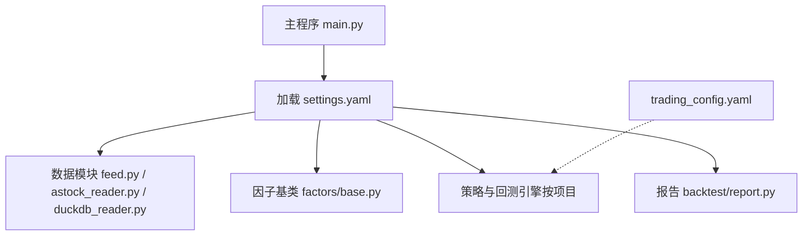
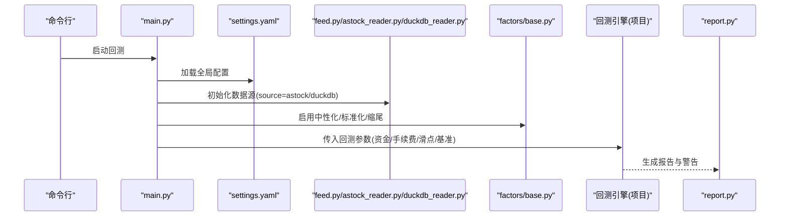
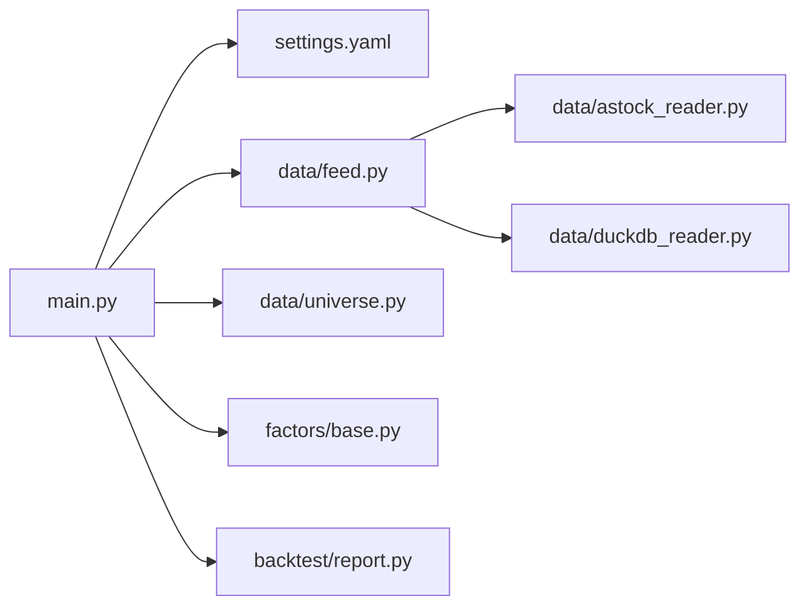

# 全局配置

<cite>
**本文引用的文件**   
- [config/settings.yaml](file://config/settings.yaml)
- [config/trading_config.yaml](file://config/trading_config.yaml)
- [main.py](file://main.py)
- [data/feed.py](file://data/feed.py)
- [data/astock_reader.py](file://data/astock_reader.py)
- [data/duckdb_reader.py](file://data/duckdb_reader.py)
- [data/universe.py](file://data/universe.py)
- [factors/base.py](file://factors/base.py)
- [projects/Project_01_多因子IC小盘Alpha/config/strategy.yaml](file://projects/Project_01_多因子IC小盘Alpha/config/strategy.yaml)
- [scripts/run_backtest.py](file://scripts/run_backtest.py)
- [backtest/report.py](file://backtest/report.py)
</cite>

## 目录
1. [简介](#简介)
2. [项目结构](#项目结构)
3. [核心组件](#核心组件)
4. [架构总览](#架构总览)
5. [详细组件分析](#详细组件分析)
6. [依赖关系分析](#依赖关系分析)
7. [性能与缓存](#性能与缓存)
8. [故障排查指南](#故障排查指南)
9. [结论](#结论)
10. [附录：配置项速查表](#附录配置项速查表)

## 简介
本文件为 QuantLab 的“全局配置”权威说明，围绕 config/settings.yaml 展开，系统解释所有配置项的含义、数据类型、默认值、有效范围与使用方式，并覆盖数据源（astock/DuckDB）、回测参数、日志、因子预处理、策略股票池以及实盘配置入口。同时给出配置验证规则、错误处理机制、最佳实践与常见问题定位方法，帮助读者快速、安全地调整与扩展配置。

## 项目结构
QuantLab 采用“三级级联配置”模式：
- 全局配置：config/settings.yaml（项目信息、数据源、回测参数、因子预处理、策略默认股票池、日志）
- 实盘配置：config/trading_config.yaml（账号、交易参数、风控阈值、委托管理、调度计划、通知）
- 项目级配置：各项目的 strategy.yaml（如 Project_01 的策略权重与过滤条件）

图表来源
- [main.py:21-26](file://main.py#L21-L26)
- [data/feed.py:17-40](file://data/feed.py#L17-L40)
- [data/astock_reader.py:25-45](file://data/astock_reader.py#L25-L45)
- [data/duckdb_reader.py:42-57](file://data/duckdb_reader.py#L42-L57)
- [factors/base.py:9-28](file://factors/base.py#L9-L28)
- [backtest/report.py:111-147](file://backtest/report.py#L111-L147)

章节来源
- [AGENTS.md:90-94](file://AGENTS.md#L90-L94)

## 核心组件
- 配置加载器：main.py 中的 load_config() 负责读取 settings.yaml
- 数据源抽象：data/feed.py 提供统一接口，内部根据 source 切换 astock 或 DuckDB
- 因子预处理：factors/base.py 提供 winsorize/zscore/rank_normalize 等工具
- 股票池校验：data/universe.py 对 CSV 进行严格校验与去重
- 报告与警告：backtest/report.py 汇总运行期警告与关键日志

章节来源
- [main.py:21-26](file://main.py#L21-L26)
- [data/feed.py:17-40](file://data/feed.py#L17-L40)
- [factors/base.py:30-51](file://factors/base.py#L30-L51)
- [data/universe.py:27-61](file://data/universe.py#L27-L61)
- [backtest/report.py:111-147](file://backtest/report.py#L111-L147)

## 架构总览
settings.yaml 作为全局配置中心，被主程序加载后，驱动数据层、因子层、策略层与报告层协同工作。实盘配置通过 trading.config 指向独立的 trading_config.yaml，便于隔离生产环境敏感参数。

图表来源
- [main.py:21-26](file://main.py#L21-L26)
- [data/feed.py:17-40](file://data/feed.py#L17-L40)
- [data/astock_reader.py:25-45](file://data/astock_reader.py#L25-L45)
- [data/duckdb_reader.py:42-57](file://data/duckdb_reader.py#L42-L57)
- [factors/base.py:30-51](file://factors/base.py#L30-L51)
- [backtest/report.py:111-147](file://backtest/report.py#L111-L147)

## 详细组件分析

### 项目信息配置（project）
- name: 项目名称，字符串类型，默认 "QuantLab"
- version: 版本号，字符串类型，默认 "1.0.0"
- root: 项目根路径，字符串类型，默认 "E:\\QuantLab"

用途与影响
- 用于日志输出、结果目录组织、路径拼接等
- 建议保持与实际部署路径一致，避免相对路径歧义

章节来源
- [config/settings.yaml:4-7](file://config/settings.yaml#L4-L7)

### 数据源配置（data）
- data.source: 数据源标识，枚举 "astock"/"duckdb"，默认 "astock"
- data.astock.daily_path: 日线 parquet 路径，字符串，默认 "E:/astock/daily/stock_daily.parquet"
- data.astock.finance_path: 财务数据目录，字符串，默认 "E:/astock/finance"
- data.astock.basic_path: 基础信息目录，字符串，默认 "E:/astock/basic"
- data.cache.enabled: 是否启用缓存，布尔，默认 true
- data.cache.dir: 缓存目录，字符串，默认 "E:/QuantLab/data/cache"
- data.cache.expire_days: 缓存过期天数，整数，默认 1

行为与约束
- feed.py 根据 source 选择具体实现；astock 走 parquet 读取，duckdb 走 DuckDBDailyReader
- astock_reader 会检查文件存在性与列完整性，缺失将抛出 FileNotFoundError/ValueError
- duckdb_reader 会检查数据库文件存在性，并检测 .wal 同步状态，发出警告
- 缓存开关控制中间结果落盘与过期清理（由上层逻辑决定）

章节来源
- [config/settings.yaml:10-19](file://config/settings.yaml#L10-L19)
- [data/feed.py:17-40](file://data/feed.py#L17-L40)
- [data/astock_reader.py:35-45](file://data/astock_reader.py#L35-L45)
- [data/duckdb_reader.py:42-57](file://data/duckdb_reader.py#L42-L57)

### 回测参数（backtest）
- start_date/end_date: 回测起止日期，字符串（YYYY-MM-DD），默认 "2018-07-01"/"2026-06-30"
- initial_capital: 初始资金，数值，默认 500000
- commission: 单边手续费率，数值，默认 0.00025
- slippage: 滑点比例，数值，默认 0.002
- benchmark: 基准指数代码，字符串，默认 "000300.SH"

注意事项
- 日期需符合交易日区间，过短样本可能触发“短期样本”警告
- 基准不可用时会在报告中记录禁用原因

章节来源
- [config/settings.yaml:22-28](file://config/settings.yaml#L22-L28)
- [backtest/report.py:78-108](file://backtest/report.py#L78-L108)

### 日志配置（logging）
- level: 日志级别，枚举 "DEBUG"/"INFO"/"WARNING"/"ERROR"/"CRITICAL"，默认 "INFO"
- dir: 日志目录，字符串，默认 "E:/QuantLab/logs"
- max_file_size: 单文件大小限制，字符串格式（如 "10MB"）
- backup_count: 保留历史文件数量，整数，默认 10

说明
- 实际脚本中可通过 logging.basicConfig(level=...) 设置级别
- 报告模块会将 WARN/ERROR 摘要写入 logs.txt

章节来源
- [config/settings.yaml:31-35](file://config/settings.yaml#L31-L35)
- [scripts/run_backtest.py:43-44](file://scripts/run_backtest.py#L43-L44)
- [backtest/report.py:111-147](file://backtest/report.py#L111-L147)

### 因子配置（factors）
- neutralize: 是否中性化，布尔，默认 true
- standardize: 是否标准化，布尔，默认 true
- winsorize: 是否缩尾，布尔，默认 true
- winsorize_limit: 缩尾分位数上限/下限，数值，默认 0.05
- neutralize_method: 中性化方法，枚举 "industry"/"market"/"none"，默认 "industry"
- standardize_method: 标准化方法，枚举 "zscore"/"rank"/"none"，默认 "zscore"

实现要点
- factors/base.py 提供 winsorize/zscore/rank_normalize 静态方法
- 中性化与标准化在因子计算管线中顺序执行，受开关与方法控制

章节来源
- [config/settings.yaml:38-49](file://config/settings.yaml#L38-L49)
- [factors/base.py:30-51](file://factors/base.py#L30-L51)

### 策略配置（strategy）
- default_universe: 默认股票池名称，字符串，默认 "small_cap"
- universes: 股票池定义字典，键为池名，值为市值范围
  - small_cap: min_mv=0, max_mv=30e8
  - mid_cap: min_mv=30e8, max_mv=200e8
  - large_cap: min_mv=200e8, max_mv=null（无上限）

用法
- 策略运行时根据 default_universe 选取对应市值区间过滤
- 可结合项目级 strategy.yaml 进一步细化（如 top_n、调仓频率、止损等）

章节来源
- [config/settings.yaml:52-63](file://config/settings.yaml#L52-L63)
- [projects/Project_01_多因子IC小盘Alpha/config/strategy.yaml:19-35](file://projects/Project_01_多因子IC小盘Alpha/config/strategy.yaml#L19-L35)

### 实盘配置入口（trading）
- config: 指向独立配置文件，字符串，默认 "config/trading_config.yaml"
- enabled: 是否启用实盘模式，布尔，默认 false

内容概览（trading_config.yaml）
- account: 账号 id、QMT 路径、session_id
- trading: 初始资金、仓位上限、佣金、印花税、滑点
- risk: 个股止损、组合回撤、最长持有天数、单日最大换手
- order: 委托超时、重试次数、价格容差、未成交自动撤单
- schedule: 盘前/开盘/午后/尾盘时间、风控检查间隔
- notification: 通知开关、渠道、webhook_url
- data: 数据源、astock 路径、缓存目录
- strategy: 策略名、股票池、top_n、调仓频率、因子权重

章节来源
- [config/settings.yaml:66-68](file://config/settings.yaml#L66-L68)
- [config/trading_config.yaml:1-62](file://config/trading_config.yaml#L1-L62)

## 依赖关系分析
- main.py 加载 settings.yaml，并将配置传递给数据层、因子层与回测引擎
- data/feed.py 依据 data.source 动态选择 astock 或 duckdb 读取器
- factors/base.py 提供通用预处理工具，供因子计算调用
- data/universe.py 负责股票池 CSV 的强校验与去重
- backtest/report.py 汇总运行期警告与关键日志，辅助排障

图表来源
- [main.py:21-26](file://main.py#L21-L26)
- [data/feed.py:17-40](file://data/feed.py#L17-L40)
- [data/astock_reader.py:25-45](file://data/astock_reader.py#L25-L45)
- [data/duckdb_reader.py:42-57](file://data/duckdb_reader.py#L42-L57)
- [data/universe.py:27-61](file://data/universe.py#L27-L61)
- [factors/base.py:9-28](file://factors/base.py#L9-L28)
- [backtest/report.py:111-147](file://backtest/report.py#L111-L147)

## 性能与缓存
- astock parquet 读取仅加载必要列，降低内存占用
- DuckDB 只读连接，支持 WAL 检测并发同步风险
- 缓存开关与过期策略可减少重复 I/O，但需注意磁盘空间与一致性

优化建议
- 合理设置 expire_days，平衡命中率与存储成本
- 大窗口回测时优先使用 astock parquet，减少数据库锁竞争
- 开启缓存后，确保缓存目录有足够权限与空间

章节来源
- [data/astock_reader.py:47-56](file://data/astock_reader.py#L47-L56)
- [data/duckdb_reader.py:54-68](file://data/duckdb_reader.py#L54-L68)
- [config/settings.yaml:16-19](file://config/settings.yaml#L16-L19)

## 故障排查指南
常见错误与定位
- 数据源路径不存在：astock_reader 抛出 FileNotFoundError；检查 daily_path/finance_path/basic_path
- 数据列缺失：astock_reader 构造索引时报 ValueError；确认 parquet 包含 trade_date/ts_code 及必要字段
- DuckDB 文件不存在或正在同步：duckdb_reader 抛出 FileNotFoundError 或发出 WAL 警告；等待同步完成或更换快照
- 股票池为空或格式错误：universe.py 抛出 ValueError；检查 CSV 首列为 code、编码为 UTF-8、代码格式匹配正则
- 基准不可用：报告模块记录 BENCHMARK_DISABLED；检查基准数据可用性
- 短期样本：报告模块记录 SHORT_SAMPLE_PERIOD；扩大回测区间或接受警告

处理步骤
- 先核对 settings.yaml 的路径与开关
- 再检查数据文件是否存在且可读
- 查看 backtest/report.py 生成的 logs.txt 与 report.md 中的警告块
- 必要时关闭缓存或缩短回测区间以快速验证

章节来源
- [data/astock_reader.py:35-45](file://data/astock_reader.py#L35-L45)
- [data/duckdb_reader.py:42-57](file://data/duckdb_reader.py#L42-L57)
- [data/universe.py:27-61](file://data/universe.py#L27-L61)
- [backtest/report.py:78-108](file://backtest/report.py#L78-L108)

## 结论
settings.yaml 是 QuantLab 的核心配置中枢，贯穿数据、因子、策略与报告全链路。通过清晰的层级与严格的校验，既能保证回测与实盘的稳定性，又便于扩展与迁移。建议在生产环境中：
- 明确区分全局、实盘与项目级配置
- 谨慎修改路径与开关，配合报告与日志快速定位问题
- 利用缓存与只读数据源提升性能与安全性

## 附录：配置项速查表
以下为 settings.yaml 中关键配置项的说明、类型、默认值与有效范围。

- project.name
  - 含义：项目名称
  - 类型：字符串
  - 默认值："QuantLab"
  - 有效范围：任意非空字符串

- project.version
  - 含义：项目版本
  - 类型：字符串
  - 默认值："1.0.0"
  - 有效范围：语义化版本格式（建议）

- project.root
  - 含义：项目根路径
  - 类型：字符串
  - 默认值："E:\\QuantLab"
  - 有效范围：存在的本地路径

- data.source
  - 含义：数据源标识
  - 类型：枚举
  - 默认值："astock"
  - 有效范围："astock"/"duckdb"

- data.astock.daily_path
  - 含义：日线 parquet 路径
  - 类型：字符串
  - 默认值："E:/astock/daily/stock_daily.parquet"
  - 有效范围：存在的文件路径

- data.astock.finance_path
  - 含义：财务数据目录
  - 类型：字符串
  - 默认值："E:/astock/finance"
  - 有效范围：存在的目录路径

- data.astock.basic_path
  - 含义：基础信息目录
  - 类型：字符串
  - 默认值："E:/astock/basic"
  - 有效范围：存在的目录路径

- data.cache.enabled
  - 含义：是否启用缓存
  - 类型：布尔
  - 默认值：true
  - 有效范围：true/false

- data.cache.dir
  - 含义：缓存目录
  - 类型：字符串
  - 默认值："E:/QuantLab/data/cache"
  - 有效范围：可写目录路径

- data.cache.expire_days
  - 含义：缓存过期天数
  - 类型：整数
  - 默认值：1
  - 有效范围：>=1

- backtest.start_date
  - 含义：回测开始日期
  - 类型：字符串（YYYY-MM-DD）
  - 默认值："2018-07-01"
  - 有效范围：合法日期且在交易日范围内

- backtest.end_date
  - 含义：回测结束日期
  - 类型：字符串（YYYY-MM-DD）
  - 默认值："2026-06-30"
  - 有效范围：合法日期且在交易日范围内

- backtest.initial_capital
  - 含义：初始资金
  - 类型：数值
  - 默认值：500000
  - 有效范围：>0

- backtest.commission
  - 含义：单边手续费率
  - 类型：数值
  - 默认值：0.00025
  - 有效范围：>=0

- backtest.slippage
  - 含义：滑点比例
  - 类型：数值
  - 默认值：0.002
  - 有效范围：>=0

- backtest.benchmark
  - 含义：基准指数代码
  - 类型：字符串
  - 默认值："000300.SH"
  - 有效范围：有效的指数代码

- logging.level
  - 含义：日志级别
  - 类型：枚举
  - 默认值："INFO"
  - 有效范围："DEBUG"/"INFO"/"WARNING"/"ERROR"/"CRITICAL"

- logging.dir
  - 含义：日志目录
  - 类型：字符串
  - 默认值："E:/QuantLab/logs"
  - 有效范围：可写目录路径

- logging.max_file_size
  - 含义：单文件最大大小
  - 类型：字符串（如 "10MB"）
  - 默认值："10MB"
  - 有效范围：合理的文件大小描述

- logging.backup_count
  - 含义：保留历史文件数
  - 类型：整数
  - 默认值：10
  - 有效范围：>=0

- factors.neutralize
  - 含义：是否中性化
  - 类型：布尔
  - 默认值：true
  - 有效范围：true/false

- factors.standardize
  - 含义：是否标准化
  - 类型：布尔
  - 默认值：true
  - 有效范围：true/false

- factors.winsorize
  - 含义：是否缩尾
  - 类型：布尔
  - 默认值：true
  - 有效范围：true/false

- factors.winsorize_limit
  - 含义：缩尾分位数
  - 类型：数值
  - 默认值：0.05
  - 有效范围：(0, 0.5]

- factors.neutralize_method
  - 含义：中性化方法
  - 类型：枚举
  - 默认值："industry"
  - 有效范围："industry"/"market"/"none"

- factors.standardize_method
  - 含义：标准化方法
  - 类型：枚举
  - 默认值："zscore"
  - 有效范围："zscore"/"rank"/"none"

- strategy.default_universe
  - 含义：默认股票池名称
  - 类型：字符串
  - 默认值："small_cap"
  - 有效范围：universes 中定义的键名

- strategy.universes.small_cap.min_mv
  - 含义：小市值最小流通市值
  - 类型：数值
  - 默认值：0
  - 有效范围：>=0

- strategy.universes.small_cap.max_mv
  - 含义：小市值最大流通市值
  - 类型：数值
  - 默认值：30e8
  - 有效范围：>min_mv 或 null

- strategy.universes.mid_cap.min_mv
  - 含义：中市值最小流通市值
  - 类型：数值
  - 默认值：30e8
  - 有效范围：>=0

- strategy.universes.mid_cap.max_mv
  - 含义：中市值最大流通市值
  - 类型：数值
  - 默认值：200e8
  - 有效范围：>min_mv 或 null

- strategy.universes.large_cap.min_mv
  - 含义：大市值最小流通市值
  - 类型：数值
  - 默认值：200e8
  - 有效范围：>=0

- strategy.universes.large_cap.max_mv
  - 含义：大市值最大流通市值
  - 类型：数值
  - 默认值：null
  - 有效范围：>min_mv 或 null

- trading.config
  - 含义：实盘配置文件路径
  - 类型：字符串
  - 默认值："config/trading_config.yaml"
  - 有效范围：存在的配置文件路径

- trading.enabled
  - 含义：是否启用实盘模式
  - 类型：布尔
  - 默认值：false
  - 有效范围：true/false

章节来源
- [config/settings.yaml:4-68](file://config/settings.yaml#L4-L68)
- [config/trading_config.yaml:1-62](file://config/trading_config.yaml#L1-L62)