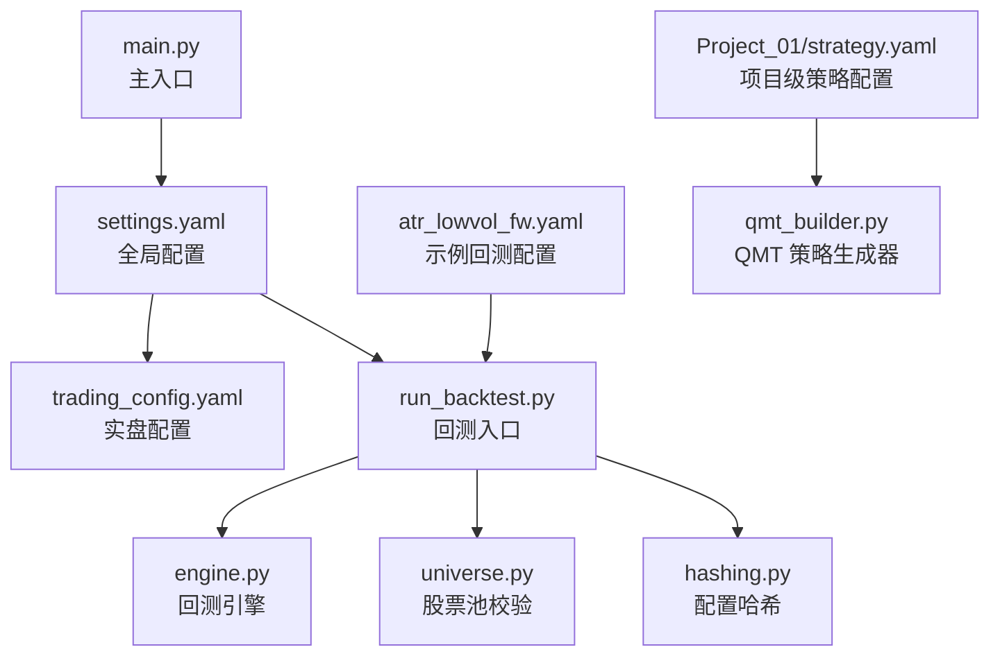
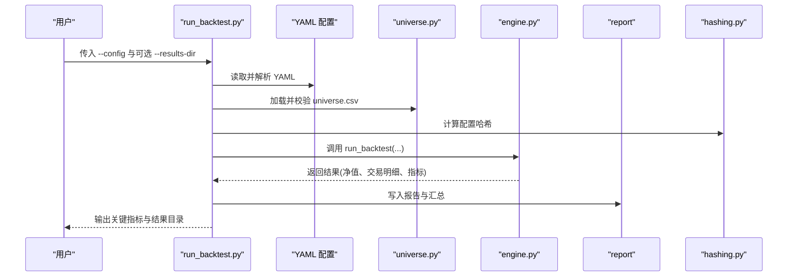
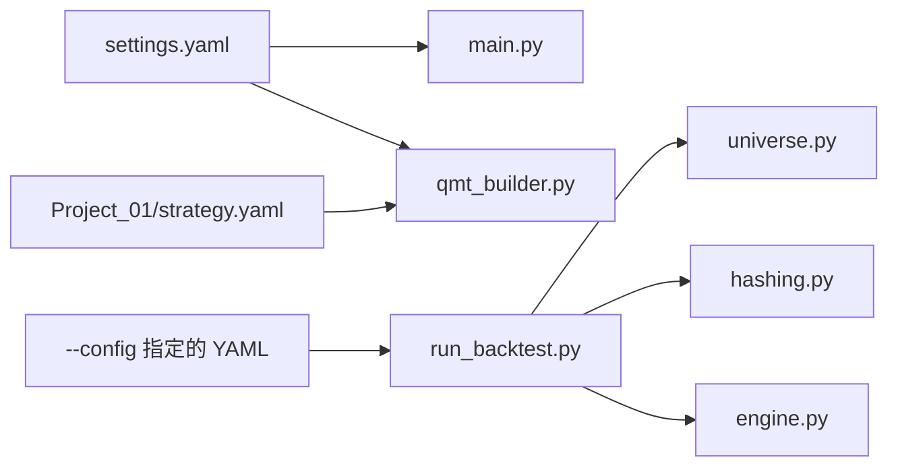

# 配置管理

<cite>
**本文引用的文件**   
- [config/settings.yaml](file://config/settings.yaml)
- [config/trading_config.yaml](file://config/trading_config.yaml)
- [scripts/run_backtest.py](file://scripts/run_backtest.py)
- [backtest/hashing.py](file://backtest/hashing.py)
- [data/universe.py](file://data/universe.py)
- [main.py](file://main.py)
- [broker/qmt_builder.py](file://broker/qmt_builder.py)
- [config/atr_lowvol_fw.yaml](file://config/atr_lowvol_fw.yaml)
- [projects/Project_01_多因子IC小盘Alpha/config/strategy.yaml](file://projects/Project_01_多因子IC小盘Alpha/config/strategy.yaml)
</cite>

## 目录
1. [简介](#简介)
2. [项目结构](#项目结构)
3. [核心组件](#核心组件)
4. [架构总览](#架构总览)
5. [详细组件分析](#详细组件分析)
6. [依赖关系分析](#依赖关系分析)
7. [性能与可维护性建议](#性能与可维护性建议)
8. [故障排查指南](#故障排查指南)
9. [结论](#结论)
10. [附录：YAML 规范与最佳实践](#附录yaml-规范与最佳实践)

## 简介
本章节面向 QuantLab 的配置管理体系，系统性说明全局配置 settings.yaml、实盘交易配置 trading_config.yaml、以及项目级策略配置文件（如 Project_01 的 strategy.yaml）的职责边界、字段含义、加载与覆盖机制、验证与调试方法。文档同时给出回测执行流程中配置如何被解析、校验与落盘，帮助读者快速定位问题并安全地扩展配置项。

## 项目结构
QuantLab 的配置体系围绕三类 YAML 文件组织：
- 全局配置：config/settings.yaml，定义数据源、缓存、回测默认值、日志、因子预处理、策略默认股票池、以及指向实盘配置的入口。
- 实盘配置：config/trading_config.yaml，定义账户信息、交易参数、风控阈值、订单行为、调度计划、通知方式、数据源路径与策略权重等。
- 项目级配置：各 projects/*/config/strategy.yaml，用于具体策略的参数化（因子权重、调仓频率、止损、QMT 测试参数等）。

图表来源
- [config/settings.yaml:1-69](file://config/settings.yaml#L1-L69)
- [config/trading_config.yaml:1-62](file://config/trading_config.yaml#L1-L62)
- [scripts/run_backtest.py:1-132](file://scripts/run_backtest.py#L1-L132)
- [backtest/hashing.py:1-23](file://backtest/hashing.py#L1-L23)
- [data/universe.py:1-61](file://data/universe.py#L1-L61)
- [config/atr_lowvol_fw.yaml:1-49](file://config/atr_lowvol_fw.yaml#L1-L49)
- [projects/Project_01_多因子IC小盘Alpha/config/strategy.yaml:1-62](file://projects/Project_01_多因子IC小盘Alpha/config/strategy.yaml#L1-L62)
- [main.py:1-104](file://main.py#L1-L104)
- [broker/qmt_builder.py:1-200](file://broker/qmt_builder.py#L1-L200)

章节来源
- [config/settings.yaml:1-69](file://config/settings.yaml#L1-L69)
- [config/trading_config.yaml:1-62](file://config/trading_config.yaml#L1-L62)
- [scripts/run_backtest.py:1-132](file://scripts/run_backtest.py#L1-L132)

## 核心组件
- 全局配置 settings.yaml
  - 项目信息：名称、版本、根路径
  - 数据源：astock 日线/财务/基础路径；缓存开关、目录与过期天数
  - 回测默认：起止日期、初始资金、佣金、滑点、基准
  - 日志：级别、目录、文件大小与备份数量
  - 因子预处理：中性化、标准化、缩尾及方法与阈值
  - 策略默认：默认股票池与市值区间
  - 实盘入口：指向 trading_config.yaml 的路径与是否启用
- 实盘配置 trading_config.yaml
  - 账户：账号 ID、QMT 路径、会话 ID
  - 交易：初始资金、单股仓位上限、总仓位上限、佣金、印花税、滑点
  - 风控：个股止损、组合最大回撤、最长持有天数、单日最大换手
  - 订单：超时时间、重试次数、价格容差、未成交自动撤单
  - 调度：盘前准备、开盘执行、午后检查、风控检查间隔、尾盘处理
  - 通知：开关、渠道、webhook URL
  - 数据源：主数据源、astock 路径、缓存目录
  - 策略：名称、股票池、top_n、调仓频率、因子权重
- 项目级策略配置 strategy.yaml（以 Project_01 为例）
  - 策略元信息：名称、版本
  - 因子权重：BP、reversal_1m、volatility_60d、ROE 等
  - 过滤条件：市值、成交额
  - 回测参数：top_n、调仓频率、止损、交易成本、动态股票池
  - 实盘参数：初始资金、仓位限制、止损、调仓频率、订单超时与重试
  - QMT 测试：账号、目标代码与数量

章节来源
- [config/settings.yaml:1-69](file://config/settings.yaml#L1-L69)
- [config/trading_config.yaml:1-62](file://config/trading_config.yaml#L1-L62)
- [projects/Project_01_多因子IC小盘Alpha/config/strategy.yaml:1-62](file://projects/Project_01_多因子IC小盘Alpha/config/strategy.yaml#L1-L62)

## 架构总览
下图展示从 CLI 到回测引擎与报告输出的配置流转过程，以及关键校验点（如 universe CSV 校验、adjustment 枚举校验、配置哈希计算）。

图表来源
- [scripts/run_backtest.py:35-132](file://scripts/run_backtest.py#L35-L132)
- [data/universe.py:27-61](file://data/universe.py#L27-L61)
- [backtest/hashing.py:22-23](file://backtest/hashing.py#L22-L23)

章节来源
- [scripts/run_backtest.py:1-132](file://scripts/run_backtest.py#L1-L132)

## 详细组件分析

### 全局配置 settings.yaml
- 数据源设置
  - source: astock
  - astock.daily_path / finance_path / basic_path：分别指向日线 parquet、财务与基础数据目录
  - cache.enabled/dir/expire_days：控制本地缓存开关、目录与过期天数
- 回测参数
  - start_date/end_date：回测区间
  - initial_capital/commission/slippage/benchmark：初始资金、佣金、滑点、基准指数
- 因子预处理
  - neutralize/standardize/winsorize：开关
  - winsorize_limit：缩尾阈值
  - neutralize_method：industry/market/none
  - standardize_method：zscore/rank/none
- 策略默认
  - default_universe：small_cap
  - universes：按市值区间划分 small_cap/mid_cap/large_cap
- 实盘入口
  - trading.config：指向 config/trading_config.yaml
  - trading.enabled：默认关闭，需手动开启

章节来源
- [config/settings.yaml:1-69](file://config/settings.yaml#L1-L69)

### 实盘配置 trading_config.yaml
- 账户信息
  - account.id/path/session_id：账号、QMT userdata_mini 路径、会话 ID
- 交易参数
  - trading.initial_capital/max_single_position/max_total_position/commission_rate/stamp_tax/slippage
- 风控参数
  - risk.stop_loss_pct/max_drawdown/max_holding_days/max_daily_turnover
- 订单行为
  - order.timeout_seconds/max_retry/price_tolerance/cancel_unfilled
- 调度计划
  - schedule.pre_market/morning_open/afternoon_check/risk_check_interval/end_of_day
- 通知
  - notification.enabled/method/webhook_url
- 数据源
  - data.source/astock_path/cache_dir
- 策略（示例）
  - strategy.name/universe/top_n/rebalance_freq/factors.{BP,reversal_1m,volatility_60d,ROE,vwap_volume_corr}

章节来源
- [config/trading_config.yaml:1-62](file://config/trading_config.yaml#L1-L62)

### 项目级配置（以 Project_01 为例）
- factors.weights：因子权重字典
- market_cap.amount：市值与成交额过滤
- backtest.top_n/rebalance_freq/stop_loss/tx_cost/dynamic_universe：回测参数
- live.initial_capital/max_position_pct/max_total_positions/stop_loss_pct/rebalance_freq/order_timeout_seconds/max_retry：实盘参数
- qmt.account_id/target_code/target_volume：QMT 测试参数

章节来源
- [projects/Project_01_多因子IC小盘Alpha/config/strategy.yaml:1-62](file://projects/Project_01_多因子IC小盘Alpha/config/strategy.yaml#L1-L62)

### 回测入口与配置解析（scripts/run_backtest.py）
- 命令行参数
  - --config：必填，指定 YAML 配置文件路径
  - --results-dir：可选，覆盖报告输出目录
- 配置加载与校验
  - _load_yaml：读取 YAML 文本并 safe_load
  - 提取 backtest/data/universe/execution/strategy_params 等段
  - 顶层 strategy 与 trading_model 作为扁平注册名
  - 计算配置哈希 compute_config_hash(raw_text)
  - 校验 universe.csv 必须存在且非空
  - 校验 data.adjustment 仅允许 raw/qfq/hfq
- 运行与输出
  - 构造 AstockParquetReader
  - 按需加载 industry_map（当 strategy_params.industry_cap > 0）
  - 调用 engine.run_backtest(...) 并写入报告

章节来源
- [scripts/run_backtest.py:35-132](file://scripts/run_backtest.py#L35-L132)
- [backtest/hashing.py:22-23](file://backtest/hashing.py#L22-L23)

### 股票池校验（data/universe.py）
- 首列必须为 code，否则抛出异常
- code 正则匹配 6 位 + .SZ/.SH，非法行丢弃并记录警告
- enabled 字段支持 false/0/no/空视为禁用
- 重复 code 保留首次出现，后续丢弃并警告
- 若最终无有效行，抛出异常
- 编码兼容 UTF-8 BOM

章节来源
- [data/universe.py:1-61](file://data/universe.py#L1-L61)

### 主入口与全局配置加载（main.py）
- load_config：从 config/settings.yaml 加载全局配置
- run_backtest：根据 strategy_name 分支加载不同模块，使用 settings 中的 project_01 段落驱动研究管线

章节来源
- [main.py:21-34](file://main.py#L21-L34)
- [main.py:28-74](file://main.py#L28-L74)

### QMT 策略生成器（broker/qmt_builder.py）
- load_config：读取 settings.yaml
- build_qmt_strategy：基于 Project_01 的 strategy.yaml 与 settings 中的 live/market_cap/factors 等，生成 GBK 编码的 QMT 策略源码

章节来源
- [broker/qmt_builder.py:21-24](file://broker/qmt_builder.py#L21-L24)
- [broker/qmt_builder.py:33-52](file://broker/qmt_builder.py#L33-L52)

### 示例回测配置（config/atr_lowvol_fw.yaml）
- backtest.name/start_date/end_date/initial_cash/benchmark_code/benchmark_db_path
- data.source/path/adjustment/fundamentals
- universe.csv：股票池文件
- execution.price/slippage/commission_rate/tax_rate
- strategy/trading_model
- strategy_params：调仓频率、持仓数、ATR 窗口与阈值、换手率门限、质量与动量门限、止损、组合层 overlay（position_sizing、target_leverage、vol_target、industry_cap、max_positions、min_position_value、vol_window、margin_interest_rate）

章节来源
- [config/atr_lowvol_fw.yaml:1-49](file://config/atr_lowvol_fw.yaml#L1-L49)

## 依赖关系分析
- 配置加载链路
  - main.py -> settings.yaml
  - broker/qmt_builder.py -> settings.yaml
  - scripts/run_backtest.py -> 项目级 YAML（由 --config 指定）
- 数据与校验
  - scripts/run_backtest.py -> data/universe.py（CSV 校验）
  - scripts/run_backtest.py -> backtest/hashing.py（配置哈希）
- 策略与执行
  - scripts/run_backtest.py -> backtest/engine.py（回测执行）
  - broker/qmt_builder.py -> Project_01/strategy.yaml（生成 QMT 策略）

图表来源
- [main.py:21-34](file://main.py#L21-L34)
- [broker/qmt_builder.py:21-24](file://broker/qmt_builder.py#L21-L24)
- [scripts/run_backtest.py:35-132](file://scripts/run_backtest.py#L35-L132)
- [data/universe.py:27-61](file://data/universe.py#L27-L61)
- [backtest/hashing.py:22-23](file://backtest/hashing.py#L22-L23)

章节来源
- [scripts/run_backtest.py:1-132](file://scripts/run_backtest.py#L1-L132)
- [data/universe.py:1-61](file://data/universe.py#L1-L61)
- [backtest/hashing.py:1-23](file://backtest/hashing.py#L1-L23)

## 性能与可维护性建议
- 配置分层与覆盖
  - 将通用默认值放在 settings.yaml，项目特定参数放在各自 strategy.yaml，避免重复与维护冲突
  - 对易变参数（如路径、资金、阈值）集中管理在 trading_config.yaml，便于审计与切换环境
- 校验前置
  - 在入口脚本中对关键字段进行强校验（如 adjustment 枚举、universe.csv 非空），尽早失败
- 可追溯性
  - 使用 compute_config_hash 将配置原文哈希写入报告，确保结果可复现
- 缓存与 IO
  - 合理设置 cache.expire_days，避免频繁磁盘 IO；对大文件读取采用只读模式
- 日志与监控
  - 通过 logging.dir/level 控制日志输出；生产环境建议开启告警通道（notification）

[本节为通用建议，不直接分析具体文件]

## 故障排查指南
- 常见错误与定位
  - universe.csv 首列非 code：data/universe.py 会抛出 ValueError，检查 CSV 表头与编码
  - code 格式非法或重复：会被丢弃并记录警告，核对股票代码与去重逻辑
  - data.adjustment 取值非法：run_backtest.py 会抛出 ValueError，确认 raw/qfq/hfq
  - 缺少 universe.csv：run_backtest.py 报错提示必须设置
  - 配置哈希不一致：对比 hashing.compute_config_hash 的输出，确认 YAML 内容变更
- 调试步骤
  - 使用 scripts/run_backtest.py --config 指定最小化配置，逐步添加字段定位问题
  - 打开 logging.level=DEBUG，观察加载与校验流程
  - 检查缓存目录与权限，必要时清空缓存重新拉取
- 实盘相关
  - 核对 trading_config.yaml 的 account.path/session_id 与实际安装一致
  - 检查 notification.webhook_url 是否正确，避免消息无法送达

章节来源
- [data/universe.py:27-61](file://data/universe.py#L27-L61)
- [scripts/run_backtest.py:66-78](file://scripts/run_backtest.py#L66-L78)
- [backtest/hashing.py:22-23](file://backtest/hashing.py#L22-L23)
- [config/trading_config.yaml:1-62](file://config/trading_config.yaml#L1-L62)

## 结论
QuantLab 的配置体系以 settings.yaml 为全局基线，trading_config.yaml 为实盘专项配置，项目级 strategy.yaml 承载策略参数。通过 CLI 入口统一加载、严格校验与哈希追踪，实现了高可维护性与可复现性。遵循本文档的分层与校验建议，可在保证稳定性的前提下高效迭代策略与部署。

[本节为总结性内容，不直接分析具体文件]

## 附录：YAML 规范与最佳实践
- 命名与结构
  - 使用清晰层级：project/data/backtest/logging/factors/strategy/trading
  - 布尔值使用 true/false，数值保持单位一致（如百分比用小数）
- 路径与平台差异
  - Windows 路径建议使用正斜杠或双反斜杠，避免转义问题
- 注释与可读性
  - 每个关键键添加中文注释，说明取值范围与影响
- 版本与变更
  - 在 settings.project.version 与 strategy.version 中记录版本，配合哈希实现变更追踪
- 安全与敏感信息
  - 账号、session_id、webhook_url 等敏感字段应纳入环境变量或密钥管理，避免硬编码
- 继承与覆盖机制（建议）
  - 当前仓库未实现显式“继承”语法，推荐通过分层文件与入口脚本合并策略：
    - 基线：settings.yaml
    - 项目：projects/*/config/strategy.yaml
    - 实盘：config/trading_config.yaml
  - 在入口脚本中按优先级合并（例如：项目覆盖基线，实盘覆盖项目），并在报告中记录最终生效配置

[本节为通用指导，不直接分析具体文件]