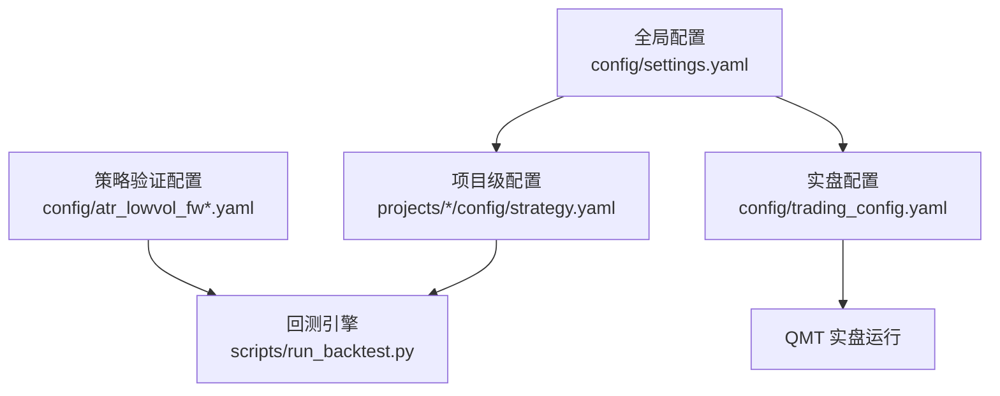
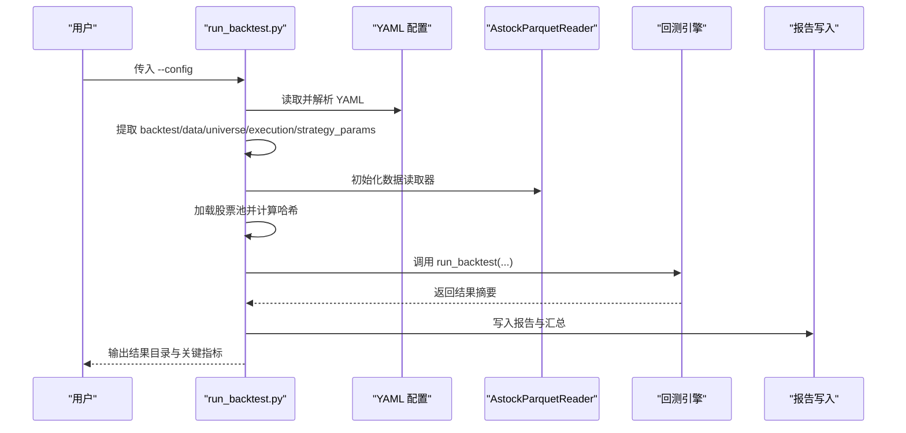
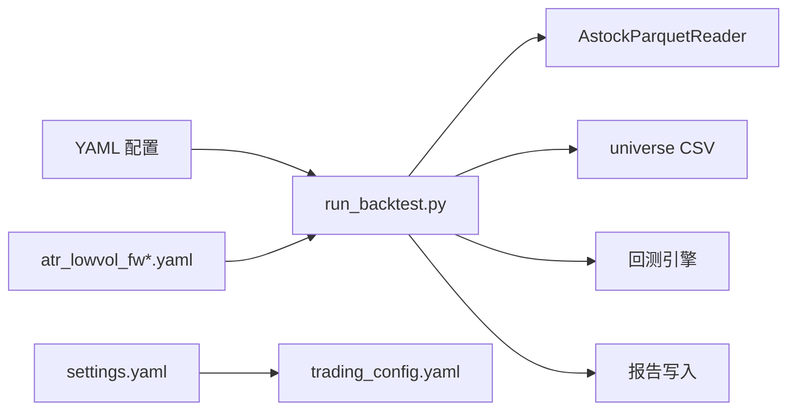

# 项目配置

<cite>
**本文引用的文件**   
- [config/settings.yaml](file://config/settings.yaml)
- [config/trading_config.yaml](file://config/trading_config.yaml)
- [config/atr_lowvol_fw.yaml](file://config/atr_lowvol_fw.yaml)
- [config/atr_lowvol_fw_leverage_only.yaml](file://config/atr_lowvol_fw_leverage_only.yaml)
- [config/atr_lowvol_fw_leveraged.yaml](file://config/atr_lowvol_fw_leveraged.yaml)
- [projects/Project_01_多因子IC小盘Alpha/config/strategy.yaml](file://projects/Project_01_多因子IC小盘Alpha/config/strategy.yaml)
- [projects/Project_10_价值小盘V2/config/strategy.yaml](file://projects/Project_10_价值小盘V2/config/strategy.yaml)
- [scripts/run_backtest.py](file://scripts/run_backtest.py)
- [backtest/hashing.py](file://backtest/hashing.py)
- [data/universe.py](file://data/universe.py)
- [AGENTS.md](file://AGENTS.md)
</cite>

## 目录
1. [简介](#简介)
2. [项目结构](#项目结构)
3. [核心组件](#核心组件)
4. [架构总览](#架构总览)
5. [详细组件分析](#详细组件分析)
6. [依赖关系分析](#依赖关系分析)
7. [性能与可维护性建议](#性能与可维护性建议)
8. [故障排查指南](#故障排查指南)
9. [结论](#结论)
10. [附录：YAML 规范与最佳实践](#附录yaml-规范与最佳实践)

## 简介
本文件面向 QuantLab 项目的“项目级配置”体系，系统性说明：
- 全局配置、实盘配置与项目级配置的层级结构与继承覆盖规则
- 策略特定配置（ATR低波策略参数、因子权重、调仓规则）的组织方式
- 回测环境配置（数据路径、输出目录、报告格式）
- 部署配置（QMT 策略参数、实盘开关、监控与调度）
- 配置加载流程、哈希校验与结果可追溯机制
- YAML 语法规范与多项目环境下的版本控制建议

## 项目结构
QuantLab 的配置采用“三级级联”组织：
- 全局配置：config/settings.yaml（项目信息、数据源、回测默认值、因子预处理、策略默认股票池、日志等）
- 实盘配置：config/trading_config.yaml（账号、交易参数、风控阈值、委托管理、调度计划、通知）
- 项目级配置：projects/Project_XX_*/config/strategy.yaml（项目独立参数，如因子权重、回测与实盘参数、QMT 参数）

此外，框架原生策略的验证配置位于 config/atr_lowvol_fw*.yaml，用于驱动通用回测引擎。

**图示来源** 
- [config/settings.yaml:1-69](file://config/settings.yaml#L1-L69)
- [config/trading_config.yaml:1-62](file://config/trading_config.yaml#L1-L62)
- [config/atr_lowvol_fw.yaml:1-49](file://config/atr_lowvol_fw.yaml#L1-L49)
- [scripts/run_backtest.py:1-132](file://scripts/run_backtest.py#L1-L132)

**章节来源**
- [AGENTS.md:83-109](file://AGENTS.md#L83-L109)
- [config/settings.yaml:1-69](file://config/settings.yaml#L1-L69)
- [config/trading_config.yaml:1-62](file://config/trading_config.yaml#L1-L62)

## 核心组件
- 全局配置（settings.yaml）
  - 定义项目元信息、数据源路径、缓存、回测默认值、因子预处理、策略默认股票池、日志与实盘入口指向
- 实盘配置（trading_config.yaml）
  - 定义 QMT 账户、交易参数、风控阈值、订单管理、调度计划、通知与数据源路径
- 项目级配置（各 Project 的 strategy.yaml）
  - 定义策略名称/版本、因子权重、市值与成交额过滤、回测参数、实盘参数、QMT 测试参数
- 策略验证配置（atr_lowvol_fw*.yaml）
  - 定义回测时间窗口、初始资金、基准、数据源、执行参数、策略名与 trading_model、以及组合层参数（杠杆、波动率目标、行业上限等）

**章节来源**
- [config/settings.yaml:1-69](file://config/settings.yaml#L1-L69)
- [config/trading_config.yaml:1-62](file://config/trading_config.yaml#L1-L62)
- [projects/Project_01_多因子IC小盘Alpha/config/strategy.yaml:1-62](file://projects/Project_01_多因子IC小盘Alpha/config/strategy.yaml#L1-L62)
- [projects/Project_10_价值小盘V2/config/strategy.yaml:1-66](file://projects/Project_10_价值小盘V2/config/strategy.yaml#L1-L66)
- [config/atr_lowvol_fw.yaml:1-49](file://config/atr_lowvol_fw.yaml#L1-L49)
- [config/atr_lowvol_fw_leverage_only.yaml:1-48](file://config/atr_lowvol_fw_leverage_only.yaml#L1-L48)
- [config/atr_lowvol_fw_leveraged.yaml:1-47](file://config/atr_lowvol_fw_leveraged.yaml#L1-L47)

## 架构总览
配置在运行时的加载与使用流程如下：
- 回测入口脚本读取指定 YAML，解析为配置对象
- 从配置中抽取 backtest/data/universe/execution/strategy_params 等段
- 构建数据读取器与股票池，计算配置与股票池哈希
- 调用回测引擎执行，并写入报告到 reports 目录

**图示来源** 
- [scripts/run_backtest.py:35-132](file://scripts/run_backtest.py#L35-L132)
- [backtest/hashing.py:1-23](file://backtest/hashing.py#L1-L23)
- [data/universe.py:1-32](file://data/universe.py#L1-L32)

**章节来源**
- [scripts/run_backtest.py:1-132](file://scripts/run_backtest.py#L1-L132)
- [backtest/hashing.py:1-23](file://backtest/hashing.py#L1-L23)
- [data/universe.py:1-32](file://data/universe.py#L1-L32)

## 详细组件分析

### 全局配置（settings.yaml）
- 作用：提供项目级默认值与系统级设置
- 关键字段：
  - project：项目名称、版本、根路径
  - data：数据源类型与 astock 路径、缓存开关与目录
  - backtest：回测起止日期、初始资金、佣金滑点、基准代码
  - logging：日志级别、目录、轮转策略
  - factors：中性化、标准化、去极值等预处理开关与方法
  - strategy：默认股票池与不同市值区间定义
  - trading：指向实盘配置文件与是否启用

- 继承与覆盖：
  - 项目级或策略验证配置若包含同名键，将覆盖全局默认值
  - 未显式覆盖的字段沿用 settings.yaml 中的默认值

**章节来源**
- [config/settings.yaml:1-69](file://config/settings.yaml#L1-L69)

### 实盘配置（trading_config.yaml）
- 作用：集中管理 QMT 账号、交易与风控、订单与调度、通知与数据源
- 关键字段：
  - account：账号 ID、QMT 路径、会话 ID
  - trading：初始资金、单票仓位上限、总仓位上限、佣金、印花税、滑点
  - risk：个股止损、组合最大回撤、最长持有天数、单日最大换手
  - order：委托超时、重试次数、价格容差、自动撤单
  - schedule：盘前/开盘/午后检查/风控检查间隔/尾盘处理时间
  - notification：通知开关、方法与 webhook
  - data：主数据源与 astock 路径、缓存目录
  - strategy：示例策略名、股票池、top_n、调仓频率、因子权重（需与策略实现一致）

- 继承与覆盖：
  - 由 main.py 或其他入口根据 settings.yaml 的 trading.config 指向加载
  - 项目级 live 段可覆盖部分交易参数（见 Project_01 的 live 配置）

**章节来源**
- [config/trading_config.yaml:1-62](file://config/trading_config.yaml#L1-L62)
- [main.py:21-26](file://main.py#L21-L26)

### 项目级配置（Project_01 与 Project_10）
- Project_01（多因子IC小盘Alpha）
  - factors.weights：BP、反转、低波、ROE 权重
  - market_cap/amount：市值与成交额过滤
  - backtest：top_n、调仓频率、止损、交易成本、动态股票池
  - results：记录已验证的回测指标（供参考）
  - live：实盘初始资金、仓位限制、止损、调仓频率、订单超时与重试
  - qmt：账号、测试标的与数量

- Project_10（价值小盘V2）
  - universe：市值区间、PE/PB 下限、ST/停牌剔除
  - scoring：评分方法、权重（如 z_score）、历史分位窗口
  - portfolio：持仓数量、权重方法、调仓频率
  - rebalance：全量重建或信号触发补仓及阈值
  - risk_control：止损、回撤、持有天数、换手、ATR 自适应止损、分层降仓
  - quality_screen：质量排雷条件
  - transaction：交易成本与涨跌停保护

- 继承与覆盖：
  - 项目级配置优先于全局默认值；当与 atr_lowvol_fw*.yaml 同时使用时，后者作为策略验证配置直接驱动回测引擎，优先级高于 settings.yaml

**章节来源**
- [projects/Project_01_多因子IC小盘Alpha/config/strategy.yaml:1-62](file://projects/Project_01_多因子IC小盘Alpha/config/strategy.yaml#L1-L62)
- [projects/Project_10_价值小盘V2/config/strategy.yaml:1-66](file://projects/Project_10_价值小盘V2/config/strategy.yaml#L1-L66)

### 策略验证配置（ATR 低波系列）
- atr_lowvol_fw.yaml：基础验证配置，包含回测时间、初始资金、基准、数据源、执行参数、策略名 atr_lowvol、trading_model next_open，以及策略参数（调仓频率、持仓数、ATR 窗口与上限、换手约束、质量门控、动量门控、止损、组合层参数如 position_sizing/target_leverage/vol_target/industry_cap 等）
- atr_lowvol_fw_leverage_only.yaml：纯杠杆验证，关闭保守叠加层以证明两融利息计提路径生效
- atr_lowvol_fw_leveraged.yaml：组合层全开，演示“任何策略即插即跑 + 真实约束”

- 继承与覆盖：
  - 这些配置通过 scripts/run_backtest.py 直接读取，覆盖 settings.yaml 的全局默认值
  - 顶层 strategy 与 trading_model 作为扁平注册名被解析

**章节来源**
- [config/atr_lowvol_fw.yaml:1-49](file://config/atr_lowvol_fw.yaml#L1-L49)
- [config/atr_lowvol_fw_leverage_only.yaml:1-48](file://config/atr_lowvol_fw_leverage_only.yaml#L1-L48)
- [config/atr_lowvol_fw_leveraged.yaml:1-47](file://config/atr_lowvol_fw_leveraged.yaml#L1-L47)
- [scripts/run_backtest.py:52-64](file://scripts/run_backtest.py#L52-L64)

### 配置加载与哈希校验
- 加载流程：
  - run_backtest.py 解析 YAML，提取 backtest/data/universe/execution/strategy_params
  - 解析顶层 strategy 与 trading_model（扁平注册名）
  - 构造 AstockParquetReader，加载股票池 CSV 并校验 schema
  - 计算配置哈希与股票池哈希，用于结果可追溯
  - 调用回测引擎并写入报告

- 哈希校验：
  - compute_config_hash(yaml_text)：对原始 YAML 文本求哈希
  - compute_universe_hash(codes)：对排序后的股票代码列表求哈希
  - 用于区分不同配置与股票池产生的结果集

**章节来源**
- [scripts/run_backtest.py:35-132](file://scripts/run_backtest.py#L35-L132)
- [backtest/hashing.py:1-23](file://backtest/hashing.py#L1-L23)
- [data/universe.py:1-32](file://data/universe.py#L1-L32)

### 回测环境与输出
- 数据路径：
  - astock parquet 路径由 data.path 指定（如 E:/astock/daily/stock_daily.parquet）
  - 调整方式 adjustment 支持 raw/qfq/hfq
- 输出目录：
  - 默认 E:/QuantLab/reports，可通过 --results-dir 覆盖
- 报告格式：
  - equity_curve.csv、trades.csv、summary.json、report.md、logs.txt 等

**章节来源**
- [scripts/run_backtest.py:93-127](file://scripts/run_backtest.py#L93-L127)

### 部署配置（QMT）
- 账号与连接：account.id、account.path、account.session_id
- 交易参数：initial_capital、max_single_position、max_total_position、commission_rate、stamp_tax、slippage
- 风控阈值：stop_loss_pct、max_drawdown、max_holding_days、max_daily_turnover
- 订单管理：timeout_seconds、max_retry、price_tolerance、cancel_unfilled
- 调度计划：pre_market、morning_open、afternoon_check、risk_check_interval、end_of_day
- 通知：enabled、method、webhook_url
- 数据源：source、astock_path、cache_dir
- 策略示例：name、universe、top_n、rebalance_freq、factors 权重（需与策略实现一致）

**章节来源**
- [config/trading_config.yaml:1-62](file://config/trading_config.yaml#L1-L62)

## 依赖关系分析
- 配置到运行器的依赖：
  - run_backtest.py 依赖 YAML 配置、AstockParquetReader、universe CSV、backtest 引擎与报告模块
- 配置内部依赖：
  - settings.yaml 的 trading.config 指向 trading_config.yaml
  - atr_lowvol_fw*.yaml 通过顶层 strategy 与 trading_model 驱动引擎
- 外部依赖：
  - astock parquet 数据（只读）
  - DuckDB 基准数据库（可选）
  - QMT 客户端（实盘）

**图示来源** 
- [scripts/run_backtest.py:1-132](file://scripts/run_backtest.py#L1-L132)
- [config/settings.yaml:1-69](file://config/settings.yaml#L1-L69)
- [config/trading_config.yaml:1-62](file://config/trading_config.yaml#L1-L62)
- [config/atr_lowvol_fw.yaml:1-49](file://config/atr_lowvol_fw.yaml#L1-L49)

**章节来源**
- [scripts/run_backtest.py:1-132](file://scripts/run_backtest.py#L1-L132)
- [config/settings.yaml:1-69](file://config/settings.yaml#L1-L69)
- [config/trading_config.yaml:1-62](file://config/trading_config.yaml#L1-L62)

## 性能与可维护性建议
- 配置可读性：
  - 合理分组（backtest/data/universe/execution/strategy_params），使用注释说明单位与取值范围
- 可追溯性：
  - 利用配置哈希与股票池哈希关联结果目录，避免重复实验
- 可扩展性：
  - 新增策略时，保持顶层 strategy 与 trading_model 命名清晰，并在 strategy_params 中集中参数
- 数据路径：
  - 统一使用绝对路径，避免跨平台差异；必要时在 settings.yaml 中集中管理
- 版本控制：
  - 每个项目独立的 strategy.yaml 纳入版本控制；变更需附带简要说明与影响评估

[本节为通用指导，不直接分析具体文件]

## 故障排查指南
- 常见错误与定位：
  - universe CSV 首列非 code：data/universe.py 会抛出异常，检查 CSV 格式
  - adjustment 非法值：仅允许 raw/qfq/hfq，否则报错
  - 缺少 universe.csv：必须显式设置
  - 行业映射加载失败：当 industry_cap > 0 时尝试加载，失败则降级禁用该功能
- 调试建议：
  - 开启 INFO 级别日志，查看加载与执行过程
  - 使用 --results-dir 指定输出目录，便于对比不同配置的结果
  - 核对配置哈希与股票池哈希，确认结果对应正确

**章节来源**
- [data/universe.py:1-32](file://data/universe.py#L1-L32)
- [scripts/run_backtest.py:75-92](file://scripts/run_backtest.py#L75-L92)
- [scripts/run_backtest.py:93-127](file://scripts/run_backtest.py#L93-L127)

## 结论
QuantLab 的配置体系通过“全局—实盘—项目级—策略验证”四级结构，实现了默认值继承与灵活覆盖。结合配置哈希与股票池哈希，确保回测与实盘的可追溯性与一致性。遵循 YAML 规范与最佳实践，可在多项目环境下高效管理与演进配置。

[本节为总结，不直接分析具体文件]

## 附录：YAML 语法与最佳实践
- 注释使用：
  - 使用 # 进行行内注释，解释字段含义、单位与取值范围
- 参数分组：
  - 按功能域分组（backtest、data、universe、execution、strategy_params、risk、order、schedule、notification、strategy）
- 命名约定：
  - 使用小写与下划线分隔，避免特殊字符；布尔值使用 true/false
- 默认值与覆盖：
  - 在 settings.yaml 中提供默认值，在项目级或策略验证配置中覆盖必要字段
- 多项目环境：
  - 每个 Project 独立 strategy.yaml，避免共享冲突；公共参数下沉至 settings.yaml
- 版本控制建议：
  - 提交变更时附带简要说明；对关键参数变更进行回归验证；保留历史配置以便复现实验

[本节为通用指导，不直接分析具体文件]