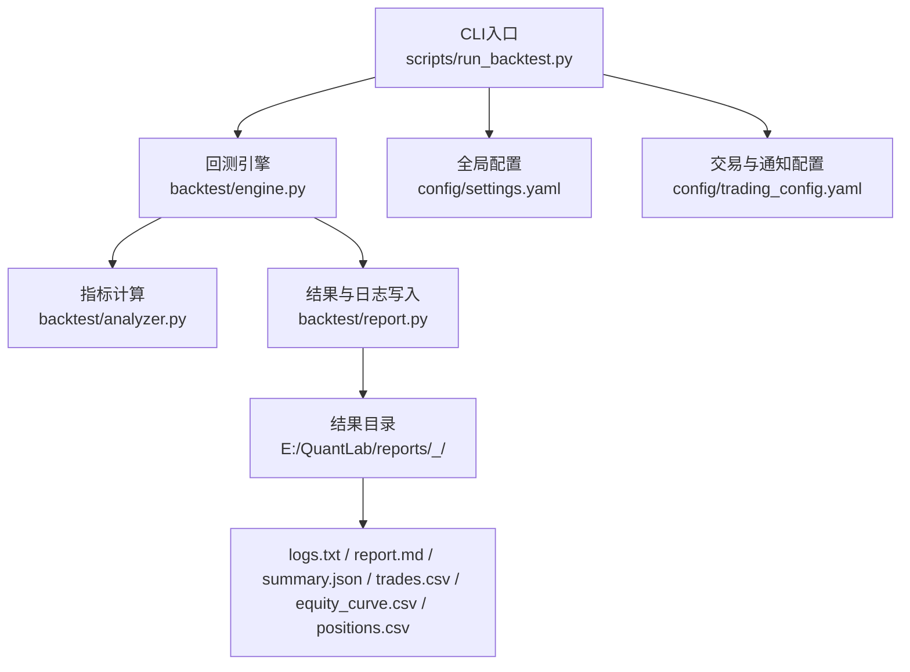
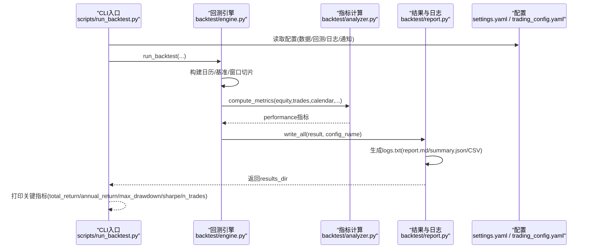
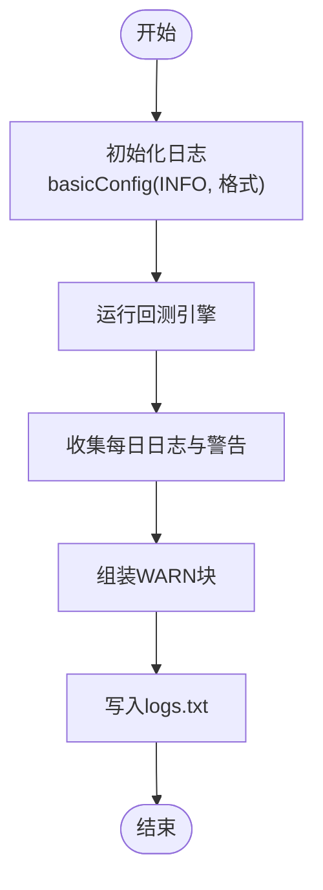
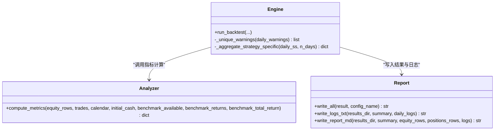
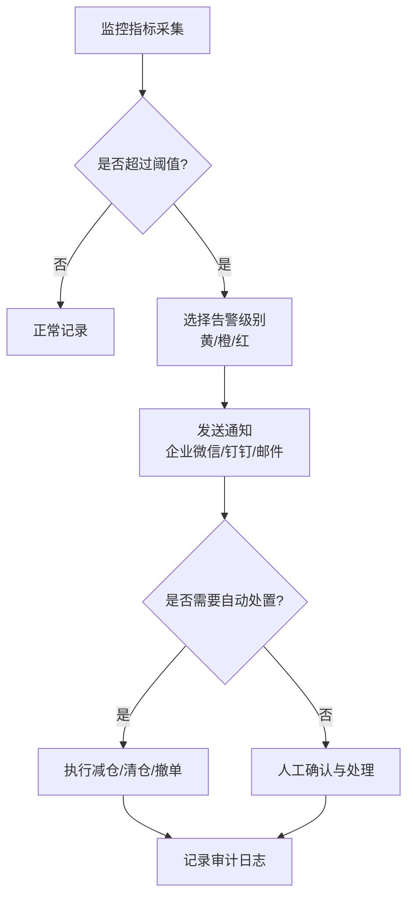
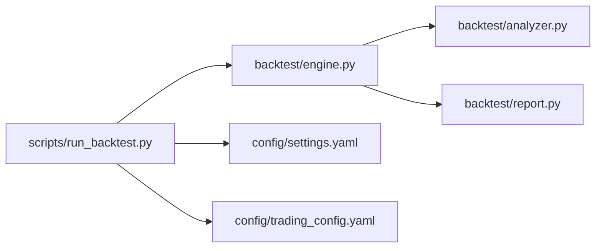

# 监控告警

<cite>
**本文引用的文件**   
- [main.py](file://main.py)
- [settings.yaml](file://config/settings.yaml)
- [trading_config.yaml](file://config/trading_config.yaml)
- [run_backtest.py](file://scripts/run_backtest.py)
- [engine.py](file://backtest/engine.py)
- [report.py](file://backtest/report.py)
- [analyzer.py](file://backtest/analyzer.py)
- [logs.txt](file://reports/20260803_204830_513b7f_atr_lowvol_fw/logs.txt)
- [monitoring_indicators.md](file://projects/verification/results/monitoring_indicators.md)
- [A股量化框架_五大扩展模块.md](file://A股量化框架_五大扩展模块.md)
- [miniQMT实盘对接_生产级完善方案.md](file://miniQMT实盘对接_生产级完善方案.md)
- [全局复利与踩坑日志.md](file://全局复利与踩坑日志.md)
</cite>

## 目录
1. [简介](#简介)
2. [项目结构](#项目结构)
3. [核心组件](#核心组件)
4. [架构总览](#架构总览)
5. [详细组件分析](#详细组件分析)
6. [依赖关系分析](#依赖关系分析)
7. [性能考虑](#性能考虑)
8. [故障诊断指南](#故障诊断指南)
9. [结论](#结论)
10. [附录](#附录)

## 简介
本文件面向 QuantLab 的监控告警体系，围绕以下目标展开：
- 日志收集机制：日志级别、格式定义、轮转策略与落盘位置
- 性能指标采集：回测绩效、交易执行、系统资源等关键指标的采集与展示
- 告警规则配置：阈值设置、通知方式、升级机制
- 监控仪表板搭建：Grafana 集成思路、自定义图表与实时监控面板
- 故障诊断工具：错误追踪、性能分析、内存泄漏检测
- 告警通知集成：邮件、短信、企业微信等渠道配置

## 项目结构
QuantLab 的监控与报告能力主要分布在以下模块：
- 运行入口与 CLI：scripts/run_backtest.py、main.py
- 回测引擎与指标：backtest/engine.py、backtest/analyzer.py
- 结果与日志输出：backtest/report.py
- 配置中心：config/settings.yaml、config/trading_config.yaml
- 实盘与通知：miniQMT 相关文档与配置
- 监控指标定义：projects/verification/results/monitoring_indicators.md
- 示例日志：reports/.../logs.txt

**图示来源** 
- [run_backtest.py:1-132](file://scripts/run_backtest.py#L1-L132)
- [engine.py:237-556](file://backtest/engine.py#L237-L556)
- [report.py:1-264](file://backtest/report.py#L1-L264)
- [settings.yaml:1-69](file://config/settings.yaml#L1-L69)
- [trading_config.yaml:37-61](file://config/trading_config.yaml#L37-L61)

**章节来源**
- [run_backtest.py:1-132](file://scripts/run_backtest.py#L1-L132)
- [engine.py:237-556](file://backtest/engine.py#L237-L556)
- [report.py:1-264](file://backtest/report.py#L1-L264)
- [settings.yaml:1-69](file://config/settings.yaml#L1-L69)
- [trading_config.yaml:37-61](file://config/trading_config.yaml#L37-L61)

## 核心组件
- 日志与报告
  - 统一通过 backtest/report.py 将回测结果与日志写入固定目录，包含 logs.txt、report.md、summary.json、trades.csv、equity_curve.csv、positions.csv。
  - logs.txt 中采用固定顺序的 WARN 块与每日日志行，便于解析与告警。
- 指标计算
  - backtest/analyzer.py 提供 compute_metrics，生成 total_return、annual_return、max_drawdown、sharpe、win_rate、n_trades 等。
  - engine.py 在回测主循环中聚合 daily_logs、warnings、strategy_specific 并调用 compute_metrics。
- 配置管理
  - settings.yaml 提供 logging.level、logging.dir、max_file_size、backup_count 等基础日志配置项（用于后续扩展）。
  - trading_config.yaml 提供 notification.enabled、method、webhook_url 等通知配置项。

**章节来源**
- [report.py:78-121](file://backtest/report.py#L78-L121)
- [engine.py:434-443](file://backtest/engine.py#L434-L443)
- [analyzer.py:96-169](file://backtest/analyzer.py#L96-L169)
- [settings.yaml:31-36](file://config/settings.yaml#L31-L36)
- [trading_config.yaml:37-41](file://config/trading_config.yaml#L37-L41)

## 架构总览
下图展示了从 CLI 到引擎、指标、报告与配置的完整链路，以及日志与告警的关键节点。

**图示来源** 
- [run_backtest.py:96-127](file://scripts/run_backtest.py#L96-L127)
- [engine.py:237-556](file://backtest/engine.py#L237-L556)
- [report.py:245-264](file://backtest/report.py#L245-L264)

## 详细组件分析

### 日志收集机制
- 日志级别与格式
  - CLI 层使用 Python logging.basicConfig(level=logging.INFO, format="%(asctime)s %(levelname)s %(name)s: %(message)s") 作为默认控制台输出格式。
  - 回测引擎内部使用 logging.getLogger(__name__) 记录决策日志与警告信息，并在 report.py 中以“[INFO]”前缀写入 logs.txt。
- 日志格式定义
  - logs.txt 包含固定顺序的 WARN 块（如 SHORT_SAMPLE_PERIOD、BENCHMARK_DISABLED、DATA_DEDUP_APPLIED、SECTOR_HEAT_MODE_ZERO、DATA_WAL_DETECTED），随后是每日日志行（以 “[INFO]” 或 “[ERROR]” 开头）。
  - 示例日志显示 unfilled_order、fill buy/sell、hold 等事件，便于定位成交失败原因与持仓状态。
- 日志轮转策略
  - settings.yaml 定义了 logging.level、logging.dir、max_file_size、backup_count，为后续引入按大小/数量轮转提供配置基线（当前报告模块直接写文件，未内置轮转逻辑）。
- 落盘位置
  - 默认 results_dir 为 E:/QuantLab/reports，每个 run_id 对应一个子目录，包含 logs.txt、report.md、summary.json、trades.csv、equity_curve.csv、positions.csv。

**图示来源** 
- [run_backtest.py:42-44](file://scripts/run_backtest.py#L42-L44)
- [report.py:78-121](file://backtest/report.py#L78-L121)

**章节来源**
- [run_backtest.py:42-44](file://scripts/run_backtest.py#L42-L44)
- [report.py:78-121](file://backtest/report.py#L78-L121)
- [settings.yaml:31-36](file://config/settings.yaml#L31-L36)
- [logs.txt:4708-5827](file://reports/20260803_204830_513b7f_atr_lowvol_fw/logs.txt#L4708-L5827)

### 性能指标采集
- 回测绩效指标
  - analyzer.compute_metrics 基于 equity_rows、trades、trading_calendar、initial_cash、benchmark_available/returns/total_return 计算 total_return、annual_return、max_drawdown、sharpe、calmar、win_rate、n_trades 等。
  - engine.py 在回测结束后汇总 diagnostics_aggregate（warnings_unique、candidate_total_avg_per_day、candidate_passed_avg_per_day、unfilled_order_count、strategy_specific）并传入 compute_metrics。
- 交易执行指标
  - 通过 trades.csv 字段（side、volume、price、amount、slippage_amt、commission、tax、reason、layer、model）可统计成交笔数、滑点成本、佣金税费、失败原因分布等。
- 系统资源监控
  - 当前仓库未内置系统资源采集；可在 CLI 层扩展 psutil 或平台监控 Agent 采集 CPU/内存/IO，并将指标追加至 summary.json 或独立 CSV，供 Grafana 消费。

**图示来源** 
- [analyzer.py:96-169](file://backtest/analyzer.py#L96-L169)
- [engine.py:493-522](file://backtest/engine.py#L493-L522)
- [report.py:245-264](file://backtest/report.py#L245-L264)

**章节来源**
- [analyzer.py:96-169](file://backtest/analyzer.py#L96-L169)
- [engine.py:493-522](file://backtest/engine.py#L493-L522)
- [report.py:245-264](file://backtest/report.py#L245-L264)

### 告警规则配置
- 阈值与处理建议
  - monitoring_indicators.md 定义了净值、回撤、持仓集中度、行业集中度、换手率、信号质量、业绩归因、容量检查、策略有效性、风控回顾等多维度阈值与处理动作（预警/减仓/清仓/人工确认）。
- 通知方式
  - trading_config.yaml 提供 notification.enabled、method（wechat/dingtalk/email）、webhook_url。
  - miniQMT 文档中的 Broker 实现包含 _notify 方法，支持企业微信/钉钉 Webhook 推送，且具备断线重连与委托超时监控。
- 升级机制
  - 可按阈值分级（黄/橙/红）触发不同处理流程，结合定时任务（每日/每周/每月/每季度）进行复盘与自动干预。

**图示来源** 
- [monitoring_indicators.md:1-69](file://projects/verification/results/monitoring_indicators.md#L1-L69)
- [trading_config.yaml:37-41](file://config/trading_config.yaml#L37-L41)
- [miniQMT实盘对接_生产级完善方案.md:692-714](file://miniQMT实盘对接_生产级完善方案.md#L692-L714)

**章节来源**
- [monitoring_indicators.md:1-69](file://projects/verification/results/monitoring_indicators.md#L1-L69)
- [trading_config.yaml:37-41](file://config/trading_config.yaml#L37-L41)
- [miniQMT实盘对接_生产级完善方案.md:692-714](file://miniQMT实盘对接_生产级完善方案.md#L692-L714)

### 监控仪表板搭建（Grafana 集成思路）
- 数据源
  - 将 reports/<run_id>_<config>/ 下的 equity_curve.csv、trades.csv、positions.csv、summary.json 作为时序/表格数据源导入 Prometheus/Grafana 或 InfluxDB。
- 关键图表
  - 净值曲线（total_asset、daily_return、benchmark_close/return）
  - 回撤曲线（drawdown）
  - 成交明细（side、volume、price、slippage_amt、commission、tax）
  - 持仓快照（code、volume、cost_price、last_price、unrealized_pnl）
  - 指标卡片（total_return、annual_return、max_drawdown、sharpe、win_rate、n_trades）
- 实时面板
  - 结合 miniQMT Broker 的 get_positions/get_today_orders/get_today_trades 接口，周期性拉取并刷新面板。
  - 将 logs.txt 中的 ERROR/WARN 行接入日志聚合（如 Loki），在 Grafana 中联动查询。

[本节为概念性说明，不直接分析具体代码文件]

### 故障诊断工具
- 错误追踪
  - 通过 logs.txt 中的 [ERROR] 行快速定位 unfilled_order 原因（如 below_min_lot）。
  - report.md 会摘录最近 10 条 WARN/ERROR 日志，便于快速排查。
- 性能分析
  - 利用 summary.json 中的 runtime_seconds、performance.* 指标评估回测耗时与收益稳定性。
  - 可在 CLI 层增加 cProfile/py-spy 对热点函数（如 _slice_window_fast、compute_metrics）进行分析。
- 内存泄漏检测
  - 针对长时间运行的实盘进程，可使用 memory_profiler 或 Valgrind（Windows下可用第三方工具）跟踪对象增长。
  - 关注 broker/state 持久化与订单缓存（_orders/_trades）的清理策略。

**章节来源**
- [report.py:138-233](file://backtest/report.py#L138-L233)
- [logs.txt:4708-5827](file://reports/20260803_204830_513b7f_atr_lowvol_fw/logs.txt#L4708-L5827)
- [engine.py:543-556](file://backtest/engine.py#L543-L556)

## 依赖关系分析
- CLI 依赖 backtest.engine.run_backtest 与 backtest.report.write_all。
- engine.py 依赖 analyzer.compute_metrics、execution.fill_buy/fill_sell、portfolio.Portfolio、rebalance.target_weights_to_decision。
- report.py 依赖 csv/json/os 标准库，输出固定列顺序的 CSV 与 Markdown/JSON。
- 配置依赖 settings.yaml（日志/数据/回测/策略）与 trading_config.yaml（交易/通知）。

**图示来源** 
- [run_backtest.py:96-127](file://scripts/run_backtest.py#L96-L127)
- [engine.py:237-260](file://backtest/engine.py#L237-L260)
- [report.py:245-264](file://backtest/report.py#L245-L264)

**章节来源**
- [run_backtest.py:96-127](file://scripts/run_backtest.py#L96-L127)
- [engine.py:237-260](file://backtest/engine.py#L237-L260)
- [report.py:245-264](file://backtest/report.py#L245-L264)

## 性能考虑
- 数据切片优化
  - engine._build_cut_index 与 _slice_window_fast 通过预计算 cut 索引实现 O(1) 每日切片，避免重复 DataFrame 过滤开销。
- 基准序列对齐
  - _load_benchmark_series 对缺失日期进行前向填充，确保 MA60/MA120 等长窗口指标稳定。
- 指标计算复杂度
  - compute_metrics 主要对 equity_rows 与 trades 做线性扫描，时间复杂度 O(N)，空间复杂度取决于中间数组大小。
- 日志与 IO
  - 大量日志写入可能成为瓶颈，建议在生产环境启用异步日志或批量落盘，并结合日志轮转控制磁盘占用。

**章节来源**
- [engine.py:121-146](file://backtest/engine.py#L121-L146)
- [engine.py:38-99](file://backtest/engine.py#L38-L99)
- [analyzer.py:96-169](file://backtest/analyzer.py#L96-L169)

## 故障诊断指南
- 常见问题
  - 样本期过短：SHORT_SAMPLE_PERIOD 警告，提示仅用于 MVP 验证，不可作为最终定论。
  - 基准不可用：BENCHMARK_DISABLED，需检查 benchmark_db_path 与数据可用性。
  - 去重与 WAL：DATA_DEDUP_APPLIED、DATA_WAL_DETECTED，提示数据去重与同步状态。
  - 委托失败：logs.txt 中 unfilled_order with reason=below_min_lot，需调整最小手数或价格容差。
- 排查步骤
  - 查看 report.md 的“关键日志摘录”与 summary.json 的 performance 指标。
  - 核对 trading_config.yaml 的通知 webhook 是否有效。
  - 使用 miniQMT Broker 的 reconcile_positions 进行持仓对账，定位差异。

**章节来源**
- [report.py:78-121](file://backtest/report.py#L78-L121)
- [logs.txt:4708-5827](file://reports/20260803_204830_513b7f_atr_lowvol_fw/logs.txt#L4708-L5827)
- [miniQMT实盘对接_生产级完善方案.md:603-644](file://miniQMT实盘对接_生产级完善方案.md#L603-L644)

## 结论
QuantLab 已具备完善的回测与报告能力，日志与指标输出规范清晰，适合扩展为生产级监控告警体系。建议在现有基础上：
- 引入日志轮转与结构化日志（JSON），便于集中采集与分析
- 扩展系统资源监控（CPU/内存/IO）并接入时序数据库
- 完善告警规则与升级机制，结合自动化处置（减仓/清仓/撤单）
- 搭建 Grafana 仪表板，实现净值、回撤、成交、持仓与日志联动可视化
- 强化实盘连接稳定性（断线重连、委托超时监控、状态持久化）

[本节为总结性内容，不直接分析具体文件]

## 附录
- 日志编码与路径注意事项
  - 实盘/模拟策略日志真实落点在局域网机器，策略 print 输出在特定文件名中，注意编码（UTF-8）与日期可信度。
- 通知渠道配置
  - 企业微信/钉钉 Webhook 获取与配置步骤见相关文档。
- 启动与运行
  - 可通过批处理脚本或命令行启动回测与实盘流程。

**章节来源**
- [全局复利与踩坑日志.md:147-168](file://全局复利与踩坑日志.md#L147-L168)
- [A股量化框架_五大扩展模块.md:1711-1712](file://A股量化框架_五大扩展模块.md#L1711-L1712)
- [A股量化框架_五大扩展模块.md:2126](file://A股量化框架_五大扩展模块.md#L2126)
- [实盘配置指南.md:82-158](file://实盘配置指南.md#L82-L158)