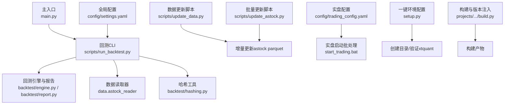
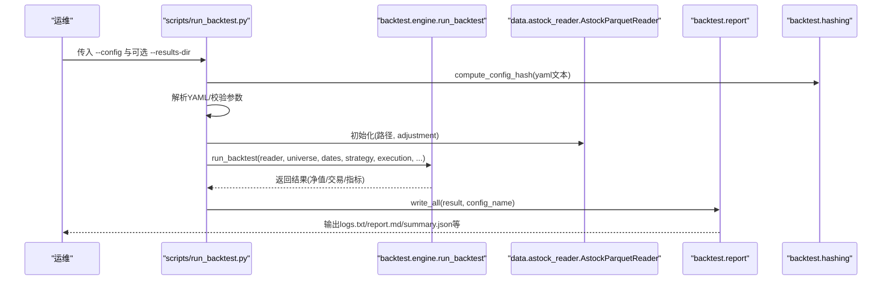
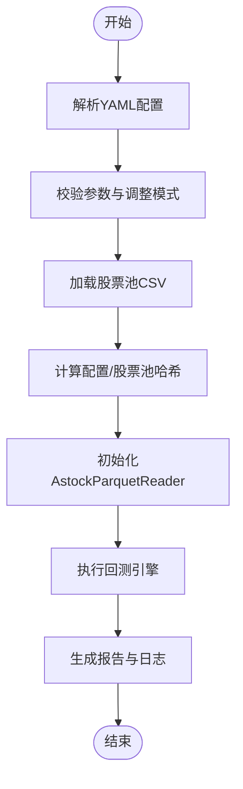
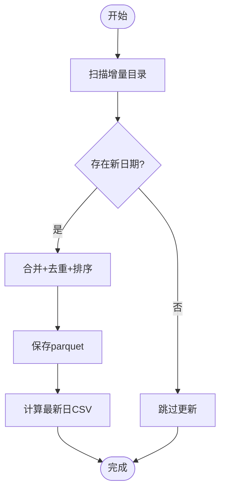
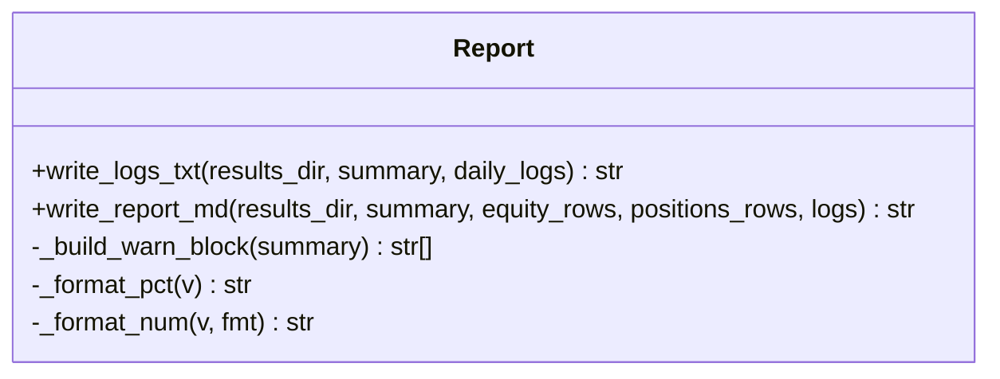
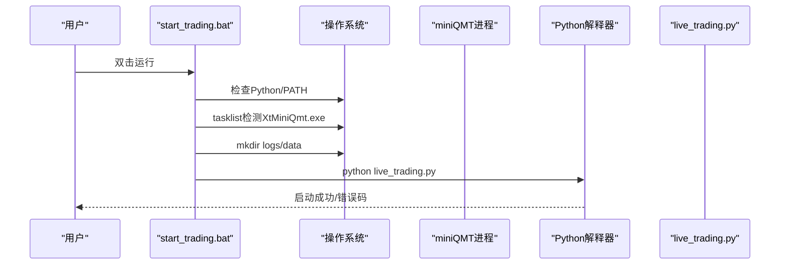
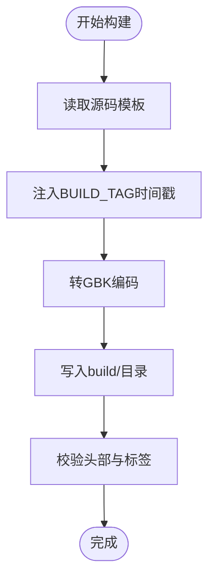
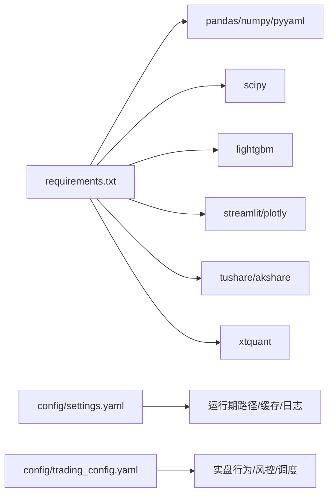

# 部署与运维

<cite>
**本文引用的文件**
- [main.py](file://main.py)
- [requirements.txt](file://requirements.txt)
- [setup.py](file://setup.py)
- [config/settings.yaml](file://config\settings.yaml)
- [config/trading_config.yaml](file://config\trading_config.yaml)
- [scripts/run_backtest.py](file://scripts\run_backtest.py)
- [scripts/update_data.py](file://scripts\update_data.py)
- [scripts/update_astock.py](file://scripts\update_astock.py)
- [backtest/report.py](file://backtest\report.py)
- [backtest/hashing.py](file://backtest/hashing.py)
- [start_trading.bat](file://start_trading.bat)
- [scripts/update_data.bat](file://scripts\update_data.bat)
- [projects/Project_10_价值小盘V2/build.py](file://projects\Project_10_价值小盘V2\build.py)
- [AGENTS.md](file://AGENTS.md)
- [specs/QwenQT-2026-0801.md](file://specs\QwenQT-2026-0801.md)
- [全局复利与踩坑日志.md](file://全局复利与踩坑日志.md)
</cite>

## 目录
1. [简介](#简介)
2. [项目结构](#项目结构)
3. [核心组件](#核心组件)
4. [架构总览](#架构总览)
5. [详细组件分析](#详细组件分析)
6. [依赖关系分析](#依赖关系分析)
7. [性能考虑](#性能考虑)
8. [故障排查指南](#故障排查指南)
9. [结论](#结论)
10. [附录](#附录)

## 简介
本文件面向生产环境的 QuantLab 部署与运维，覆盖服务器准备、依赖安装、数据准备、服务启动、监控集成、数据更新机制、故障排查、备份与灾备、安全加固、容器化方案（Docker/Kubernetes）、监控仪表板与报表生成等。文档以仓库实际代码为依据，提供可操作的步骤与可视化图示，帮助运维人员快速落地并稳定运行系统。

## 项目结构
QuantLab 采用“策略/回测/数据/配置/脚本”分层组织：
- 入口与回测：main.py、scripts/run_backtest.py
- 数据与更新：scripts/update_data.py、scripts/update_astock.py
- 配置：config/settings.yaml、config/trading_config.yaml
- 报告与指标：backtest/report.py、backtest/hashing.py
- 实盘启动：start_trading.bat、setup.py
- 构建与版本注入：projects/Project_10_价值小盘V2/build.py
- 依赖清单：requirements.txt

**图表来源**
- [main.py:1-104](file://main.py#L1-L104)
- [scripts/run_backtest.py:1-132](file://scripts\run_backtest.py#L1-L132)
- [backtest/report.py:78-147](file://backtest\report.py#L78-L147)
- [backtest/hashing.py:1-23](file://backtest/hashing.py#L1-L23)
- [scripts/update_data.py:1-135](file://scripts\update_data.py#L1-L135)
- [scripts/update_astock.py:151-178](file://scripts\update_astock.py#L151-L178)
- [config/settings.yaml:1-69](file://config\settings.yaml#L1-L69)
- [config/trading_config.yaml:1-59](file://config\trading_config.yaml#L1-L59)
- [start_trading.bat:1-51](file://start_trading.bat#L1-L51)
- [setup.py:1-82](file://setup.py#L1-L82)
- [projects/Project_10_价值小盘V2/build.py:44-68](file://projects\Project_10_价值小盘V2\build.py#L44-L68)

**章节来源**
- [main.py:1-104](file://main.py#L1-L104)
- [scripts/run_backtest.py:1-132](file://scripts\run_backtest.py#L1-L132)
- [config/settings.yaml:1-69](file://config\settings.yaml#L1-L69)
- [config/trading_config.yaml:1-59](file://config\trading_config.yaml#L1-L59)

## 核心组件
- 回测入口与配置加载：main.py 负责加载 settings.yaml 并调用 Project_01 的评分与回测流程；scripts/run_backtest.py 作为通用 CLI，统一读取 YAML 配置、加载股票池与数据源、执行回测并输出报告。
- 数据更新：scripts/update_data.py 实现 astock parquet 增量更新与 CSV 重算；scripts/update_astock.py 支持按 code 并行增量处理。
- 报告与指标：backtest/report.py 汇总警告块、日志与 Markdown 报告；backtest/hashing.py 计算配置、数据与股票池哈希，用于结果可追溯。
- 实盘启动：start_trading.bat 检查 Python、QMT 进程、配置文件，创建日志目录后启动 live_trading.py；setup.py 自动复制 xtquant 并创建必要目录。
- 构建与版本注入：projects/Project_10_价值小盘V2/build.py 在构建时注入时间戳标记，便于追踪构建版本。

**章节来源**
- [main.py:21-73](file://main.py#L21-L73)
- [scripts/run_backtest.py:35-127](file://scripts\run_backtest.py#L35-L127)
- [scripts/update_data.py:37-131](file://scripts\update_data.py#L37-L131)
- [scripts/update_astock.py:151-178](file://scripts\update_astock.py#L151-L178)
- [backtest/report.py:78-147](file://backtest\report.py#L78-L147)
- [backtest/hashing.py:1-23](file://backtest/hashing.py#L1-L23)
- [start_trading.bat:1-51](file://start_trading.bat#L1-L51)
- [setup.py:15-82](file://setup.py#L15-L82)
- [projects/Project_10_价值小盘V2/build.py:44-68](file://projects\Project_10_价值小盘V2\build.py#L44-L68)

## 架构总览
下图展示从配置到回测/实盘的端到端流程，以及数据更新与报告生成的关键节点。

**图表来源**
- [scripts/run_backtest.py:42-127](file://scripts\run_backtest.py#L42-L127)
- [backtest/hashing.py:1-23](file://backtest/hashing.py#L1-L23)
- [backtest/report.py:111-147](file://backtest\report.py#L111-L147)

## 详细组件分析

### 回测流水线（CLI）
- 功能要点
  - 解析 YAML 配置，提取 backtest/data/universe/execution/strategy_params 等字段。
  - 计算配置哈希与股票池哈希，确保结果可追溯。
  - 初始化 AstockParquetReader，按需加载行业映射（当启用 industry_cap）。
  - 调用 engine.run_backtest 执行回测，最终通过 report.write_all 输出多格式结果。
- 关键约束
  - 仅读取 astock parquet（只读），写入限定在 results 目录。
  - 未导入 xtquant/passorder，避免与实盘耦合。

**图表来源**
- [scripts/run_backtest.py:42-127](file://scripts\run_backtest.py#L42-L127)
- [backtest/hashing.py:1-23](file://backtest/hashing.py#L1-L23)

**章节来源**
- [scripts/run_backtest.py:1-132](file://scripts\run_backtest.py#L1-L132)

### 数据更新机制（增量与全量）
- 增量更新 astock parquet
  - 扫描“增量”目录，合并新日期行，去重并按 trade_date/ts_code 排序，落盘为 parquet。
  - 若无可新增日期，直接跳过。
- CSV 重算
  - 基于最新交易日快照，计算 ROE 等衍生字段，输出 GBK 编码 CSV。
- 批量并行更新
  - update_astock.py 支持按 code 并行处理，提升吞吐。

**图表来源**
- [scripts/update_data.py:37-131](file://scripts\update_data.py#L37-L131)
- [scripts/update_astock.py:151-178](file://scripts\update_astock.py#L151-L178)

**章节来源**
- [scripts/update_data.py:1-135](file://scripts\update_data.py#L1-L135)
- [scripts/update_astock.py:151-178](file://scripts\update_astock.py#L151-L178)

### 报告与告警
- 报告内容
  - logs.txt：固定顺序的 WARN 块 + 每日日志。
  - report.md：Markdown 报告，包含绩效、覆盖率、样本期警告等。
  - summary.json：结构化摘要。
- 告警项示例
  - SHORT_SAMPLE_PERIOD、BENCHMARK_DISABLED、DATA_DEDUP_APPLIED、SECTOR_HEAT_MODE_ZERO、DATA_WAL_DETECTED。

**图表来源**
- [backtest/report.py:78-147](file://backtest\report.py#L78-L147)

**章节来源**
- [backtest/report.py:78-147](file://backtest\report.py#L78-L147)

### 实盘启动与环境配置
- start_trading.bat
  - 检查 Python、QMT 进程、配置文件，创建日志与数据目录，启动 live_trading.py。
- setup.py
  - 自动查找 xtquant 源路径，复制到系统 Python site-packages，验证导入，创建必要目录。
- trading_config.yaml
  - 账户、交易参数、风控、订单、调度、通知、数据源与策略配置。

**图表来源**
- [start_trading.bat:1-51](file://start_trading.bat#L1-L51)
- [setup.py:15-82](file://setup.py#L15-L82)
- [config/trading_config.yaml:1-59](file://config\trading_config.yaml#L1-L59)

**章节来源**
- [start_trading.bat:1-51](file://start_trading.bat#L1-L51)
- [setup.py:1-82](file://setup.py#L1-L82)
- [config/trading_config.yaml:1-59](file://config\trading_config.yaml#L1-L59)

### 构建与版本注入
- build.py 在构建时将 BUILD_TAG 占位符替换为时间戳，并以 GBK 编码写入 build/ 目录，便于部署追踪。

**图表来源**
- [projects/Project_10_价值小盘V2/build.py:44-68](file://projects\Project_10_价值小盘V2\build.py#L44-L68)

**章节来源**
- [projects/Project_10_价值小盘V2/build.py:44-68](file://projects\Project_10_价值小盘V2\build.py#L44-L68)

## 依赖关系分析
- 运行时依赖
  - 核心：pandas>=2.0、numpy>=1.24、pyyaml>=6.0
  - 回测：scipy>=1.10
  - ML（可选）：lightgbm>=4.0
  - 可视化（可选）：streamlit>=1.28、plotly>=5.18
  - 数据源（可选）：tushare>=1.2、akshare>=1.10
  - 实盘：xtquant（从QMT安装目录复制）
- 配置依赖
  - settings.yaml：全局路径、缓存、回测默认值、因子预处理、策略宇宙、日志目录。
  - trading_config.yaml：账户、交易参数、风控、订单、调度、通知、数据源、策略参数。

**图表来源**
- [requirements.txt:1-29](file://requirements.txt#L1-L29)
- [config/settings.yaml:1-69](file://config\settings.yaml#L1-L69)
- [config/trading_config.yaml:1-59](file://config\trading_config.yaml#L1-L59)

**章节来源**
- [requirements.txt:1-29](file://requirements.txt#L1-L29)
- [config/settings.yaml:1-69](file://config\settings.yaml#L1-L69)
- [config/trading_config.yaml:1-59](file://config\trading_config.yaml#L1-L59)

## 性能考虑
- 数据读取
  - 使用 parquet 存储与 pyarrow 引擎，减少 I/O 与内存占用；建议开启列裁剪与分区读取。
- 增量更新
  - 优先增量合并，避免全量重建；对大表进行去重与排序优化。
- 并行处理
  - update_astock.py 支持 ProcessPoolExecutor 并行，合理设置 workers 数以避免 CPU 争用。
- 报告生成
  - 将日志与指标分离写入，避免阻塞主流程；必要时异步落盘。
- 缓存策略
  - 根据 settings.yaml 的 cache 配置控制过期时间与目录，避免重复计算。

[本节为通用指导，不直接分析具体文件]

## 故障排查指南
- 常见问题定位
  - Python 未加入 PATH：start_trading.bat 会提示并退出。
  - miniQMT 未运行：批处理脚本检测进程并给出提示。
  - 配置文件缺失：start_trading.bat 检查 config/trading_config.yaml 是否存在。
  - xtquant 导入失败：setup.py 会尝试复制并验证导入，失败则退出。
- 日志与报告
  - 查看 reports/<run_id>/logs.txt 中的 WARN 块，识别样本期不足、基准不可用、数据去重、WAL 同步等问题。
  - 检查 report.md 与 summary.json 获取绩效与覆盖率信息。
- 数据问题
  - 增量更新失败：检查增量目录命名与 stock_daily.parquet 是否存在；确认 trade_date 字段类型。
  - CSV 生成异常：核对最新交易日数据完整性与字段有效性。
- 性能瓶颈
  - 观察 update_astock.py 的并行进度与耗时；适当调整 workers。
  - 评估 parquet 读取与合并阶段的内存峰值，必要时分块处理。
- 内存泄漏检测
  - 使用 Python 内置或第三方工具（如 tracemalloc、memory_profiler）监控长驻进程内存增长。
  - 结合日志时间戳定位异常增长阶段。

**章节来源**
- [start_trading.bat:1-51](file://start_trading.bat#L1-L51)
- [setup.py:54-82](file://setup.py#L54-L82)
- [backtest/report.py:78-147](file://backtest\report.py#L78-L147)
- [scripts/update_data.py:37-131](file://scripts\update_data.py#L37-L131)
- [scripts/update_astock.py:151-178](file://scripts\update_astock.py#L151-L178)

## 结论
QuantLab 在生产环境中具备清晰的入口与配置体系、稳健的数据更新机制、完善的报告与告警能力，并通过批处理脚本与一键配置简化部署。建议结合监控仪表板与自动化任务，形成闭环的运维体系，保障系统稳定与可观测性。

[本节为总结，不直接分析具体文件]

## 附录

### 生产环境部署流程（服务器配置、依赖安装、数据准备、服务启动）
- 服务器准备
  - 安装 Python（加入 PATH），确保磁盘空间满足 parquet 与日志需求。
  - 安装 QMT 客户端（miniQMT），记录安装路径。
- 依赖安装
  - 使用 requirements.txt 安装核心与可选依赖。
  - 运行 setup.py 自动复制 xtquant 并创建必要目录。
- 数据准备
  - 运行 scripts/update_data.py 或 scripts/update_data.bat 进行增量更新与 CSV 重算。
  - 如需批量并行更新，使用 scripts/update_astock.py。
- 服务启动
  - 回测：python -m scripts.run_backtest --config config/atr_lowvol_fw.yaml [--results-dir ...]
  - 实盘：双击 start_trading.bat，确认 QMT 已登录并配置文件正确。

**章节来源**
- [requirements.txt:1-29](file://requirements.txt#L1-L29)
- [setup.py:15-82](file://setup.py#L15-L82)
- [scripts/update_data.py:1-135](file://scripts\update_data.py#L1-L135)
- [scripts/update_astock.py:151-178](file://scripts\update_astock.py#L151-L178)
- [scripts/run_backtest.py:1-132](file://scripts\run_backtest.py#L1-L132)
- [start_trading.bat:1-51](file://start_trading.bat#L1-L51)

### 监控系统集成（日志收集、指标采集、告警配置）
- 日志收集
  - 回测日志：reports/<run_id>/logs.txt，包含固定顺序的 WARN 块与每日日志。
  - 应用日志：根据 settings.yaml 的 logging.dir 配置落盘。
- 指标采集
  - 报告 summary.json 与 report.md 提供绩效、覆盖率、样本期警告等指标。
  - 监控指标定义参考 projects/verification/results/monitoring_indicators.md（净值、回撤、持仓、行业集中度、换手率、信号质量、业绩归因、容量检查、策略有效性）。
- 告警配置
  - trading_config.yaml 中 notification.enabled/method/webhook_url 用于企业微信/钉钉/邮件通知。
  - 建议在 CI/CD 或定时任务中解析 logs.txt 与 summary.json，触发阈值告警。

**章节来源**
- [backtest/report.py:78-147](file://backtest\report.py#L78-L147)
- [config/trading_config.yaml:37-41](file://config\trading_config.yaml#L37-L41)

### 数据更新机制（增量、全量、校验）
- 增量更新
  - scripts/update_data.py 扫描增量目录，合并新日期，去重排序后落盘。
- 全量更新
  - 可通过重新生成 CSV 或重建 parquet（需外部数据源支持）实现。
- 数据校验
  - 检查 trade_date 唯一性与连续性；对比最新交易日行数与字段完整性。
  - 利用 hashing 工具计算数据哈希，确保一致性。

**章节来源**
- [scripts/update_data.py:37-131](file://scripts\update_data.py#L37-L131)
- [backtest/hashing.py:1-23](file://backtest/hashing.py#L1-L23)

### 故障排查指南（常见错误、性能瓶颈、内存泄漏）
- 常见错误
  - Python/QMT 未就绪、配置文件缺失、xtquant 导入失败。
- 性能瓶颈
  - 大数据合并与排序、并行度不足、I/O 瓶颈。
- 内存泄漏
  - 长驻进程内存持续增长，需结合日志与内存工具定位。

**章节来源**
- [start_trading.bat:1-51](file://start_trading.bat#L1-L51)
- [setup.py:54-82](file://setup.py#L54-L82)
- [scripts/update_astock.py:151-178](file://scripts\update_astock.py#L151-L178)

### 运维最佳实践（备份、灾备、安全加固）
- 备份策略
  - 定期备份 astock parquet、CSV、reports 目录与配置文件。
  - 使用版本化工具管理配置与脚本变更。
- 灾难恢复
  - 保留最近一次完整快照与增量日志，支持快速回滚。
- 安全加固
  - 限制 Python 与 QMT 访问权限，最小化暴露面。
  - 敏感配置（账号、路径）加密或环境变量注入。

[本节为通用指导，不直接分析具体文件]

### 容器化部署（Docker 镜像构建与 Kubernetes 部署）
- Docker 镜像构建
  - 基础镜像选择 Python 官方镜像，复制项目代码与依赖，安装 requirements.txt。
  - 将 xtquant 与 QMT 相关依赖打包或挂载外部卷。
  - 定义 CMD/ENTRYPOINT 指向 scripts/run_backtest.py 或 live_trading.py。
- Kubernetes 部署
  - 使用 Deployment 管理回测任务，ConfigMap/Secret 管理配置与密钥。
  - 使用 Job/CronJob 执行定时数据更新与回测任务。
  - 持久化卷挂载 astock 数据与 reports 目录。

[本节为概念性指导，不直接分析具体文件]

### 监控仪表板与报表生成
- 仪表板
  - 可使用 streamlit/plotly 搭建自定义仪表板，读取 reports 目录与 summary.json。
- 报表生成
  - backtest/report.py 自动生成 logs.txt、report.md、summary.json，便于可视化与归档。
- 指标定义
  - 参考 monitoring_indicators.md 中的每日/每周/每月/季度监控指标与阈值。

**章节来源**
- [backtest/report.py:111-147](file://backtest\report.py#L111-L147)
- [requirements.txt:19-21](file://requirements.txt#L19-L21)

### 里程碑与验收节点（参考）
- 里程碑规划与验收标准见 specs/QwenQT-2026-0801.md，涵盖数据修复、策略增强、模拟盘与实盘上线等关键节点。

**章节来源**
- [specs/QwenQT-2026-0801.md:101-113](file://specs\QwenQT-2026-0801.md#L101-L113)

### 测试与协作约定（参考）
- 测试与协作约定见 AGENTS.md 与 全局复利与踩坑日志.md，强调 MOCK 局限、测试报告记录 warning、遇异常必停等规范。

**章节来源**
- [AGENTS.md:185-194](file://AGENTS.md#L185-L194)
- [全局复利与踩坑日志.md:379-406](file://全局复利与踩坑日志.md#L379-L406)