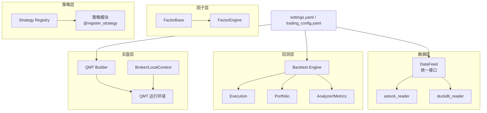
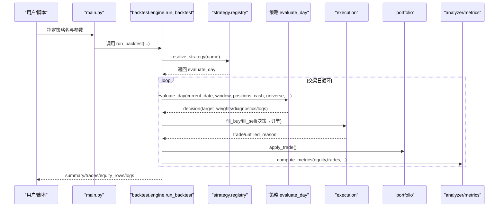
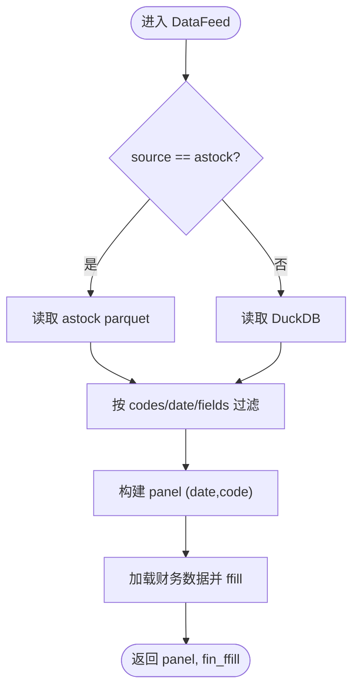
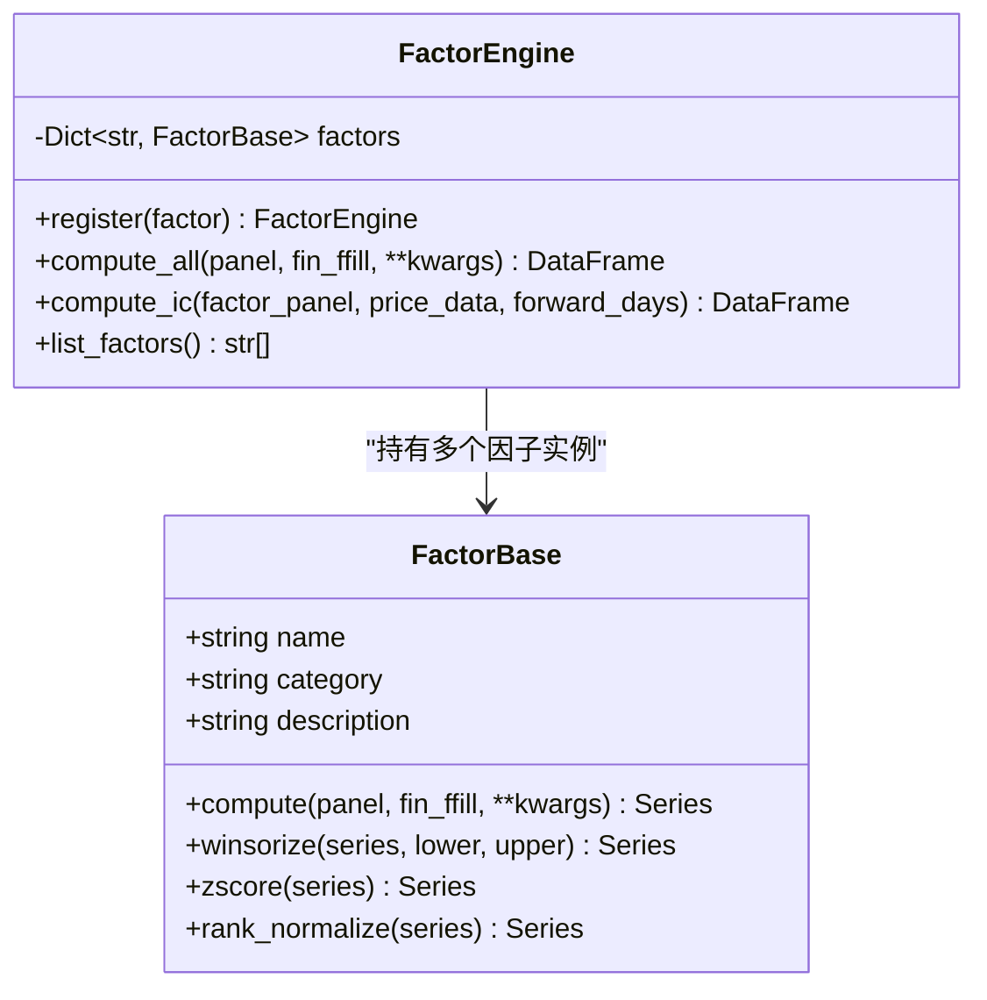
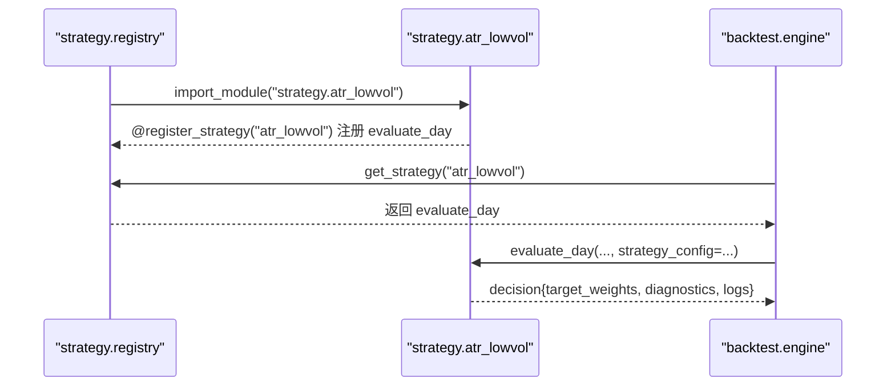
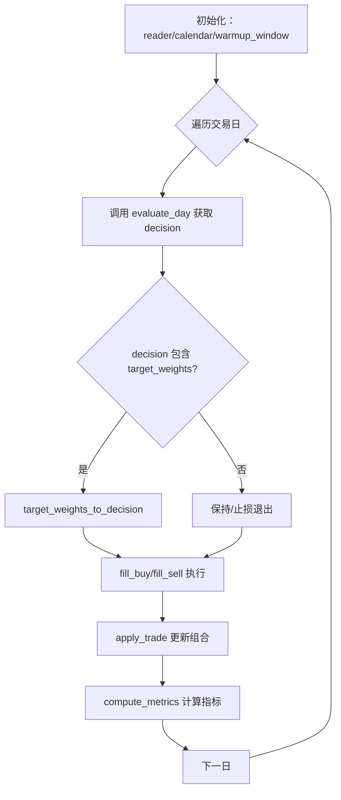
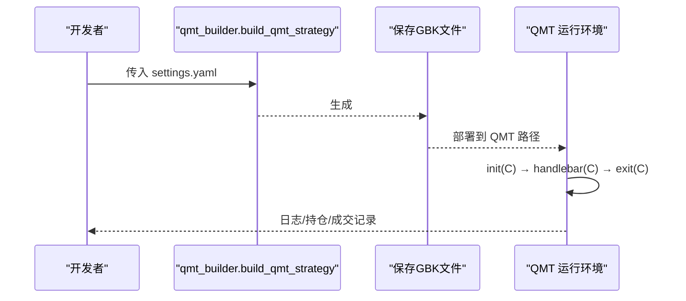
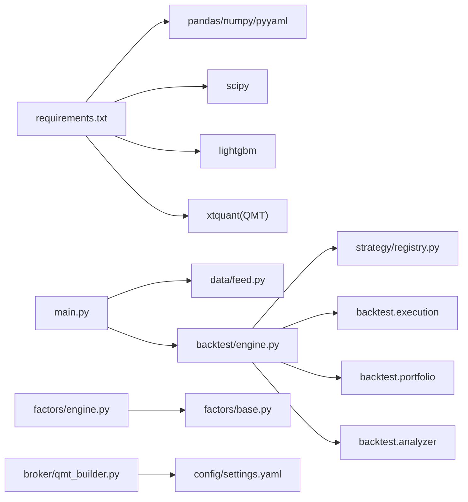

# 项目概述

<cite>
**本文引用的文件**   
- [main.py](file://main.py)
- [requirements.txt](file://requirements.txt)
- [setup.py](file://setup.py)
- [快速启动.md](file://快速启动.md)
- [AGENTS.md](file://AGENTS.md)
- [A股量化框架_五大扩展模块.md](file://A股量化框架_五大扩展模块.md)
- [实盘配置指南.md](file://实盘配置指南.md)
- [config/settings.yaml](file://config/settings.yaml)
- [data/feed.py](file://data/feed.py)
- [factors/base.py](file://factors/base.py)
- [factors/engine.py](file://factors/engine.py)
- [strategy/registry.py](file://strategy/registry.py)
- [backtest/engine.py](file://backtest/engine.py)
- [broker/qmt_builder.py](file://broker/qmt_builder.py)
- [strategy/atr_lowvol.py](file://strategy/atr_lowvol.py)
</cite>

## 目录
1. [简介](#简介)
2. [项目结构](#项目结构)
3. [核心组件](#核心组件)
4. [架构总览](#架构总览)
5. [详细组件分析](#详细组件分析)
6. [依赖关系分析](#依赖关系分析)
7. [性能考量](#性能考量)
8. [故障排查指南](#故障排查指南)
9. [结论](#结论)
10. [附录：快速开始](#附录快速开始)

## 简介
QuantLab 是一个面向 A 股市场的完整量化交易研究与实盘框架，覆盖因子研究、策略开发、回测验证到 QMT 实盘交易的端到端链路。框架采用分层与模块化设计：数据层提供统一接口与多源支持；因子层提供标准化因子库与 IC 评估；策略层通过注册机制实现“即插即用”；回测层提供高性能引擎与真实约束模拟；实盘层对接 QMT，具备委托监控、状态持久化与风控巡检能力。

核心优势包括：
- 多数据源支持：astock parquet 与 DuckDB 双引擎，统一 DataFeed 接口
- 标准化因子库：FactorBase + FactorEngine，内置预处理（截尾、标准化、中性化）与 IC 评估
- 策略注册机制：@register_strategy 装饰器 + autodiscover，扁平化策略管理
- 高性能回测引擎：next_open 模型、O(1) 窗口切片、基准对齐、组合与执行一体化
- 完整的 QMT 实盘对接：单文件 GBK 策略生成、本地 miniQMT 验证、生产级 Broker 能力

## 项目结构
仓库按功能域划分，便于独立演进与复用：
- data：数据读取与面板构建（astock/DuckDB 双引擎、PIT 安全财务）
- factors：因子基类与引擎（注册、计算、IC）
- strategy：策略库与注册中心（扁平模块、调度、模板）
- backtest：回测引擎（执行、组合、指标、报告）
- broker：券商接口与 QMT 策略生成器
- projects：策略项目隔离（每个项目独立回测/配置/结果）
- config：全局/实盘/项目级三级配置
- scripts：批量任务与工具脚本
- reports：回测产物与日志

图表来源
- [data/feed.py:17-124](file://data/feed.py#L17-L124)
- [factors/base.py:9-52](file://factors/base.py#L9-L52)
- [factors/engine.py:9-86](file://factors/engine.py#L9-L86)
- [strategy/registry.py:24-115](file://strategy/registry.py#L24-L115)
- [backtest/engine.py:237-619](file://backtest/engine.py#L237-L619)
- [broker/qmt_builder.py:33-386](file://broker/qmt_builder.py#L33-L386)
- [config/settings.yaml:1-69](file://config/settings.yaml#L1-L69)

章节来源
- [AGENTS.md:1-194](file://AGENTS.md#L1-L194)
- [config/settings.yaml:1-69](file://config/settings.yaml#L1-L69)

## 核心组件
- 数据层 DataFeed：统一 get_daily/get_universe/get_financials，内部分发 astock 与 duckdb 两种读取器，返回 MultiIndex DataFrame，并支持缓存与字段裁剪
- 因子层 FactorBase/FactorEngine：抽象 compute 接口，提供 winsorize/zscore/rank_normalize 等预处理，集中注册与批量计算，内置截面 IC/ICIR 统计
- 策略层 registry：@register_strategy 装饰器将 evaluate_day 函数注册到全局表，autodiscover 自动扫描 strategy 包下模块，支持测试注入与诊断取值
- 回测层 engine：run_backtest 串联 reader → strategy_core → execution → portfolio → metrics，支持 next_open 交易模型、基准对齐、持仓与资金记账、未成交订单跟踪
- 实盘层 qmt_builder：从配置组装 GBK 编码的 QMT 单文件策略（init/handlebar/exit），内置止损、调仓日判断、因子计算与下单流程

章节来源
- [data/feed.py:17-197](file://data/feed.py#L17-L197)
- [factors/base.py:9-52](file://factors/base.py#L9-L52)
- [factors/engine.py:9-86](file://factors/engine.py#L9-L86)
- [strategy/registry.py:24-115](file://strategy/registry.py#L24-L115)
- [backtest/engine.py:237-619](file://backtest/engine.py#L237-L619)
- [broker/qmt_builder.py:33-386](file://broker/qmt_builder.py#L33-L386)

## 架构总览
QuantLab 的分层架构强调“解耦与可替换”，各层通过明确契约交互：
- 数据层：DataFeed 暴露统一方法，屏蔽底层存储差异
- 因子层：FactorEngine 聚合已注册因子，输出因子面板供策略使用
- 策略层：evaluate_day 仅负责选股与目标权重，不关心订单簿记
- 回测层：engine 负责时间推进、信号解析、执行撮合、组合更新与指标计算
- 实盘层：qmt_builder 将策略逻辑打包为 QMT 兼容的单文件，配合 LocalContext 进行本地验证

图表来源
- [main.py:28-93](file://main.py#L28-L93)
- [backtest/engine.py:237-619](file://backtest/engine.py#L237-L619)
- [strategy/registry.py:24-115](file://strategy/registry.py#L24-L115)

## 详细组件分析

### 数据层：DataFeed 与面板构建
- 统一接口：get_daily/get_universe/get_financials，内部根据 source 选择 astock 或 duckdb
- 面板构建：get_panel 将日线与财务数据拼接为 panel 与 fin_ffill，用于后续因子计算
- 缓存与过滤：支持代码筛选、日期范围、字段裁剪，减少内存占用

图表来源
- [data/feed.py:17-197](file://data/feed.py#L17-L197)

章节来源
- [data/feed.py:17-197](file://data/feed.py#L17-L197)

### 因子层：FactorBase 与 FactorEngine
- FactorBase：定义 compute 抽象方法与通用预处理（winsorize/zscore/rank_normalize）
- FactorEngine：集中注册、批量计算、IC/ICIR 统计，支持向前收益与截面相关性

图表来源
- [factors/base.py:9-52](file://factors/base.py#L9-L52)
- [factors/engine.py:9-86](file://factors/engine.py#L9-L86)

章节来源
- [factors/base.py:9-52](file://factors/base.py#L9-L52)
- [factors/engine.py:9-86](file://factors/engine.py#L9-L86)

### 策略层：注册机制与示例策略
- registry：@register_strategy 装饰器将 evaluate_day 注册到全局字典，autodiscover 自动导入 strategy 包下模块
- atr_lowvol：演示 target_weights 模式，仅输出选股意愿，组合与执行由回测层处理

图表来源
- [strategy/registry.py:24-115](file://strategy/registry.py#L24-L115)
- [strategy/atr_lowvol.py:78-165](file://strategy/atr_lowvol.py#L78-L165)
- [backtest/engine.py:207-235](file://backtest/engine.py#L207-L235)

章节来源
- [strategy/registry.py:24-115](file://strategy/registry.py#L24-L115)
- [strategy/atr_lowvol.py:1-165](file://strategy/atr_lowvol.py#L1-L165)

### 回测层：引擎主循环与执行
- run_backtest：加载日历与历史窗口，逐日调用策略 evaluate_day，解析 decision，执行买卖，更新组合与指标
- 关键优化：预计算 cut_index 实现 O(1) 窗口切片；基准序列对齐与缺失前向填充；未成交订单跟踪与日志

图表来源
- [backtest/engine.py:237-619](file://backtest/engine.py#L237-L619)

章节来源
- [backtest/engine.py:237-619](file://backtest/engine.py#L237-L619)

### 实盘层：QMT 策略生成与本地验证
- qmt_builder：从 settings.yaml 读取配置，生成 GBK 编码的 QMT 单文件策略，包含 init/handlebar/exit 生命周期、止损、调仓日判断、因子计算与下单
- LocalContext：将 C.* 调用映射到本地 xtdata，便于快速验证选股管线与排序

图表来源
- [broker/qmt_builder.py:33-386](file://broker/qmt_builder.py#L33-L386)

章节来源
- [broker/qmt_builder.py:33-386](file://broker/qmt_builder.py#L33-L386)
- [AGENTS.md:1-194](file://AGENTS.md#L1-L194)

## 依赖关系分析
- 外部依赖：pandas/numpy/pyyaml/scipy/lightgbm 等，xtquant 需从 QMT 安装目录复制
- 模块耦合：backtest/engine 依赖 strategy.registry 与 backtest.execution/portfolio/analyzer；data.feed 被 main.py 与回测入口使用；factors.engine 被研究脚本与策略引用

图表来源
- [requirements.txt:1-29](file://requirements.txt#L1-L29)
- [main.py:28-93](file://main.py#L28-L93)
- [backtest/engine.py:237-619](file://backtest/engine.py#L237-L619)
- [strategy/registry.py:24-115](file://strategy/registry.py#L24-L115)
- [factors/engine.py:9-86](file://factors/engine.py#L9-L86)
- [factors/base.py:9-52](file://factors/base.py#L9-L52)
- [broker/qmt_builder.py:33-386](file://broker/qmt_builder.py#L33-L386)
- [config/settings.yaml:1-69](file://config/settings.yaml#L1-L69)

章节来源
- [requirements.txt:1-29](file://requirements.txt#L1-L29)

## 性能考量
- 数据层：parquet 直读与 DuckDB 查询结合，字段裁剪与缓存降低 I/O 压力
- 因子层：批量计算与向量化操作，避免逐行循环；IC 计算按日期分组，控制样本量阈值
- 回测层：cut_index 预计算使每日窗口切片 O(1)，减少 DataFrame 拷贝；基准序列对齐一次完成；未成交订单计数与日志聚合
- 实盘层：GBK 单文件策略避免运行时依赖；本地 miniQMT 验证缩短反馈周期

[本节为通用指导，不直接分析具体文件]

## 故障排查指南
- 连接问题：确认 QMT 已启动并登录，检查 xtquant 路径与 Python 环境一致性
- 数据缺失：核对 astock/DuckDB 路径与字段名称，确保日期格式与 MultiIndex 正确
- 策略未注册：确认 strategy 模块顶层存在 @register_strategy，且未被 autodiscover 跳过
- 回测异常：检查 calendar 是否为空、benchmark 数据是否可用、decision 结构是否符合预期
- QMT 下单失败：passorder 异步接口需短轮询反查 order_id；注意 m_strOptName 方向判断与收盘后不再触发 handlebar

章节来源
- [AGENTS.md:50-194](file://AGENTS.md#L50-L194)
- [实盘配置指南.md:1-258](file://实盘配置指南.md#L1-L258)

## 结论
QuantLab 以清晰的分层与模块化设计，打通了 A 股量化从研究到实盘的完整链路。数据层与因子层提供稳定高效的输入，策略层通过注册机制实现灵活扩展，回测层保证高保真与高性能，实盘层则提供生产级的 QMT 对接能力。借助三级配置体系与完善的验证框架，团队可在保证严谨性的前提下快速迭代策略与因子。

[本节为总结性内容，不直接分析具体文件]

## 附录：快速开始
- 环境搭建：安装 Python 依赖（pandas/numpy/pyyaml/scipy/lightgbm），复制 xtquant 到系统 Python 或使用 QMT 内置 Python
- 启动 QMT：运行 XtMiniQmt.exe 并登录账号
- 测试连接：执行 test_connection.py 验证 xtquant 与账户查询
- 运行回测：python main.py --strategy project_01
- 启动实盘：执行 start_trading.bat 或 python live_trading.py

章节来源
- [快速启动.md:1-67](file://快速启动.md#L1-L67)
- [setup.py:1-82](file://setup.py#L1-L82)
- [main.py:95-104](file://main.py#L95-L104)
- [实盘配置指南.md:1-258](file://实盘配置指南.md#L1-L258)