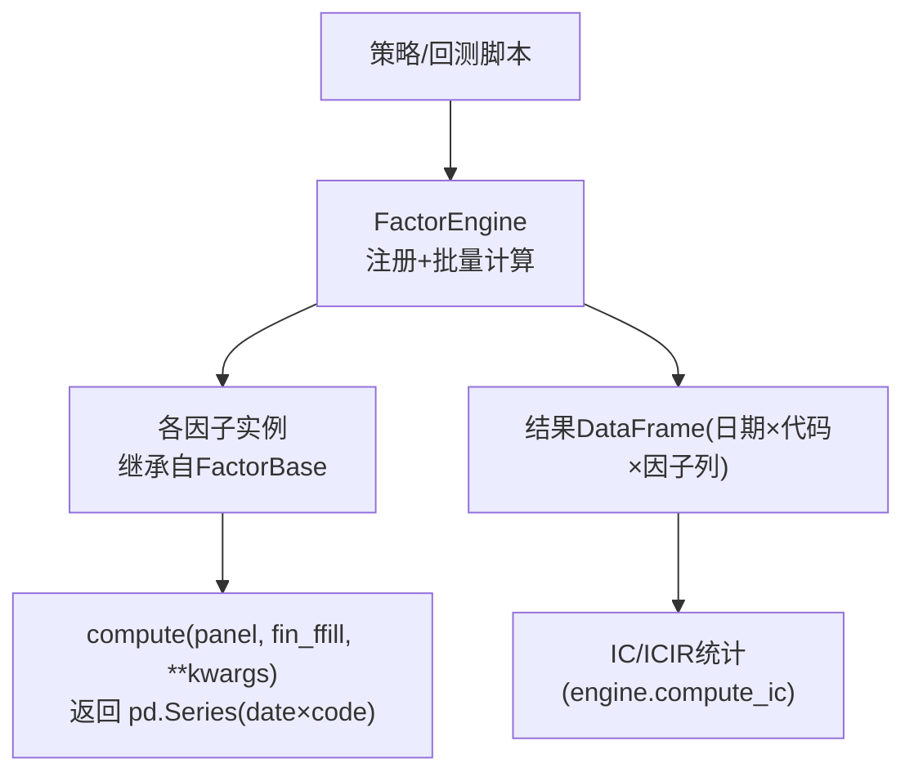
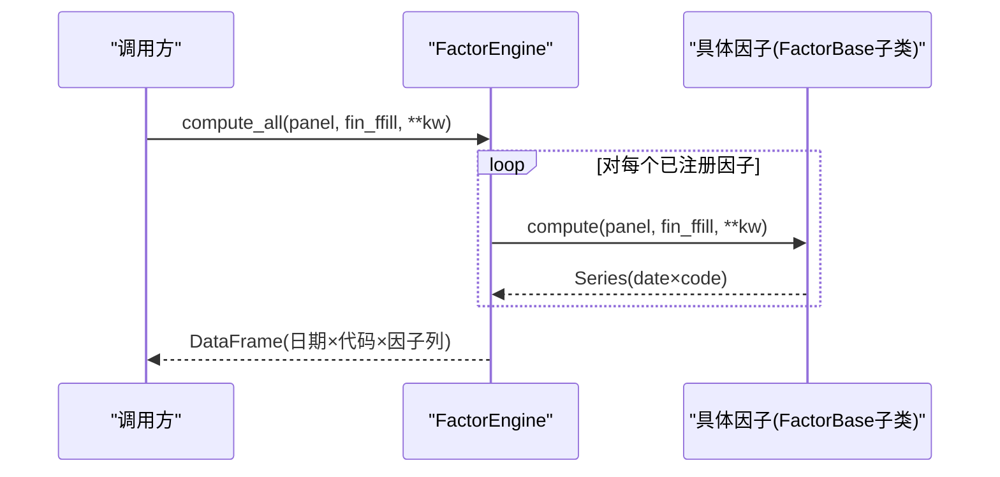
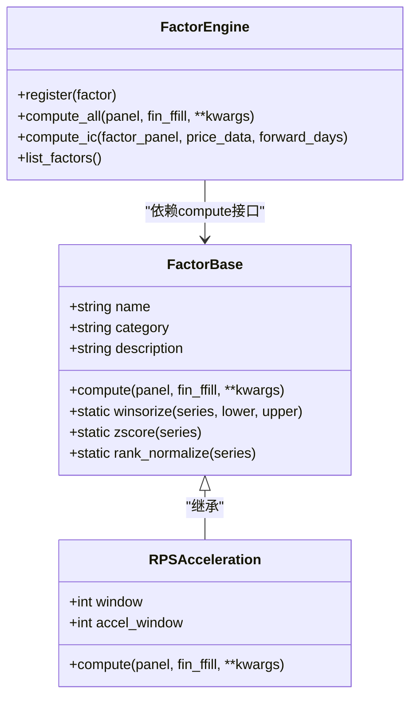

# FactorBase基类体系

<cite>
**本文引用的文件**
- [factors/base.py](file://factors/base.py)
- [factors/engine.py](file://factors/engine.py)
- [factors/rps_acceleration.py](file://factors/rps_acceleration.py)
- [data/astock_finance_reader.py](file://data/astock_finance_reader.py)
</cite>

## 目录
1. [简介](#简介)
2. [项目结构](#项目结构)
3. [核心组件](#核心组件)
4. [架构总览](#架构总览)
5. [关键组件详解](#关键组件详解)
6. [依赖关系分析](#依赖关系分析)
7. [性能与计算特性](#性能与计算特性)
8. [排错与常见问题](#排错与常见问题)
9. [结论](#结论)
10. [附录：新因子开发指南](#附录：新因子开发指南)

## 简介
本文件为QuantLab量化交易系统中“FactorBase抽象基类”的设计文档。内容覆盖继承契约、compute方法的输入输出规范（面板MultiIndex、财务数据fin_ffill格式、返回值Series）、三大静态预处理方法的技术原理与实践（winsorize/zscore/rank_normalize）、因子元数据的意义与治理、以及从零到一实现新因子的标准流程与最佳实践。

## 项目结构
FactorBase及因子生态位于factors目录下，核心包括：
- 基类与工具：factors/base.py
- 引擎层：factors/engine.py（注册、批量计算、IC评估）
- 示例因子：factors/rps_acceleration.py（基于Panel的截面RPS加速度）
- 财务读取与PIT保障：data/astock_finance_reader.py（用于理解fin_ffill来源与时序一致性要求）

图表来源
- [factors/engine.py:9-85](file://factors/engine.py#L9-L85)
- [factors/base.py:9-51](file://factors/base.py#L9-L51)
- [factors/rps_acceleration.py:23-76](file://factors/rps_acceleration.py#L23-L76)

章节来源
- [factors/base.py:1-51](file://factors/base.py#L1-L51)
- [factors/engine.py:1-85](file://factors/engine.py#L1-L85)
- [factors/rps_acceleration.py:1-120](file://factors/rps_acceleration.py#L1-L120)

## 核心组件
- FactorBase（抽象基类）
  - 元数据管理：name、category、description（便于注册、索引、审计与可视化）
  - compute 抽象接口：标准化输入、输出与异常约定
  - 预处理工具：winsorize / zscore / rank_normalize（静态方法）
- FactorEngine（因子引擎）
  - 注册、批量计算、统一错误日志
  - IC/ICIR统计（截面相关性）

章节来源
- [factors/base.py:9-51](file://factors/base.py#L9-L51)
- [factors/engine.py:9-85](file://factors/engine.py#L9-L85)

## 架构总览
下图展示典型的数据流：上层（策略/研究脚本）通过FactorEngine加载已注册的因子，统一传入Panel与fin_ffill，得到每个因子截面Series并组合成因子面板；后续可由引擎或外部流程进行IC评估、组合加权等。

图表来源
- [factors/engine.py:20-32](file://factors/engine.py#L20-L32)
- [factors/base.py:17-28](file://factors/base.py#L17-L28)
- [factors/rps_acceleration.py:35-76](file://factors/rps_acceleration.py#L35-L76)

## 关键组件详解

### 1) FactorBase.compute 输入输出契约
- 输入
  - panel：pandas.MultiIndex DataFrame，时间轴 × 证券（索引层次通常含日期与代码），常用列包含收盘价、成交量等行情特征。
  - fin_ffill：宽表型财务指标矩阵，经向前填充处理，确保每日可用最新且无未来信息的财务值。
- 输出
  - 必须返回一个pd.Series，其MultiIndex为(date, code)，值为该日-该证券的因子得分。
- 设计考量
  - 以截面维度（date切片）为核心计算单元，便于与IC/ICIR、中性化、排名等操作对齐。
  - 将行业/市值/风格中性化由上层流程负责，compute保持“单一责任”。

章节来源
- [factors/base.py:17-28](file://factors/base.py#L17-L28)
- [factors/rps_acceleration.py:44-76](file://factors/rps_acceleration.py#L44-L76)

### 2) 三个静态预处理方法

- winsorize（百分位截尾）
  - 目的：压缩极端值，降低离群点对模型与排序的影响。
  - 原理：按lower与upper分位阈值裁剪，低于下界的值设为下界分位数，高于上界的设为上界分位数。
  - 边界处理：空序列直接原样返回；NaN不参与分位计算。
  - 参数建议：默认1%和99%适用于多数全市场横截面；强异常市场可调整为2%/98%等更稳健配置。

- zscore（Z-score标准化）
  - 目的：使不同量纲/分布的特征在同一尺度可比，利于线性模型或多因子合成。
  - 原理：均值中心化、方差标准化；若方差为零或非数值，应返回全NaN以避免误导后续步骤。
  - 注意事项：单只股票时间序列的标准差可能为零（震荡极小），此情况下应跳过或返回NaN，交由上层决定是否用rank或其他方式替代。

- rank_normalize（排序标准化）
  - 目的：将任意分布转换为[0,1]百分秩，适合非线性模型或相对排名策略。
  - 行为：缺失值按默认rank行为保留/参与排名，需根据业务确定是否需要先行dropna或填充。

章节来源
- [factors/base.py:30-51](file://factors/base.py#L30-L51)

### 3) 因子元数据管理（name/category/description）
- name：唯一标识，作为FactorEngine的键，避免重复注册冲突。
- category：语义分组（如“动量”“质量”“低波”），有助于筛选、可视化和风控分层。
- description：可读描述，便于复现、评审、发布清单维护。
- 实践建议：在__init__中声明，并保证同仓库内全局唯一；必要时可在工程侧加入校验。

章节来源
- [factors/base.py:12-15](file://factors/base.py#L12-L15)
- [factors/rps_acceleration.py:35-42](file://factors/rps_acceleration.py#L35-L42)

### 4) 示例因子实现：RPSAcceleration
- 逻辑要点
  - 基于窗口N日的收益率做截面百分比排名（0-100）得RPS。
  - 用加速窗口M对比当前RPS与M日前RPS，得到加速度正负趋势信号。
  - 通过unstack/stack完成截面运算，并以MultiIndex恢复时序×证券结构。
- 与基类衔接
  - 继承FactorBase，遵循compute契约，返回Series(date×code)。
  - 可搭配预处理：zscore用于稳定跨期稳定性；rank_normalize用于对数变换非线性的收益曲线场景。

章节来源
- [factors/rps_acceleration.py:23-76](file://factors/rps_acceleration.py#L23-L76)

## 依赖关系分析
- 耦合点
  - 因子与引擎：通过base.compute抽象形成松耦合；引擎负责编排与错误隔离。
  - 因子与数据：仅依赖通用panel/fin_ffill，不感知数据库实现细节。
- 潜在环与风险
  - compute内部不应反向import高层模块，应保持单向依赖。
  - fin_ffill应由数据层确保PIT与ffill一致性，因子层只做横向截面运算，避免引入前视偏差。

图表来源
- [factors/base.py:9-51](file://factors/base.py#L9-L51)
- [factors/rps_acceleration.py:23-76](file://factors/rps_acceleration.py#L23-L76)
- [factors/engine.py:9-85](file://factors/engine.py#L9-L85)

章节来源
- [factors/engine.py:9-85](file://factors/engine.py#L9-L85)
- [factors/base.py:9-51](file://factors/base.py#L9-L51)
- [factors/rps_acceleration.py:23-76](file://factors/rps_acceleration.py#L23-L76)

## 性能与计算特性
- 截面优先：尽量以wide表进行向量操作（unstack→行级排名/差分→stack），降低Python循环开销。
- 内存与IO：
  - panel较大时谨慎频繁unstack/stack，注意多进程下的缓存复用。
  - fin_ffill应为轻量宽表，建议只加载所需列以减少内存占用。
- 预处理的复杂度：
  - winsorize与rank_normalize通常为O(N log N)或线性扫描，zscore为O(N)。
- 异常样本：
  - 零方差/纯常数序列应避免直接参与线性标准化；必要时降级到rank。
  - 稀疏面板：缺失值较多时，使用dropna后再计算分位数/均值，确保统计量稳定。

## 排错与常见问题
- compute未返回Series或其index非(date, code)
  - 现象：下游IC计算报错或形状不匹配。
  - 处理：在compute末尾检查类型与层级名称（建议使用type检查与断言）。
- 截面元素不足导致统计失效
  - 现象：IC/ICIR计算被过滤（样本过少）。
  - 处理：在compute中设置最小样本保护，或在上层聚合时允许更宽松的统计区间。
- Z-score分母为零
  - 现象：除以0或得到Inf/Nan。
  - 处理：当std<=0或NaN时返回全NaN，并记录日志以便排查异常行情或死股。
- 财务数据前视偏差
  - 现象：因子使用未来公告的财务数据，导致IC虚高但实战无效。
  - 处理：确认fin_ffill来源采用PIT（如按ann_date/f_ann_date延迟），不得直接用财报end_date代替可用日。

章节来源
- [factors/engine.py:20-32](file://factors/engine.py#L20-L32)
- [data/astock_finance_reader.py:1-40](file://data/astock_finance_reader.py#L1-L40)

## 结论
FactorBase以简洁而严格的接口约束了因子开发范式：统一的输入输出、标准化的预处理工具、清晰的元数据定义，使得海量因子在计算、评估与集成时具备一致性与可扩展性。结合FactorEngine的注册与统计能力，团队可高效地扩展因子库并持续度量alpha质量。对于新增因子，应严格遵循契约、关注截面计算的性能与鲁棒性，并以IC/ICIR等指标驱动迭代。

## 附录：新因子开发指南

- 步骤
  1. 新建类继承FactorBase，__init__中设置name/category/description。
  2. 实现compute(panel, fin_ffill, **kwargs)，内部以截面为主进行计算，返回Series(date×code)。
  3. 在策略/研究中注册该因子至FactorEngine（若使用引擎批量流水线）。
  4. 根据需要接入winsorize/zscore/rank_normalize进行预处理；确保顺序正确（推荐先截尾再标准化/排名）。
  5. 运行IC评估，审视稳定性与方向一致性。

- 最佳实践
  - 输入检查：提前验证panel必含列、fin_ffill字段可用性；失败快速报错并打印上下文。
  - 缺失值策略：明确在截面/时序维度的dropna/fillna位置，避免隐藏的前视或回填。
  - 性能优化：尽可能使用向量化、减少中间副本；大面板场景考虑分区/分块计算。
  - 可观测性：关键路径添加可控日志或采样打印，便于定位异常因子。

- 常见错误模式
  - 将个股时间序列函数直接当成截面因子使用（未做unstack）。
  - 用当日价格估算成本或滑点（产生撮合look-ahead）。
  - 直接使用财报发布期而非“可使用日期”，造成前视偏差。

章节来源
- [factors/base.py:9-51](file://factors/base.py#L9-L51)
- [factors/engine.py:9-85](file://factors/engine.py#L9-L85)
- [factors/rps_acceleration.py:23-76](file://factors/rps_acceleration.py#L23-L76)