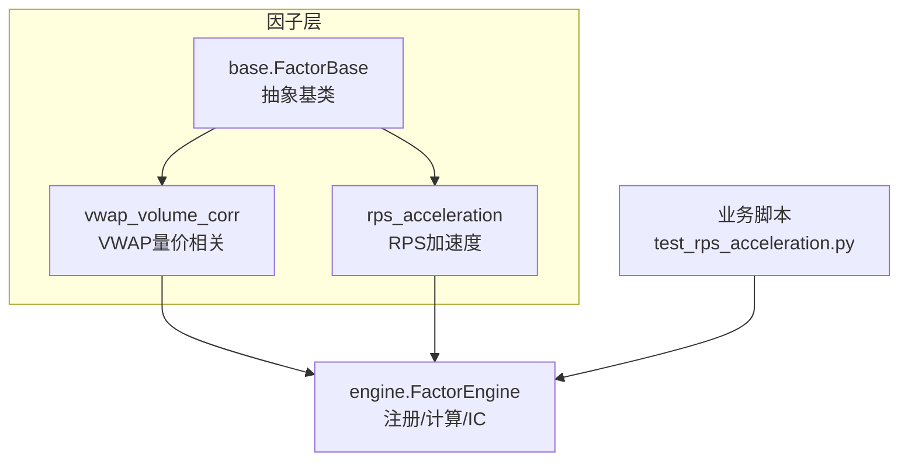
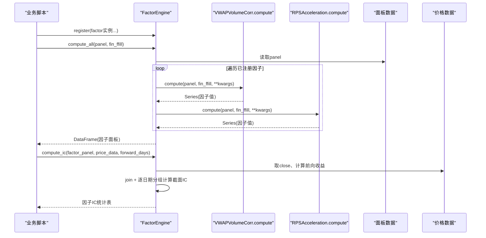
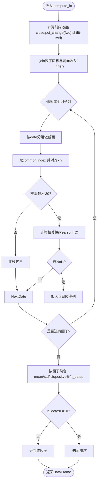
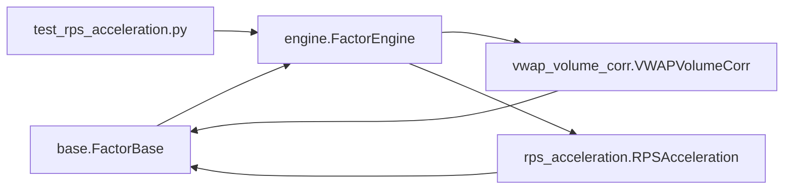

# FactorEngine引擎系统

<cite>
**本文引用的文件**
- [factors/engine.py](file://factors/engine.py)
- [factors/base.py](file://factors/base.py)
- [factors/vwap_volume_corr.py](file://factors/vwap_volume_corr.py)
- [factors/rps_acceleration.py](file://factors/rps_acceleration.py)
- [projects/Project_12_RPS主升浪/research/test_rps_acceleration.py](file://projects/Project_12_RPS主升浪/research/test_rps_acceleration.py)
</cite>

## 目录
1. [简介](#简介)
2. [项目结构](#项目结构)
3. [核心组件](#核心组件)
4. [架构总览](#架构总览)
5. [详细组件分析](#详细组件分析)
6. [依赖关系分析](#依赖关系分析)
7. [性能与优化](#性能与优化)
8. [故障排查指南](#故障排查指南)
9. [结论](#结论)
10. [附录：工作流与示例](#附录工作流与示例)

## 简介
FactorEngine是QuantLab量化研究体系中的“因子计算与评估”中枢，承担三件核心任务：
- 因子注册：通过register方法把实现类实例登记到引擎，支持链式调用。
- 批量计算：compute_all统一对面板数据进行因子计算，返回以（日期×标的）为索引的因子面板。
- IC评估：compute_ic基于前向收益和截面相关性评估因子的稳定性、信息比率与胜率。

本文件从工程与统计双视角展开，既解释数据结构与算法，也给出可落地的优化与排错建议。

## 项目结构
因子子模块位于 factors/ 目录下，采用“基类+引擎+因子实现”的分层组织：
- base.py：定义通用基类 FactorBase，提供标准接口与常用预处理（截尾、标准化、百分位排名）。
- engine.py：因子引擎 FactorEngine，负责注册、批量计算与IC评估。
- vwap_volume_corr.py、rps_acceleration.py：示例因子实现，展示如何继承基类、面向多股票面板计算、输出MultiIndex时序。
- 使用示例：projects/... 下脚本演示如何构造因子、注册并调用engine进行计算。

图示来源
- [factors/engine.py:1-86](file://factors/engine.py#L1-L86)
- [factors/base.py:1-52](file://factors/base.py#L1-L52)
- [factors/vwap_volume_corr.py:1-68](file://factors/vwap_volume_corr.py#L1-L68)
- [factors/rps_acceleration.py:1-76](file://factors/rps_acceleration.py#L1-L76)
- [projects/Project_12_RPS主升浪/research/test_rps_acceleration.py:116-123](file://projects/Project_12_RPS主升浪/research/test_rps_acceleration.py#L116-L123)

章节来源
- [factors/engine.py:1-86](file://factors/engine.py#L1-L86)
- [factors/base.py:1-52](file://factors/base.py#L1-L52)

## 核心组件
- FactorBase：抽象基类，强制实现compute(panel, fin_ffill, **kwargs)，并提供winsorize/zscore/rank_normalize等静态工具。
- FactorEngine：实现register、compute_all、compute_ic、list_factors；内部维护factor字典，按名称索引实例。
- 具体因子：如VWAPVolumeCorr、RPSAcceleration，均继承自FactorBase，在compute中对多股票面板执行向量化计算并返回Series。

章节来源
- [factors/base.py:9-52](file://factors/base.py#L9-L52)
- [factors/engine.py:9-86](file://factors/engine.py#L9-L86)
- [factors/vwap_volume_corr.py:18-67](file://factors/vwap_volume_corr.py#L18-L67)
- [factors/rps_acceleration.py:26-75](file://factors/rps_acceleration.py#L26-L75)

## 架构总览
下图展示了用户脚本如何通过FactorEngine注册因子、批量计算，并以compute_ic进行质量评估的关键流程。

图示来源
- [factors/engine.py:15-81](file://factors/engine.py#L15-L81)
- [factors/vwap_volume_corr.py:28-67](file://factors/vwap_volume_corr.py#L28-L67)
- [factors/rps_acceleration.py:44-75](file://factors/rps_acceleration.py#L44-L75)

章节来源
- [projects/Project_12_RPS主升浪/research/test_rps_acceleration.py:116-123](file://projects/Project_12_RPS主升浪/research/test_rps_acceleration.py#L116-L123)
- [factors/engine.py:20-81](file://factors/engine.py#L20-L81)

## 详细组件分析

### FactorBase：基类与预处理工具
- 抽象方法compute约定统一的输入签名：面板数据和财务填充表，允许扩展参数。**kwargs**为因子按需透传。
- 静态方法提供因子预处理：
  - winsorize：上下分位数裁剪，抑制极端值。
  - zscore：标准化为零均值单位方差，便于跨因子合成或模型输入。
  - rank_normalize：将因子值转换为[0,1]百分位排名，消除尺度差异，提升稳定性。

章节来源
- [factors/base.py:9-52](file://factors/base.py#L9-L52)

### FactorEngine：注册、批量计算与IC评估

- 注册机制与链式调用
  - register返回self，支持像流式API一样连续注册多个因子，提高装配效率。
  - 内部字典以因子name为键存储实例，避免重复且保证O(1)查找。

- compute_all：面板计算与异常处理
  - 依次遍历已注册的因子实例，调用其compute并累加结果列。
  - 异常隔离：单个因子抛错仅记录日志并跳过该列，不中断整体批处理；最终返回DataFrame可能缺少某些列，调用方应做缺失检查。
  - 返回结构：MultiIndex(date, code) × factor_name，适配pandas多因子面板操作。

- compute_ic：IC评估与质量控制
  - 前向收益：对close序列按forward_days做pct_change，再shift(-forward_days)得到“T日计算，未来H日收益”，对齐横截面可比性。
  - 合并策略：inner join保留两者同时有值的样本点，避免外推导致的空集问题。
  - 截面IC计算：
    - 按日期groupby，分别提取当日因子值与前向收益，去重交集对齐样本。
    - 若样本不足30，则跳过当天（降低噪声期影响）。
    - 使用相关系数函数计算Pearson IC；若结果为NaN则丢弃该日。
  - 质量过滤：要求有效日数≥10才纳入统计，减少短序列偏误。
  - 指标：
    - ic_mean：每日IC的平均值，反映方向一致性强度。
    - ic_std：每日IC的标准差，刻画波动稳定性。
    - icir：ic_mean/ic_std，稳定性的综合衡量（越高越好），分母为0时置0。
    - ic_positive_pct：IC为正的比例，表征方向稳定度。
    - n_dates：有效计算天数。
  - 排序：按icir降序输出，便于快速筛选稳定因子。

图示来源
- [factors/engine.py:34-81](file://factors/engine.py#L34-L81)

章节来源
- [factors/engine.py:12-86](file://factors/engine.py#L12-L86)

### 典型因子实现：VWAP量价相关
- 原理：以成交量加权平均价（VWAP）与成交量的秩（截面rank）在滚动窗口内求Spearman相关（通过对秩序列用滚动相关实现），取负后再做截面排名，得到因子值。
- 实现要点：
  - 从面板中提取vol与amount，计算VWAP，unstack为宽表以便向量化时间序列运算。
  - 每日截面rank后，用rolling(window=5).corr进行滚动相关，fillna填补冷启动缺失。
  - 取负后进行截面排名，stack回多维索引形成因子面板列。
- 适用场景：捕捉量价背离/资金博弈信号，适合作为短期动量/反转的辅助信号。

章节来源
- [factors/vwap_volume_corr.py:18-67](file://factors/vwap_volume_corr.py#L18-L67)

### 典型因子实现：RPS加速度
- 原理：计算过去N日涨幅的截面百分位（RPS），再比较当前RPS与M日前RPS的差分，正值表示相对走强。
- 实现要点：
  - close.unstack成宽表，计算区间收益率，rank(axis=1, pct=True)得到全市场百分位。
  - 对RPS序列做M日差分即得加速度，fillna填充前端缺失。
  - 压缩回MultiIndex得到因子面板。
- 注意：根据仓库中独立验证备注，该因子在A股全市场缺乏稳健预测力，适合研究方法与接口示范。

章节来源
- [factors/rps_acceleration.py:26-75](file://factors/rps_acceleration.py#L26-L75)

## 依赖关系分析
- 耦合关系
  - engine.py依赖base.py的FactorBase约定接口；具体因子依赖base的工具函数以提升数据处理效率。
  - 具体因子只依赖pandas/numpy，无外部IO，保持纯函数风格，便于测试与复用。
  - 业务脚本依赖engine暴露的public API，解耦策略逻辑与因子实现。
- 潜在环路与风险
  - 当前无循环导入；engine仅被其他脚本引入，不会反向依赖具体因子。
  - 单因子异常被捕获不中断，可能导致返回DF缺列，调用方需健壮性检查。

图示来源
- [factors/engine.py:9-20](file://factors/engine.py#L9-L20)
- [factors/base.py:9-52](file://factors/base.py#L9-L52)
- [factors/vwap_volume_corr.py:18-67](file://factors/vwap_volume_corr.py#L18-L67)
- [factors/rps_acceleration.py:26-75](file://factors/rps_acceleration.py#L26-L75)
- [projects/Project_12_RPS主升浪/research/test_rps_acceleration.py:116-123](file://projects/Project_12_RPS主升浪/research/test_rps_acceleration.py#L116-L123)

章节来源
- [factors/engine.py:9-86](file://factors/engine.py#L9-L86)

## 性能与优化
- 面板向量化优先
  - 将MultiIndex unstack为宽表（date×code），利用pandas/NumPy广播与rolling提升性能。
  - 避免在for code逐票Python级循环，改用轴上操作。
- 减少中间对象分配
  - 尽量就地赋值或链式表达式，减少不必要的copy。
- IC阶段优化
  - compute_ic中daily IC计算本质是O(T×N^2)，N为每日股票数。可在大规模市场池考虑：
    - 采样或分层：只在流动性/市值达标子池计算IC。
    - 增量/缓存：跨天只更新新增/变动行。
- 并发与批处理
  - 如果未来因子库扩展，compute_all可按因子维度并行（例如进程/线程池），但需注意GIL与内存峰值。

[本节为通用优化建议，未直接分析特定代码片段]

## 故障排查指南
- 常见报错定位
  - panel缺列：如vwap_volume_corr抛出“缺少vol或amount”。确保面板包含必要字段。
  - close缺列：rps_acceleration要求close存在。
  - 因子列缺失：compute_all中个别因子异常会被跳过，结果DF可能缺列；建议对返回df.columns进行检查。
- 统计无效原因
  - sample过少：单日共同样本<30则跳过该日，最终可能<10个日次而弃用该因子。
  - NaN扩散：前向收益或因子出现大面积缺失，需要核对数据对齐与复权口径。
- 调试建议
  - 逐步打印：在compute中打印形状与样本量；在compute_ic中观察每日common长度。
  - 数据对齐：确认因子与价格数据的时间索引一致（含停牌/退市处理）。
- 异常兜底策略
  - 对外部计算封装try-except；对阈值（样本/方差/相关性）做guard条件。
  - 返回时补全缺失列、填充合理默认值，保障下游稳健运行。

章节来源
- [factors/engine.py:27-32](file://factors/engine.py#L27-L32)
- [factors/vwap_volume_corr.py:37-43](file://factors/vwap_volume_corr.py#L37-L43)
- [factors/rps_acceleration.py:53-58](file://factors/rps_acceleration.py#L53-L58)
- [factors/engine.py:58-79](file://factors/engine.py#L58-L79)

## 结论
FactorEngine通过简明的注册—计算—评估闭环，提供了可插拔的多因子研究与评估框架。其设计亮点包括：
- 链式注册与字典驱动的执行路径，清晰易扩展。
- 批计算时对单个因子异常隔离，提升鲁棒性。
- IC评估内置样本质量门槛与多指标汇总，便于快速判别因子稳健性。
实践建议：严格遵循Panel→宽表→向量化计算的范式；在IC阶段重视样本门槛与前后向收益的对齐；结合base提供的预处理工具，保证因子质量与可比性。

[本节为总结性内容，不引用具体代码]

## 附录：工作流与示例

### 端到端工作流
- 准备面板：构造包含OHLCV等列的MultiIndex DataFrame（date, code）。
- 构建因子：实现compute方法，返回与panel索引对齐的Series。
- 注册并批量计算：engine.register(...) → engine.compute_all(panel, fin_ffill)。
- IC评估：engine.compute_ic(factor_panel, price_data, forward_days)。

示例参考：
- 在项目脚本中创建FactorEngine实例、注册因子并调用compute_all的用法，见下方引用。

章节来源
- [projects/Project_12_RPS主升浪/research/test_rps_acceleration.py:116-123](file://projects/Project_12_RPS主升浪/research/test_rps_acceleration.py#L116-L123)
- [factors/engine.py:15-32](file://factors/engine.py#L15-L32)

### IC关键参数的业务含义
- forward_days：决定收益前瞻窗口，过大易平滑信号，过小噪声高。通常20交易日与月频调仓匹配良好。
- 样本门槛（>=30/10）：兼顾统计显著性与可用性，避免在交易清淡或极端行情期的伪信号。
- icir：信息比率，衡量单位波动下的超额信息含量，是首选排序依据。
- ic_positive_pct：方向稳定性指标，>55%通常认为具有一致性优势。

章节来源
- [factors/engine.py:34-81](file://factors/engine.py#L34-L81)