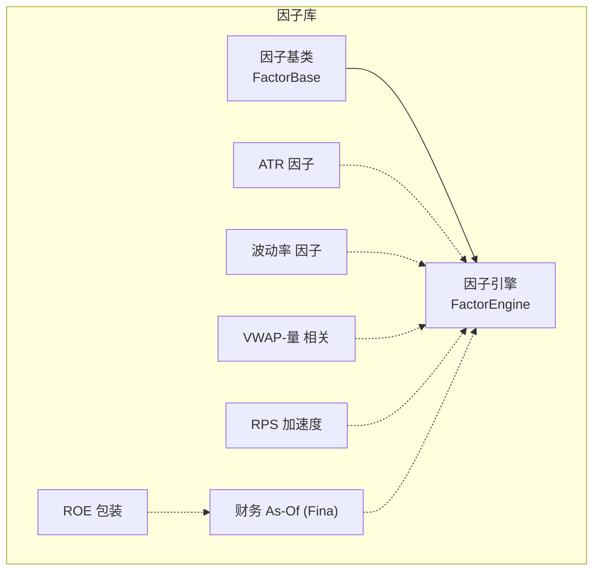
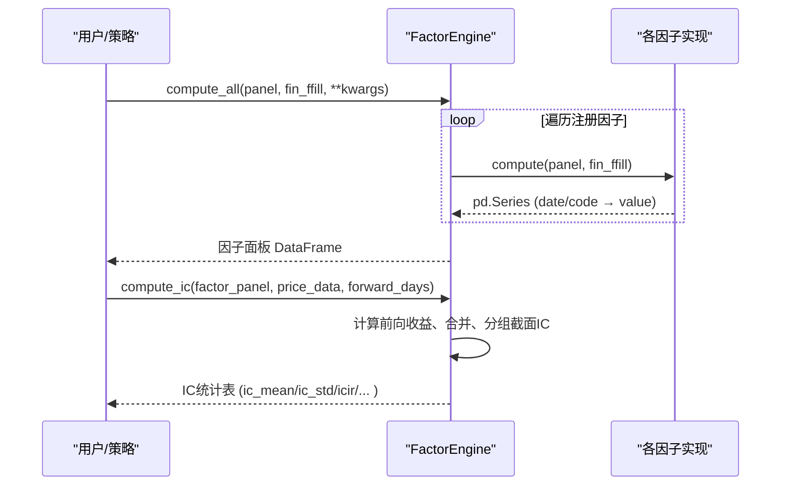
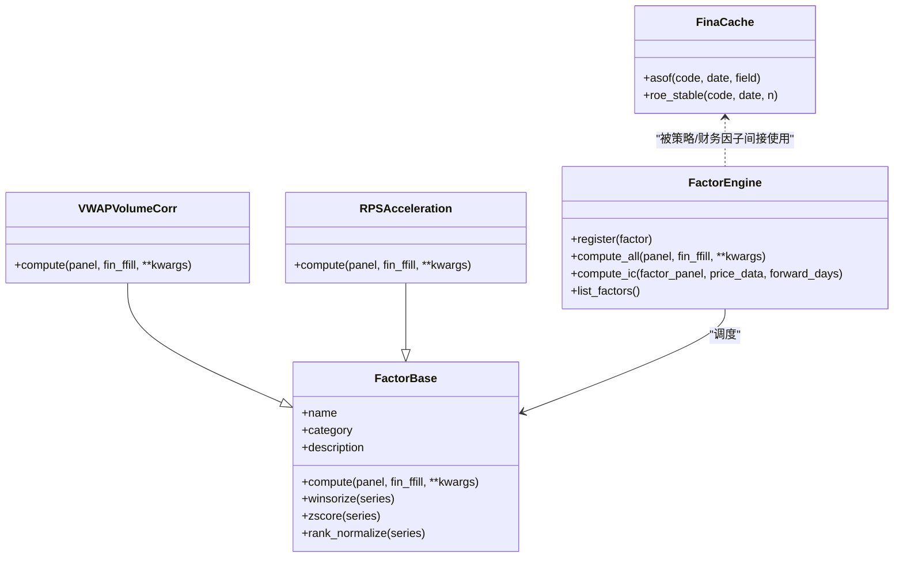

# 内置因子库详解

<cite>
**本文引用的文件 **
- [factors/base.py](file://factors/base.py)
- [factors/engine.py](file://factors/engine.py)
- [factors/atr.py](file://factors/atr.py)
- [factors/volatility.py](file://factors/volatility.py)
- [factors/vwap_volume_corr.py](file://factors/vwap_volume_corr.py)
- [factors/rps_acceleration.py](file://factors/rps_acceleration.py)
- [factors/fina.py](file://factors/fina.py)
- [factors/roe.py](file://factors/roe.py)
</cite>

## 目录
1. [简介](#简介)
2. [项目结构与分层](#项目结构与分层)
3. [核心组件总览](#核心组件总览)
4. [架构与数据流](#架构与数据流)
5. [因子详解（逐类展开）](#因子详解逐类展开)
6. [依赖关系分析](#依赖关系分析)
7. [性能与工程要点](#性能与工程要点)
8. [故障排查与常见坑](#故障排查与常见坑)
9. [结论与建议](#结论与建议)
10. [附录：参数配置与使用示例](#附录参数配置与使用示例)

## 简介
本文件对 QuantLab 内置因子库进行系统化的实现级说明，覆盖以下维度：
- 每个因子的算法逻辑、量化原理、输入输出、参数与适用场景
- 因子分类体系：技术指标（ATR）、波动率风险（年化波动）、量价相关（VWAP-Vol Spearman 相关）、动量（RPS加速度）、财务与质量（ROE、Fina As-Of）
- 因子注册、批量计算与IC评估的工作流
- 组合使用的权重配置方法与历史表现观测建议
- 典型用法入口、参数调优建议及注意事项

## 项目结构与分层
- factors/base.py：提供因子基类 FactorBase 与通用预处理（截尾、标准化、排序归一）
- factors/engine.py：FactorEngine 负责因子注册、批量计算与IC统计（截面IC、ICIR）
- factors/*：各具体因子实现（函数式或继承基类的类）
  - ATR：基于真实波幅的波动代理
  - 波动率：基于收益率序列的标准差×年化
  - VWAP-成交量相关：GTJA191风格的 rank(VWAP) 与 rank(vol) 的滚动 Spearman 相关取负再排名
  - RPS加速度：RPS截面百分位的短期变化
  - Fina/Roe：按时间点读取财务指标（PIT安全），ROE稳定度判断等

图示来源
- [factors/base.py:9-51](file://factors/base.py#L9-L51)
- [factors/engine.py:9-85](file://factors/engine.py#L9-L85)
- [factors/atr.py:20-43](file://factors/atr.py#L20-L43)
- [factors/volatility.py:6-27](file://factors/volatility.py#L6-L27)
- [factors/vwap_volume_corr.py:18-67](file://factors/vwap_volume_corr.py#L18-L67)
- [factors/rps_acceleration.py:26-75](file://factors/rps_acceleration.py#L26-L75)
- [factors/fina.py:23-79](file://factors/fina.py#L23-L79)
- [factors/roe.py:11-13](file://factors/roe.py#L11-L13)

小节来源
- [factors/base.py:1-51](file://factors/base.py#L1-L51)
- [factors/engine.py:1-85](file://factors/engine.py#L1-L85)

## 核心组件总览
- FactorBase：抽象基类，定义 compute(panel, fin_ffill, ...)；提供 winsorize/zscore/rank_normalize 工具方法
- FactorEngine：注册器 + 统一计算接口 compute_all(...)；提供 compute_ic(...) 计算每日截面IC并汇总均值、标准差、ICIR、胜率、样本天数
- 各因子模块：以函数式或类的方式，接收 MultiIndex DataFrame（含 date/ts_code 或 trade_date/ts_code 与 close/open/high/low/vol/amount）返回 Series/DataFrame

小节来源
- [factors/base.py:9-51](file://factors/base.py#L9-L51)
- [factors/engine.py:9-85](file://factors/engine.py#L9-L85)

## 架构与数据流
典型的因子构建与评估流程：
- 策略或研究脚本调用 FactorEngine.compute_all(panel, fin_ffill, ...), 传入行情面板与（可选）财务填充表
- Engine 逐个已注册因子执行 compute(...)，异常日志记录
- 得到因子面板（date/code × factor_name）后可调用 compute_ic(...)，根据收盘价前向收益进行截面IC统计

图示来源
- [factors/engine.py:20-81](file://factors/engine.py#L20-L81)

## 因子详解（逐类展开）

### 类别与定位
- 技术指标：ATR（真实波动幅度，波动代理）
- 波动率风险：年化波动率（从连续收益率计算）
- 量价相关：VWAP-成交量相关性（GTJA191风格）
- 动量信号：RPS加速度（截面百分位变化）
- 财务/质量：Fina（As-Of 财务字段点态加载）、ROE（作为质量/盈利能力指标）

小节来源
- [factors/engine.py:20-81](file://factors/engine.py#L20-L81)

### ATR 波动率因子
- 原理：以真实波幅 TR = max(high-low, |high-prevClose|, |low-prevClose|)，采用Wilder平滑（等价于指数加权平均 alpha=1/n）得到ATR。ATR_pct = ATR / close 用作低波筛选的核心代理。
- 输入：当日窗口内的 OHLC（close, high, low）
- 输出：标量（最近值）或 pct（比例化）
- 关键参数：n（平滑窗口，默认14）
- 适用场景：波动过滤、风控仓位、选股中的“低波”筛选
- 复杂度：O(n) 时间、O(n) 空间（滚动）
- 注意：缺失前导N天会产生NaN，需要回测warm-up期

小节来源
- [factors/atr.py:10-43](file://factors/atr.py#L10-L43)

### 波动率因子（年化波动）
- 原理：基于收益率序列标准差乘以 sqrt(252) 得到年化波动率，用于风险度量或目标波动率 sizing
- 输入：close 序列（至少数日收益率）
- 输出：年化波动（%）
- 关键参数：n（回看窗口，默认60）
- 适用场景：vol-targeting、风险控制、动态仓位
- 复杂度：O(n)，空间 O(n)

小节来源
- [factors/volatility.py:6-27](file://factors/volatility.py#L6-L27)

### VWAP-成交量相关因子（GTJA191）
- 原理：VWAP = amount/(volume*100)。计算 daily 截面 rank(VWAP) 与 rank(volume) 的5日滚动 Spearman 相关（即对相关秩做时序回归），取负后再做截面 rank，越大表示近期“价格上涨伴随缩量/价格相对强势且无放量跟随”的信号更强（经验方向）。
- 输入：vol, amount（必需列）
- 输出：因子面（截面 rank）
- 关键参数：滚动窗口=5；min_periods=5
- 适用场景：反转/量价背离辅助信号；常作为中性化的技术因子
- 复杂度：宽表 rolling 相关，时间上 O(T·C)，C为股票数；内存占用随宽表大小上升
- 注意：停牌 volume=0 需排除或加保护

小节来源
- [factors/vwap_volume_corr.py:18-67](file://factors/vwap_volume_corr.py#L18-L67)

### RPS 加速度因子（动量/趋势）
- 原理：先计算N日涨幅的截面百分位（RPS），再求 M 日前的RPS与当前RPS的差值（加速度）。正值表示“强度正在增强”
- 输入：close（必需列）
- 输出：Series（date/code → 加速度百分位）
- 关键参数：window（RPS回看期，默认20），accel_window（加速度回看，默认5）
- 适用场景：动量加速信号；在牛市中可能有效，在震荡/熊市中需谨慎
- 备注：代码内含注释说明经独立验证该因子在A股全市场并不稳健，可作为方法参考但需谨慎使用
- 复杂度：O(T·C)，截面排名线性

小节来源
- [factors/rps_acceleration.py:26-75](file://factors/rps_acceleration.py#L26-L75)

### Fina 财务因子（Point-in-Time 安全）
- 原理：按报告期 end_date（去“-”后比较）在给定日期 date 之前选取“最新可报告”的值（as-of），避免未来函数。支持 roe/fcff/fcfe/ocfps 字段读取，以及 ROE 稳定性判断（近n个财报期为正）
- 输入：code, date, field（字符串）
- 输出：数值或 None（缺失时）
- 关键参数：parquet_path（默认固定路径）、n（稳定度窗口，默认8季）
- 适用场景：基本面筛选（盈利能力/现金流/每股收益）
- 复杂度：二进制搜索 O(log Q)，Q为某公司股票报表季度数；进程内按代码分片缓存

小节来源
- [factors/fina.py:23-79](file://factors/fina.py#L23-L79)

### ROE 质量因子（封装）
- 原理：薄封装，调用 Fina 的 as-of 读取器获取 ROE（百分比）；保留历史兼容
- 输入：code, date
- 输出：浮点数（ROE）或 None
- 适用场景：质量/盈利因子；可结合其他指标（如稳定度 is_roe_stable）
- 注意：与 Fina 共用同一缓存，避免重复读取大文件

小节来源
- [factors/roe.py:11-13](file://factors/roe.py#L11-L13)
- [factors/fina.py:65-79](file://factors/fina.py#L65-L79)

### 通用预处理（winsorize/zscore/rank）
- 截尾：winsorize 默认上下1%
- 标准化：z-score 将序列均值为0、方差为1（若std=0则全部置NaN）
- 排名归一：rank(pct=True) 映射到[0,1]区间
- 使用方式：在因子内部或外部流水线中按需应用，控制方向与尺度

小节来源
- [factors/base.py:17-51](file://factors/base.py#L17-L51)

## 依赖关系分析
- FactorBase 为所有继承型因子的共同基础，提供公共工具
- FactorEngine 作为调度层聚合多个因子（既可用类也可用函数式）
- RPS/VWAP 直接依赖 base 基类；ATR、波动率、ROE 通过函数接口被策略直接调用
- Fina 与 Roe：Roe 复用 Fina 的 as-of 缓存；财务读取强依赖指定 parquet 路径

图示来源
- [factors/base.py:9-51](file://factors/base.py#L9-L51)
- [factors/engine.py:9-85](file://factors/engine.py#L9-L85)
- [factors/vwap_volume_corr.py:18-67](file://factors/vwap_volume_corr.py#L18-L67)
- [factors/rps_acceleration.py:26-75](file://factors/rps_acceleration.py#L26-L75)
- [factors/fina.py:23-79](file://factors/fina.py#L23-L79)

小节来源
- [factors/base.py:9-51](file://factors/base.py#L9-L51)
- [factors/engine.py:9-85](file://factors/engine.py#L9-L85)

## 性能与工程要点
- 批量计算优先使用 FactorEngine.compute_all，减少Python层面循环开销；异常会打印提示但不中断整体
- 宽表运算（VWAP/Spearman、RPS）在股票数量较多时显存敏感，建议：
  - 控制因子计算批次或使用 subsample/行业切片
  - 提前剔除停牌/ST/上市不足期
  - 保证 panel 索引规范（date/ts_code 或 trade_date/ts_code）
- 财务 as-of 缓存为进程内单例，首建较大，后续读取快速；多进程时需考虑各自进程内重建
- IC 评估使用前向收益并限制最小样本（≥30只），结果才纳入统计

小节来源
- [factors/engine.py:20-81](file://factors/engine.py#L20-L81)
- [factors/fina.py:23-49](file://factors/fina.py#L23-L49)

## 故障排查与常见坑
- 缺少必要列：vwap_volume_corr 需要 vol/amount；rps_acceleration 需要 close
- 前导缺失：滚动相关/EMA/滞后需 warm-up 期，否则出现 NaN；可在 pipeline 中填充0或延迟处理
- 财务日期口径：必须使用 end_date 做 as-of 比较，不能直接用公告/发布日导致前视偏差
- 单位与除零：VWAP 计算中对 volume×100 加极小量防止除零；ATR_pct 在 close≤0 时返回0
- 因子方向：不同因子的“高值含义”不同（如 RPS加速度越高=越强；VWAP相关因子取负后的排名方向），在组合时必须正确对齐因子方向
- 样本外不稳定：RPS在A股全市场可能不稳健，应结合市场环境与组合权重做鲁棒性检验

小节来源
- [factors/vwap_volume_corr.py:38-43](file://factors/vwap_volume_corr.py#L38-L43)
- [factors/rps_acceleration.py:53-55](file://factors/rps_acceleration.py#L53-L55)
- [factors/atr.py:36-42](file://factors/atr.py#L36-L42)
- [factors/fina.py:27-48](file://factors/fina.py#L27-L48)

## 结论与建议
- ATR/波动率属于经典风险度量与波动代理，广泛可用于风控与选股
- VWAP-量相关因子具明确的量价背离含义，适合作为中性化技术因子
- RPS加速度在特定市场环境（牛市/结构性行情）可能有超额，但在A股全市场需审慎
- 财务类因子应以 as-of 安全读取为核心，强调质量/稳定性而非单一时点噪声
- 建议在工程中统一使用 FactorEngine 进行管理，并用 compute_ic 持续监控因子的有效性（IC均值、ICIR、胜率、样本天数）

## 附录：参数配置与使用示例

### 常用参数速览
- ATR：n=14（默认），ATR_pct 比例化
- 波动率：n=60（年化），最低有效长度需足够
- VWAP-量相关：滚动窗口=5；确保有 vol/amount
- RPS加速度：window=20，accel_window=5
- Fina：按 code+date+field 读取；roe_stable(n=8 季)

### 典型用法
- 批量因子计算：实例化 FactorEngine，调用 compute_all(panel, fin_ffill)，得到因子面板
- IC评估：compute_ic(factor_panel, price_data[['close']], forward_days=20) 生成IC统计
- 单日/逐标的计算：可直接调用各模块的单日函数（如 rps_acceleration_latest、compute_single）

### 组合权重配置方法（面向研究与回测）
- 权重确定思路
  - 基于IC稳定性：选择IC均值高、ICIR高、阳性概率高的因子赋予更高权重
  - 相关性约束：避免权重集中于高度相关的同族因子（例如RPS与其他动量因子）
  - 经济含义/风险预算：对波动与回撤敏感度不同的因子采用风险平价思路分配权重
- 配置形式（建议在策略或研究配置表中声明）
  - 因子名→权重列表；或
  - 因子组→风险贡献→目标权重
  - 建议每半仓或季度重校准一次权重，并在样本外回测验证
- 历史表现观测
  - 用 compute_ic 评估每期权重组合的截面预测力（IC/ICIR）
  - 用历史净值曲线观察最大回撤与换手；对过拟合特征（过度优化权重）进行惩罚

小节来源
- [factors/engine.py:34-81](file://factors/engine.py#L34-L81)
- [factors/rps_acceleration.py:123-157](file://factors/rps_acceleration.py#L123-L157)
- [factors/vwap_volume_corr.py:73-115](file://factors/vwap_volume_corr.py#L73-L115)