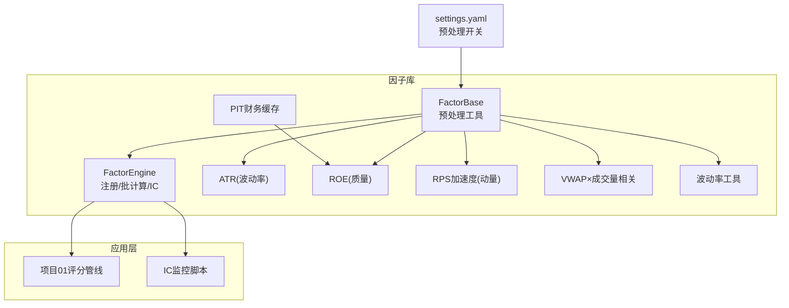
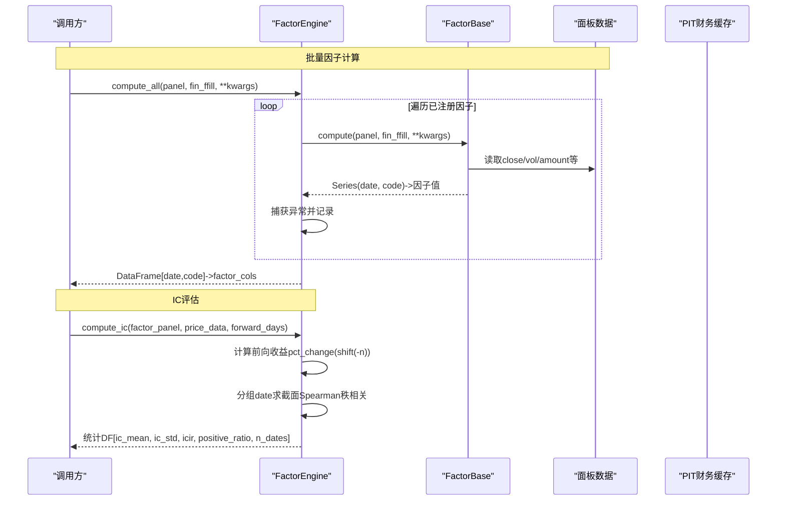
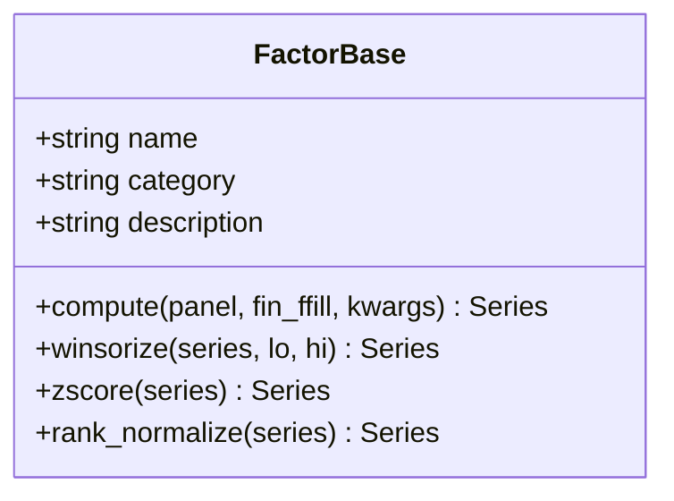
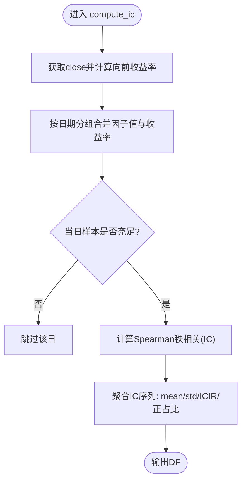
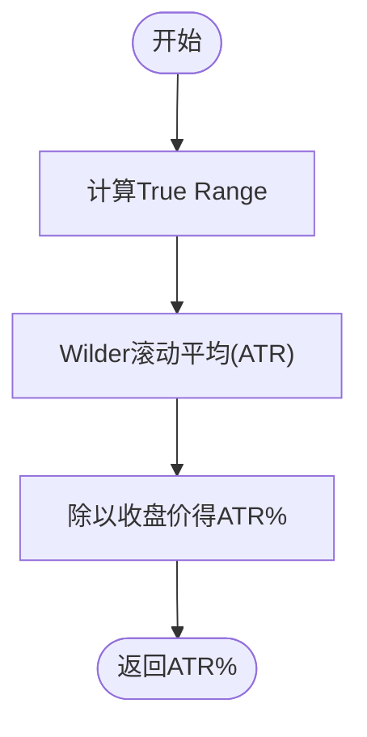
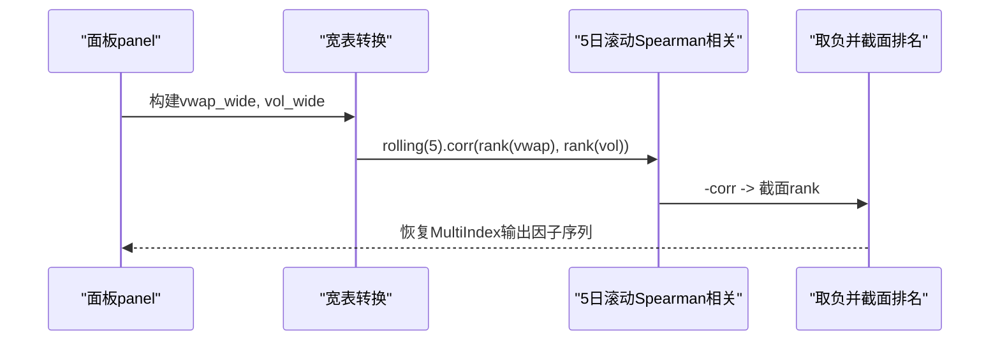
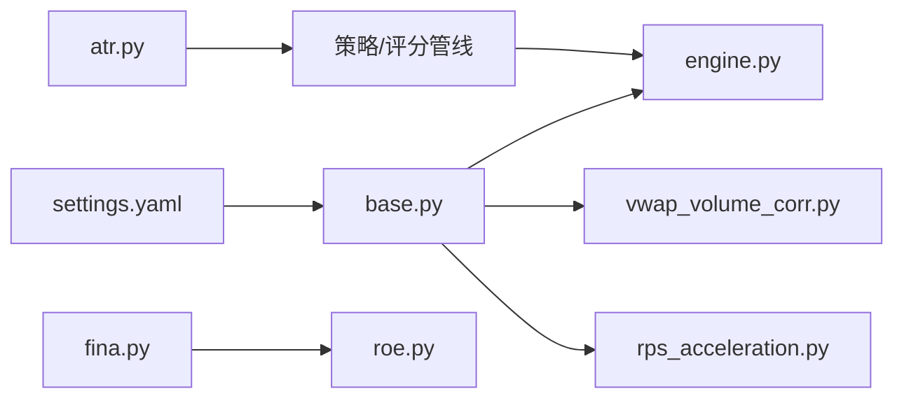
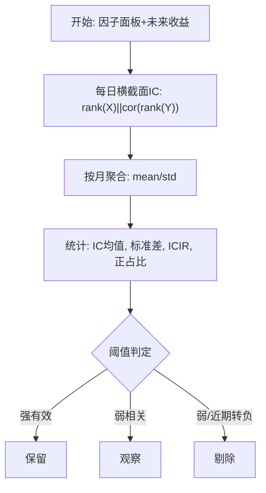

# 因子框架设计

<cite>
**本文引用的文件列表**
- [factors/base.py](file://factors/base.py)
- [factors/engine.py](file://factors/engine.py)
- [factors/vwap_volume_corr.py](file://factors/vwap_volume_corr.py)
- [factors/rps_acceleration.py](file://factors/rps_acceleration.py)
- [factors/atr.py](file://factors/atr.py)
- [factors/fina.py](file://factors/fina.py)
- [factors/roe.py](file://factors/roe.py)
- [factors/volatility.py](file://factors/volatility.py)
- [config/settings.yaml](file://config/settings.yaml)
- [factors/__init__.py](file://factors/__init__.py)
- [projects/Project_01_多因子IC小盘Alpha/research/multi_factor_ic/ic_test.py](file://projects/Project_01_多因子IC小盘Alpha/research/multi_factor_ic/ic_test.py)
- [projects/Project_16_LightGBM股票大师/factor_ic_monitor.py](file://projects/Project_16_LightGBM股票大师/factor_ic_monitor.py)
</cite>

## 目录
1. [引言](#引言)
2. [项目结构](#项目结构)
3. [核心组件](#核心组件)
4. [架构总览](#架构总览)
5. [详细组件分析](#详细组件分析)
6. [依赖关系分析](#依赖关系分析)
7. [性能与工程特性](#性能与工程特性)
8. [IC评估体系与相关性方法](#ic评估体系与相关性方法)
9. [新因子开发指南](#新因子开发指南)
10. [故障排查与常见问题](#故障排查与常见问题)
11. [结论](#结论)

## 引言
本设计文档面向 QuantLab 的因子框架，系统性阐述 FactorBase 抽象基类的设计原则、compute 方法输入输出契约、标准预处理流程（winsorize→zscore→rank_normalize）及其数学含义；说明 FactorEngine 的注册与批量计算机制、因子分类与管理体系；深入解析已实现的核心因子：ATR波动率因子、ROE质量因子、RPS加速因子、VWAP量价相关因子的计算逻辑与应用场景；总结因子IC评估体系（Information Coefficient）、截面相关性与权重优化思路；最后提供可操作的新因子开发规范、测试验证方法与性能优化技巧，以及因子组合使用模式与最佳实践。

## 项目结构
QuantLab 将因子库独立为 factors 包，包含抽象基类、引擎、若干具体因子实现和财务数据加载器；全局配置通过 config/settings.yaml 管理因子预处理开关与默认中性化/标准化方法；策略与项目层引用这些因子进行评分和IC评测。

图示来源
- [factors/base.py:1-52](file://factors/base.py#L1-L52)
- [factors/engine.py:1-86](file://factors/engine.py#L1-L86)
- [factors/vwap_volume_corr.py:1-115](file://factors/vwap_volume_corr.py#L1-L115)
- [factors/rps_acceleration.py:1-157](file://factors/rps_acceleration.py#L1-L157)
- [factors/atr.py:1-43](file://factors/atr.py#L1-L43)
- [factors/fina.py:1-79](file://factors/fina.py#L1-L79)
- [factors/volatility.py:1-27](file://factors/volatility.py#L1-L27)
- [config/settings.yaml:1-69](file://config/settings.yaml#L1-L69)

章节来源
- [factors/__init__.py:1-8](file://factors/__init__.py#L1-L8)
- [config/settings.yaml:37-64](file://config/settings.yaml#L37-L64)

## 核心组件
本节聚焦以下构件：
- FactorBase：定义因子计算接口与通用预处理；统一 winsorize/z-score/rank_normalize 工具函数。
- FactorEngine：负责因子注册、批计算与IC统计。
- 财务缓存 f.fina：按代码+报告期的PIT财务数据访问。
- 已实现因子：ATR、ROE、RPS加速度、VWAP×成交量相关。
- 波动率工具：年化波动率等辅助。

章节来源
- [factors/base.py:9-52](file://factors/base.py#L9-L52)
- [factors/engine.py:9-86](file://factors/engine.py#L9-L86)
- [factors/fina.py:14-79](file://factors/fina.py#L14-L79)
- [factors/atr.py:10-43](file://factors/atr.py#L10-L43)
- [factors/roe.py:1-14](file://factors/roe.py#L1-L14)
- [factors/volatility.py:6-27](file://factors/volatility.py#L6-L27)

## 架构总览
FactorBase 提供面向面板的 compute 抽象，所有因子以同一契约接入 FactorEngine。Engine 维护 name->实例的注册表，compute_all 批量计算；compute_ic 自动构造前向收益并逐日计算Spearman秩相关（横截面 IC），汇总统计得到 IC均值、标准差、ICIR、正IC占比等指标。设置项在 settings.yaml 中定义中性化/标准化策略，供上层管线采用。

图示来源
- [factors/engine.py:20-81](file://factors/engine.py#L20-L81)
- [factors/base.py:17-52](file://factors/base.py#L17-L52)

## 详细组件分析

### FactorBase：抽象基类与预处理
- 设计原则
  - 统一接口：compute(panel, fin_ffill, **kwargs) 接收统一的面板与财务宽表，返回 MultiIndex(date, code) 的因子序列。
  - 零副作用：纯函数式计算，无外部状态或I/O。
  - 可扩展：通过继承与覆盖 compute，快速新增因子。
- 标准预处理（建议管线）
  - winsorize：按分位数截断极端值，抑制异常冲击。
  - zscore：去量纲、均值为0、方差为1，便于线性组合与对比。
  - rank_normalize：将因子映射到[0,1]区间，提升稳健性并减少分布偏态影响。
- 复杂度
  - 单次处理为 O(N)，N 为当日截面样本数；rank 也为 O(N log N)。
- 错误边界
  - 空序列时 winsorize 直接返回原序列；std=0 时 zscore 返回NaN，便于上游过滤。

图示来源
- [factors/base.py:9-52](file://factors/base.py#L9-L52)

章节来源
- [factors/base.py:1-52](file://factors/base.py#L1-L52)

### FactorEngine：注册与批计算
- 关键能力
  - register(factor)：以 name 为键注册因子实例。
  - compute_all(panel, fin_ffill, **kwargs)：对全部注册因子执行 compute，组装为 DataFrame；对失败记录日志但不中断。
  - compute_ic(factor_panel, price_data, forward_days)：构造未来收益率、按日期分组做横截面 Rank Correlation（Spearman），汇总IC统计。
  - list_factors()：查看已注册因子清单。
- 行为要点
  - 样本过少（如当日可用样本<30）会跳过当日IC计算，避免不稳定估计。
  - ICIR 可能为0（当标准差为0）。
- 扩展建议
  - 可将 IC 统计结果导出至 JSON/CSV，对接可视化看板。

图示来源
- [factors/engine.py:34-81](file://factors/engine.py#L34-L81)

章节来源
- [factors/engine.py:9-86](file://factors/engine.py#L9-L86)

### 已实现因子详解

#### ATR波动率因子
- 算法概述
  - true_range: max(high-low, |high-prev_close|, |low-prev_close|)。
  - atr: Wilder平滑（等价alpha=1/n的指数加权移动平均）。
  - atr_pct: atr/close，得到相对波动率。
- 应用场景
  - 波动率目标、仓位缩放、风险预算、低波选择器的代理变量。
- 复杂度
  - O(T)，T为窗口长度；向量化处理高效。

图示来源
- [factors/atr.py:10-43](file://factors/atr.py#L10-L43)

章节来源
- [factors/atr.py:1-43](file://factors/atr.py#L1-L43)

#### ROE质量因子
- 实现方式
  - 通过 factors/fina.get_fina_asof 按报告期回溯（PIT安全），取ROE作为质量代理；roe.py 暴露 get_roe_asof 兼容旧接口。
  - 支持 is_roe_stable(code, date, n) 判断近n期ROE全为正。
- 数据处理
  - 按代码分组并按 ed（报告结束期）排序，利用 searchsorted 定位截至日期的最近可用财报。
- 应用场景
  - 质量/盈利稳定性筛选、因子合成中的质量维度。
- 注意
  - 若字段为空或过期则回退为None，需在上游填充/过滤。

章节来源
- [factors/fina.py:14-79](file://factors/fina.py#L14-L79)
- [factors/roe.py:1-14](file://factors/roe.py#L1-L14)

#### RPS加速度因子
- 算法定义
  - RPS_N = 过去N日涨幅的截面百分位；加速度 = RPS_current − RPS_{current−M}。
  - 方向：加速度越大表示“走强”。
- 实现细节
  - 通过 panel["close"].unstack 转宽表，截面排名后乘100，再差分；warmup期不足用0补齐。
  - 单股/单日便捷函数用于策略层调用。
- 研究结论与用途
  - 注释标注：在A股全市场独立IC验证未通过（IC多为负），但保留了算法参考价值，适用于策略组合中的探索模块或特定阶段信号。

章节来源
- [factors/rps_acceleration.py:1-157](file://factors/rps_acceleration.py#L1-L157)

#### VWAP量价相关因子
- 算法定义
  - VWAP = amount/(volume×100)；每日截面rank(VWAP)与rank(volume)的5日滚动Spearman相关；取负后再做截面rank。
- 实现要点
  - 宽表计算、rolling.min_periods=5保证前4日可用0填充；缺失行情排除volume≤0或amount≤0样本。
  - 兼容单日计算版本，输出对齐目标交易日截面索引。
- 应用场景
  - 捕捉量价异动与价格路径不一致的微观结构信息，适合做流动性/情绪代理。

图示来源
- [factors/vwap_volume_corr.py:28-67](file://factors/vwap_volume_corr.py#L28-L67)
- [factors/vwap_volume_corr.py:73-115](file://factors/vwap_volume_corr.py#L73-L115)

章节来源
- [factors/vwap_volume_corr.py:1-115](file://factors/vwap_volume_corr.py#L1-L115)

### 因子组合与评分范式
- Project_01 评分管线演示了多因子合成范式：子因子经 winsorize → z-score → 方向控制（反号或正向），按固定权重加权和，得到0~100综合分。
- 权重示例：BP、反转、低波、ROE、VWAP量价相关等，体现风格均衡与分散度。
- 推荐实践：将权重视为可调超参，结合IC/ICIR历史表现与稳定性约束（如近期衰减惩罚）做定期评估与再平衡。

章节来源
- [projects/Project_01_多因子IC小盘Alpha/strategy/scoring.py:13-95](file://projects/Project_01_多因子IC小盘Alpha/strategy/scoring.py#L13-L95)
- [projects/Project_01_多因子IC小盘Alpha/strategy/scoring.py:98-150](file://projects/Project_01_多因子IC小盘Alpha/strategy/scoring.py#L98-L150)

## 依赖关系分析
- 模块内聚与耦合
  - base 独立且高内聚，被 engine 与所有具体因子依赖。
  - engine 依赖 base 约定及上游面板/价格数据。
  - vwap 与 rps 依赖 base 提供的名称/类目封装；atr/roe 为函数式因子，供策略或上层管线直接调用。
  - fina 通过过程级缓存减少重复IO，被 roe 复用。
- 外部依赖
  - pandas/numpy 进行向量运算；parquet 读入财务数据（fina）。
  - 配置文件 settings.yaml 管理因子预处理选项。

图示来源
- [factors/base.py:1-52](file://factors/base.py#L1-L52)
- [factors/engine.py:1-86](file://factors/engine.py#L1-L86)
- [factors/vwap_volume_corr.py:1-115](file://factors/vwap_volume_corr.py#L1-L115)
- [factors/rps_acceleration.py:1-157](file://factors/rps_acceleration.py#L1-L157)
- [factors/atr.py:1-43](file://factors/atr.py#L1-L43)
- [factors/fina.py:1-79](file://factors/fina.py#L1-L79)
- [factors/roe.py:1-14](file://factors/roe.py#L1-L14)
- [config/settings.yaml:37-64](file://config/settings.yaml#L37-L64)

章节来源
- [factors/__init__.py:1-8](file://factors/__init__.py#L1-L8)

## 性能与工程特性
- 向量化计算
  - 宽表 unstack + rolling/corr 充分利用pandas底层C实现，降低Python层循环。
  - 对于时间窗较小的因子（如5日），min_periods 控制冷启动期。
- 内存与I/O
  - 财务数据通过进程级缓存（by_code dict）减少重复parquet读取；按需列加载。
- 健壮性
  - 对停牌/极值/短窗口有边界保护（fillna、safe_mask、样本下限判断）。
- 可扩展性
  - 新增因子仅需继承 base.compute 并遵循契约即可接入 engine。
- 参数治理
  - 可通过 settings.yaml 统一控制预处理策略（winsorize/zscore/neutralize），配合不同因子类型选择适用方案。

章节来源
- [factors/fina.py:23-49](file://factors/fina.py#L23-L49)
- [factors/vwap_volume_corr.py:42-63](file://factors/vwap_volume_corr.py#L42-L63)
- [config/settings.yaml:37-64](file://config/settings.yaml#L37-L64)

## IC评估体系与相关性方法
- IC定义
  - 横截面 Spearman 秩相关：对每个交易日，因子值与未来收益率分别rank后进行相关系数计算。
- ICIR
  - IC序列均值/标准差，衡量信息比率。
- 月度健康监控
  - 逐日计算IC，月度聚合得到mean/std；基于阈值判有效/观察/失效；给出保留/剔除建议。
- 分组收益（Q分位法）
  - 按因子排名分为Q组，比较各组平均收益，验证单调性与超额分布。
- 典型参考
  - 工程中使用 two 套实现：engine.compute_ic 与 project-level IC 测试脚本（含分组收益、自定义spearman实现）互补验证。

图示来源
- [factors/engine.py:34-81](file://factors/engine.py#L34-L81)
- [projects/Project_16_LightGBM股票大师/factor_ic_monitor.py:35-166](file://projects/Project_16_LightGBM股票大师/factor_ic_monitor.py#L35-L166)
- [projects/Project_01_多因子IC小盘Alpha/research/multi_factor_ic/ic_test.py:18-75](file://projects/Project_01_多因子IC小盘Alpha/research/multi_factor_ic/ic_test.py#L18-L75)

章节来源
- [factors/engine.py:34-81](file://factors/engine.py#L34-L81)
- [projects/Project_16_LightGBM股票大师/factor_ic_monitor.py:1-174](file://projects/Project_16_LightGBM股票大师/factor_ic_monitor.py#L1-L174)
- [projects/Project_01_多因子IC小盘Alpha/research/multi_factor_ic/ic_test.py:1-120](file://projects/Project_01_多因子IC小盘Alpha/research/multi_factor_ic/ic_test.py#L1-L120)

## 新因子开发指南

### 开发与规范
- 继承 FactorBase 并在 compute(panel, fin_ffill, **kwargs) 中：
  - 校验必要列是否存在（如 close/vol/amount）。
  - 优先用宽表 + rolling/vectorized 计算，减少Python循环。
  - 返回 MultiIndex(date, code) 的 Series，缺失值合理填充NaN或0。
- 命名与类目
  - name 简洁明确，category 归类（如“量价”“技术”“基本面”），description 注明方向含义（越大越好/越小越好）。

### 预处理选择
- 推荐顺序：winsorize(1%,99%) → z-score → 方向控制（必要时取反）→ rank_normalize（可选）。
- 中性化/标准化由 settings.yaml 驱动，可在上层管线中按需开启。

### 测试与验证
- 单元测试
  - 针对单只个股时序正确性（例如ATR周期、平滑）。
  - 针对截面一致性（同日内 rank/相关性稳定）。
- IC回归验证
  - 使用 engine.compute_ic 或 project-level ic_test 计算长期IC与ICIR；观察近期是否衰减。
- 回测集成
  - 接入 Project_01 评分管线或策略管线，观察组合表现；关注换手/滑点后的净收益变化。

### 性能优化
- 向量化：尽量使用 pandas.Series/pandas.DataFrame 的内置方法（rank、rolling、corr、ewm）。
- I/O：财务数据借助 fina 的 by_code 缓存；避免重复读取 parquet。
- 内存：大面板先 filter 所需列，再用 unstack/stack 控制临时对象体积。

### 组合使用模式
- 线性加权：各子因子标准化后，按比例加权得分；权重可由历史ICIR或网格搜索优化。
- 非线性组合：机器学习模型（Tree/Linear/NN）在特征层融合，仍需严格的PIT与防过拟合。
- 动态择时：叠加大盘门控（趋势/波动环境）以过滤不利时期交易。

章节来源
- [factors/base.py:17-52](file://factors/base.py#L17-L52)
- [config/settings.yaml:37-64](file://config/settings.yaml#L37-L64)
- [projects/Project_01_多因子IC小盘Alpha/research/multi_factor_ic/ic_test.py:48-75](file://projects/Project_01_多因子IC小盘Alpha/research/multi_factor_ic/ic_test.py#L48-L75)

## 故障排查与常见问题
- 计算失败不中断：engine.compute_all 内部捕获异常并打印，不影响其他因子计算。
  - 建议：检查面板列名、缺失数据与窗口长度。
- IC样本不足：当日截面少于最小样本时会被跳过。
  - 建议：扩大池子或缩短前瞻窗口；检查停牌/退市导致的缺失。
- ROE不可用：PIT查询不到最近财报时会返回None。
  - 建议：在前端进行填充或过滤；可使用 is_roe_stable 做稳定性门槛。
- VWAP/Vol异常：volume=0 时需屏蔽；金额过小可能导致数值不稳定。
  - 建议：采用 safe_mask 排除；必要时对量价做winsorize。
- RPS方向问题：窗口/加速度窗口选择不当可能导致信号噪声过大。
  - 建议：参数敏感性分析与分段样本校验。

章节来源
- [factors/engine.py:27-32](file://factors/engine.py#L27-L32)
- [factors/fina.py:65-79](file://factors/fina.py#L65-L79)
- [factors/vwap_volume_corr.py:37-59](file://factors/vwap_volume_corr.py#L37-L59)
- [factors/rps_acceleration.py:56-75](file://factors/rps_acceleration.py#L56-L75)

## 结论
QuantLab 因子框架以 FactorBase/FactorEngine 为核心，提供统一的因子契约与批处理能力；标准化的预处理流程提升了因子之间的可组合性与稳定性；已实现的ATR、ROE、RPS加速度、VWAP量价相关因子覆盖了波动率、质量、动量和量价多个维度；配套的IC评估体系与月度健康监控帮助识别因子的衰减与失效，支撑持续的因子优化与权重调整。遵循本文的开发规范与实践建议，可以高效扩展因子库、稳健地组合因子，并将其无缝接入研究与实盘系统。