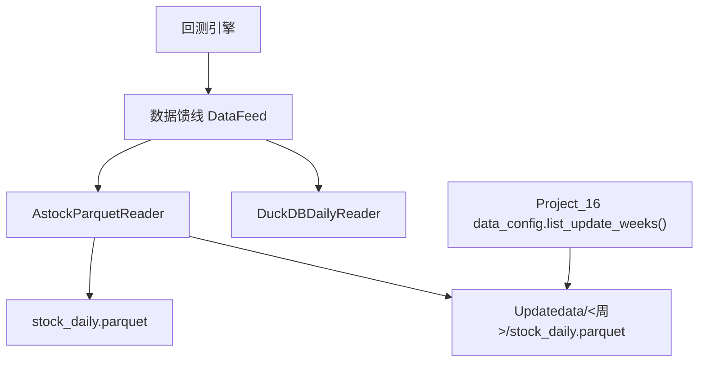
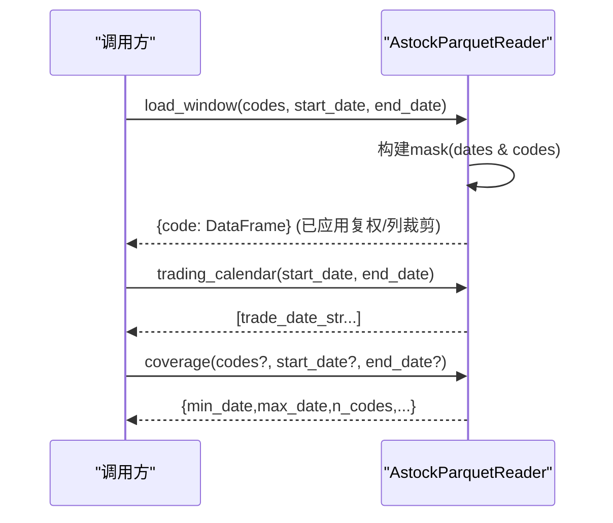
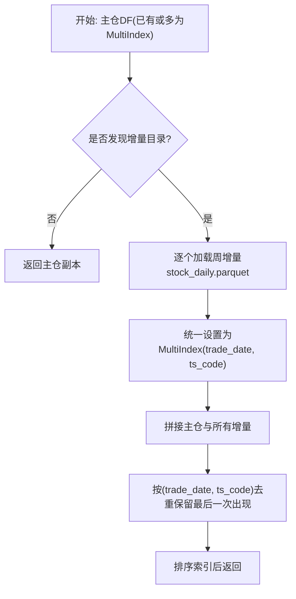

# Astock Parquet数据源实现

<cite>
**本文引用的文件**
- [data/astock_reader.py](file://data/astock_reader.py)
- [projects/Project_16_LightGBM股票大师/data_config.py](file://projects/Project_16_LightGBM股票大师/data_config.py)
- [data/feed.py](file://data/feed.py)
- [backtest/engine.py](file://backtest/engine.py)
- [backtest/report.py](file://backtest/report.py)
- [data/duckdb_reader.py](file://data/duckdb_reader.py)
</cite>

## 目录
1. [引言](#引言)
2. [项目结构与角色](#项目结构与角色)
3. [核心组件总览](#核心组件总览)
4. [架构与数据流](#架构与数据流)
5. [关键机制深度解析](#关键机制深度解析)
   - [增量合并与主仓+Updatedata优先策略](#增量合并与主仓updatedata优先策略)
   - [复权因子处理与价格转换](#复权因子处理与价格转换)
   - [列选择优化与内存占用控制](#列选择优化与内存占用控制)
   - [MultiIndex设计与索引规范](#multindex设计与索引规范)
   - [load_window筛选与输出对齐](#load_window筛选与输出对齐)
   - [交易日历生成](#交易日历生成)
   - [覆盖度检测与信息统计](#覆盖度检测与信息统计)
   - [去重策略与容错设计](#去重策略与容错设计)
   - [WAL检测与并发同步告警](#wal检测与并发同步告警)
6. [配置与调优](#配置与调优)
7. [性能评估与建议](#性能评估与建议)
8. [故障诊断手册](#故障诊断手册)
9. [扩展指导](#扩展指导)
10. [结论](#结论)

## 引言
本文面向A股日线Parquet数据源 AstockParquetReader 的实现，系统阐述其在回测中的数据接入、增量合并、复权换算、列裁剪、索引结构、日历与覆盖度统计、容错与并发同步告警等核心机制。该读者采用鸭子类型接口（load_window/trading_calendar/coverage/close），可与DuckDB读器互换，上层引擎无需改动。

## 项目结构与角色
- data/astock_reader.py：实现AstockParquetReader，读取E:/astock/daily/stock_daily.parquet，并按需要合并Updatedata增量子目录的周增量，提供统一的回测接口。
- projects/Project_16_LightGBM股票大师/data_config.py：集中管理ASTOCK_DIR、UPDATE_DATA_DIR等路径，并实现list_update_weeks扫描逻辑供增量合并调用。
- data/feed.py：高层数据访问入口DataFeed，按source分发到astock parquet或duckdb后端。
- backtest/engine.py 与 backtest/report.py：回测引擎聚合reader的coverage和wal_detected等状态字段，写入summary与日志。
- data/duckdb_reader.py：提供WAL检测机制范式（针对DuckDB），为parquet读器参考其并发同步风险报告方式。

图表来源
- [data/astock_reader.py:27-65](file://data/astock_reader.py#L27-L65)
- [projects/Project_16_LightGBM股票大师/data_config.py:43-101](file://projects/Project_16_LightGBM股票大师/data_config.py#L43-L101)
- [data/feed.py:17-41](file://data/feed.py#L17-L41)

章节来源
- [data/astock_reader.py:1-115](file://data/astock_reader.py#L1-L115)
- [projects/Project_16_LightGBM股票大师/data_config.py:11-101](file://projects/Project_16_LightGBM股票大师/data_config.py#L11-L101)
- [data/feed.py:17-41](file://data/feed.py#L17-L41)

## 核心组件总览
- AstockParquetReader：构造时完成文件存在性校验、列裁剪、构建MultiIndex、增量合并；运行时提供日期窗口筛选、交易日列表与覆盖度统计。
- 增量模块_merge_update_daily：动态导入data_config.list_update_weeks，逐个加载周增量parquet，转为MultiIndex后与主仓concat并按(trade_date, ts_code)去重保留最新行（增量优先）。
- 复权换算：在load_window内，raw模式下使用原始价；hfq模式下乘以adj_factor；qfq模式下以最新adj_factor为基准进行前复权归一化。
- 列选择：构造阶段通过pyarrow扫描schema，仅读取所需列（默认14个关键字段+adj_factor等可选列），显著降低大表内存占用。

章节来源
- [data/astock_reader.py:78-162](file://data/astock_reader.py#L78-L162)
- [data/astock_reader.py:27-65](file://data/astock_reader.py#L27-L65)

## 架构与数据流
- 初始化流程：构造函数检查数据源文件、按需裁剪列、设置MultiIndex、触发增量合并、缓存dates/codes用于快速过滤。
- 请求流程：load_window根据codes与[start_date,end_date]构建掩码，分组返回每只股票的DataFrame；trading_calendar基于索引提取唯一交易日；coverage生成描述数据范围、行数、数据源时间戳等元信息。

图表来源
- [data/astock_reader.py:116-204](file://data/astock_reader.py#L116-L204)

章节来源
- [data/astock_reader.py:78-204](file://data/astock_reader.py#L78-L204)

## 关键机制深度解析

### 增量合并与主仓+Updatedata优先策略
- 策略规则：将主仓与Updatedata下各周增量文件统一为MultiIndex后拼接，按(trade_date, ts_code)去重，保留最后一行。由于增量文件最后被追加concat，同键重复时将“后者覆盖前者”，即增量优先。
- 可恢复性：单个增量文件异常会被捕获并记录警告，继续尝试其他周；缺失字段或格式不对的文件将被跳过，保证总体健壮。
- 配置解耦：通过Project_16项目的data_config.list_update_weeks定位增量根目录与子目录清单，便于独立部署修改数据源路径而不影响主库代码。

图表来源
- [data/astock_reader.py:27-65](file://data/astock_reader.py#L27-L65)
- [projects/Project_16_LightGBM股票大师/data_config.py:43-56](file://projects/Project_16_LightGBM股票大师/data_config.py#L43-L56)

章节来源
- [data/astock_reader.py:27-65](file://data/astock_reader.py#L27-L65)
- [projects/Project_16_LightGBM股票大师/data_config.py:43-101](file://projects/Project_16_LightGBM股票大师/data_config.py#L43-L101)

### 复权因子处理与价格转换
- raw模式：使用原始OHLCV，不进行任何价格变换，适合需自行处理复权的用户。
- hfq模式：收盘价与开高低均由原始价乘上对应日期的adj_factor，得到后复权序列，保持收益连续性。
- qfq模式：计算每只股票在该窗口的最新adj_factor，并以adj_factor/latest_adj作为系数乘入价格，实现前复权归一（使最近一天价格为一致口径）。当最新adj_factor<=0时，不做缩放以避免除零/负数导致的失真。

注意：上述换算发生在load_window结果组内计算，逐股票代码独立处理，不会影响其他股票的数据。

章节来源
- [data/astock_reader.py:143-155](file://data/astock_reader.py#L143-L155)

### 列选择优化与内存占用控制
- 读取前通过pyarrow.ParquetFile探测文件schema，从预置候选列中挑选实际存在的列进行读取，避免加载不必要列。
- 核心列集包含：trade_date、ts_code、open、high、low、close、vol、amount、adj_factor、circ_mv、pe_ttm、pb、ps_ttm、dv_ttm、turnover_rate、is_st 等，大幅低于原表全列规模，有效降低内存峰值。
- 后续输出会进一步依据可用字段做keep裁剪，确保下游只拿到需要的列。

章节来源
- [data/astock_reader.py:90-111](file://data/astock_reader.py#L90-L111)
- [data/astock_reader.py:156-161](file://data/astock_reader.py#L156-L161)

### MultiIndex设计与索引规范
- 目标索引：(trade_date, ts_code)，与DuckDB读器保持一致，确保engine对两种数据来源透明切换。
- 兼容性：若Parquet无pandas MultiIndex元数据，构造期将其普通列转换为MultiIndex；若已是MultiIndex则直接沿用并重命名索引名称，兼顾历史格式迁移。

章节来源
- [data/astock_reader.py:100-113](file://data/astock_reader.py#L100-L113)

### load_window筛选与输出对齐
- 时间过滤：对整体索引的trade_date层进行[start_date,end_date]闭区间掩码。
- 标的过滤：对ts_code层进行codes.isin过滤。
- 空集合保护：若无匹配行抛出明确ValueError，便于上游及时识别窗口或标的不可用。
- 输出格式：按股票代码分组，内部重置日期字符串为标准'YYYY-MM-DD'形式，并确保按日期排序；附带字段包含date以及open/high/low/close/vol/amount及可选字段（如市值、估值、换手率、是否ST、adj_factor）。

章节来源
- [data/astock_reader.py:116-162](file://data/astock_reader.py#L116-L162)

### 交易日历生成
- 从全局索引trade_date层截取区间内的唯一交易日，并排序返回字符串列表，满足外部调度、面板补齐或频率对齐需求。

章节来源
- [data/astock_reader.py:164-172](file://data/astock_reader.py#L164-L172)

### 覆盖度检测与信息统计
- 首次构建缓存：最小/最大日期、代码数、去重后行数、数据文件mtime、数据源标识。
- 可筛选：支持指定codes与日期范围进行局部覆盖统计，缺失标的会被单独列出以便提示。
- 用途：回测引擎将此信息聚合进summary（如n_codes、dedup_count、data_source），用于运行后审计与指标解释。

章节来源
- [data/astock_reader.py:174-204](file://data/astock_reader.py#L174-L204)
- [backtest/engine.py:570-590](file://backtest/engine.py#L570-L590)

### 去重策略与容错设计
- 去重键：以(trade_date, ts_code)作为唯一键，去除同一标的-同一日的重复行。
- 优先级：因增量文件在最后concat，去重保留最后一行即实现“同一天同一只股票以增量为准”的策略。
- 容错：对增量文件读取异常、缺失必需列等情况捕获并记录警告，不影响主仓和其他增量文件的使用，保证批处理鲁棒性。

章节来源
- [data/astock_reader.py:27-65](file://data/astock_reader.py#L27-L65)

### WAL检测与并发同步告警
- parquet读器当前预留wal_detected与wal_warning_message字段，但本实现未内置自动检查；可将之视为兼容占位。
- duckdb_reade展示了成熟WAL检测范式：检查数据库文件是否存在“.wal”，若存在则设置标志与警告消息，回测引擎将其写入summary与日志，提醒数据可能正被同步，结果不稳定需谨慎解读。
- 建议：若希望在parquet场景也暴露并发同步风险，可借鉴duckdb思路增加对目录下临时文件或锁文件的检查并在coverage/warning中上报。

章节来源
- [data/astock_reader.py:78-89](file://data/astock_reader.py#L78-L89)
- [data/duckdb_reader.py:53-75](file://data/duckdb_reader.py#L53-L75)
- [backtest/engine.py:581-586](file://backtest/engine.py#L581-L586)
- [backtest/report.py:101-108](file://backtest/report.py#L101-L108)

## 配置与调优
- 数据源路径：主仓parquet路径默认内置，也可由外部传入；增量目录与周扫描函数定义在Project_16的data_config中，建议在部署环境统一修改该配置以避免硬编码。
- adjustment参数：支持"raw"/"qfq"/"hfq"三种模式，构造函数会校验输入合法性。
- 列裁剪开关：列选择在构造期基于实际schema动态选择，属于自动行为；如需调整可修改内部_need_cols定义。
- 窗口参数：load_window的start_date/end_date与codes决定数据量与内存消耗，建议在回测前尽量缩小范围。
- 并发同步：若数据更新任务仍在写入增量parquet，应等待落盘完成后再执行长时回测；遇到WAL类并发同步时应延后重跑。

章节来源
- [data/astock_reader.py:78-111](file://data/astock_reader.py#L78-L111)
- [projects/Project_16_LightGBM股票大师/data_config.py:11-23](file://projects/Project_16_LightGBM股票大师/data_config.py#L11-L23)

## 性能评估与建议
- 内存占用：通过对PyArrow schema探测并仅读取必需列，显著降低了大型daily parquets的内存压力；对于千万级行×多列表尤为关键。
- I/O优化：批量读取单次完成，之后在内存中以MultiIndex+布尔掩码过滤，减少多次磁盘往返；groupby(ts_code)可在列较少且组数可控情况下保持良好吞吐。
- 建议：
  - 将回测窗口尽可能收紧到必要起止日与标的集合。
  - 若需更细粒度的列选择，可复用read_parquet的columns能力在外部做预裁剪。
  - 大量标的与宽字段组合时，考虑分层加载（先日期过滤再标的过滤）以降低中间对象大小。

[本节为通用指导，不直接分析具体文件]

## 故障诊断手册
- FileNotFoundError：主仓parquet缺失或路径错误；确认DATA_SOURCE_ASTOCK与ASTOCK_DAILY_PATH指向正确。
- ValueError：
  - adjustment非raw/qfq/hfq：请修正参数。
  - 缺少trade_date/ts_code列：确认parquet包含两列或已是MultiIndex格式。
  - 窗口内无匹配数据：扩大时间范围或确认标的是否存在于池内。
- 增量失败：单份增量文件异常不会中断整体流程；检查Updatedata子目录是否存在stock_daily.parquet及字段完整。
- 覆盖度不符：coverage返回的n_codes、min_date、max_date与预期不一致时，检查codes与日期过滤是否正确，或是否存在增删标的/数据源路径变更。
- WAL同步冲突：虽parquet读器未实现WAL检测，但在DuckDB端已完善；若同时使用多数据源，请关注duckdb_reader的.wal警告与report中的DATA_WAL_DETECTED项，必要时延后运行。

章节来源
- [data/astock_reader.py:78-111](file://data/astock_reader.py#L78-L111)
- [data/astock_reader.py:116-162](file://data/astock_reader.py#L116-L162)
- [data/duckdb_reader.py:53-75](file://data/duckdb_reader.py#L53-L75)
- [backtest/report.py:101-108](file://backtest/report.py#L101-L108)

## 扩展指导
- 新增字段：在_load列选时增加新字段到候选列表，并相应地在load_window输出白名单中添加字段，确保前后端一致。
- 复权增强：可在qfq模式中引入分块latest_adj（按滚动窗口）以满足不同场景；或在hfq中允许自定义基准日。
- 并行读取：如需支持超大窗口，可在构造期拆分文件片段或使用分区存储以提升随机访问效率。
- 一致性校验：可增加checksum校验对比相邻日期/标的的一致性，主动识别坏块。
- WAL监控：为parquet场景增加简易信号检测（例如配套.log或.lock文件），在coverage或警告中显式输出，提升运维可观测性。

[本节为通用指导，不直接分析具体文件]

## 结论
AstockParquetReader以轻量、稳定为目标，围绕增量合并、复权换算、列裁剪与MultiIndex对齐三大主题构建了回测友好的日线数据源。其与DuckDB读器的同质化接口实现了底层无关的回测调用体验；配合Project_16的data_config实现了灵活的增量目录管理。推荐在正式回测前结合coverage与日志信息进行数据质量自检，在并发同步期间遵循延后执行原则以确保结果稳定。