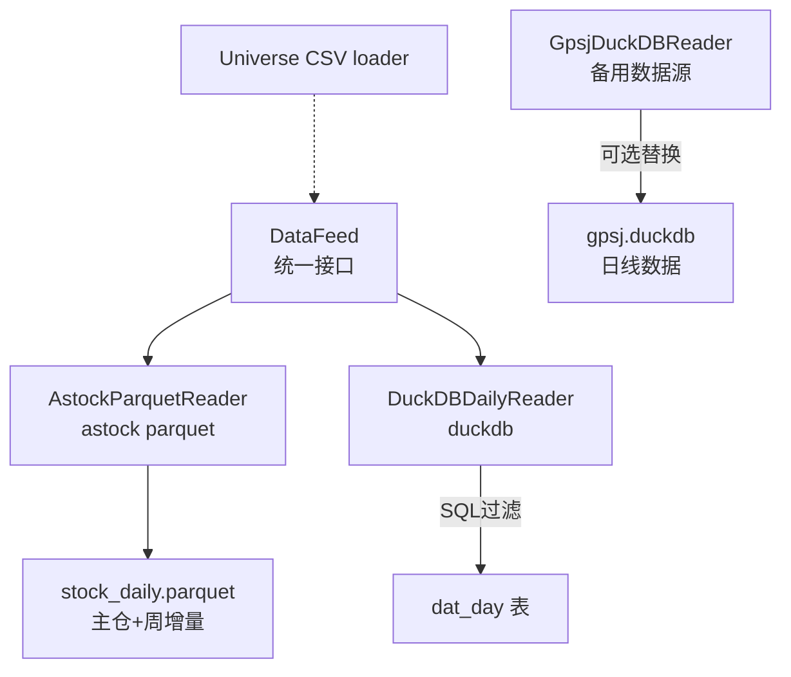
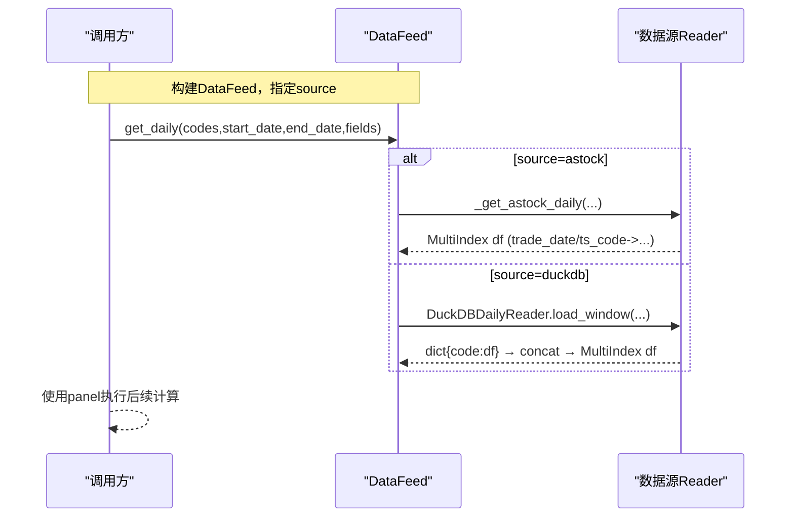
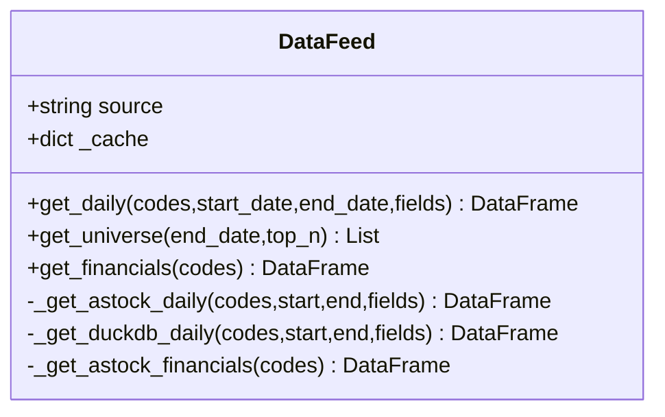
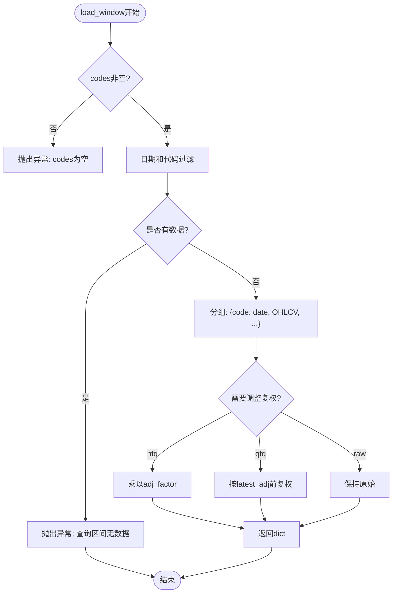
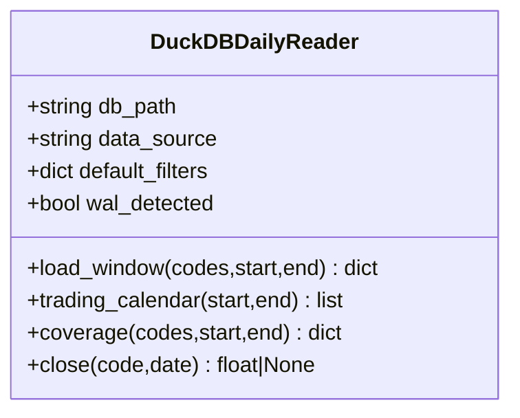
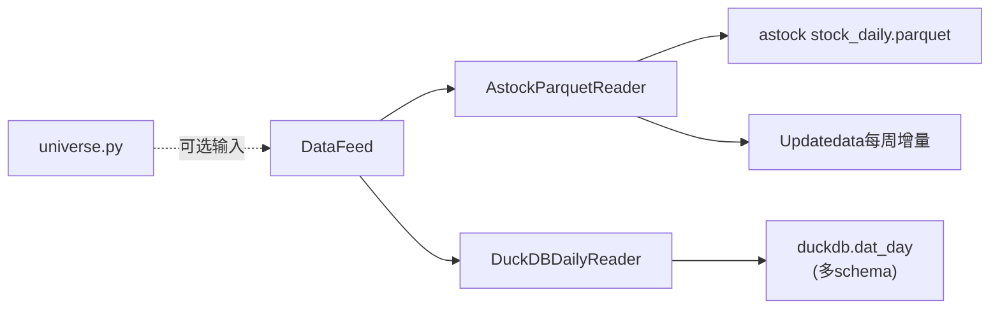
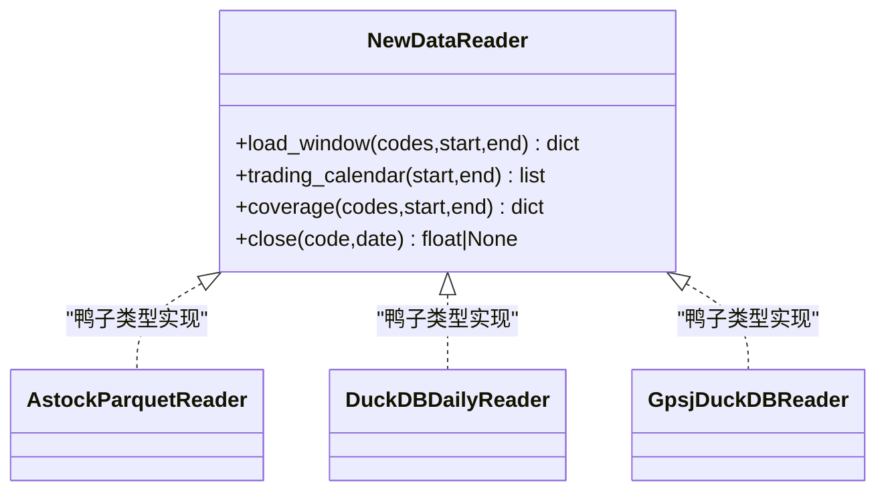

# DataFeed抽象接口设计

<cite>
**本文引用的文件 **
- [data/feed.py](file://data/feed.py)
- [data/astock_reader.py](file://data/astock_reader.py)
- [data/duckdb_reader.py](file://data/duckdb_reader.py)
- [data/gpsj_reader.py](file://data/gpsj_reader.py)
- [data/astock_finance_reader.py](file://data/astock_finance_reader.py)
- [data/universe.py](file://data/universe.py)
</cite>

## 目录
1. [引言](#引言)
2. [项目结构](#项目结构)
3. [核心组件](#核心组件)
4. [架构总览](#架构总览)
5. [详细组件分析](#详细组件分析)
6. [依赖关系分析](#依赖关系分析)
7. [性能与缓存](#性能与缓存)
8. [故障排查指南](#故障排查指南)
9. [结论](#结论)
10. [附录：新数据源接入规范](#附录新数据源接入规范)

## 引言
本文面向QuantLab量化交易系统的数据接入层，聚焦DataFeed抽象接口的设计与实现。该接口以鸭子类型为核心思路，对外统一暴露get_daily、get_universe、get_financials等方法，对内将请求分发至不同的具体数据源（如astock parquet或duckdb），向上屏蔽多源差异，为回测、因子研究及实盘策略提供稳定一致的行情与财务数据。

## 项目结构
围绕数据接入的相关模块如下：
- data/feed.py：定义DataFeed类与兼容接口get_panel，封装source路由
- data/astock_reader.py：实现AstockParquetReader，遵循load_window/trading_calendar/coverage/close四方法契约
- data/duckdb_reader.py：实现DuckDBDailyReader，面向多schema统一输出标准字段
- data/gpsj_reader.py：备用数据源Reader，同样遵循四方法接口并与astock口径对齐
- data/astock_finance_reader.py：PIT安全财务读取器，用于前向无偏差选股与打分
- data/universe.py：股票池CSV加载与校验工具

图表来源
- [data/feed.py:17-134](file://data/feed.py#L17-L134)
- [data/astock_reader.py:68-162](file://data/astock_reader.py#L68-L162)
- [data/duckdb_reader.py:35-132](file://data/duckdb_reader.py#L35-L132)
- [data/gpsj_reader.py:46-113](file://data/gpsj_reader.py#L46-L113)
- [data/universe.py:27-61](file://data/universe.py#L27-L61)

章节来源
- [data/feed.py:1-186](file://data/feed.py#L1-L186)

## 核心组件
- DataFeed：统一入口，内部维护source与内存缓存，对外提供：
  - get_daily：按日期范围与代码筛选返回MultiIndex面板
  - get_universe：基于最近交易日成交额排序动态选择top_n只股票
  - get_financials：读取财务指标（当前默认返回空DataFrame，可扩）
  - _get_astock_daily / _get_duckdb_daily：根据source进行具体实现
- AstockParquetReader：读只parquet主仓并合并周增量，输出标准列集合并按adjustment规则处理复权
- DuckDBDailyReader：对两种schema的dat_day表统一标准化为date/open/high/low/close/vol/amount
- GpsjDuckDBReader：备用数据源，按约定取“不复权_*”与“复权因子”，口径对齐astock
- Universe：负责从CSV装载并校验股票池

章节来源
- [data/feed.py:17-134](file://data/feed.py#L17-L134)
- [data/astock_reader.py:68-201](file://data/astock_reader.py#L68-L201)
- [data/duckdb_reader.py:35-200](file://data/duckdb_reader.py#L35-L200)
- [data/gpsj_reader.py:46-175](file://data/gpsj_reader.py#L46-L175)
- [data/universe.py:27-61](file://data/universe.py#L27-L61)

## 架构总览
数据流从上层策略或研究脚本发起：
- 调用方构造DataFeed(source="astock"|"duckdb")
- 通过get_daily/get_universe/get_financials获取数据
- DataFeed内部分发到相应reader
- reader内部完成数据源拉取、过滤、转换与规范化
- 上层得到标准化的MultiIndex DataFrame或字典/数组

图表来源
- [data/feed.py:28-41](file://data/feed.py#L28-L41)
- [data/feed.py:106-124](file://data/feed.py#L106-L124)
- [data/astock_reader.py:116-162](file://data/astock_reader.py#L116-L162)
- [data/duckdb_reader.py:90-132](file://data/duckdb_reader.py#L90-L132)

## 详细组件分析

### DataFeed：统一接口与缓存
- 设计要点
  - 构造函数接收source参数，决定底层reader路径
  - 内置_cache字典，缓存astock_parquet全量数据避免重复读取
  - get_universe依据最新交易日的成交额降序排序选取top_n
  - 兼容旧接口的get_panel：组装面板字段，填充缺失列为NaN；并对财务数据做ffill重采样
- 关键行为
  - _get_astock_daily：reset index→filter codes/date→选fields→set_index为["date","code"]
  - _get_duckdb_daily：调用DuckDBDailyReader.load_window，转为MultiIndex后拼接
  - _get_astock_financials：直接读取fina_indicator.parquet并按codes筛选（若存在）
  - get_panel：统一映射close/open/volume/amount/pe_ttm/pb/circ_mv等字段至面板

图表来源
- [data/feed.py:17-134](file://data/feed.py#L17-L134)
- [data/feed.py:137-181](file://data/feed.py#L137-L181)

章节来源
- [data/feed.py:17-181](file://data/feed.py#L17-L181)

### astock读者：AstockParquetReader（鸭子类型契约）
- 契约目标：与DuckDBDailyReader保持一致的四方法接口（load_window/trading_calendar/coverage/close）
- 核心逻辑
  - 初始化阶段仅读取必要列，降低内存占用，并设置MultiIndex
  - 增量合并：优先读取主仓stock_daily.parquet，再按配置逐周追加Updatedata中的stock_daily.parquet，同键去重保留“增量优先”
  - load_window：按(codes, start_date, end_date)过滤，输出每只股票的date/ohlc/amount等列字典
  - trading_calendar：按日期区间返回唯一交易日列表
  - coverage：统计最小/最大时间范围、覆盖的股票数等元信息
  - adjustment支持raw/qfq/hfq，结合adj_factor还原或复权价格
  - close(code,date)：取某日收盘价或复权价（与gspj_reader一致风格）

图表来源
- [data/astock_reader.py:116-162](file://data/astock_reader.py#L116-L162)

章节来源
- [data/astock_reader.py:27-201](file://data/astock_reader.py#L27-L201)

### duckdb读者：DuckDBDailyReader（多schema统一）
- 设计目标：在保持read_only的前提下，适配两种schema（jince_zhisuan与qmt_self_owned），统一输出标准列
- 关键点
  - 连接时标记read_only，检测WAL警告（金策智算可能正在同步）
  - _date_expr/_filter_clause针对不同source生成正确的日期列与默认过滤
  - load_window：动态拼装IN查询与BETWEEN条件，支持QUALIFY去重；按code分组输出字典
  - trading_calendar：按日期DISTINCT排序
  - coverage：统计范围、行数、去重统计及universe覆盖率（可限定codes/时间）
  - close：可按(code,date)取值，并在需要时应用adjustment规则

图表来源
- [data/duckdb_reader.py:35-200](file://data/duckdb_reader.py#L35-L200)

章节来源
- [data/duckdb_reader.py:35-200](file://data/duckdb_reader.py#L35-L200)

### 备用数据源：GpsjDuckDBReader（口径对齐）
- 用途：当需要使用备用数据源进行交叉验证或替代时提供一致接口
- 特点
  - 严格使用“不复权_*”列加“复权因子”，保证与astock口径一致
  - adjustment与astock_reader一致（raw/hfq/qfq）
  - load_window/trading_calendar/coverage/close均实现，便于无缝替换

章节来源
- [data/gpsj_reader.py:1-175](file://data/gpsj_reader.py#L1-L175)

### 股票池：Universe CSV加载与校验
- 功能：从CSV文件加载有效股票代码，校验格式（^\\d{6}\\.(SZ|SH)$）、去重、忽略disabled行，空池时报错
- 适用场景：与DataFeed.get_universe结合，或在外部准备固定候选池时使用

章节来源
- [data/universe.py:1-61](file://data/universe.py#L1-L61)

### 财务数据与PIT安全
- astock财务读取器AstockFinanceReader遵循PIT规则：使用ann_date/f_ann_date作为公告截止，取截至asof_date可见且end_date最新的记录，确保回测无前瞻偏差
- 可在扩展DataFeed.get_financials时与之集成，以实现PIT安全的财务字段注入

章节来源
- [data/astock_finance_reader.py:1-200](file://data/astock_finance_reader.py#L1-L200)

## 依赖关系分析
- DataFeed对外暴露接口，依赖具体的reader实现
- astock_reader与duckdb_reader之间通过相同四方法契约形成松耦合，可通过switch source快速切换
- universe.py作为外部股票池装配工具，独立于上述reader体系

图表来源
- [data/feed.py:17-134](file://data/feed.py#L17-L134)
- [data/astock_reader.py:27-112](file://data/astock_reader.py#L27-L112)
- [data/duckdb_reader.py:35-132](file://data/duckdb_reader.py#L35-L132)

章节来源
- [data/feed.py:17-134](file://data/feed.py#L17-L134)

## 性能与缓存
- DataFeed缓存：在_init中创建_cache，首次读取astock parquet后常驻内存，后续get_daily复用，显著减少重复I/O
- astock_reader列裁剪：仅读取所需列，避免加载冗余字段，降低内存与IO压力
- 增量合并：仅在初次加载后进行一轮聚合与去重，之后以MultiIndex高效切片
- duckdb_reader：SQL层面完成过滤，减少网络/内存传输数据量；支持QUALIFY去重以避免重复交易
- 建议优化
  - 对频繁调用的面板查询可增加短期LRU缓存键（按codes/hashable(params))
  - 增量合并完成后考虑持久化中间结果（注意数据版本与失效策略）

章节来源
- [data/feed.py:20-26](file://data/feed.py#L20-L26)
- [data/astock_reader.py:90-112](file://data/astock_reader.py#L90-L112)
- [data/duckdb_reader.py:90-132](file://data/duckdb_reader.py#L90-L132)

## 故障排查指南
- FileNotFoundError
  - astock parquet或duckdb数据库路径不存在时抛错，检查路径配置与数据是否就绪
- 区间无数据
  - load_window在codes为空或查询区间无数据时抛出异常，确认codes与起止日期合理
- WAL告警（duckdb）
  - 检测到quantifydata.duckdb.wal时给出运行警告，提示同步期间hash不稳定，应在同步完成后重跑
- 增量合并失败
  - 读取Updatedata各周parquet失败会记录warning并跳过该周，不影响主仓，但需检查磁盘与权限
- universe无效/空池
  - CSV首列必须为code且满足正则，重复/禁用行将被跳过，最终空池会报错

章节来源
- [data/astock_reader.py:78-85](file://data/astock_reader.py#L78-L85)
- [data/duckdb_reader.py:42-75](file://data/duckdb_reader.py#L42-L75)
- [data/duckdb_reader.py:90-97](file://data/duckdb_reader.py#L90-L97)
- [data/universe.py:27-61](file://data/universe.py#L27-L61)

## 结论
DataFeed通过简洁统一的四个核心方法与鸭子类型协议，成功桥接了astock parquet与duckdb等多数据源，使上层研究与策略无需关心底层实现。配合PIT安全的财务读取、严格的宇宙筛选与稳健的错误处理，形成了可靠且可扩展的数据底座。未来只需新增符合四方法的reader，即可通过source切换无缝接入。

[无直接文件分析引用]

## 附录：新数据源接入规范

### 四方法接口契约
- 必需方法
  - load_window(codes: List[str], start_date: str, end_date: str) -> Dict[str, pd.DataFrame]
    - 每个code对应的DataFrame需包含列：date, open, high, low, close, vol, amount
    - 额外可带：circ_mv, pe_ttm, pb, turnover_rate等（便于面板合成）
    - code格式需与系统保持一致（例如“000001.SZ”）
    - 要求对重复交易进行合理去重，保证时间有序
  - trading_calendar(start_date: str, end_date: str) -> List[str]
    - 返回[start_date, end_date]范围内的唯一交易日列表（已排序字符串）
  - coverage(codes=None, start_date=None, end_date=None) -> Dict
    - 描述数据源覆盖范围（min_date/max_date/n_codes/n_rows等），可按codes与日期范围做子集统计
  - close(code: str, date: str) -> Optional[float]
    - 返回给定日期的收盘价（可为复权价或约定价格，需在文档内明确口径）

- 约定
  - 所有读取均为只读
  - 日期格式化采用“YYYY-MM-DD”
  - 代码格式统一采用tushare风格（如“600000.SH”）
  - 复权处理遵循raw/qfq/hfq三种模式，并在coverage中声明

图表来源
- [data/astock_reader.py:116-201](file://data/astock_reader.py#L116-L201)
- [data/duckdb_reader.py:90-200](file://data/duckdb_reader.py#L90-L200)
- [data/gpsj_reader.py:85-175](file://data/gpsj_reader.py#L85-L175)

### get_panel字段映射与MultiIndex面板
- DataFeed.get_panel将底层daily转换为统一面板列集合：close, open, volume, amount, pe_ttm, pb, circ_mv, pct_chg, turnover_rate等
- 当底层缺失某些列时会填充NaN，确保下游计算不中断
- 索引为MultiIndex：date, code；顺序对时间序列运算影响重大，务必保证日期递增

章节来源
- [data/feed.py:155-178](file://data/feed.py#L155-L178)

### 股票池动态调整逻辑
- get_universe按“最近交易日”成交额降序排名，取top_n只组成当日股票池
- 若未提供end_date，则以实际可用最新日为准；否则截取≤end_date的最新日
- 若无成交额列，则退化为按index次序取前N个代码

章节来源
- [data/feed.py:43-63](file://data/feed.py#L43-L63)

### 错误处理与健壮性
- 参数校验：codes为空时立即报错
- 区间越界：超出数据源覆盖范围时抛错并附带上下界信息
- 资源检查：文件不存在即抛FileNotFoundError
- 增量失败：记录warning并继续，不中断主流程

章节来源
- [data/astock_reader.py:116-139](file://data/astock_reader.py#L116-L139)
- [data/duckdb_reader.py:90-97](file://data/duckdb_reader.py#L90-L97)
- [data/astock_reader.py:78-85](file://data/astock_reader.py#L78-L85)

### 性能优化建议
- 列裁剪与选择性读取（astock_reader已实现）
- SQL侧过滤（duckdb_reader）
- 增量合并后的去重与排序只执行一次
- 建议在高层增加会话级缓存（如按params哈希保存Panel片段）

[本节为通用建议，不直接引用具体代码]

### 接入步骤清单
- 新建reader实现四方法（load_window/trading_calendar/coverage/close）
- 统一输出date与OHLCV列名，代码格式按约定
- 实现adjustment语义（raw/qfq/hfq）并在coverage标注
- 在DataFeed中添加新的source分支或提供工厂注册机制
- 编写单测：正常区间、空区间、越界、无数据、增量生效、WAL场景等

[本节为过程性指导，不直接引用具体代码]