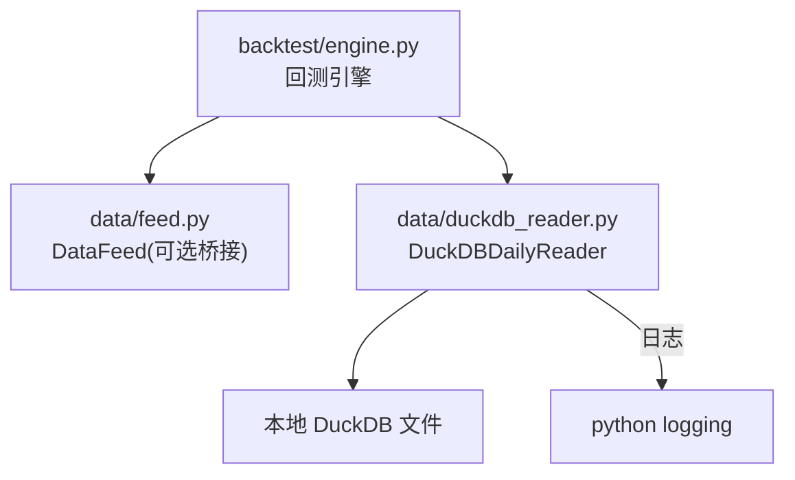
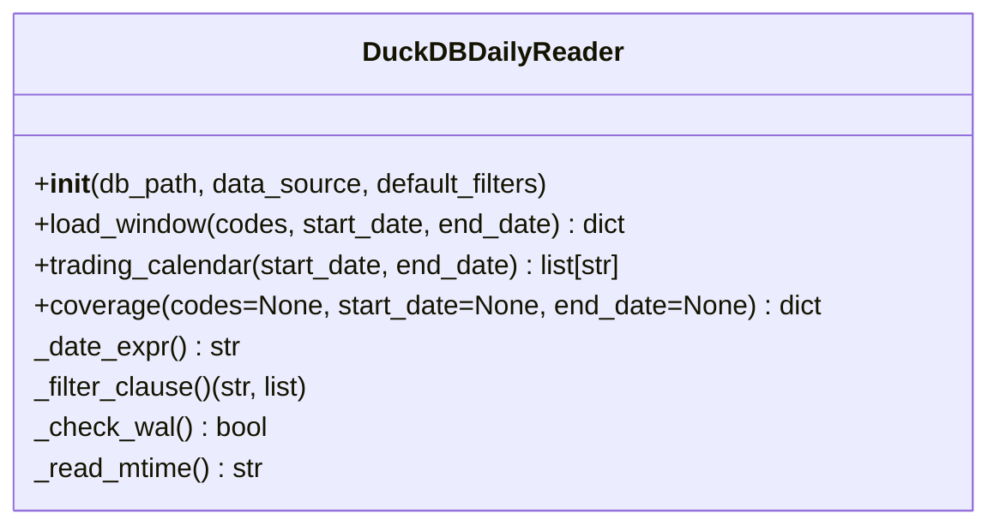
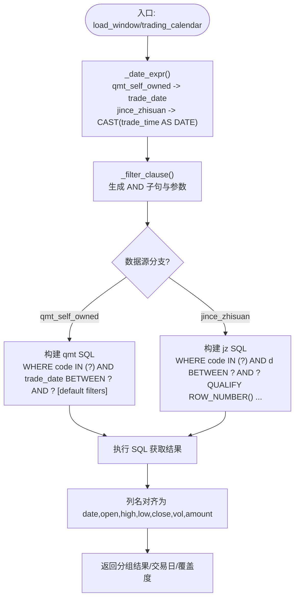
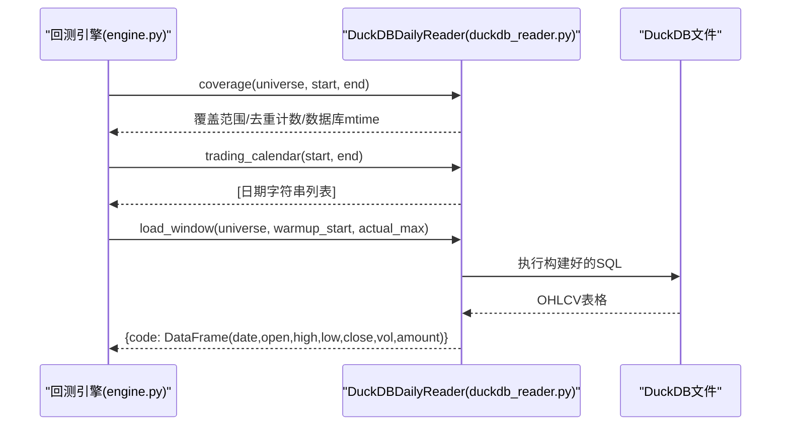

# DuckDB数据源实现

<cite>
**本文引用的文件 **
- [duckdb_reader.py](file://data/duckdb_reader.py)
- [astock_reader.py](file://data/astock_reader.py)
- [feed.py](file://data/feed.py)
- [engine.py](file://backtest/engine.py)
</cite>

## 目录
1. [简介](#简介)
2. [项目结构](#项目结构)
3. [核心组件](#核心组件)
4. [架构总览](#架构总览)
5. [组件详解](#组件详解)
6. [依赖关系分析](#依赖关系分析)
7. [性能与优化](#性能与优化)
8. [故障排查指南](#故障排查指南)
9. [数据库维护建议](#数据库维护建议)
10. [结论](#结论)

## 简介
本文件面向 QuantLab 的量化回测引擎中“DuckDB 日线数据读取层”，聚焦于 DuckDBDailyReader 的双 schema 支持、SQL 查询优化、WAL 检测告警、连接与缓存管理，以及 load_window/trading_calendar/coverage 等方法的分 schema 构建逻辑。目标是为读者提供从原理到落地实践的完整技术说明，便于扩展新 schema、定位性能问题、规避常见坑点。

## 项目结构
与 DuckDBDailyReader 直接相关的代码主要位于 data/ 目录下：
- duckdb_reader.py：DuckDB 日线只读 reader 的实现，负责双 schema（jince_zhisuan v0.2 与 qmt_self_owned v0.3）统一接口封装、SQL 构建、WAL 检测、覆盖统计与缓存。
- astock_reader.py：与 DuckDB 同接口的鸭子类型实现（parquet），便于在回测框架中以统一方式切换数据源。
- feed.py：统一的 DataFeed 接口，可在旧逻辑中桥接到 DuckDBDailyReader。
- backtest/engine.py：回测引擎调用 reader.trading_calendar() 和 reader.load_window()，构成消费方链路。

图表来源
- [engine.py:261-279](file://backtest/engine.py#L261-L279)
- [feed.py:17-124](file://data/feed.py#L17-L124)
- [duckdb_reader.py:35-132](file://data/duckdb_reader.py#L35-L132)

章节来源
- [engine.py:261-279](file://backtest/engine.py#L261-L279)
- [feed.py:17-124](file://data/feed.py#L17-L124)
- [duckdb_reader.py:35-132](file://data/duckdb_reader.py#L35-L132)

## 核心组件
- DuckDBDailyReader：统一对外的四方法接口（load_window/trading_calendar/coverage/close）。内部根据 data_source 选择不同 schema 处理路径。
- 支持的数据源常量：jince_zhisuan（v0.2）、qmt_self_owned（v0.3）。
- 默认过滤器 default_filters：在 qmt_self_owned 下默认附加 adjustment='hfq' 与 source='xtquant' 过滤，可构造时替换。

章节来源
- [duckdb_reader.py:30-57](file://data/duckdb_reader.py#L30-L57)

## 架构总览
双 schema 架构通过显式 data_source 参数决定运行时行为：
- jince_zhisuan（v0.2 路径）
  - 表 dat_day，日期列为 trade_time（时间戳），同日可能多时间戳需去重。
  - 使用 QUALIFY ROW_NUMBER 去重策略，按 code+date 分区按 trade_time 降序取最新一条。
  - WAL 检测沿用：如果检测到 quantifydata.duckdb.wal 文件，输出告警提示。
- qmt_self_owned（v0.3 主路径）
  - 表 dat_day，日期列为 trade_date（DATE）。
  - 上游已保证 (code, trade_date, adjustment, source) 唯一，因此不启用 QUALIFY。
  - 默认按 adjustment='hfq'、source='xtquant' 过滤；如需多源由上层传 default_filters。

图表来源
- [duckdb_reader.py:35-185](file://data/duckdb_reader.py#L35-L185)

章节来源
- [duckdb_reader.py:77-88](file://data/duckdb_reader.py#L77-L88)
- [duckdb_reader.py:90-132](file://data/duckdb_reader.py#L90-L132)
- [duckdb_reader.py:134-144](file://data/duckdb_reader.py#L134-L144)
- [duckdb_reader.py:146-185](file://data/duckdb_reader.py#L146-L185)

## 组件详解

### 双 schema 适配与 SQL 查询构建
- 日期表达式 _date_expr：
  - qmt_self_owned：返回 trade_date。
  - jince_zhisuan：返回 CAST(trade_time AS DATE)。
- 默认过滤器 _filter_clause：
  - 将 default_filters 转换为 AND key = ? 条件与对应参数列表。
- load_window：
  - jince_zhisuan 分支：
    - SELECT code, d AS date, open, high, low, close, vol, amount FROM dat_day WHERE code IN (...) AND d BETWEEN ? AND ? ORDER BY code,date。
    - 使用 QUALIFY ROW_NUMBER() OVER (PARTITION BY code, d ORDER BY trade_time DESC) = 1 以在同日多时间戳下保留最新。
  - qmt_self_owned 分支：
    - SELECT code, trade_date AS date, open, high, low, close, vol, amount FROM dat_day WHERE code IN (...) AND trade_date BETWEEN ? AND ? [AND default filters] ORDER BY code,date。
    - 不启用 QUALIFY，依赖上游唯一性约束。
- trading_calendar：
  - 按 _date_expr() 提取 DISTINCT trade_date/CAST(trade_time AS DATE)，按区间与默认过滤器筛选后排序去重。
- coverage：
  - 首次调用计算并缓存最小/最大日期、股票数量、去重后行数等元信息。
  - 针对两种 schema 分别执行去重前总行数与去重后行数的统计，计算 dedup_count。

章节来源
- [duckdb_reader.py:77-88](file://data/duckdb_reader.py#L77-L88)
- [duckdb_reader.py:90-132](file://data/duckdb_reader.py#L90-L132)
- [duckdb_reader.py:134-144](file://data/duckdb_reader.py#L134-L144)
- [duckdb_reader.py:146-185](file://data/duckdb_reader.py#L146-L185)

### WAL 检测与警告
- 当 data_source 为 jince_zhisuan 时：
  - 检查 db_path + ".wal" 是否存在，存在即发出告警日志与文本消息，记录 wal_detected=true 及 warning 文案。
- 对于 qmt_self_owned：
  - 始终 wal_detected=false（因其同步机制不同）。

章节来源
- [duckdb_reader.py:55-75](file://data/duckdb_reader.py#L55-L75)

### 连接与生命周期
- 构造时以 read_only=True 打开 DuckDB 连接，禁止写操作与 ATTACH。
- 未暴露显式的 close()；实际关闭由 Python GC 或上下文控制对象销毁时完成。建议在批量任务中合理复用或及时释放引用以降低长时间持有连接的开销。

章节来源
- [duckdb_reader.py:54-57](file://data/duckdb_reader.py#L54-L57)

### 日期表达式与默认过滤器注入流程

图表来源
- [duckdb_reader.py:77-88](file://data/duckdb_reader.py#L77-L88)
- [duckdb_reader.py:90-132](file://data/duckdb_reader.py#L90-L132)

章节来源
- [duckdb_reader.py:77-88](file://data/duckdb_reader.py#L77-L88)
- [duckdb_reader.py:90-132](file://data/duckdb_reader.py#L90-L132)

### 交易日历提取与覆盖率统计
- trading_calendar：DISTINCT 日期 + 默认排序，仅受日期区间与默认过滤器影响。
- coverage：首次加载计算全局覆盖范围与去重计数，并缓存；可按 codes/date 做二次交集过滤以统计 universe_coverage。
- dedup_count 的意义：jince_zhisuan 路径的同日重复剔除数量，用于评估重复量级。

章节来源
- [duckdb_reader.py:134-185](file://data/duckdb_reader.py#L134-L185)

### 与回测引擎的协作
- 引擎侧调用顺序：
  1) 先调用 coverage(codes=universe,...) 获得数据范围估计；
  2) 再调用 trading_calendar(start,end) 获取回测日历；
  3) 最后 load_window(...) 拉取市场数据。
- 这种三段式确保 warm-up 区域构建合理且避免因无数据导致异常。

章节来源
- [engine.py:261-279](file://backtest/engine.py#L261-L279)

## 依赖关系分析

图表来源
- [engine.py:261-279](file://backtest/engine.py#L261-L279)
- [duckdb_reader.py:90-132](file://data/duckdb_reader.py#L90-L132)

## 性能与优化
- SQL 层面的优化
  - QUALIFY ROW_NUMBER(jince_zhisuan)：将去重逻辑下推到数据库侧，避免客户端内存处理大量重复行的成本。
  - 默认过滤器：qmt_self_owned 下通过 adjustment/source 提前过滤，减少扫描行数。
  - 日期表达式：统一抽象 _date_expr() 以避免多处硬编码，降低维护复杂度。
- 索引与分区建议
  - 若后续出现大范围查询缓慢，建议对 dat_day(code, trade_date) 建立索引；对 jince_zhisuan 也可考虑基于 trade_time 建索引加速 ROW_NUMBER 排序。
  - 大宽表查询建议按需投影列，减少网络与内存压力。
- 连接与缓存
  - 单次进程内复用 DuckDBDailyReader 实例，减少频繁 connect/close 的开销。
  - coverage() 的结果被缓存，适用于多次调用场景下的统计快速返回。
- 内存与序列化为 pandas
  - load_window 最后通过 fetchdf() 落盘到内存 DataFrame；在大窗口回测时需关注内存峰值，可在上层分批请求或采样窗口。

[本节为通用优化建议，不直接分析具体代码]

## 故障排查指南
- ValueError：codes 为空
  - 现象：load_window 抛出空集合错误。
  - 处理：确认传入代码列表不为空。
  章节来源
  - [duckdb_reader.py:91-93](file://data/duckdb_reader.py#L91-L93)
- ValueError：请求区间超出覆盖范围
  - 现象：start_date/end_date 超出 coverage 给出的 min_date/max_date。
  - 处理：放宽区间或确认数据入库时间是否完整。
  章节来源
  - [duckdb_reader.py:94-97](file://data/duckdb_reader.py#L94-L97)
- WAL 警告
  - 现象：运行中出现 quantifydata.duckdb.wal 的告警。
  - 原因：外部同步工具正在写入该数据库。
  - 建议：等待同步完成后重新运行，避免 data_hash 不稳定导致回测不一致。
  章节来源
  - [duckdb_reader.py:63-75](file://data/duckdb_reader.py#L63-L75)
- 空日历或无数据
  - 现象：引擎报 empty trading_calendar 或在 load_window 后结果为空。
  - 处理：检查日期区间、默认过滤器过滤过严（如 source/adjustment）、数据源 schema 是否正确。
  章节来源
  - [engine.py:266-268](file://backtest/engine.py#L266-L268)
  - [duckdb_reader.py:82-88](file://data/duckdb_reader.py#L82-L88)

## 数据库维护建议
- WAL 管理
  - jince_zhisuan 数据来源可能产生 .wal 文件，表示有并发写者；应协调增量同步节奏，避免与回测同时运行。
  - 发现 .wal 时立即暂停相关任务或迁移到新副本验证。
- 备份与校验
  - 定期备份数据库文件或快照；对比去重前后行数与日期边界，确保完整性。
- 索引与维护
  - 对常用查询维度（code、trade_date/CAST(trade_time AS DATE)）建立索引以提升 INTERVAL/BETWEEN 和 QUALIFY 性能。
- 版本与迁移
  - 新增 schema 需遵循当前设计：在构造中注册新的 data_source，并在 load_window/trading_calendar/coverage 三处实现分支逻辑，保持对外接口不变。

[本节提供通用维护建议，不包含具体脚本或命令]

## 结论
DuckDBDailyReader 以“显式 data_source”为核心契约，屏蔽了两种不同 schema 的细节差异，并通过 QUALIFY ROW_NUMBER、默认过滤器与日期表达式抽象，实现了高效的日线数据拉取能力。配合覆盖度缓存与 WAL 检测，为回测提供了稳定、可扩展且可观测的数据接入层。未来只需在新 schema 下补齐 SQL 分支与覆盖统计，即可无缝融入回测引擎。