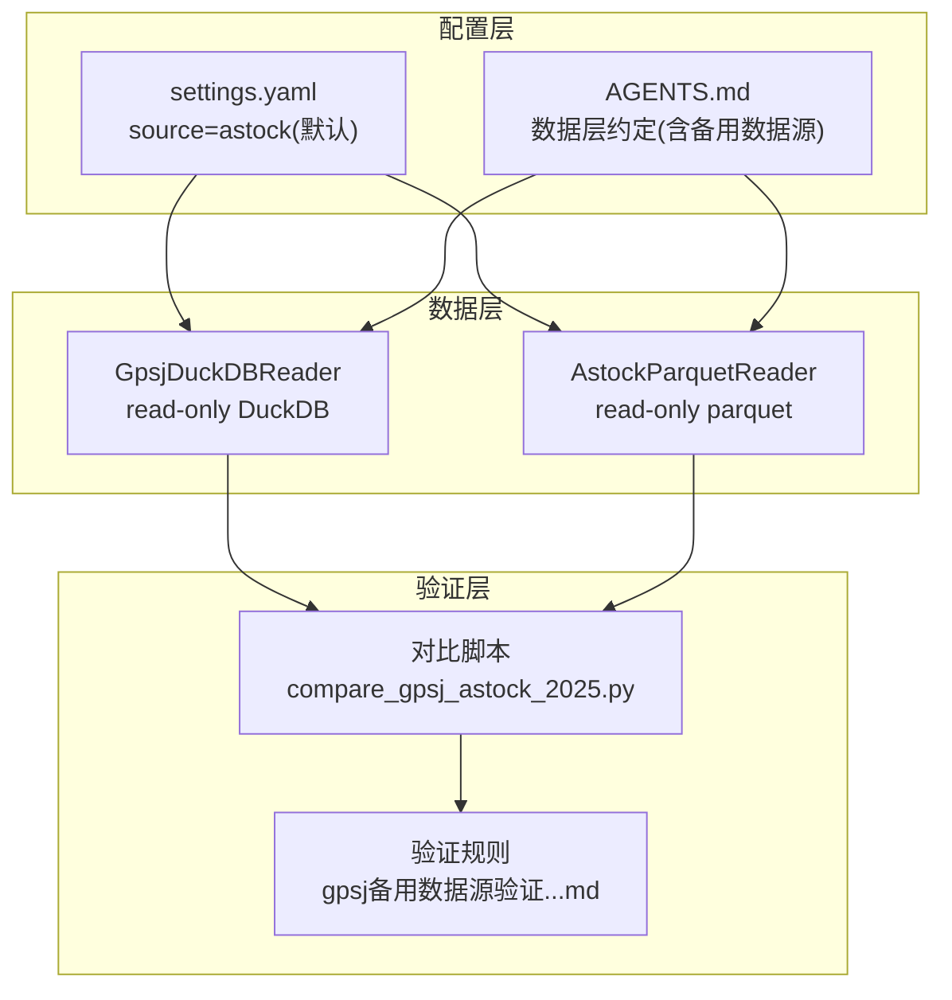
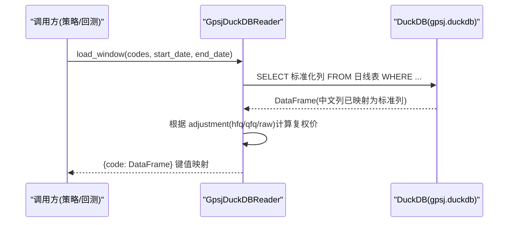
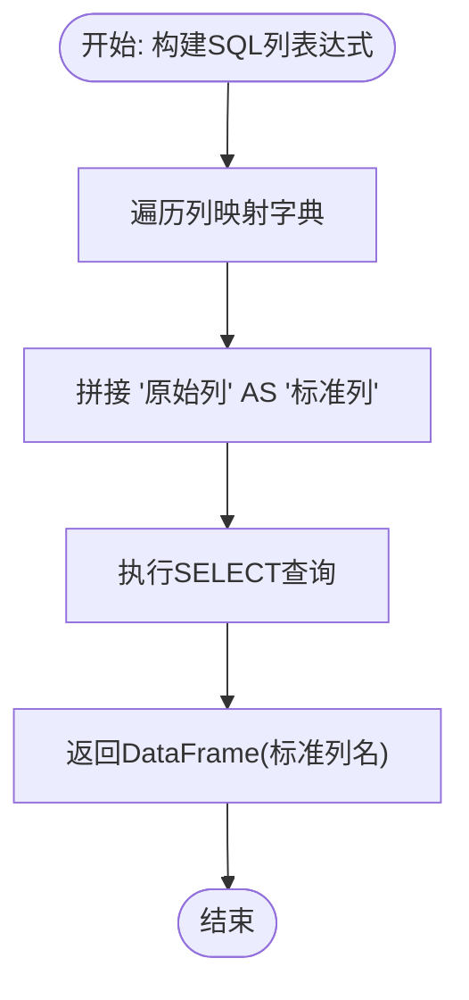
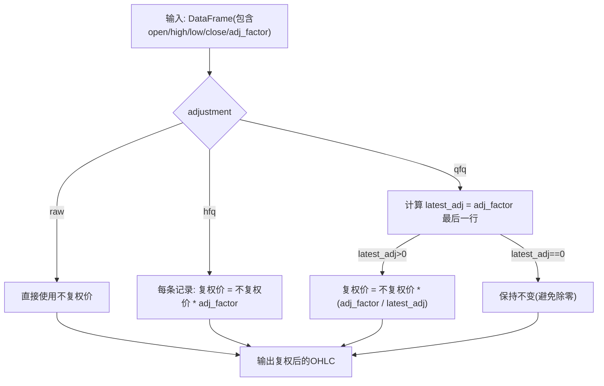
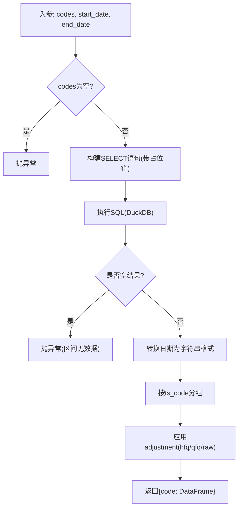
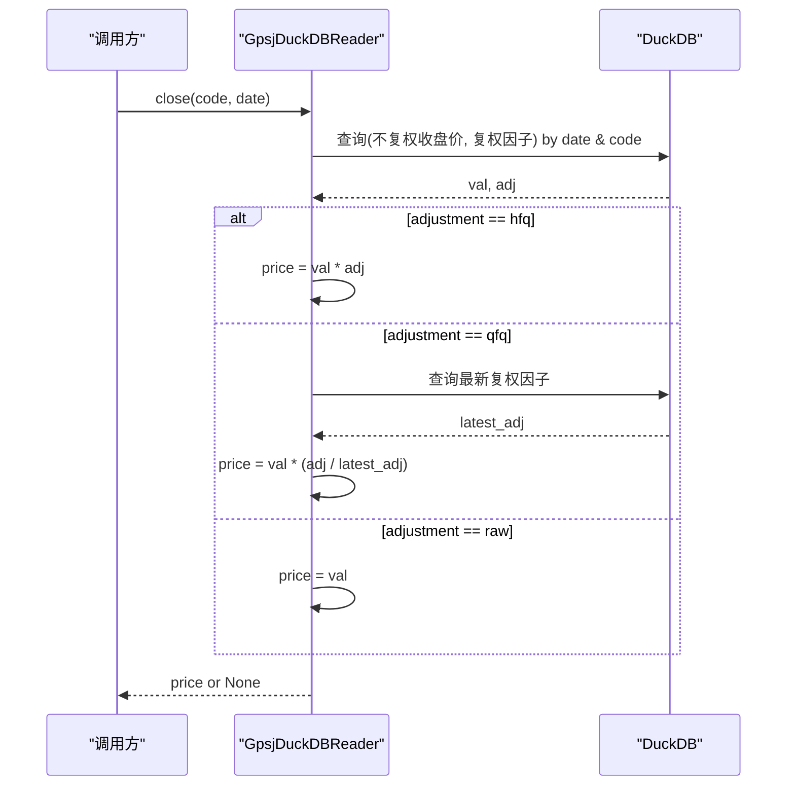
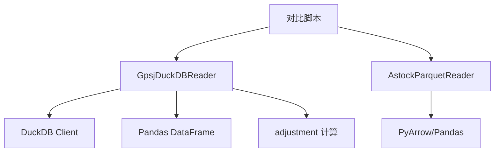
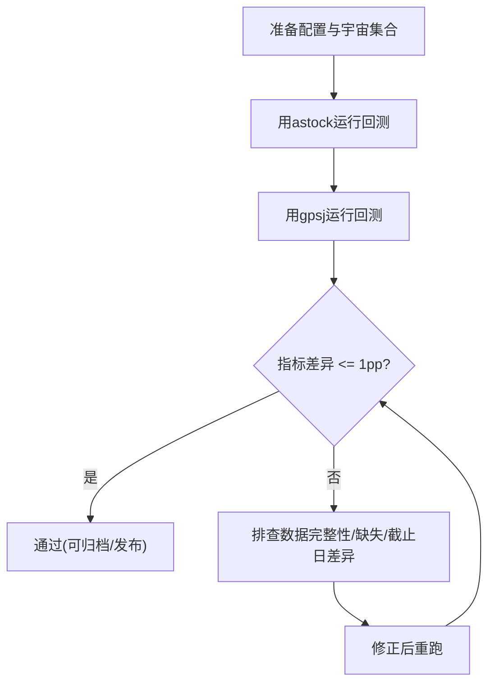

# 备用数据源Gpsj支持

<cite>
**本文引用的文件**   
- [data/gpsj_reader.py](file://data/gpsj_reader.py)
- [research_audit/gpsj备用数据源验证与交叉验证规则_20260816.md](file://research_audit/gpsj备用数据源验证与交叉验证规则_20260816.md)
- [research_audit/compare_gpsj_astock_2025.py](file://research_audit/compare_gpsj_astock_2025.py)
- [AGENTS.md](file://AGENTS.md)
- [config/settings.yaml](file://config/settings.yaml)
</cite>

## 目录
1. [简介](#简介)
2. [项目结构](#项目结构)
3. [核心组件](#核心组件)
4. [架构总览](#架构总览)
5. [详细组件分析](#详细组件分析)
6. [依赖分析](#依赖分析)
7. [性能特点](#性能特点)
8. [跨数据源一致性检查策略](#跨数据源一致性检查策略)
9. [使用方法与配置选项](#使用方法与配置选项)
10. [主备切换流程与回滚方案](#主备切换流程与回滚方案)
11. [故障恢复与扩展适配](#故障恢复与扩展适配)
12. [结论](#结论)

## 简介
本技术文档针对 QuantLab 量化交易系统的备用数据源 GpsDuckDBReader（即 gpsj DuckDB 数据源）进行深入说明。其设计理念是：通过独立、可校验的数据源对主数据源进行回测交叉验证，避免单一数据源口径带来的偏差风险。该备用数据源严格采用“不复权价格 + 复权因子”的组合方式，保证与主数据源 astock 的口径一致；并在覆盖范围、时间滞后性与全市场有效性等方面进行了明确约束，确保在合规范围内可靠使用。

## 项目结构
与备用数据源直接相关的核心位置如下：
- 读取器实现：data/gpsj_reader.py
- 对齐与验证脚本：research_audit/compare_gpsj_astock_2025.py
- 验证规则文档：research_audit/gpsj备用数据源验证与交叉验证规则_20260816.md
- 全局约定（含备用数据源的引用）：AGENTS.md
- 全局数据配置入口：config/settings.yaml（用于设定默认主数据源为 astock）

图示来源
- [data/gpsj_reader.py:1-180](file://data/gpsj_reader.py#L1-L180)
- [research_audit/compare_gpsj_astock_2025.py:1-106](file://research_audit/compare_gpsj_astock_2025.py#L1-L106)
- [research_audit/gpsj备用数据源验证与交叉验证规则_20260816.md:1-57](file://research_audit/gpsj备用数据源验证与交叉验证规则_20260816.md#L1-L57)
- [config/settings.yaml:1-50](file://config/settings.yaml#L1-L50)

章节来源
- [data/gpsj_reader.py:1-180](file://data/gpsj_reader.py#L1-L180)
- [research_audit/gpsj备用数据源验证与交叉验证规则_20260816.md:1-57](file://research_audit/gpsj备用数据源验证与交叉验证规则_20260816.md#L1-L57)
- [research_audit/compare_gpsj_astock_2025.py:1-106](file://research_audit/compare_gpsj_astock_2025.py#L1-L106)
- [config/settings.yaml:1-50](file://config/settings.yaml#L1-L50)
- [AGENTS.md:140-160](file://AGENTS.md#L140-L160)

## 核心组件
- 读取器类：GpsjDuckDBReader，提供统一的四方法接口（load_window/trading_calendar/coverage/close），兼容 astock reader 输出列名，便于策略侧无侵入替换。
- 验证与对齐：内置中英文列映射字典、不复权价处理原则以及adjustment计算逻辑，并配套独立的对比脚本与规则文档。
- 覆盖与限制：明确“2015-01 起的全市场有效覆盖”和“日期滞后”限制，指导何时可用、如何解释差异。

章节来源
- [data/gpsj_reader.py:1-180](file://data/gpsj_reader.py#L1-L180)
- [research_audit/gpsj备用数据源验证与交叉验证规则_20260816.md:8-30](file://research_audit/gpsj备用数据源验证与交叉验证规则_20260816.md#L8-L30)

## 架构总览
GpsjDuckDBReader 通过只读方式连接 DuckDB 数据库，按代码与日期区间过滤，将中文列名映射为标准列名后返回给上层回测或研究模块。调整（adjustment）时以“不复权价 × 复权因子/最新复权因子”的方式实现前复权或后复权，从而与 astock 的 raw+adj_factor 逻辑保持一致。

图示来源
- [data/gpsj_reader.py:85-113](file://data/gpsj_reader.py#L85-L113)
- [data/gpsj_reader.py:71-82](file://data/gpsj_reader.py#L71-L82)
- [data/gpsj_reader.py:96-100](file://data/gpsj_reader.py#L96-L100)

章节来源
- [data/gpsj_reader.py:68-113](file://data/gpsj_reader.py#L68-L113)
- [data/gpsj_reader.py:71-82](file://data/gpsj_reader.py#L71-L82)

## 详细组件分析

### 列映射字典设计
- 设计目标：屏蔽底层数据库中文列名差异，向上统一输出标准列名（如 open/high/low/close/vol/amount/circ_mv/pe_ttm/pb/turnover_rate/is_st/adj_factor）。
- 关键实现点：通过固定映射字典生成 SQL select 列表达式，减少运行时成本，保证一致性。
- 重要原则：不使用“收盘价”（前复权），仅使用“不复权_*”字段，配合“复权因子”做后续复权处理。

图示来源
- [data/gpsj_reader.py:27-43](file://data/gpsj_reader.py#L27-L43)
- [data/gpsj_reader.py:68-69](file://data/gpsj_reader.py#L68-L69)
- [data/gpsj_reader.py:96-100](file://data/gpsj_reader.py#L96-L100)

章节来源
- [data/gpsj_reader.py:27-43](file://data/gpsj_reader.py#L27-L43)
- [data/gpsj_reader.py:68-69](file://data/gpsj_reader.py#L68-L69)
- [data/gpsj_reader.py:96-100](file://data/gpsj_reader.py#L96-L100)

### 不复权价格的处理原则
- 禁用前复权收盘价直用：gpsj 表中“收盘价”是前复权价，不应用于原始价场景。
- 统一使用“不复权_*”列 + “复权因子”，保证与主数据源 astock 的 adj_factor 口径一致。
- 优势：降低前复权不一致性风险；便于上层策略自行控制复权方式。

章节来源
- [data/gpsj_reader.py:1-14](file://data/gpsj_reader.py#L1-L14)
- [research_audit/gpsj备用数据源验证与交叉验证规则_20260816.md:22-25](file://research_audit/gpsj备用数据源验证与交叉验证规则_20260816.md#L22-L25)

### adjustment 复权计算逻辑
- raw：保持不复权价原样。
- hfq：不复权价乘以当日的复权因子。
- qfq：不复权价乘以（当日复权因子 / 最新复权因子），以实现前复权对齐效果。
- 注意：latest_adj 取序列最后一个值作为基准；若为 0 则不做缩放，避免除零错误。

图示来源
- [data/gpsj_reader.py:71-82](file://data/gpsj_reader.py#L71-L82)

章节来源
- [data/gpsj_reader.py:71-82](file://data/gpsj_reader.py#L71-L82)

### load_window 方法与SQL查询构建
- 输入：codes（股票代码列表）、start_date、end_date。
- 查询内容：从“日线数据”表按代码与时段过滤，投影为统一列集；缺失时抛出异常提醒。
- 输出：字典 {code: DataFrame}，date 字符串化，按日排序；apply_adjustment 后再返回。
- 特性：使用参数化占位符防止注入；只读连接，关闭时自动释放资源。

图示来源
- [data/gpsj_reader.py:85-113](file://data/gpsj_reader.py#L85-L113)

章节来源
- [data/gpsj_reader.py:85-113](file://data/gpsj_reader.py#L85-L113)

### close() 单点价格获取
- 支持指定 code/date，取出“不复权_收盘价”与“复权因子”，根据 adjustment 策略返回调整后价格。
- qfq 时额外查询最新复权因子，实现前复权对齐。
- 适用于需要单点价格的场景（如净值估算、信号触发时的价格判断）。

图示来源
- [data/gpsj_reader.py:150-168](file://data/gpsj_reader.py#L150-L168)

章节来源
- [data/gpsj_reader.py:150-168](file://data/gpsj_reader.py#L150-L168)

### 覆盖范围与使用边界
- 全市场完整覆盖起始于 2015-01；在此之前非全市场，不可用于全市场选股对比。
- 数据时间存在滞后（例如截至 2026-04-03），需注意回溯窗口选择。
- 2015 之前可使用参考用途，但应谨慎解释差异。

章节来源
- [research_audit/gpsj备用数据源验证与交叉验证规则_20260816.md:12-19](file://research_audit/gpsj备用数据源验证与交叉验证规则_20260816.md#L12-L19)
- [data/gpsj_reader.py:1-14](file://data/gpsj_reader.py#L1-L14)

## 依赖分析
- 数据依赖：DuckDB（只读打开，稳定高效）；Python 包 duckdb。
- 数据流：Sql→Pandas→apply_adjustment→返回结构化字典。
- 耦合性：reader 暴露四方法接口，解耦上层回测与策略，仅依赖 DataFrame 操作与 DuckDB 客户端。
- 潜在环形依赖：无（仅单向依赖 DuckDB 与 Pandas）。

图示来源
- [data/gpsj_reader.py:18-21](file://data/gpsj_reader.py#L18-L21)
- [research_audit/compare_gpsj_astock_2025.py:20-25](file://research_audit/compare_gpsj_astock_2025.py#L20-L25)

章节来源
- [data/gpsj_reader.py:18-21](file://data/gpsj_reader.py#L18-L21)
- [research_audit/compare_gpsj_astock_2025.py:20-25](file://research_audit/compare_gpsj_astock_2025.py#L20-L25)

## 性能特点
- DuckDB 只读模式：适合大量历史窗口拉取，低延迟、高吞吐。
- 内存与列裁剪：列投影到最小必要字段（OHLCV 及市值/财务指标等），避免冗余列加载。
- 参数化查询：利用占位符与 IN(...) 条件批量过滤，减少往返次数。
- 局限：大窗口仍会产生较大数据集；建议分批或使用更严格的 codes/dates 范围。

[本节为通用性能讨论，不直接分析具体文件]

## 跨数据源一致性检查策略
- 目标：通过同区间对比（如 2025 全年 ATR MAX5）确保两源回测结果基本一致（CAGR/最大回撤等指标接近，差异 >1pp 需排查）。
- 方法：分别用 AstockParquetReader 与 GpsjDuckDBReader 跑同一策略与宇宙集合，比较绩效与统计量。
- 规范：每新增策略或因子定稿后，必须用备用数据源随机抽取一个自然年做对比；模板脚本可直接复用。

图示来源
- [research_audit/compare_gpsj_astock_2025.py:26-104](file://research_audit/compare_gpsj_astock_2025.py#L26-L104)
- [research_audit/gpsj备用数据源验证与交叉验证规则_20260816.md:31-57](file://research_audit/gpsj备用数据源验证与交叉验证规则_20260816.md#L31-L57)

章节来源
- [research_audit/compare_gpsj_astock_2025.py:26-104](file://research_audit/compare_gpsj_astock_2025.py#L26-L104)
- [research_audit/gpsj备用数据源验证与交叉验证规则_20260816.md:31-57](file://research_audit/gpsj备用数据源验证与交叉验证规则_20260816.md#L31-L57)

## 使用方法与配置选项
- 构造参数：
  - db_path：DuckDB 路径；默认指向 gpsj.duckdb。
  - data_source：固定为“gpsj”。
  - adjustment：支持 raw/qfq/hfq；默认 raw 时保留不复权价。
- 常用接口：
  - load_window：加载窗口行情并应用调整。
  - trading_calendar：获取交易日区间。
  - coverage：返回覆盖元信息（起止日期、标的数、DB 修改时间等）。
  - close：获取单点复权后的收盘价格。
- 注意事项：
  - 不要直接用“收盘价”列（前复权），务必使用“不复权_*”+“复权因子”。
  - 2015 之前不可用于全市场选股对比（覆盖率不足）。

章节来源
- [data/gpsj_reader.py:46-66](file://data/gpsj_reader.py#L46-L66)
- [data/gpsj_reader.py:85-168](file://data/gpsj_reader.py#L85-L168)
- [research_audit/gpsj备用数据源验证与交叉验证规则_20260816.md:22-25](file://research_audit/gpsj备用数据源验证与交叉验证规则_20260816.md#L22-L25)

## 主备切换流程与回滚方案
- 主数据源：默认 astock（由 settings.yaml 中 source=astock 决定）。
- 切换到备用：
  - 在调用处实例化 GpsjDuckDBReader，并使用其四方法接口替换现有读取器。
  - 若涉及 DataFeed，可按其源码中分支逻辑切换至备用（参考其封装方式）。
- 回滚策略：
  - 立即切回 astock 读取器；若出现回归，通过相同区间的 astock 结果对比快速定位问题。
  - 记录每次切换的配置与版本标签（build tag 与 commit id），便于追溯。

章节来源
- [config/settings.yaml:10-15](file://config/settings.yaml#L10-L15)
- [data/feed.py:28-41](file://data/feed.py#L28-L41)
- [data/gpsj_reader.py:46-66](file://data/gpsj_reader.py#L46-L66)

## 故障恢复与扩展适配
- 数据缺失处理：
  - load_window 空结果会抛异常，调用方需捕获并回退到主数据源或缩减区间重试。
  - 个别标的缺少数据（如 2015 前覆盖率低）需在 universe 筛选阶段排除，避免影响结果可比性。
- WAL 检测与多 schema：当前 gpsj reader 采用只读、无写入逻辑；如需对接其他 schema 可在调用方做适配。
- 扩展点：
  - 新增列映射：在 _COL_MAP 中补充中文列至标准列。
  - 新增字段：更新投影列与 coverage 返回。
  - 新增覆盖查询：在 coverage 中增加更多维度统计，便于监控数据质量。
- 与主源口径差异排查：
  - 优先检查“不复权_*”列与复权因子取值是否一致；关注日期截断导致的 asof 差异对财务数据的连锁影响。

章节来源
- [data/gpsj_reader.py:92-113](file://data/gpsj_reader.py#L92-L113)
- [research_audit/gpsj备用数据源验证与交叉验证规则_20260816.md:31-57](file://research_audit/gpsj备用数据源验证与交叉验证规则_20260816.md#L31-L57)

## 结论
GpsDuckDBReader 为 QuantLab 提供了独立可靠的备用数据源支撑，通过严谨的列映射与不复权价+复权因子的统一处理，实现了与主数据源 astock 的高度口径一致，并通过完整的跨源对比机制确保回测结果的稳健性。在实际使用中，需严格遵守覆盖范围与时间滞后限制，按照规范进行切换与回滚、以及持续的口径验证，以确保策略研发与实盘的可靠性与可追溯性。