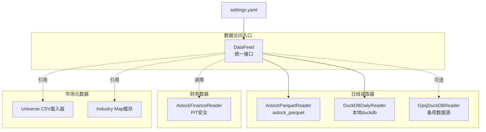
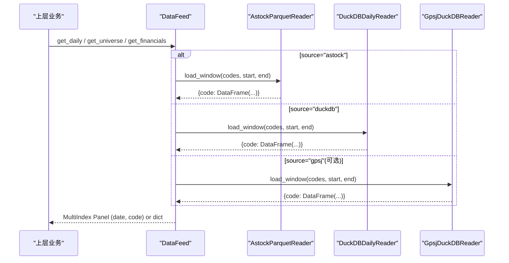
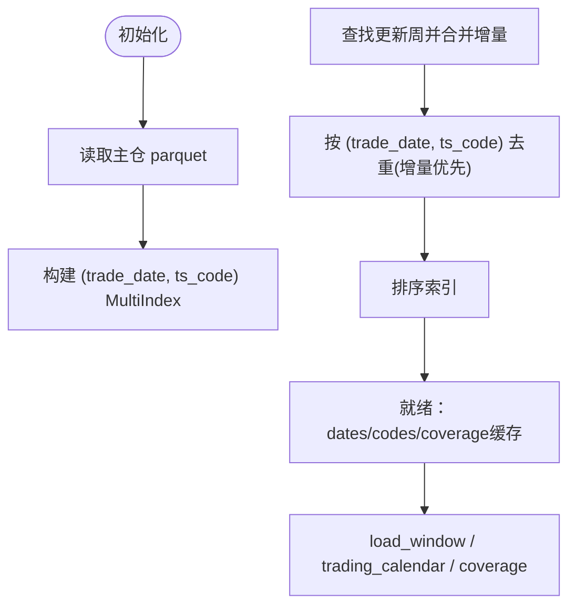
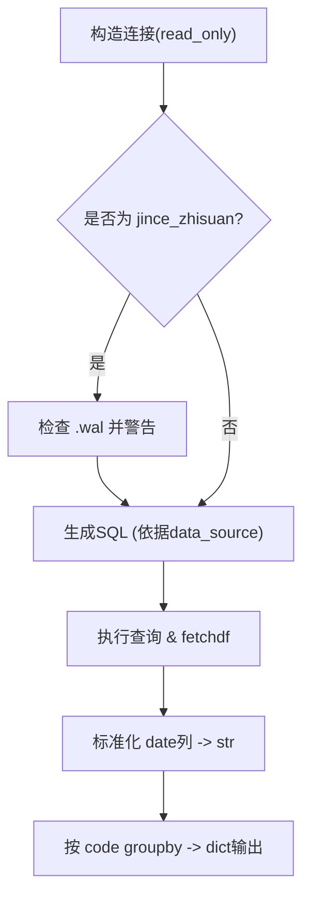
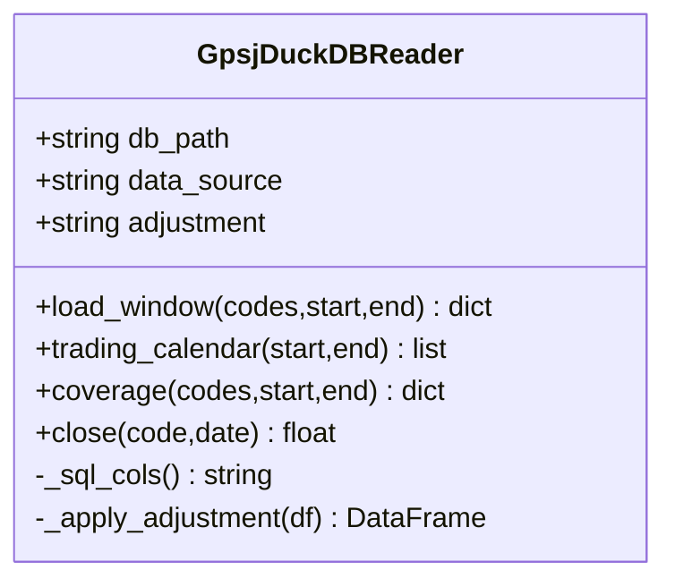
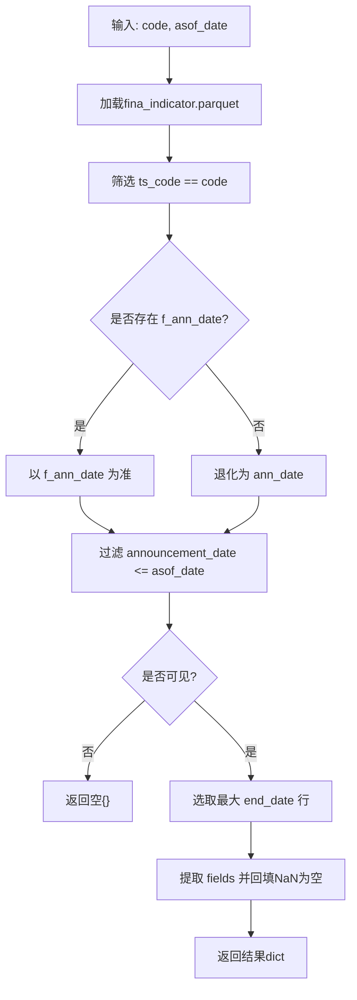
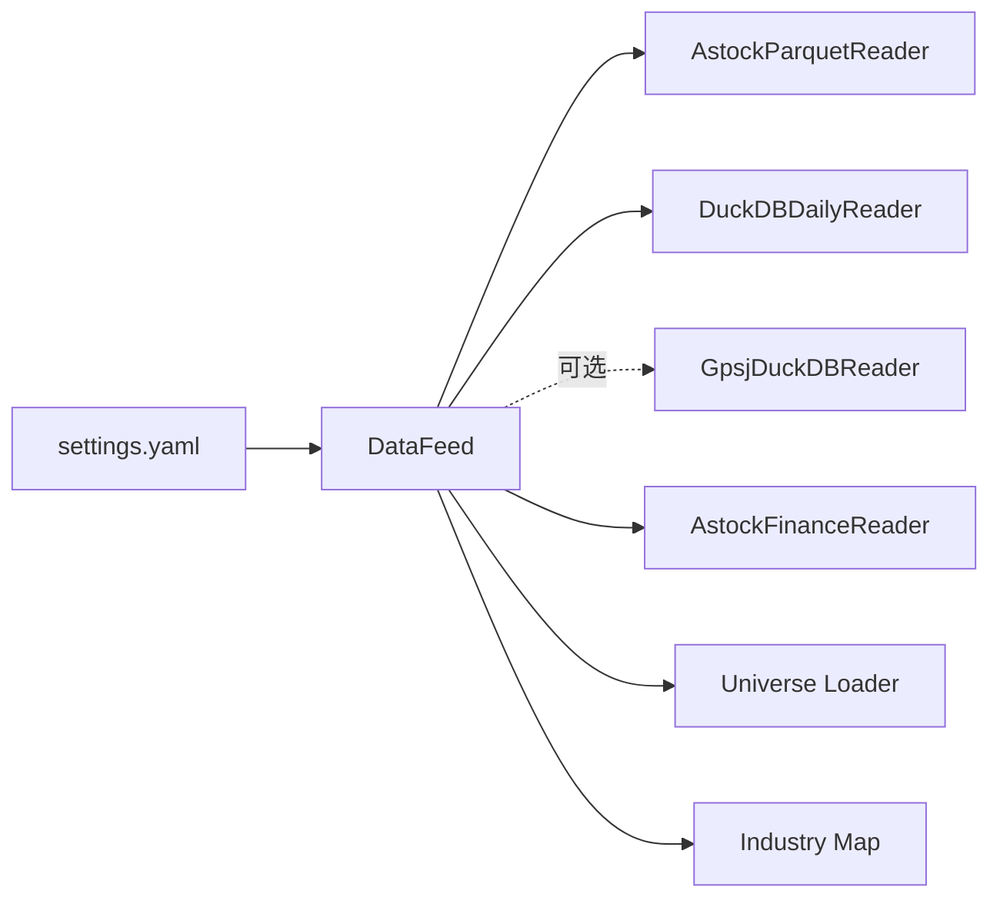

# 数据层架构

<cite>
**本文引用的文件**   
- [data/astock_reader.py](file://data/astock_reader.py)
- [data/gpsj_reader.py](file://data/gpsj_reader.py)
- [data/duckdb_reader.py](file://data/duckdb_reader.py)
- [data/feed.py](file://data/feed.py)
- [data/astock_finance_reader.py](file://data/astock_finance_reader.py)
- [data/universe.py](file://data/universe.py)
- [data/industry_map.py](file://data/industry_map.py)
- [config/settings.yaml](file://config/settings.yaml)
</cite>

## 目录
1. [简介](#简介)
2. [项目结构](#项目结构)
3. [核心组件](#核心组件)
4. [架构总览](#架构总览)
5. [详细组件分析](#详细组件分析)
6. [依赖关系分析](#依赖关系分析)
7. [性能考虑](#性能考虑)
8. [故障排查指南](#故障排查指南)
9. [结论](#结论)
10. [附录：新数据源接入指南](#附录新数据源接入指南)

## 简介
本技术文档聚焦 QuantLab 量化交易系统的数据层，系统性阐述 DataFeed 抽象接口设计理念、astock parquet 与 DuckDB 双引擎实现差异、PIT 安全财务数据处理、复权因子处理逻辑、股票池动态调整机制，以及 get_panel 接口的字段映射规则。同时给出备用数据源 gpsj_reader 的鸭子类型实现说明，涵盖缺失值处理、时间序列对齐、性能优化策略，并提供扩展新数据源的接入规范与关键方法约定。

## 项目结构
数据层位于根目录 data/ 下，包含统一入口 DataFeed、日线读取器（parquet/DuckDB）、备用数据源（gpsj_reader）、财务数据 PIT 读取器、股票池与行业映射加载器等；配置信息位于 config/settings.yaml。

图示来源
- [data/feed.py:17-41](file://data/feed.py#L17-L41)
- [data/astock_reader.py:68-112](file://data/astock_reader.py#L68-L112)
- [data/duckdb_reader.py:35-90](file://data/duckdb_reader.py#L35-L90)
- [data/gpsj_reader.py:46-66](file://data/gpsj_reader.py#L46-L66)
- [data/astock_finance_reader.py:26-66](file://data/astock_finance_reader.py#L26-L66)
- [data/universe.py:27-61](file://data/universe.py#L27-L61)
- [data/industry_map.py:16-36](file://data/industry_map.py#L16-L36)
- [config/settings.yaml:9-20](file://config/settings.yaml#L9-L20)

章节来源
- [data/feed.py:1-186](file://data/feed.py#L1-L186)
- [config/settings.yaml:1-68](file://config/settings.yaml#L1-L68)

## 核心组件
- DataFeed（统一数据访问入口）
- AstockParquetReader（astock parquet 日线读取）
- DuckDBDailyReader（本地 DuckDB 日线读取，多schema支持）
- GpsjDuckDBReader（备用数据源 duckdb 日线读取）
- AstockFinanceReader（PIT 安全财务数据读取）
- Universe loader（股票池 CSV 校验加载）
- Industry map loader（行业映射缓存）

这些组件遵循一致的“4 方法”鸭子类型契约：load_window、trading_calendar、coverage、close。上层代码无需感知底层存储形态即可切换或对比数据源。

章节来源
- [data/feed.py:17-134](file://data/feed.py#L17-L134)
- [data/astock_reader.py:68-200](file://data/astock_reader.py#L68-L200)
- [data/duckdb_reader.py:35-200](file://data/duckdb_reader.py#L35-L200)
- [data/gpsj_reader.py:46-175](file://data/gpsj_reader.py#L46-L175)
- [data/astock_finance_reader.py:26-199](file://data/astock_finance_reader.py#L26-L199)
- [data/universe.py:27-61](file://data/universe.py#L27-L61)
- [data/industry_map.py:16-41](file://data/industry_map.py#L16-L41)

## 架构总览
数据层采用“统一入口 + 多后端 reader”的分层架构。DataFeed 作为对外门面，负责分发到具体 reader 实现；各 reader 通过统一的 load_window/trading_calendar/coverage/close 契约输出标准化结果；财务数据由独立的 PIT 安全模块提供；股票池和行业映射以只读方式加载并缓存。

图示来源
- [data/feed.py:17-41](file://data/feed.py#L17-L41)
- [data/astock_reader.py:116-162](file://data/astock_reader.py#L116-L162)
- [data/duckdb_reader.py:90-132](file://data/duckdb_reader.py#L90-L132)
- [data/gpsj_reader.py:85-113](file://data/gpsj_reader.py#L85-L113)

## 详细组件分析

### astock parquet 日线读取器（AstockParquetReader）
- 功能概述
  - 只读方式从本地 astock daily parquet 文件读取日线 OHLCV 等字段，构建 MultiIndex (trade_date, ts_code) 表结构。
  - 合并 Updatedata 增量包（按周），确保增量优先去重。
  - 支持 raw/hfq/qfq 复权转换，默认只选择回测所需列，降低内存占用。
  - 暴露 load_window/trading_calendar/coverage/close 契约。
- 数据处理与复权
  - 后复权（hfq）：原始价格乘以 adj_factor。
  - 前复权（qfq）：原始价格乘以 (adj_factor / 最新 adj_factor)。
  - raw：保持不复权价，保留 adj_factor 供外部还原真实价。
- 索引与筛选
  - 统一为 MultiIndex；日期范围过滤通过 pandas Index 快速完成。
- 增量合并
  - 主仓 + Updatedata 下各周增量 parquet 文件拼接，同 (trade_date, ts_code) 去重且“增量覆盖”。

图示来源
- [data/astock_reader.py:27-65](file://data/astock_reader.py#L27-L65)
- [data/astock_reader.py:78-112](file://data/astock_reader.py#L78-L112)
- [data/astock_reader.py:116-162](file://data/astock_reader.py#L116-L162)
- [data/astock_reader.py:164-200](file://data/astock_reader.py#L164-L200)

章节来源
- [data/astock_reader.py:1-200](file://data/astock_reader.py#L1-L200)

### DuckDB 日线读取器（DuckDBDailyReader）
- 功能概述
  - 支持多种 schema 路径：jince_zhisuan（需要 QUALIFY 去重同日双时间戳）与 qmt_self_owned（默认使用 xtquant 后复权且 source='xtquant'）。
  - 严格 read_only 模式，不 ATTACH、不写盘。
  - 输出统一为 {code: DataFrame(date, open, high, low, close, vol, amount)}。
- WAL 检测与警告
  - 若存在 .wal 文件，发出同步中警告，提示 data_hash 不稳定，应在同步完成后重跑验证。
- 查询优化
  - 使用 SQL WHERE 子句提前裁剪（codes、日期区间、default_filters），减少内存和 IO。
  - 针对 jince_zhisuan 的同日多条记录，用 ROW_NUMBER() 取最近一条。

图示来源
- [data/duckdb_reader.py:35-90](file://data/duckdb_reader.py#L35-L90)
- [data/duckdb_reader.py:90-144](file://data/duckdb_reader.py#L90-L144)

章节来源
- [data/duckdb_reader.py:1-200](file://data/duckdb_reader.py#L1-L200)

### 备用数据源 gpsj_reader（GpsjDuckDBReader）
- 角色定位
  - 备用数据源（E:\huicexitong\runtime\sj\gpsj.duckdb），与 astock 同源同口径，用于回测交叉验证。
- 口径约束
  - 一律使用“不复权_*”列 + “复权因子”，避免误用前复权收盘价。
  - 复权逻辑与 astock_reader 一致（raw/hfq/qfq）。
- 数据覆盖
  - 日线覆盖 1990-12-19 ~ 2026-04-03；全市场完整覆盖仅 2015-01 起。

图示来源
- [data/gpsj_reader.py:46-175](file://data/gpsj_reader.py#L46-L175)

章节来源
- [data/gpsj_reader.py:1-175](file://data/gpsj_reader.py#L1-L175)

### PIT 安全财务数据（AstockFinanceReader）
- 设计要点
  - 基于 fina_indicator.parquet 的财务公告时间（ann_date/f_ann_date）进行可见性过滤：asof_date 前已公告才可见。
  - 在可见集合中选择最大 end_date 的最新季度，避免未来函数。
  - 叠加 stock_daily.parquet 的 PE/PE_TTM 快照（交易日 <= asof_date）保证 no look-ahead。
- 典型用法
  - get_fundamentals_pit(code, asof_date, fields=None)
  - get_daily_pe(code, asof_date)
  - get_fundamentals_for_scoring(codes, asof_date)

图示来源
- [data/astock_finance_reader.py:26-66](file://data/astock_finance_reader.py#L26-L66)
- [data/astock_finance_reader.py:66-129](file://data/astock_finance_reader.py#L66-L129)
- [data/astock_finance_reader.py:135-174](file://data/astock_finance_reader.py#L135-L174)

章节来源
- [data/astock_finance_reader.py:1-200](file://data/astock_finance_reader.py#L1-L200)

### DataFeed 统一接口与 get_panel 字段映射
- 统一入口
  - DataFeed(source="astock"|"duckdb") 分发到对应 reader；提供 get_daily、get_universe、get_financials。
- get_panel 字段映射（面板数据）
  - close, open, volume（来源于 vol 或 volume），amount, pe_ttm, pb, circ_mv, pct_chg, turnover_rate。
  - financial 指标 pivoted 后按交易日 reindex + forward fill。
- 与历史兼容
  - 适配旧式 index name ("date", "code") 及字段名称差异，自动补齐缺失列。

章节来源
- [data/feed.py:17-134](file://data/feed.py#L17-L134)
- [data/feed.py:137-181](file://data/feed.py#L137-L181)

### 股票池与行业映射
- 股票池（universe）
  - 读取 CSV 首列必须为 'code'，正则校验格式（6位+交易所），丢弃无效行，重复行保留首次出现。
- 行业映射（industry_map）
  - 从 stock_basic.parquet 提取 ts_code→industry，进程级缓存以减少重复 IO。

章节来源
- [data/universe.py:1-61](file://data/universe.py#L1-L61)
- [data/industry_map.py:1-41](file://data/industry_map.py#L1-L41)

## 依赖关系分析
数据层依赖方向单向向下：feed.py → 各 reader → pandas/pyarrow/duckdb。reader 之间互不引用，仅通过约定接口被上层消费。配置 settings.yaml 指定默认 source 与路径。

图示来源
- [data/feed.py:17-134](file://data/feed.py#L17-L134)
- [config/settings.yaml:9-20](file://config/settings.yaml#L9-L20)

章节来源
- [data/feed.py:1-186](file://data/feed.py#L1-L186)
- [config/settings.yaml:1-68](file://config/settings.yaml#L1-L68)

## 性能考虑
- 列裁剪与索引构建
  - astock_reader 仅读取回测所需列（vol/amount/pe_ttm/pb/circ_mv/turnover_rate/is_st 等），并预先建立 (trade_date, ts_code) 索引，加速切片与分组。
- SQL 层预过滤
  - DuckDBDailyReader 通过 IN 列表与 BETWEEN 条件将过滤下沉至数据库层，减少数据传输量。
- 去重与增量合并
  - astock_reader 在增量合并时使用 last 策略去重，确保最新数据覆盖。
- WAL 检测
  - 当检测到 duckdb .wal 时给出明确告警，防止在数据同步期产生不一致的分析结果。
- 面板重建开销
  - feed.get_panel 对财务数据进行 pivot/reindex+ffill，建议批量拉取并按交易日对齐计算以降低频繁 IO。

[本节为通用性能指导，不直接分析特定文件]

## 故障排查指南
- parquet 路径或权限错误
  - 现象：FileNotFoundError。确认路径与读写权限。
- 日期覆盖越界
  - 现象：DuckDBDailyReader 报 range out of coverage。使用 coverage() 核对有效区间。
- 无交易日历或空窗口
  - 现象：load_window 抛错或返回空。检查 codes/date/range 与数据实际覆盖。
- WAL 冲突
  - 现象：金策智算并发写入导致 data_hash 不稳定。等待同步完成后再运行。
- 列名缺失
  - 现象：缺少 trade_date/ts_code 或必要字段。使用 astock_reader 列裁剪逻辑核对；必要时升级/补全数据文件。
- 股票池无效
  - 现象：universe 为空或报错。检查 CSV 首列为 code、格式合法、启用标志正确。

章节来源
- [data/astock_reader.py:78-112](file://data/astock_reader.py#L78-L112)
- [data/duckdb_reader.py:42-57](file://data/duckdb_reader.py#L42-L57)
- [data/duckdb_reader.py:90-132](file://data/duckdb_reader.py#L90-L132)
- [data/astock_finance_reader.py:42-60](file://data/astock_finance_reader.py#L42-L60)
- [data/universe.py:27-61](file://data/universe.py#L27-L61)

## 结论
QuantLab 数据层以 DataFeed 为单一入口，通过 duck-typed 四方法契约解耦存储实现，支持 astock parquet 与 DuckDB 双引擎并行，并以备用数据源 gpsj_reader 实现交叉验证。财务数据以 PIT 安全机制杜绝前视偏差，配合股票池与行业映射形成完整的数据供给链。通过列裁剪、SQL 预过滤、增量去重与 WAL 检测，满足大规模回测的性能与稳定性需求。后续新增数据源只需实现四个标准方法即可无缝接入。

## 附录：新数据源接入指南
要为新数据源接入数据层，需实现与现有 reader 一致的“4 方法”接口：

- 必需方法
  - load_window(codes, start_date, end_date) -> Dict[str, pd.DataFrame]
    - keys 为股票代码（ts_code），值为 DataFrame，至少包含：date, open, high, low, close, vol, amount。可额外包含 circ_mv, pe_ttm, pb, ps_ttm, dv_ttm, turnover_rate, is_st, adj_factor。
  - trading_calendar(start_date, end_date) -> List[str]
    - 返回该区间内排序后的交易日字符串列表。
  - coverage(codes=None, start_date=None, end_date=None) -> Dict
    - 返回最小/最大日期、代码数、去重行数等元信息；可选地返回未覆盖代码列表。
  - close(code=None, date=None) -> Optional[float]
    - 单点价格访问或关闭连接的占位方法。
- 推荐规范
  - 只读模式，禁止写库或 ATTACH。
  - 日期/金额单位清晰（金额常见单位为万元或千元，请统一并在上层说明）。
  - 复权因子处理：保持 raw，并在内部实现 hfq/qfq 转换；或在调用端显式选择 adjustment。
  - 对缺失值与空集进行异常抛出或返回空结构，便于上层处理。
- 接入步骤
  - 新建类并实现上述方法（参考 AstockParquetReader、DuckDBDailyReader、GpsjDuckDBReader）。
  - 在 DataFeed 中添加对该源的分发逻辑或直接供工程通过其 Reader 直接使用。
  - 编写单元测试校验 load_window/trading_calendar/coverage/close 的输出一致性。
- 示例路径参考（仅路径，非代码内容）
  - astock_reader.py 接口与实现：[AstockParquetReader](file://data/astock_reader.py#L68-L200)
  - duckdb_reader.py 接口与实现：[DuckDBDailyReader](file://data/duckdb_reader.py#L35-L200)
  - gpsj_reader.py 备用实现：[GpsjDuckDBReader](file://data/gpsj_reader.py#L46-L175)