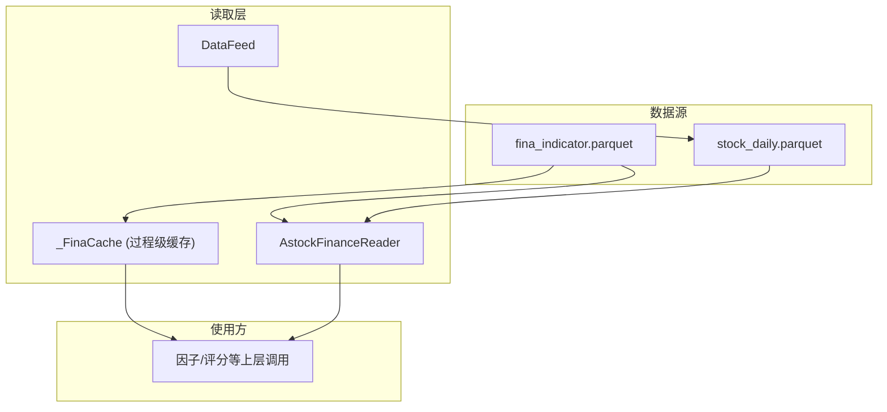
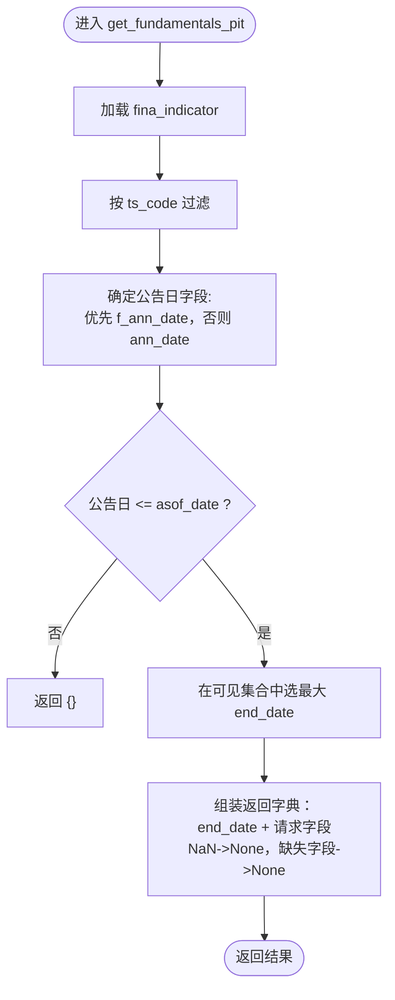
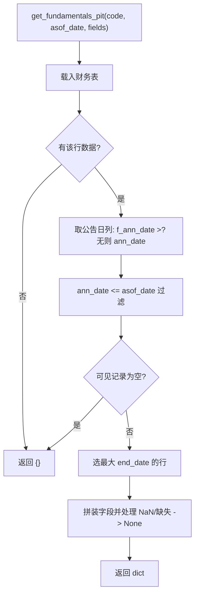
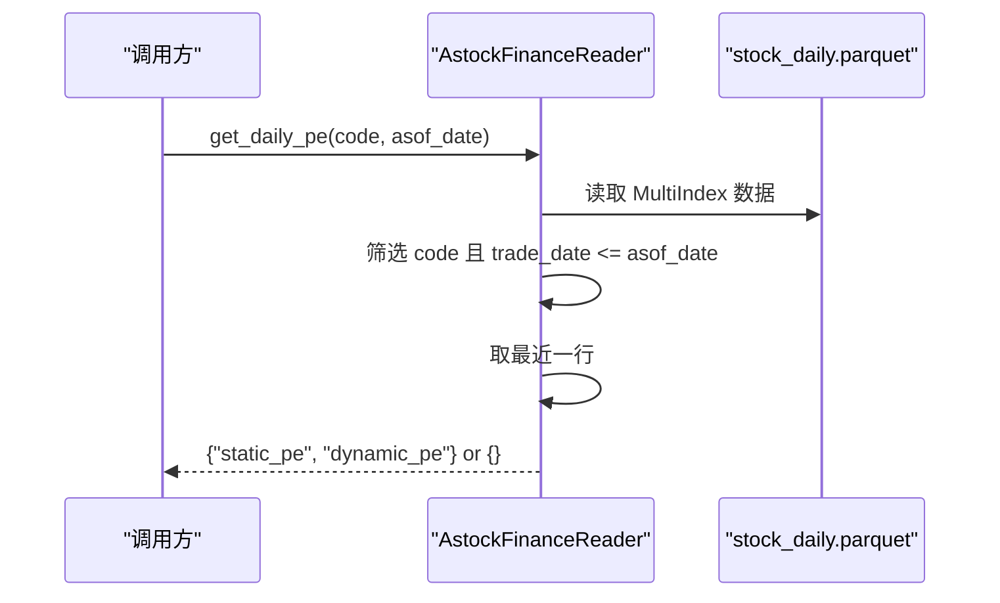
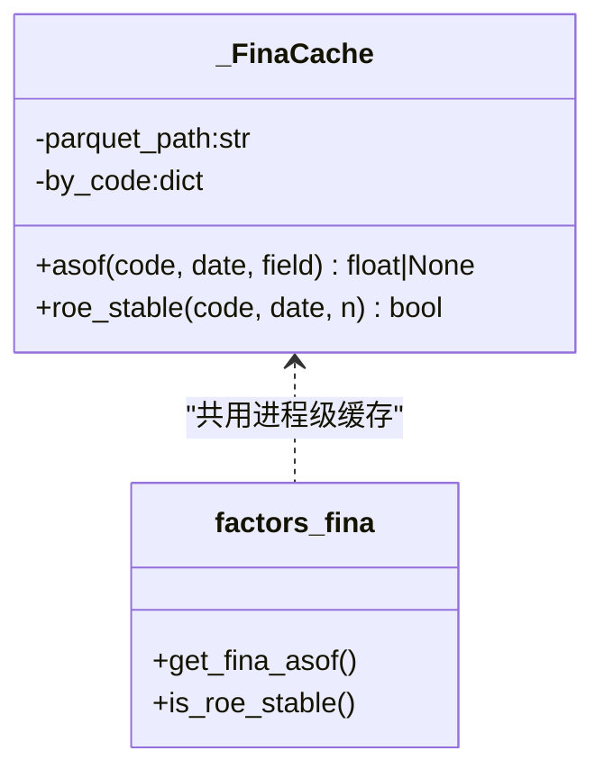
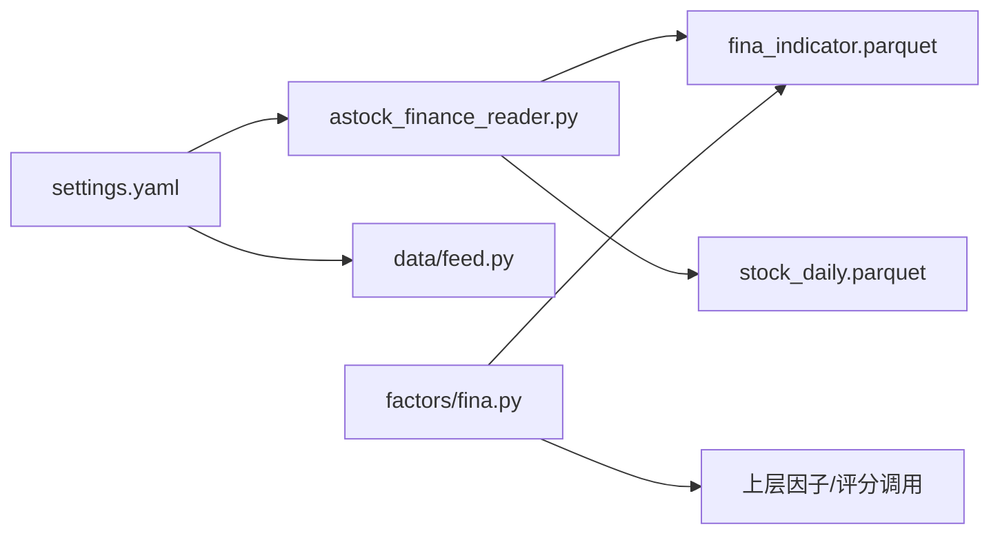

# 财务数据PIT安全处理

<cite>
**本文引用的文件**
- [astock_finance_reader.py](file://data/astock_finance_reader.py)
- [fina.py](file://factors/fina.py)
- [roe.py](file://factors/roe.py)
- [feed.py](file://data/feed.py)
- [settings.yaml](file://config/settings.yaml)
</cite>

## 目录
1. [简介](#简介)
2. [项目结构](#项目结构)
3. [核心组件](#核心组件)
4. [架构总览](#架构总览)
5. [关键组件详解](#关键组件详解)
6. [依赖与关系分析](#依赖与关系分析)
7. [性能考量与优化建议](#性能考量与优化建议)
8. [故障排查指南](#故障排查指南)
9. [结论](#结论)
10. [附录](#附录)（如需）

## 简介
本技术文档聚焦QuantLab中财务数据PIT（Point-in-Time，时点安全）安全处理，围绕实现层 AstockFinanceReader 的原理、过滤策略、边界条件与扩展开发进行系统性阐述。核心目标：
- 解释 PIT 安全的概念与必要性，说明前视偏差对回测的严重危害。
- 详细说明 get_fundamentals_pit 的分步过滤逻辑、公告日选择策略（f_ann_date 优先于 ann_date）、财报期间 end_date 选取（取可见记录中最晚期间）。
- 解释 get_daily_pe 的日线快照截取方法（基于 stock_daily.parquet 中的 pe/pe_ttm）。
- 给出典型使用范式、常见陷阱避免方法和最佳实践规范，并包含面向扩展开发的建议与验证思路。

## 项目结构
与财务PIT相关的主要代码位于 data 与 factors 两层：
- data/astock_finance_reader.py：封装财务指标（季度/年度）与日频PE的PIT查询接口，负责公告时间过滤、期间挑选与快照截取。
- factors/fina.py & factors/roe.py：提供共享缓存式“截至某日期”的财务字段加载，供因子计算复用同一份 parquet，减少重复IO与内存占用。
- data/feed.py：统一数据入口，读取 astock daily parquet；与 finance reader 形成协同（daily 与财务分离存放，finance reader 专注PIT规则）。
- config/settings.yaml：集中声明 astock 路径常量（daily_path、finance_path），便于环境与模块间路径对齐。

图表来源
- [astock_finance_reader.py:1-L20](file://data/astock_finance_reader.py#L1-L20)
- [fina.py:1-L18](file://factors/fina.py#L1-L18)
- [feed.py:10-L14](file://data/feed.py#L10-L14)

章节来源
- [astock_finance_reader.py:1-L20](file://data/astock_finance_reader.py#L1-L20)
- [fina.py:1-L18](file://factors/fina.py#L1-L18)
- [feed.py:10-L14](file://data/feed.py#L10-L14)
- [settings.yaml:11-L15](file://config/settings.yaml#L11-L15)

## 核心组件
- AstockFinanceReader：PIT安全的财务与PE访问器
  - _load_fina/_load_daily：懒加载 parquet，按端要求构建索引与校验基础结构。
  - get_fundamentals_pit：公告时间过滤 + 最新期间选择 + 缺失值转换。
  - get_daily_pe：在日线快照中筛选 trade_date <= asof_date，取最近交易日结果。
  - get_fundamentals_for_scoring：封装常用字段（动态PE、静态PE）供评分管线。
- _FinaCache（process-wide cache）：仅按需列加载，按 ts_code 分组排序后以二分查找取得 asof 值，ROE稳定性判断亦复用该缓存。
- DataFeed：统一 astock 日线数据访问，作为 daily PE 的数据底座之一（更偏 OHLCV 面板，与财务 PIT 解耦）。

章节来源
- [astock_finance_reader.py:36-L60](file://data/astock_finance_reader.py#L36-L60)
- [astock_finance_reader.py:66-L129](file://data/astock_finance_reader.py#L66-L129)
- [astock_finance_reader.py:135-L174](file://data/astock_finance_reader.py#L135-L174)
- [fina.py:23-L48](file://factors/fina.py#L23-L48)
- [fina.py:65-L78](file://factors/fina.py#L65-L78)
- [feed.py:71-L104](file://data/feed.py#L71-L104)

## 架构总览
PIT 安全的核心是：在任何回溯时点 T，只能使用“在该时点之前已公开披露”且“当时已知最新”的财务与估值信息。为此：
- 财务指标采用“公告时间”约束：f_ann_date 优先，否则回退到 ann_date；只有公告日不超过 asof_date 的记录才被视为“可见”。
- 在可见记录内，选择 end_date 最大的那条财报作为当时可用的最新期间结果。
- 日频估值（PE/PE_TTM）采用 stock_daily.parquet 的逐日快照，天然抗前瞻；再叠加 trade_date <= asof_date 的安全边界，避免错误使用未来交易日的行情。

图表来源
- [astock_finance_reader.py:66-L129](file://data/astock_finance_reader.py#L66-L129)

章节来源
- [astock_finance_reader.py:66-L129](file://data/astock_finance_reader.py#L66-L129)

## 关键组件详解

### PIT安全的必要性与风险
- 前视偏差的典型表现：若在 t 时点用尚未公告的财务数据（或未来期间的数据）做选股/打分，会虚高收益、扭曲IC、导致策略在未来实盘中失效。
- 本项目通过两条防线保障：
  - 财务侧：以 f_ann_date/ann_date <= asof_date 控制数据可见性。
  - 估值侧：日频 PE 取自 stock_daily.parquet 的当日快照，并结合 trade_date <= asof_date 保证不穿越当前时点。

章节来源
- [astock_finance_reader.py:8-L11](file://data/astock_finance_reader.py#L8-L11)
- [settings.yaml:11-L15](file://config/settings.yaml#L11-L15)

### AstockFinanceReader.get_fundamentals_pit 详解
- 输入：ts_code（如 "600000.SH"）、asof_date（字符串或可比较日期）、可选 fields。
- 步骤：
  1) 加载 fina_indicator.parquet；
  2) 筛选目标 code 行；若无数据直接返回空字典；
  3) 公告日选择策略：若存在 f_ann_date，则优先用于过滤；否则回退 ann_date；
  4) 将 asof_date 转换为可比字符串形式，过滤出公告日不大于 asof_date 的“可见”记录；
  5) 在可见集里，选择 end_date 最大的那条，即当时已披露的最新一期财务；
  6) 提取 fields：缺失字段置 None，NaN 也置 None；始终附带 end_date 便于追溯。
- 返回值：dict {field: value}，表示截至 asof_date 对该股票“可用”的财务快照。

图表来源
- [astock_finance_reader.py:66-L129](file://data/astock_finance_reader.py#L66-L129)

章节来源
- [astock_finance_reader.py:66-L129](file://data/astock_finance_reader.py#L66-L129)

### AstockFinanceReader.get_daily_pe 详解
- 输入：code、asof_date。
- 行为：
  - 从 stock_daily.parquet 拉取 MultiIndex（trade_date, ts_code）；
  - 筛选 ts_code == code 且 trade_date <= asof_date；
  - 取最后一条（最近交易日）的 pe、pe_ttm；
  - 返回 {"static_pe": pe or None, "dynamic_pe": pe_ttm or None}；没有数据时返回 {}。
- 设计要点：日线快照天然具备时间不可逆性，配合 trade_date 约束双重防漏。

图表来源
- [astock_finance_reader.py:135-L174](file://data/astock_finance_reader.py#L135-L174)

章节来源
- [astock_finance_reader.py:135-L174](file://data/astock_finance_reader.py#L135-L174)

### ROE等字段的as-of读取（_FinaCache）
- 为节省进程内多次 IO，factors/fina.py 对必要的几列（roe/fcff/fcfe/ocfps）做单例缓存，按 ts_code 分组并依据 end_date 排序，利用二分搜索取得指定日期之前的最新值。
- 同时提供 is_roe_stable(code, date, n)：判断最近 n 个报告期 ROE 是否全部大于0，便于质量筛选。

图表来源
- [fina.py:23-L78](file://factors/fina.py#L23-L78)

章节来源
- [fina.py:23-L78](file://factors/fina.py#L23-L78)
- [roe.py:1-L14](file://factors/roe.py#L1-L14)

### 与数据源路径的关系
- settings.yaml 集中声明 astock daily_path 与 finance_path，避免分散配置引发路径不一致。
- feed.py 与 finance reader 各自持有默认路径常量，建议遵循单一配置入口，确保模块间一致。

章节来源
- [settings.yaml:11-L15](file://config/settings.yaml#L11-L15)
- [feed.py:10-L14](file://data/feed.py#L10-L14)
- [astock_finance_reader.py:19-L21](file://data/astock_finance_reader.py#L19-L21)

## 依赖与关系分析
- 数据依赖：
  - AstockFinanceReader._load_fina 依赖 fina_indicator.parquet；
  - AstockFinanceReader._load_daily 依赖 stock_daily.parquet；
  - _FinaCache 仅按需读取少量列以减少开销；
  - feed.DataFeed 主要消费 stock_daily.parquet 的 OHLCV+估值等日线列。
- 函数耦合：
  - get_fundamentals_pit 强依赖财务报告表结构与关键字段（ts_code、f_ann_date/ann_date、end_date、若干财务列）；
  - get_daily_pe 依赖 stock_daily 的多索引结构与 pe、pe_ttm 列；
  - factors 层通过 _FinaCache 独立维护 afof 语义，避免与 finance reader 的全量 DataFrame 耦合。
- 外发/外部：
  - 纯只读文件I/O，不涉及网络；异常集中在文件不存在和数据结构校验。

图表来源
- [settings.yaml:11-L15](file://config/settings.yaml#L11-L15)
- [astock_finance_reader.py:19-L21](file://data/astock_finance_reader.py#L19-L21)
- [feed.py:10-L14](file://data/feed.py#L10-L14)
- [fina.py:17-L18](file://factors/fina.py#L17-L18)

章节来源
- [astock_finance_reader.py:19-L21](file://data/astock_finance_reader.py#L19-L21)
- [feed.py:10-L14](file://data/feed.py#L10-L14)
- [fina.py:17-L18](file://factors/fina.py#L17-L18)

## 性能考量与优化建议
- 惰性加载与进程级缓存
  - AstockFinanceReader 对两份 parquet 采用实例级懒加载；_FinaCache 为 process-wide 共享，避免因子/多策略重复读盘。
- 列裁剪与索引优化
  - _FinaCache 仅读必要列（roe/fcff/fcfe/ocfps 及 end_date/ts_code），显著降低内存带宽与解析成本；
  - stock_daily 读取使用 MultiIndex（trade_date, ts_code）加速切片定位。
- 过滤顺序与时序复杂度
  - get_fundamentals_pit 先按 ts_code 过滤，再公告时间过滤，最后选 end_date 最大——时间复杂度近似 O(n_code)，对全市场滚动场景友好。
- 可能的进一步优化
  - 对超大规模财报表，可按 ts_code 建立外部索引或分区存储，避免每次加载整表；
  - 对于高频批量 asof 查询，可将多个 asof_date 合并批处理，减少循环扫描；
  - 缓存失效策略：当底层 parquet mtime 变更时主动重建缓存（当前未实现，可在 _load_* 中加入校验）。

[本节为通用性能讨论，无需特定源码引用]

## 故障排查指南
- 文件找不到
  - fina_indicator.parquet 或 stock_daily.parquet 路径不存在会抛 FileNotFoundError；检查 settings.yaml 与实际数据路径一致性。
- 数据格式不符
  - stock_daily 非 MultiIndex 或未设置正确的 index names 会导致后续过滤失败；_load_daily 内置了对 index names 的修复。
- 结果为空字典
  - 若 asof_date 早于最早公告/无对应 code/无可用地快照，均返回 {}; 需要核查数据覆盖区间与 code 是否存在。
- 字段缺失与NaN
  - 缺失字段返回 None；数值 NaN 转为 None，上游应做好空值分支。
- 缓存问题
  - _FinaCache 全局单例，若数据更新但进程未重启可能出现旧缓存；建议在数据更新后重启进程或由业务触发缓存重建。

章节来源
- [astock_finance_reader.py:42-L60](file://data/astock_finance_reader.py#L42-L60)
- [astock_finance_reader.py:66-L129](file://data/astock_finance_reader.py#L66-L129)
- [astock_finance_reader.py:135-L174](file://data/astock_finance_reader.py#L135-L174)
- [fina.py:23-L48](file://factors/fina.py#L23-L48)

## 结论
本仓库通过 AstockFinanceReader 与 _FinaCache 双管齐下，实现了严格的财务与估值数据的 PIT 安全：前者以公告时间与财报期间约束保证“当时可见”，后者以高效的 asof 读取满足因子/评分的高并发需求。结合 stock_daily.parquet 的天然日频快照，实现了从基本面到估值的端到端前视偏差防护。建议在扩展新字段或新增数据源时延续同样原则：明确时间点可见性与数据来源时序约束，配套单元测试与回归审计。

[本节总结性内容，不包含具体源码引用]

## 附录

### 使用示例（示意）
- 获取某股票在某日的财务快照（PIT安全）
  - 用法参考：reader.get_fundamentals_pit("600000.SH", "YYYY-MM-DD", fields=...) 
  - 返回 dict，包含 end_date 与各字段（NaN/缺失转 None）。
- 获取某股票在某日的静态/动态 PE
  - 用法参考：reader.get_daily_pe("600000.SH", "YYYY-MM-DD")
  - 返回 {"static_pe": ..., "dynamic_pe": ...} 或 {}。
- 聚合PE供评分
  - 用法参考：reader.get_fundamentals_for_scoring(codes, asof_date)
  - 返回 {code: {dynamic_pe, static_pe}}，便于统一评分管道。

[以上为方法调用示意，代码片段见下方来源]

章节来源
- [astock_finance_reader.py:26-L34](file://data/astock_finance_reader.py#L26-L34)
- [astock_finance_reader.py:180-L191](file://data/astock_finance_reader.py#L180-L191)

### 边界条件测试建议
- 公告日边界
  - 测试 asof_date 等于 f_ann_date/ann_date 的当天、前一天、后一天的行为；确认严格不等号方向。
- end_date 并列情况
  - 若有同 period end_date，应确认选择逻辑稳定（当前实现按 idxmax，需验证其确定性）。
- 极端缺失
  - 无该股票的财报、asof_date 早于首条公告、请求字段不在表中；均应正确返回空字典或 None。
- PE快照缺失
  - 某日无法得到 pe/pe_ttm 时应优雅降级为 None，不会崩溃。

[基于实现逻辑推导的测试建议，无需额外源码引用]

### 最佳实践与常见陷阱
- 最佳实践
  - 所有财务相关特征一律通过 get_fundamentals_pit 或 _FinaCache.asof 获取，禁止绕过公告时间过滤；
  - 统一通过 settings.yaml 管理 astock 路径，避免硬编码；
  - 在评估指标前，先检查返回是否为空，再进行下游计算。
- 常见陷阱
  - 直接用 end_date 代替公告日作为“可见性”标准，易引入前视偏差（必须用 f_ann_date/ann_date）；
  - 使用 stock_daily 任意一行而非 “<= asof_date 的最后一行”，造成数据穿越；
  - 忽略空值与缺失字段处理，导致下游统计/打分产生隐式填充或误差。

章节来源
- [astock_finance_reader.py:92-L106](file://data/astock_finance_reader.py#L92-L106)
- [astock_finance_reader.py:148-L174](file://data/astock_finance_reader.py#L148-L174)

### 扩展开发指导
- 新增财报字段
  - 在 DEFAULT_FIELDS 扩展字段并在结果拼装中保留 NaN->None 的策略；必要时在 _load_fina 中加入列白名单以提高效率。
- 支持多数据源（如 DuckDB）
  - 参考 DataFeed 的 duck-typed 思想，为财务数据构造统一的 Reader，保持 get_fundamentals_pit 语义不变。
- 提升大数据场景性能
  - 考虑将财务指标按 ts_code 预构建有序索引（如键表+分片存储）；对批量 asof 查询引入批处理框架。
- 可观测性与审计
  - 增加关键事件日志（公告日过滤命中数、最终 end_date 落点），便于回放与审计。

[本节面向扩展开发的概念性指导，无特定源码绑定]