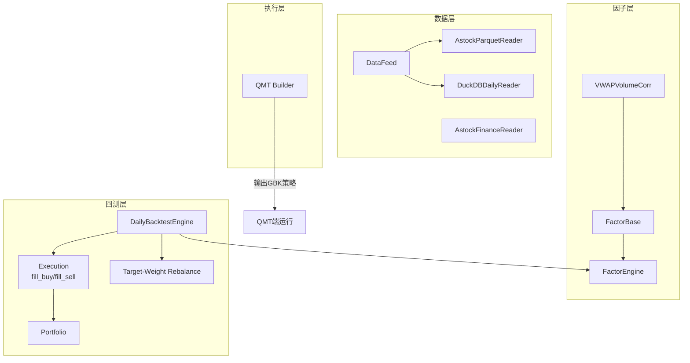
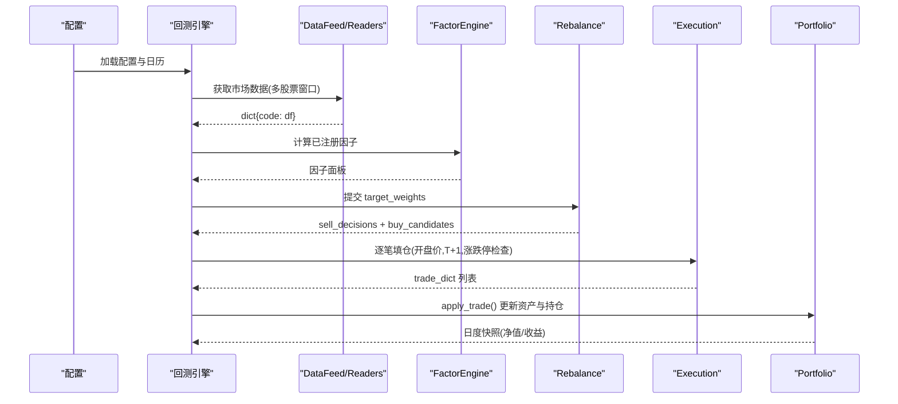
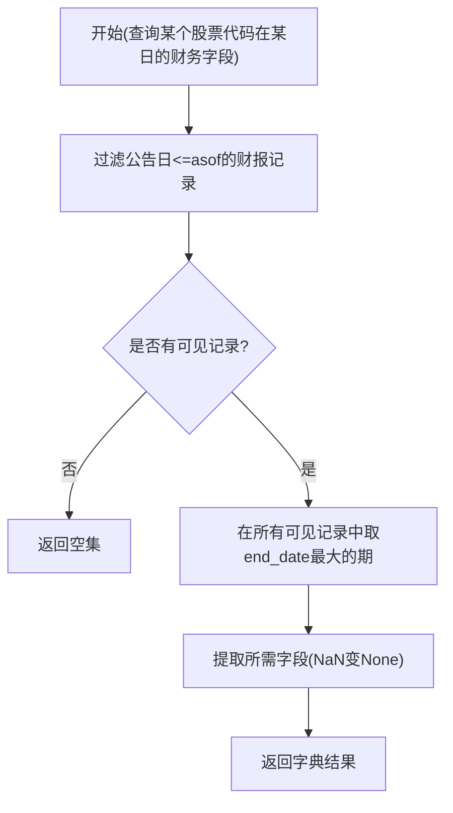
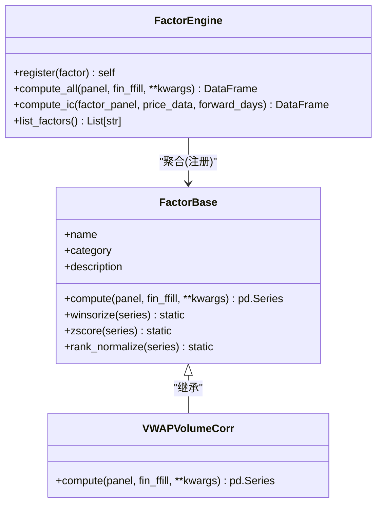
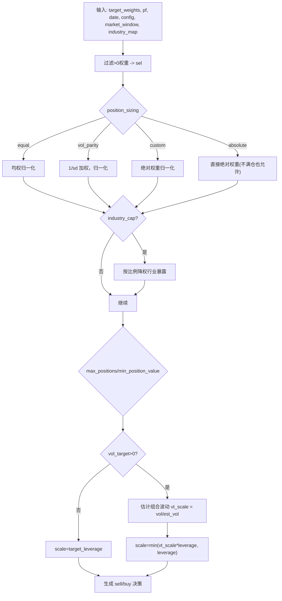
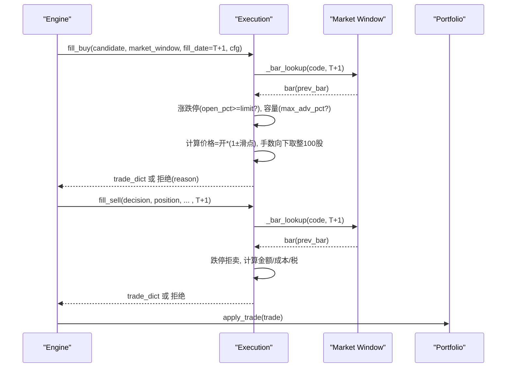
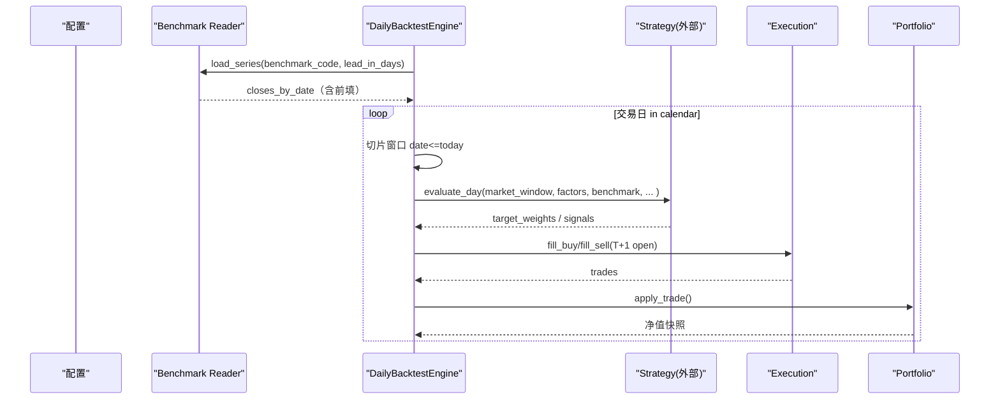
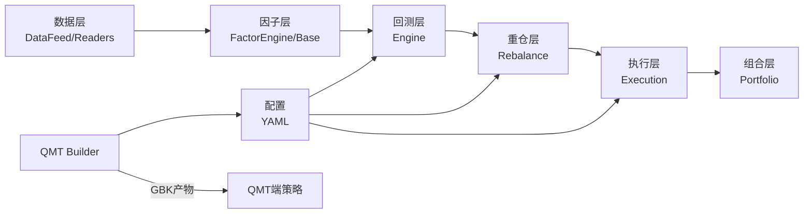

# 系统架构设计

<cite>
**本文档引用的文件**
- [data/feed.py](file://data/feed.py)
- [data/astock_reader.py](file://data/astock_reader.py)
- [data/duckdb_reader.py](file://data/duckdb_reader.py)
- [data/astock_finance_reader.py](file://data/astock_finance_reader.py)
- [factors/base.py](file://factors/base.py)
- [factors/engine.py](file://factors/engine.py)
- [factors/vwap_volume_corr.py](file://factors/vwap_volume_corr.py)
- [backtest/engine.py](file://backtest/engine.py)
- [backtest/execution.py](file://backtest/execution.py)
- [backtest/portfolio.py](file://backtest/portfolio.py)
- [backtest/rebalance.py](file://backtest/rebalance.py)
- [broker/qmt_builder.py](file://broker/qmt_builder.py)
</cite>

## 目录
1. [介绍](#介绍)
2. [项目结构](#项目结构)
3. [核心组件](#核心组件)
4. [架构总览](#架构总览)
5. [详细组件分析](#详细组件分析)
6. [依赖关系分析](#依赖关系分析)
7. [性能考虑](#性能考虑)
8. [故障排查指南](#故障排查指南)
9. [结论](#结论)
10. [附录：新模块扩展指南](#附录：新模块扩展指南)

## 介绍
本仓库实现了一套面向 A 股的量化研究与交易框架，围绕“数据—因子—策略—回测—执行”的分层架构组织。其设计目标包括：
- 数据层：提供统一的数据接口，支持 astock parquet 与 DuckDB 双引擎；财务数据严格遵循 PIT（点-in-时间）安全，避免前视偏差。
- 因子层：基于基类 FactorBase 构建标准化因子；通过 FactorEngine 注册、批量计算与 IC 评估。
- 策略层：采用 next_open 模型主循环的回测引擎，策略只需输出目标权重或信号；重仓逻辑与风控可配置化。
- 执行层：回测内模拟成交撮合；实盘由 QMT 构建器生成单文件策略并落地到交易端。
- 集成性：通过统一的鸭子类型读取器和抽象层，便于扩展新的数据源、因子或策略。

本架构文档重点解释各层职责边界、接口契约、数据流与控制流，以及关键技术决策如 PIT 安全与 next_open 时序模型的实现与原因。

## 项目结构
从代码组织看，本项目将关注点分层到独立目录：
- data：数据读取与清洗，统一 DataFeed 入口，astock/DuckDB 双实现，财务数据 PIT 安全读取器。
- factors：因子库，基类与引擎实现，内置量价因子示例。
- backtest：回测主循环、组合管理、执行撮合、再平衡策略、指标与报告。
- broker：QMT 策略构建器与订单包装器（生产部署）。
- config：YAML 配置文件与参数表。
- projects：按策略隔离的开发与研究子工程。
- mcp：MCP 服务与外部数据桥接（不在本次架构范围展开）。

图表来源
- [data/feed.py:17-124](file://data/feed.py#L17-L124)
- [data/astock_reader.py:68-162](file://data/astock_reader.py#L68-L162)
- [data/duckdb_reader.py:35-132](file://data/duckdb_reader.py#L35-L132)
- [factors/base.py:9-52](file://factors/base.py#L9-L52)
- [factors/engine.py:9-85](file://factors/engine.py#L9-L85)
- [factors/vwap_volume_corr.py:18-67](file://factors/vwap_volume_corr.py#L18-L67)
- [backtest/engine.py:1-26](file://backtest/engine.py#L1-L26)
- [backtest/execution.py:1-24](file://backtest/execution.py#L1-L24)
- [backtest/portfolio.py:1-14](file://backtest/portfolio.py#L1-L14)
- [backtest/rebalance.py:1-25](file://backtest/rebalance.py#L1-L25)
- [broker/qmt_builder.py:21-54](file://broker/qmt_builder.py#L21-L54)

章节来源
- [data/feed.py:17-182](file://data/feed.py#L17-L182)
- [data/astock_reader.py:23-172](file://data/astock_reader.py#L23-L172)
- [data/duckdb_reader.py:35-199](file://data/duckdb_reader.py#L35-L199)
- [data/astock_finance_reader.py:26-199](file://data/astock_finance_reader.py#L26-L199)
- [factors/base.py:9-52](file://factors/base.py#L9-L52)
- [factors/engine.py:9-85](file://factors/engine.py#L9-L85)
- [factors/vwap_volume_corr.py:18-114](file://factors/vwap_volume_corr.py#L18-L114)
- [backtest/engine.py:1-200](file://backtest/engine.py#L1-L200)
- [backtest/execution.py:26-200](file://backtest/execution.py#L26-L200)
- [backtest/portfolio.py:38-188](file://backtest/portfolio.py#L38-L188)
- [backtest/rebalance.py:101-200](file://backtest/rebalance.py#L101-L200)
- [broker/qmt_builder.py:21-200](file://broker/qmt_builder.py#L21-L200)

## 核心组件
- DataFeed：统一数据接入，屏蔽 astock parquet 与 DuckDB 差异，返回统一 MultiIndex 面板。
- AstockParquetReader / DuckDBDailyReader：实现一致的 4 方法接口（load_window、trading_calendar、coverage、close），前者合并增量 parquet，后者对双 schema 兼容并做 WAL 检测。
- AstockFinanceReader：PIT 安全的财务快照读取器，依据公告日期筛选，保证只使用截至 asof 已披露的信息。
- FactorBase/FactorEngine/VWAPVolumeCorr：因子标准接口与注册机制；内置因子展示截面 rank/Spearman 相关性处理流程。
- DailyBacktestEngine：next_open 模型的主循环；加载市场数据、基准指数、计算策略信号，调用执行和仓位管理。
- Execution：T+1 开盘成交撮合，考虑涨跌停限制、滑点、佣金、印花税与流动性容量上限。
- Portfolio：T+1 可用规则下的持仓跟踪与日终估值更新。
- Rebalance：将目标权重转换为卖/买决策，内置行业暴露限制、波动率目标、杠杆约束等通用风控。
- QMT Builder：将研究策略打包为 GBK 单文件策略，注入生命周期与风控逻辑。

章节来源
- [data/feed.py:17-124](file://data/feed.py#L17-L124)
- [data/astock_reader.py:68-162](file://data/astock_reader.py#L68-L162)
- [data/duckdb_reader.py:35-132](file://data/duckdb_reader.py#L35-L132)
- [data/astock_finance_reader.py:26-199](file://data/astock_finance_reader.py#L26-L199)
- [factors/base.py:9-52](file://factors/base.py#L9-L52)
- [factors/engine.py:9-85](file://factors/engine.py#L9-L85)
- [factors/vwap_volume_corr.py:18-114](file://factors/vwap_volume_corr.py#L18-L114)
- [backtest/engine.py:1-200](file://backtest/engine.py#L1-L200)
- [backtest/execution.py:26-200](file://backtest/execution.py#L26-L200)
- [backtest/portfolio.py:38-188](file://backtest/portfolio.py#L38-L188)
- [backtest/rebalance.py:101-200](file://backtest/rebalance.py#L101-L200)
- [broker/qmt_builder.py:21-200](file://broker/qmt_builder.py#L21-L200)

## 架构总览
整体数据与控制流向如下：
- 数据流：DataFeed → (astock/DuckDB reader) → panel/factors 输入面；财务数据通过 FinanceReader 提供 PIT 对齐的横截面值。
- 因子流：注册多个 FactorBase 实例，批量 compute 生成因子面板，供策略打分。
- 回测主循环：engine 遍历交易日日历，切片历史窗口，调用策略得到目标权重；rebalance 转为 sell/buy 决策；execution 以 T+1 开盘价撮合；portfolio 更新净值与持仓。
- 实盘桥接：qmt_builder 读取配置与策略逻辑，自动生成 GBK 策略并注入 init/handlebar/exit 生命周期。

图表来源
- [backtest/engine.py:1-200](file://backtest/engine.py#L1-L200)
- [data/feed.py:17-124](file://data/feed.py#L17-L124)
- [factors/engine.py:9-85](file://factors/engine.py#L9-L85)
- [backtest/rebalance.py:101-200](file://backtest/rebalance.py#L101-L200)
- [backtest/execution.py:26-200](file://backtest/execution.py#L26-L200)
- [backtest/portfolio.py:38-188](file://backtest/portfolio.py#L38-L188)

## 详细组件分析

### 数据层：DataFeed 与双引擎
- DataFeed 通过 source 分发至 astock parquet 或 DuckDB，统一输出 MultiIndex 面板。该抽象使得后续层无需感知存储细节。
- AstockParquetReader 从本地 parquet 读取并可选复权调整；同时支持增量周包合并（主仓+Updatedata 增量），去重后保留最新值，提升近实时性。
- DuckDBDailyReader 支持两种 schema（jince_zhisuan 与 qmt_self_owned），对双时间戳进行去重与日期规范化，默认仅读，具备 WAL 检测以避免同步期间不一致。

关键要点
- 一致接口：load_window/trading_calendar/coverage/close，便于替换或扩展新 reader。
- 数据质量：避免重复行、校验覆盖范围、检测 WAL 并发同步。

章节来源
- [data/feed.py:17-124](file://data/feed.py#L17-L124)
- [data/astock_reader.py:68-172](file://data/astock_reader.py#L68-L172)
- [data/duckdb_reader.py:35-199](file://data/duckdb_reader.py#L35-L199)

### 数据层：PIT 财务读取器
- AstockFinanceReader 使用 ann_date/f_ann_date 判断财报可见性，并在“可见集合内选择最大 end_date”，确保在 asof 时不可获知未来披露信息。
- 提供每日 PE 快照，同样要求 trade_date <= asof。

PIT 决策流程图

图表来源
- [data/astock_finance_reader.py:66-129](file://data/astock_finance_reader.py#L66-L129)
- [data/astock_finance_reader.py:135-174](file://data/astock_finance_reader.py#L135-L174)

章节来源
- [data/astock_finance_reader.py:26-199](file://data/astock_finance_reader.py#L26-L199)

### 因子层：FactorBase 体系
- FactorBase 定义 compute(panel, fin_ffill, **kwargs) 抽象；提供 winsorize/zscore/rank_normalize 静态预处理方法。
- 新因子需继承基类实现 compute，并通过 FactorEngine 注册后可批处理并评估 IC/ICIR。

类关系图

图表来源
- [factors/base.py:9-52](file://factors/base.py#L9-L52)
- [factors/engine.py:9-85](file://factors/engine.py#L9-L85)
- [factors/vwap_volume_corr.py:18-67](file://factors/vwap_volume_corr.py#L18-L67)

章节来源
- [factors/base.py:9-52](file://factors/base.py#L9-L52)
- [factors/engine.py:9-85](file://factors/engine.py#L9-L85)
- [factors/vwap_volume_corr.py:18-114](file://factors/vwap_volume_corr.py#L18-L114)

### 策略层与重仓：Target-Weights 到买卖决策
- Rebalance 接收 target_weights，基于 position_sizing（equal/vol_parity/custom/absolute）、industry_cap、max_positions、min_position_value、vol_target、target_leverage 等配置产生 sell_decisions 与 buy_candidates。
- 优势：策略仅需输出权重，风控与执行细节下沉至公共层，降低重复造轮子风险。

图表来源
- [backtest/rebalance.py:101-200](file://backtest/rebalance.py#L101-L200)

章节来源
- [backtest/rebalance.py:101-200](file://backtest/rebalance.py#L101-L200)

### 执行层：next_open 模型撮合
- next_open 模型的核心语义：T 日信号，T+1 开盘价成交。买入价格 = open*(1+slippage)，卖出价格 = open*(1-slippage)。若 T+1 未成交（停牌/涨跌停/流动性不足）则被拒绝，且给出具体原因。
- 涨跌停判断考虑双创（20%）、主板（10%）、ST（5%），以 open_pct 阈值拒单。
- 流动性容量上限 max_adv_pct 以“前一交易日成交额”为代理，防止过度冲击。

撮合顺序图

图表来源
- [backtest/execution.py:26-200](file://backtest/execution.py#L26-L200)
- [backtest/portfolio.py:38-188](file://backtest/portfolio.py#L38-L188)

章节来源
- [backtest/execution.py:26-200](file://backtest/execution.py#L26-L200)
- [backtest/portfolio.py:38-188](file://backtest/portfolio.py#L38-L188)

### 回测主循环与基准对齐
- Engine 负责载入运行日历、基准指数时间序列（缺失时用前值补齐）、切片历史窗口至当日、调用策略与执行流程，并写报告。
- 基准对齐：从指定 duckdb 取基准收盘价，按 run calendar 前向填充，缺失头部的短空窗容忍 14 天。

图表来源
- [backtest/engine.py:38-99](file://backtest/engine.py#L38-L99)
- [backtest/engine.py:110-146](file://backtest/engine.py#L110-L146)

章节来源
- [backtest/engine.py:1-200](file://backtest/engine.py#L1-L200)

### 执行层：QMT 构建器
- qmt_builder 读取配置（资金、止损、仓位上限、因子权重等），组装 GBK 编码的单文件策略源码，内含 init/handlebar/exit 生命周期，及下单、止损、调仓等逻辑。
- 约定：GBK 编码、Python 3.6.8 兼容语法、账号 ID 硬编码、禁止 mock 残留等。

章节来源
- [broker/qmt_builder.py:21-200](file://broker/qmt_builder.py#L21-L200)

## 依赖关系分析
- 数据层依赖本地文件或 DuckDB；finance 依赖 parquet；factor 依赖 panel 与 fin_ffill。
- 回测层依赖数据层和因子层，并通过 rebalance 与 execution 解耦策略与执行细节。
- QMT 构建器依赖配置与模块化策略逻辑，输出自包含产品。

图表来源
- [data/feed.py:17-124](file://data/feed.py#L17-L124)
- [factors/engine.py:9-85](file://factors/engine.py#L9-L85)
- [backtest/engine.py:1-200](file://backtest/engine.py#L1-L200)
- [backtest/rebalance.py:101-200](file://backtest/rebalance.py#L101-L200)
- [backtest/execution.py:26-200](file://backtest/execution.py#L26-L200)
- [backtest/portfolio.py:38-188](file://backtest/portfolio.py#L38-L188)
- [broker/qmt_builder.py:21-200](file://broker/qmt_builder.py#L21-L200)

章节来源
- [backtest/engine.py:1-200](file://backtest/engine.py#L1-L200)
- [backtest/rebalance.py:101-200](file://backtest/rebalance.py#L101-L200)
- [backtest/execution.py:26-200](file://backtest/execution.py#L26-L200)
- [data/feed.py:17-124](file://data/feed.py#L17-L124)
- [factors/engine.py:9-85](file://factors/engine.py#L9-L85)
- [broker/qmt_builder.py:21-200](file://broker/qmt_builder.py#L21-L200)

## 性能考虑
- 数据读取优化：
  - astock reader 仅读取必要列，结合 MultiIndex 过滤，减少内存占用与扫描开销；增量合并后去重保留最新。
  - DuckDB reader 使用 SQL 直接查询，按区间过滤并 groupby 输出，避免全量加载。
- 回溯窗口快速切片：
  - 预计算 cut_index（searchsorted），每日切分 O(1)，加速滚动因子计算。
- 执行撮合：
  - 以 bar lookup + searchsorted 定位当日 bar，涨跌停与容量限制早期短路，减少后续计算。
- 因子计算：
  - 截面排序与 rolling 操作向量化；IC 计算逐日分组统计，注意样本量门槛，跳过无效日。

[本节为通用指导，不直接引用具体代码行]

## 故障排查指南
- 基准数据缺失或头部空窗过大：当基准首日远晚于回测起始时，引擎会返回错误提示；建议确认基准库路径与覆盖区间。
- 涨跌停导致无法成交：当 T+1 开盘涨幅达到限制上沿或被限制下沿触及时会被拒绝；应检查信号是否避开极端行情，或通过风控调整。
- 流动性受限：若 target_cash 超过前一交易日成交额的一定比例，将被 capacity_exceeded 拒绝；可适当降低单次规模或分批执行。
- 停牌与无数据：T+1 查不到 bar 直接视为 suspended；需排查数据源或代码映射。
- WAL 警告：检测到 duckdb.wal 说明数据库可能正在同步，数据哈希不稳定，应避免在同步期间出结果。
- 增量合并失败：当 data_config 导入异常时会跳过增量，回退到主仓；请检查增量路径与权限。

章节来源
- [backtest/engine.py:38-99](file://backtest/engine.py#L38-L99)
- [backtest/execution.py:60-106](file://backtest/execution.py#L60-L106)
- [data/duckdb_reader.py:63-75](file://data/duckdb_reader.py#L63-L75)
- [data/astock_reader.py:27-65](file://data/astock_reader.py#L27-L65)

## 结论
本系统通过清晰的层次划分与稳定的接口契约，实现了从数据到执行的完整闭环：数据层统一抽象、因子层可扩展、策略层解耦、回测层稳健、实盘可迁移。关键设计包括：
- 双引擎数据接入与 PIT 安全财务读取，保障数据正确性与可靠性。
- next_open 模型确保信号与成交的时序严谨，避免盘中穿越与价格偷换。
- 统一的重仓抽象将策略意图与执行细节分离，增强可维护性与一致性。
- QMT 构建器桥接研究环境与实盘生产，满足合规与安全性要求。

## 附录：新模块扩展指南

- 新增数据源
  - 步骤：
    - 实现一个满足 4 方法接口的 reader（load_window/trading_calendar/coverage/close），保持输出列与格式一致。
    - 在 DataFeed 中添加对应 source 分支，或在已有 reader 基础上增加默认过滤器。
  - 注意事项：
    - 遵守 PIT 语义（财务数据）；对增量数据做去重与版本标记。
    - 提供 coverage 信息以供上层验证覆盖范围与时间戳。

- 新增因子
  - 步骤：
    - 继承 FactorBase，实现 compute(panel, fin_ffil, **kwargs)，并确保输入校验、NaN 处理与方向控制（正负含义清晰）。
    - 通过 FactorEngine.register 注册，并使用 compute_all 批量生成因子面板，必要时用 compute_ic 评估稳定性。
  - 注意事项：
    - 尽量使用截面 rank/Spearman 相关等鲁棒方式；避免对少量异常值敏感的计算。
    - 若依赖财务数据，请使用 PIT 读取器保证无前视。

- 新增策略
  - 步骤：
    - 在项目中编写策略 evaluate_day，输出 target_weights（{code: weight}）。
    - 通过 rebinance 层转化为实际买卖决策，利用通用风控（行业暴露、波动率目标、杠杆限制、最少市值等）。
    - 使用回测引擎进行验证；通过后通过 qmt_builder 构建为 GBK 策略并部署。
  - 注意事项：
    - 保持最小改动原则，不要绕过通用风控；任何价格与时序相关的逻辑必须遵循 next_open 模型。
    - 在 QMT 产物中务必加入 BUILD_TAG，并确保 Python 3.6.8 兼容。

- 集成示例（概念性流程）
  - 初始化：加载配置与数据 reader，构造 DataFeed。
  - 因子：创建 FactorEngine，注册若干因子，计算面板。
  - 策略：evaluate_day 使用面板得出 target_weights。
  - 重仓：target_weights_to_decision 转换为买卖指令。
  - 执行：按 next_open 模型撮合，Portfolio 更新状态。
  - 报告：持久化业绩曲线与持仓明细。

[以上为操作性指导，不涉及具体代码片段]