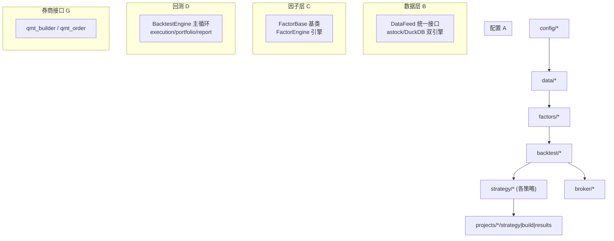
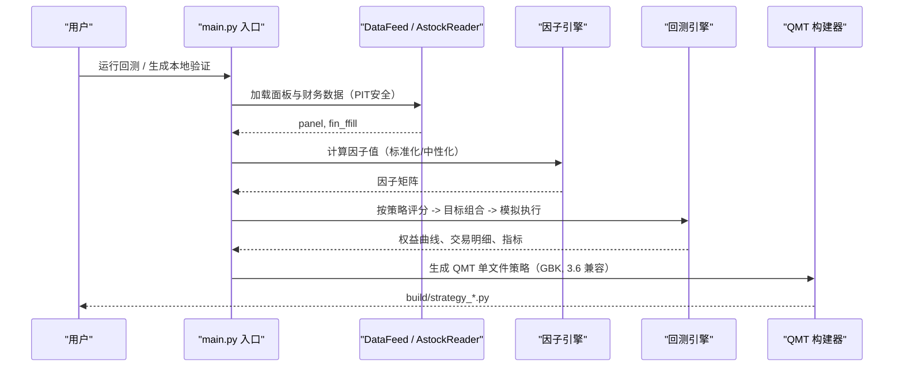
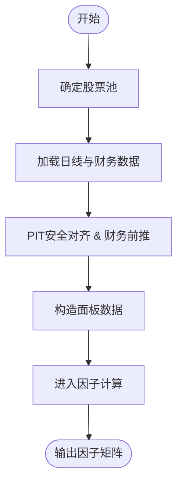
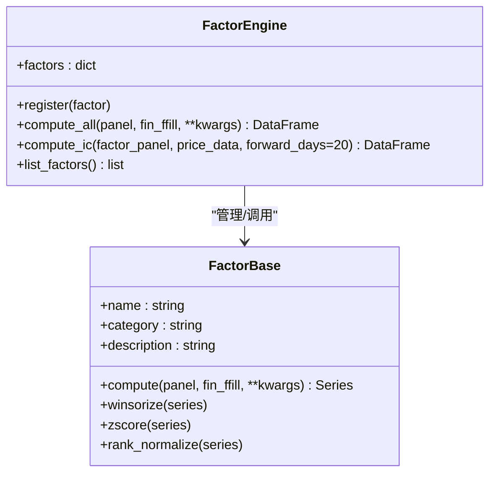
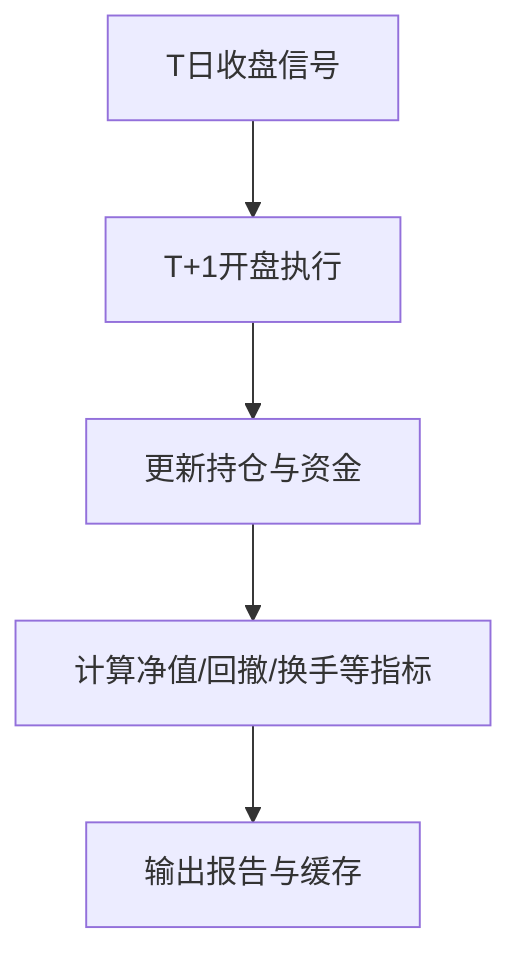
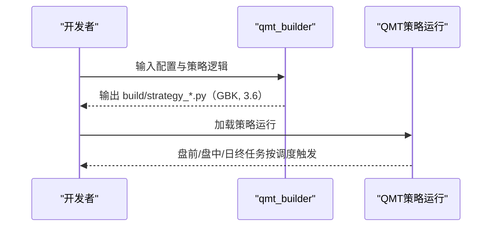
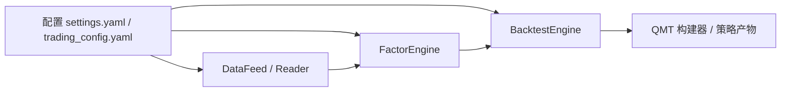

# 项目概述

<cite>
**本文档引用的文件**
- [README.md](file://README.md)
- [AGENTS.md](file://AGENTS.md)
- [settings.yaml](file://config/settings.yaml)
- [trading_config.yaml](file://config/trading_config.yaml)
- [main.py](file://main.py)
- [data/feed.py](file://data/feed.py)
- [data/astock_reader.py](file://data/astock_reader.py)
- [factors/base.py](file://factors/base.py)
- [factors/engine.py](file://factors/engine.py)
- [backtest/engine.py](file://backtest/engine.py)
- [broker/qmt_builder.py](file://broker/qmt_builder.py)
</cite>

## 目录
1. [引言](#引言)
2. [项目结构](#项目结构)
3. [核心组件](#核心组件)
4. [架构总览](#架构总览)
5. [关键流程与数据流](#关键流程与数据流)
6. [依赖关系分析](#依赖关系分析)
7. [快速开始指南](#快速开始指南)
8. [故障排查要点](#故障排查要点)
9. [结论](#结论)

## 引言
QuantLab 是面向 A 股量化研究与实盘的全链路框架，覆盖“因子研究 → 策略构建 → 回测验证 → 风控与下单”的完整流程。其核心价值在于：以 PIT（Point-in-Time）安全的财务数据为基础，采用 next_open 交易模型进行回测，并以 QMT 为券商通道，提供从研究到生产的可复现实验与可交付产物。

- 技术定位：研究级多因子与策略迭代，生产级 QMT 单文件部署与本地 miniQMT 快速验证。
- 解决方案：统一的 DataFeed + DuckDB/Parquet 读取、可插拔因子库、标准回测引擎、QMT 策略构建器与实盘调度。
- 核心设计：PIT 安全、next_open 模型、模块化架构与严格的生产合规规则（GBK、Python 3.6 兼容、账户隔离与风控底线）。

章节来源
- [README.md:8-106](file://README.md#L8-L106)
- [AGENTS.md:5-13](file://AGENTS.md#L5-L13)

## 项目结构
仓库按模块划分清晰的职责边界：配置、数据层、因子层、回测、券商接口、策略项目与脚本工具等。

图示来源
- [data/feed.py:17-41](file://data/feed.py#L17-L41)
- [factors/base.py:9-52](file://factors/base.py#L9-L52)
- [factors/engine.py:9-85](file://factors/engine.py#L9-L85)
- [backtest/engine.py:1-15](file://backtest/engine.py#L1-L15)
- [broker/qmt_builder.py:1-12](file://broker/qmt_builder.py#L1-L12)

章节来源
- [README.md:16-56](file://README.md#L16-L56)
- [AGENTS.md:8-14](file://AGENTS.md#L8-L14)

## 核心组件
- 数据读取层：DataFeed 提供统一接口，适配 astock parquet 与 DuckDB 两种数据源；AstockParquetReader 实现只读、增量合并与多种复权支持，并暴露 load_window/trading_calendar/coverage/close 的鸭子类型 4 方法。
- 因子系统：FactorBase 定义 compute 抽象及标准化预处理；FactorEngine 负责注册、批量计算与 IC 统计。
- 回测引擎：Next_open 交易模型（T 日收盘信号，T+1 开盘成交），封装 execution、portfolio、rebalance、report 等，只输出内存结果，由 report 持久化。
- 券商接口：qmt_builder 生成符合 QMT 环境的 GBK 单文件策略，包含 init/handlebar/exit 生命周期与内置风控逻辑；qmt_order 规范委托调用。
- 配置体系：settings.yaml（全局）、trading_config.yaml（实盘）、项目级 strategy.yaml（局部参数），三级级联，便于灵活切换环境。

章节来源
- [data/feed.py:17-41](file://data/feed.py#L17-L41)
- [data/astock_reader.py:68-162](file://data/astock_reader.py#L68-L162)
- [factors/base.py:9-52](file://factors/base.py#L9-L52)
- [factors/engine.py:9-85](file://factors/engine.py#L9-L85)
- [backtest/engine.py:1-15](file://backtest/engine.py#L1-L15)
- [broker/qmt_builder.py:1-12](file://broker/qmt_builder.py#L1-L12)
- [trading_config.yaml:1-62](file://trading_config.yaml#L1-L62)
- [settings.yaml:1-69](file://settings.yaml#L1-L69)

## 架构总览
下图展示从数据到策略回测与实盘产物的整体流向。数据层统一接入 astock 或 DuckDB，因子层基于面板数据计算，回测引擎使用 next_open 执行，最终产出可在 QMT 上运行的 GBK 单文件策略。

图示来源
- [main.py:21-73](file://main.py#L21-L73)
- [data/feed.py:17-41](file://data/feed.py#L17-L41)
- [data/astock_reader.py:116-162](file://data/astock_reader.py#L116-L162)
- [factors/engine.py:20-85](file://factors/engine.py#L20-L85)
- [backtest/engine.py:1-15](file://backtest/engine.py#L1-L15)
- [broker/qmt_builder.py:33-120](file://broker/qmt_builder.py#L33-L120)

章节来源
- [README.md:75-100](file://README.md#L75-L100)
- [AGENTS.md:19-41](file://AGENTS.md#L19-L41)

## 关键流程与数据流
### 数据处理流水线
- 读取策略股票池 → 窗口期 OHLCV/财务字段 → 过滤与对齐 → 生成面板与财务前推序列。
- 增量数据通过 astock reader 的合并逻辑纳入，确保数据最新且去重优先。

图示来源
- [data/feed.py:43-63](file://data/feed.py#L43-L63)
- [data/astock_reader.py:27-65](file://data/astock_reader.py#L27-L65)

章节来源
- [data/astock_reader.py:68-162](file://data/astock_reader.py#L68-L162)

### 因子计算与评估
- 新因子继承 FactorBase，实现 compute。
- FactorEngine 统一注册、批量计算，并支持逐日期截面 IC 与 ICIR 统计，辅助因子筛选与权重设定。

图示来源
- [factors/base.py:9-52](file://factors/base.py#L9-L52)
- [factors/engine.py:9-85](file://factors/engine.py#L9-L85)

章节来源
- [AGENTS.md:154-159](file://AGENTS.md#L154-L159)

### 回测交易模型（next_open）
- T 日收盘信号在 T+1 日开盘撮合，避免当日价格泄漏。
- 交易流水由 execution 负责，组合状态由 portfolio 维护，绩效由 analyzer/report 汇总。

图示来源
- [backtest/engine.py:1-15](file://backtest/engine.py#L1-L15)

章节来源
- [backtest/engine.py:1-15](file://backtest/engine.py#L1-L15)

### QMT 策略构建与实盘调度
- QMT 策略构建器将策略逻辑打包为单个 GBK 文件，保证 Python 3.6 语法兼容，并在 init/handlebar/exit 中完成初始化、每日处理与退出清理。
- 生产端遵守严格的下单、对账、权限与风控约束；本地可用 miniQMT 快速校验选股管线与 fail-open。

图示来源
- [broker/qmt_builder.py:33-120](file://broker/qmt_builder.py#L33-L120)

章节来源
- [AGENTS.md:61-105](file://AGENTS.md#L61-L105)

## 依赖关系分析
- 数据层 → 因子层：面板数据与财务前推驱动因子计算。
- 因子层 → 回测层：因子矩阵用于策略评分与目标组合构建。
- 回测层 → 券商层：回测不直接下单，但产出的策略逻辑可通过 qmt_builder 转为 QMT 单文件。
- 配置依赖：settings.yaml 与 trading_config.yaml 控制数据、回测与交易参数；项目级 config 细化策略行为。

图示来源
- [settings.yaml:1-69](file://settings.yaml#L1-L69)
- [trading_config.yaml:1-62](file://trading_config.yaml#L1-L62)

章节来源
- [AGENTS.md:123-143](file://AGENTS.md#L123-L143)

## 快速开始指南
- 环境要求
  - 研究环境：Python 3.11（pandas≥2.0、numpy、pyyaml、pyarrow 等）。
  - QMT 生产：Python 3.6.8（GBK 编码，无 f-string、无新式类型标注等）。
- 首次运行
  - 回测主入口：执行 main.py（默认 Project_01 策略）或切换到其他项目独立 runner。
  - 本地 miniQMT 验证：使用 broker/local_context 适配器，快速验证选股管线与失败开放。
  - QMT 预生成 CSV：scripts/gen_qmt_csv.py 生成外部股票池与文件交换数据。
- 基础配置
  - 全局设置：config/settings.yaml（数据源、回测时间窗、佣金滑点、因子预处理、默认股票池）。
  - 实盘设置：config/trading_config.yaml（账号、初始资金、风控阈值、调度计划、通知方式）。
  - 项目策略：各 projects/*/config/*.yaml 独立参数（调仓频率、top_n、因子权重等）。
- 运行示例
  - 根目录：python main.py
  - Project_10：cd projects/Project_10_价值小盘V2 && python runner.py
  - 本地 miniQMT：按说明运行 local_validate.py

章节来源
- [README.md:75-100](file://README.md#L75-L100)
- [AGENTS.md:123-143](file://AGENTS.md#L123-L143)
- [settings.yaml:21-50](file://settings.yaml#L21-L50)
- [trading_config.yaml:10-36](file://trading_config.yaml#L10-L36)

## 故障排查要点
- 数据问题
  - 检查数据源路径与增量合并是否正确（astock parquet 主仓与 Updatedata 每周增量）。
  - 确认财务数据 PIT 安全（ann_date/f_ann_date 过滤），避免未来函数导致回测虚高。
- 因子问题
  - 若因子计算异常，先确认输入面板列名与空值处理，逐步打印 daily_ic 观察显著性。
- 回测问题
  - next_open 模型需确保 T→T+1 的取价与订单撮合正确；“盘中 vs 尾盘对照差异 >30pp 且方向反转”提示 look-ahead 风险。
- QMT 问题
  - 确保构建产物为 GBK 编码，首行 coding 标记存在，语法兼容 Python 3.6。
  - 下单后必须轮询反查订单号，避免静默断链；持仓文件带 account_id 戳，加载时不匹配则自动备份并重空仓。
  - 时间使用 C.get_current_time()，不可用 datetime.now()；>15:00 的任务不会触发，需用 init 末尾标志联动防重复。

章节来源
- [data/astock_reader.py:110-162](file://data/astock_reader.py#L110-L162)
- [AGENTS.md:69-105](file://AGENTS.md#L69-L105)
- [backtest/engine.py:110-147](file://backtest/engine.py#L110-L147)

## 结论
QuantLab 将“A 股量化研究—回测—生产”打通，形成稳定可扩展的工程体系：以 PIT 安全为基础、以 next_open 为回测基准、以 QMT 为生产通道，并提供本地快速验证与严格的生产规则。对于初学者，可从 main.py 与配置文件入手，逐步理解数据/因子/回测/实盘的链路；对于有经验的开发者，可专注于因子扩展、策略优化与生产部署的细节打磨。