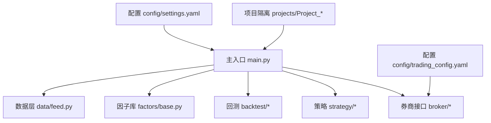
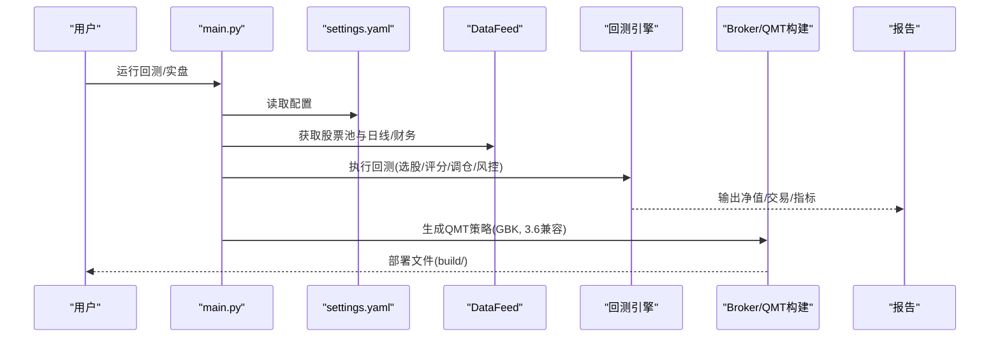
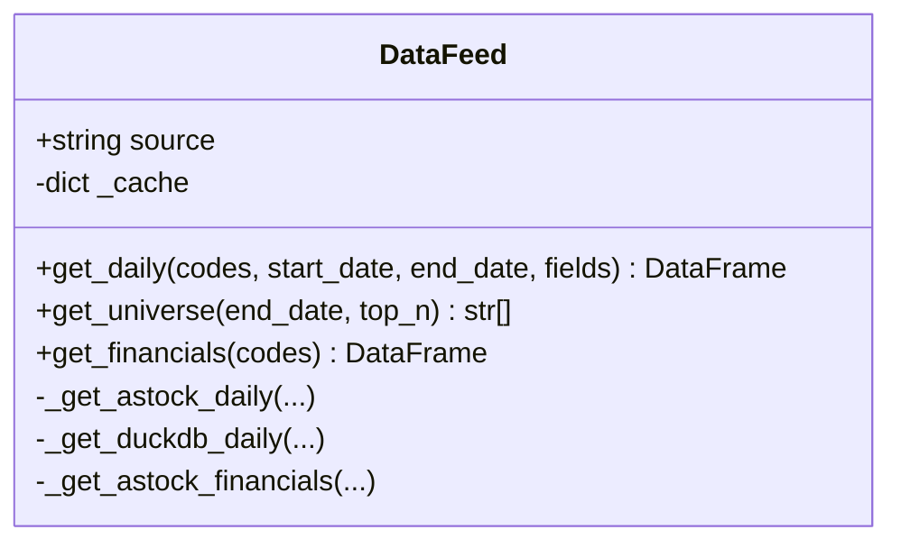
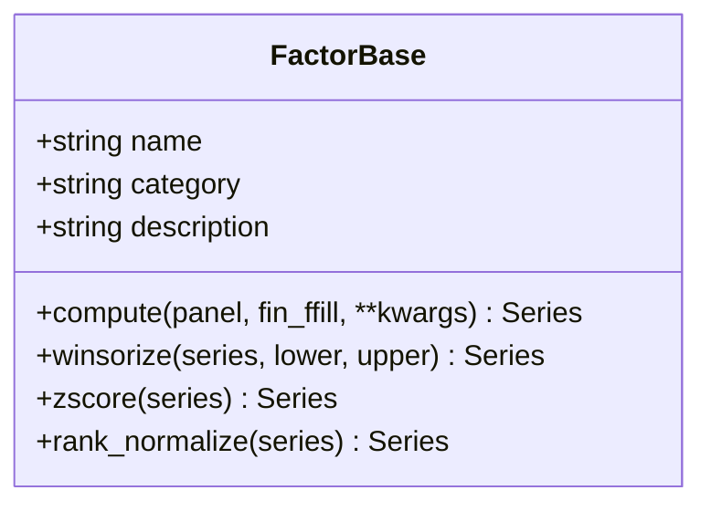
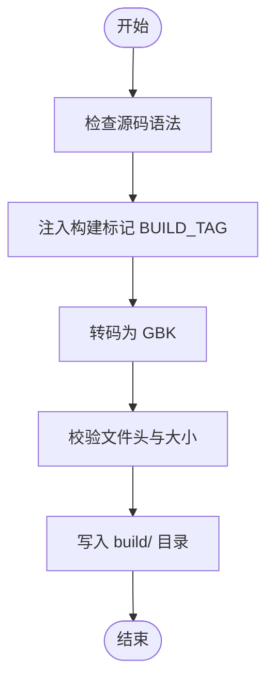
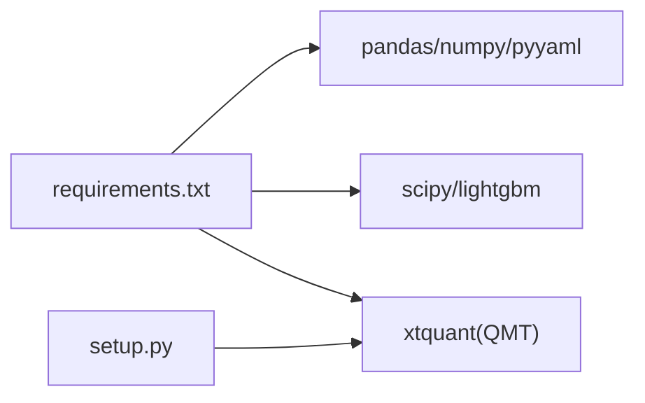

# 团队协作规范

<cite>
**本文引用的文件**   
- [README.md](file://README.md)
- [AGENTS.md](file://AGENTS.md)
- [全局复利与踩坑日志.md](file://全局复利与踩坑日志.md)
- [快速启动.md](file://快速启动.md)
- [实盘配置指南.md](file://实盘配置指南.md)
- [requirements.txt](file://requirements.txt)
- [setup.py](file://setup.py)
- [main.py](file://main.py)
- [data/feed.py](file://data/feed.py)
- [factors/base.py](file://factors/base.py)
- [config/settings.yaml](file://config/settings.yaml)
- [config/trading_config.yaml](file://config/trading_config.yaml)
- [.gitignore](file://.gitignore)
- [projects/Project_10_价值小盘V2/build.py](file://projects/Project_10_价值小盘V2/build.py)
</cite>

## 目录
1. [引言](#引言)
2. [项目结构](#项目结构)
3. [核心组件](#核心组件)
4. [架构总览](#架构总览)
5. [详细组件分析](#详细组件分析)
6. [依赖关系分析](#依赖关系分析)
7. [性能与稳定性考量](#性能与稳定性考量)
8. [故障排查指南](#故障排查指南)
9. [结论](#结论)
10. [附录：协作模板与清单](#附录协作模板与清单)

## 引言
本规范面向 QuantLab 团队，统一代码风格、文档编写、代码审查、开发环境、任务分配与协作流程，确保从因子研究、策略构建、回测验证到 miniQMT 实盘的端到端一致性。核心目标包括：
- 明确 Python 编码规范、命名约定、注释与文档字符串格式
- 标准化 README、API 文档与变更日志维护
- 建立 PR 模板、审查清单与质量标准
- 统一 IDE 配置、依赖管理与虚拟环境使用
- 规范 Issue 模板与项目管理工具使用
- 制定沟通渠道、会议制度与知识分享机制
- 提供新成员入职指南与培训材料

## 项目结构
QuantLab 采用“模块分层 + 项目隔离”的组织方式：
- 数据层 data/：统一 DataFeed 接口，支持 astock parquet 与 DuckDB 双引擎
- 因子库 factors/：FactorBase 抽象基类与预处理（截尾、Z-score、秩标准化）
- 回测 backtest/：引擎、执行、组合、调仓、分析与报告
- 券商接口 broker/：QMT 单文件策略生成器与本地验证适配器
- 策略 strategy/：策略注册与调度（当前策略逻辑在各 projects 下）
- 项目隔离 projects/：每个策略独立目录，含 strategy/config/results/specs
- 配置 config/：settings.yaml（全局）、trading_config.yaml（实盘）
- 脚本 scripts/：数据更新、CSV 生成、QMT 测试等
- 报告 reports/：回测产物与报告

图表来源
- [main.py:1-104](file://main.py#L1-L104)
- [data/feed.py:1-197](file://data/feed.py#L1-L197)
- [factors/base.py:1-52](file://factors/base.py#L1-L52)
- [config/settings.yaml:1-69](file://config/settings.yaml#L1-L69)
- [config/trading_config.yaml:1-62](file://config/trading_config.yaml#L1-L62)

章节来源
- [README.md:1-107](file://README.md#L1-L107)
- [AGENTS.md:1-194](file://AGENTS.md#L1-L194)

## 核心组件
- 数据层 DataFeed：统一 get_daily/get_universe/get_financials，缓存与多源切换
- 因子基类 FactorBase：定义 compute 抽象方法，内置 winsorize/zscore/rank_normalize
- 回测引擎：按频率调仓、撮合、风控与报告输出
- QMT 构建器：GBK 单文件策略生成，Python 3.6.8 兼容
- 本地验证 LocalContext：miniQMT 快速验证适配

章节来源
- [data/feed.py:1-197](file://data/feed.py#L1-L197)
- [factors/base.py:1-52](file://factors/base.py#L1-L52)
- [AGENTS.md:16-27](file://AGENTS.md#L16-L27)

## 架构总览
系统由“配置驱动 + 模块化实现”构成，主入口加载配置并路由至具体策略与数据源；broker 层负责将研究代码转换为 QMT 可部署的 GBK 单文件；projects 隔离不同策略的全生命周期。

图表来源
- [main.py:21-92](file://main.py#L21-L92)
- [data/feed.py:28-63](file://data/feed.py#L28-L63)
- [projects/Project_10_价值小盘V2/build.py:44-68](file://projects/Project_10_价值小盘V2/build.py#L44-L68)

## 详细组件分析

### 数据层 DataFeed 分析
- 职责：统一数据源接口，封装 astock parquet 与 DuckDB 读取，返回 MultiIndex DataFrame
- 关键方法：get_daily、get_universe、get_financials
- 缓存策略：内存缓存 + 过期时间（1天）
- 兼容性：字段名对齐、日期类型处理、空值填充

图表来源
- [data/feed.py:17-134](file://data/feed.py#L17-L134)

章节来源
- [data/feed.py:1-197](file://data/feed.py#L1-L197)

### 因子库 FactorBase 分析
- 职责：定义因子计算抽象接口与通用预处理
- 预处理顺序：winsorize → zscore → rank_normalize
- 扩展性：继承 FactorBase 实现 compute，注册到引擎后批量计算与 IC 评估

图表来源
- [factors/base.py:9-52](file://factors/base.py#L9-L52)

章节来源
- [factors/base.py:1-52](file://factors/base.py#L1-L52)
- [AGENTS.md:120-126](file://AGENTS.md#L120-L126)

### QMT 构建与部署流程
- 输入：策略源码（UTF-8）
- 处理：语法检查、BUILD_TAG 注入、GBK 转码
- 输出：build/ 下的 GBK 单文件（首行 # coding=gbk），Python 3.6.8 兼容

图表来源
- [projects/Project_10_价值小盘V2/build.py:44-68](file://projects/Project_10_价值小盘V2/build.py#L44-L68)

章节来源
- [AGENTS.md:43-48](file://AGENTS.md#L43-L48)
- [AGENTS.md:50-67](file://AGENTS.md#L50-L67)

### 配置系统（三级级联）
- 全局配置 settings.yaml：项目信息、数据源、回测参数、因子预处理、默认股票池
- 实盘配置 trading_config.yaml：账号、交易参数、风控阈值、委托管理、调度计划
- 项目级配置：各 Project 下的 strategy.yaml

章节来源
- [config/settings.yaml:1-69](file://config/settings.yaml#L1-L69)
- [config/trading_config.yaml:1-62](file://config/trading_config.yaml#L1-L62)
- [AGENTS.md:90-94](file://AGENTS.md#L90-L94)

## 依赖关系分析
- 运行时依赖：pandas、numpy、pyyaml、scipy、lightgbm（可选）
- 环境差异：研究环境 Python 3.11，回测 Python 3.10，QMT 生产 Python 3.6.8
- 包管理：requirements.txt 声明依赖，setup.py 辅助安装 xtquant

图表来源
- [requirements.txt:1-29](file://requirements.txt#L1-L29)
- [setup.py:1-82](file://setup.py#L1-L82)

章节来源
- [requirements.txt:1-29](file://requirements.txt#L1-L29)
- [setup.py:1-82](file://setup.py#L1-L82)
- [README.md:92-100](file://README.md#L92-L100)

## 性能与稳定性考量
- 数据读取：内存缓存 + 过期策略，避免重复 IO
- 因子计算：向量化操作，减少循环；预处理顺序固定
- 回测效率：按频率分组，避免全量扫描；过滤函数在评分内部应用
- QMT 限制：GBK 编码、无 pyarrow、异步下单延迟需轮询
- 风控底线：止损、回撤、持有期、换手率约束，优先卖出风控

章节来源
- [data/feed.py:136-181](file://data/feed.py#L136-L181)
- [AGENTS.md:83-88](file://AGENTS.md#L83-L88)
- [AGENTS.md:111-118](file://AGENTS.md#L111-L118)

## 故障排查指南
- QMT 连接失败：检查 xtquant 安装路径、QMT 客户端状态、账号登录
- 策略未运行：查看 XtClient_FormulaOutput_*.log，确认初始化完成
- 订单反查失败：增加短轮询次数与间隔，放宽 remark 硬过滤
- 持仓不一致：同步账户全量持仓，清理孤儿持仓
- 数据异常：检查 astock 路径、PIT 安全、日期类型与字段映射

章节来源
- [快速启动.md:1-67](file://快速启动.md#L1-L67)
- [实盘配置指南.md:154-208](file://实盘配置指南.md#L154-L208)
- [全局复利与踩坑日志.md:56-118](file://全局复利与踩坑日志.md#L56-L118)

## 结论
本规范通过统一的代码风格、文档标准、审查流程与环境配置，确保 QuantLab 从研究到实盘的一致性与可维护性。建议团队严格执行 AGENTS.md 中的红线与最佳实践，持续完善测试与监控，保障策略稳健上线。

## 附录：协作模板与清单

### 代码风格指南（Python）
- 编码：UTF-8（研究/回测），QMT 产物必须 GBK 且首行 # coding=gbk
- 命名：模块/函数 snake_case，类 PascalCase，常量 UPPER_SNAKE_CASE
- 注释：函数/类必须有 docstring，复杂逻辑添加行内注释
- 文档字符串：遵循 Google/NumPy 风格，包含 Args、Returns、Raises
- 导入：标准库、第三方、本地模块分组，避免通配符导入

章节来源
- [AGENTS.md:50-67](file://AGENTS.md#L50-L67)
- [factors/base.py:1-28](file://factors/base.py#L1-L28)

### 文档编写规范
- README 模板：项目定位、目录结构、快速开始、环境要求、核心约定
- API 文档：函数签名、参数说明、返回值、示例调用、错误码
- 变更日志：版本、日期、变更内容、影响范围、迁移步骤

章节来源
- [README.md:1-55](file://README.md#L1-L55)
- [AGENTS.md:1-15](file://AGENTS.md#L1-L15)

### 代码审查流程
- PR 模板：变更描述、影响范围、测试覆盖、回滚方案
- 审查清单：编码规范、逻辑正确性、性能影响、安全性、文档更新
- 质量标准：单元测试覆盖率、集成测试通过、QMT 模拟端验证

章节来源
- [全局复利与踩坑日志.md:382-412](file://全局复利与踩坑日志.md#L382-L412)
- [AGENTS.md:142-155](file://AGENTS.md#L142-L155)

### 开发环境标准化
- IDE 配置：PEP8 插件、自动格式化、导入排序、Git 集成
- 依赖管理：requirements.txt 锁定版本，虚拟环境隔离
- 虚拟环境：venv/conda 创建独立环境，激活后安装依赖

章节来源
- [requirements.txt:1-29](file://requirements.txt#L1-L29)
- [快速启动.md:1-27](file://快速启动.md#L1-L27)

### 任务分配与进度跟踪
- Issue 模板：标题、背景、目标、验收标准、优先级、负责人
- 项目管理：看板状态 INBOX→TODO→DOING→REVIEW→DONE，阻塞项标注 BLOCKED
- 进度汇报：每日站会同步进展，周会评审风险与里程碑

章节来源
- [全局控制台.md:134-170](file://全局控制台.md#L134-L170)
- [全局复利与踩坑日志.md:396-402](file://全局复利与踩坑日志.md#L396-L402)

### 团队协作最佳实践
- 沟通渠道：企业微信/钉钉群，重要决策留痕
- 会议制度：每日站会、每周评审、月度复盘
- 知识分享：知识库沉淀、案例复盘、技术分享会

章节来源
- [全局控制台.md:134-170](file://全局控制台.md#L134-L170)
- [全局复利与踩坑日志.md:408-412](file://全局复利与踩坑日志.md#L408-L412)

### 新成员入职指南
- 环境搭建：Python 版本、依赖安装、QMT 客户端配置
- 代码阅读：AGENTS.md、README.md、核心模块说明
- 实战演练：运行 main.py、本地验证、QMT 构建与部署

章节来源
- [快速启动.md:1-67](file://快速启动.md#L1-L67)
- [实盘配置指南.md:1-124](file://实盘配置指南.md#L1-L124)
- [AGENTS.md:1-15](file://AGENTS.md#L1-L15)