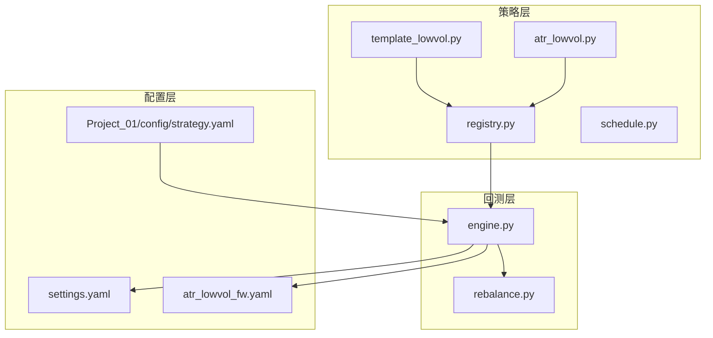
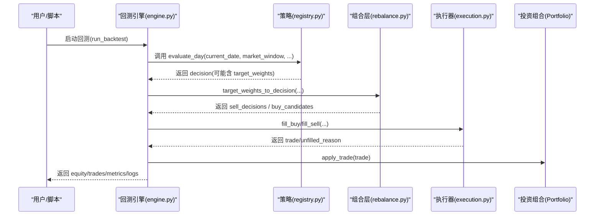
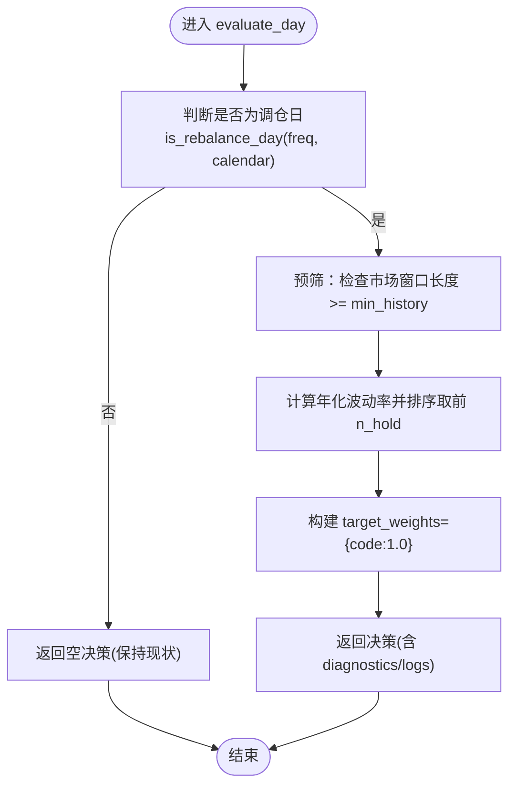
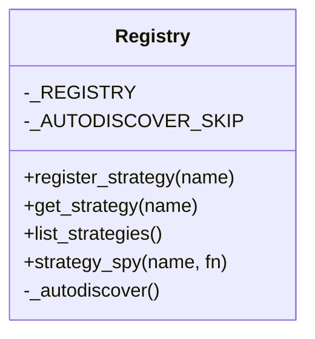
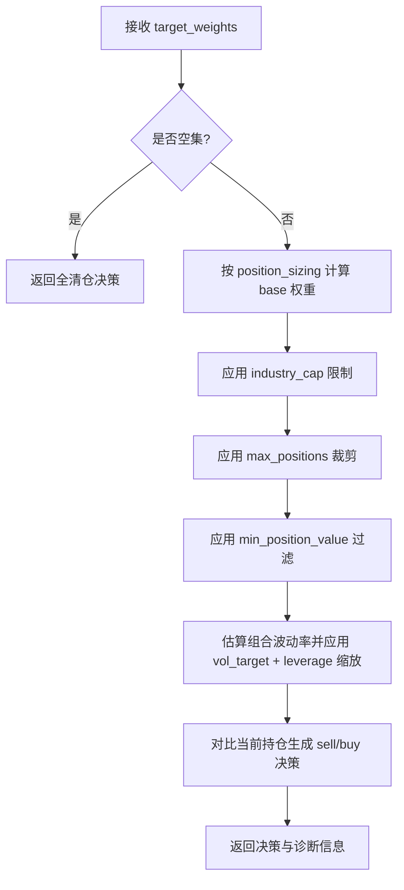
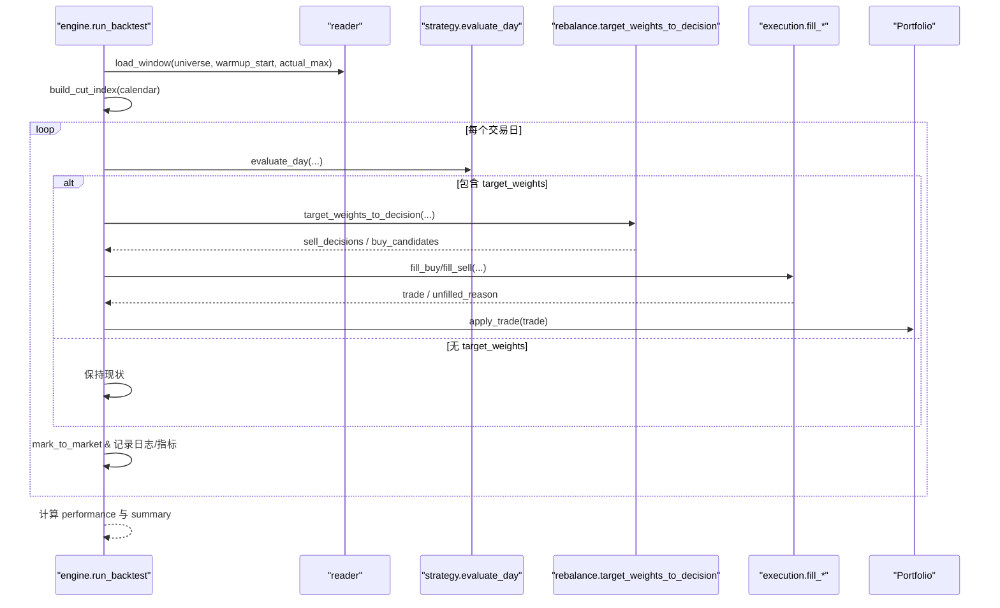
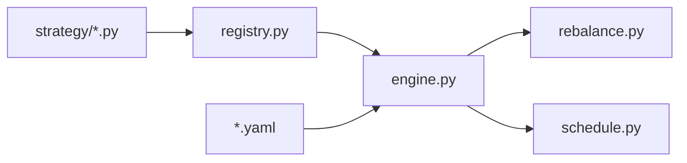

# 模板与脚手架

<cite>
**本文引用的文件**   
- [strategy/template_lowvol.py](file://strategy/template_lowvol.py)
- [strategy/atr_lowvol.py](file://strategy/atr_lowvol.py)
- [strategy/registry.py](file://strategy/registry.py)
- [strategy/schedule.py](file://strategy/schedule.py)
- [backtest/engine.py](file://backtest/engine.py)
- [backtest/rebalance.py](file://backtest/rebalance.py)
- [config/settings.yaml](file://config/settings.yaml)
- [config/atr_lowvol_fw.yaml](file://config/atr_lowvol_fw.yaml)
- [projects/Project_01_多因子IC小盘Alpha/config/strategy.yaml](file://projects/Project_01_多因子IC小盘Alpha/config/strategy.yaml)
- [main.py](file://main.py)
- [AGENTS.md](file://AGENTS.md)
</cite>

## 目录
1. [简介](#简介)
2. [项目结构](#项目结构)
3. [核心组件](#核心组件)
4. [架构总览](#架构总览)
5. [详细组件分析](#详细组件分析)
6. [依赖关系分析](#依赖关系分析)
7. [性能考量](#性能考量)
8. [故障排查指南](#故障排查指南)
9. [结论](#结论)
10. [附录](#附录)

## 简介
本文件面向 QuantLab 的“模板与脚手架系统”，聚焦以下目标：
- 策略模板的设计理念与使用方法，重点解析 template_lowvol.py 的结构与自定义要点。
- 脚手架工具的自动化能力（新项目创建、配置文件生成、依赖安装）与扩展机制（新增策略模板类型与管理）。
- 代码生成器的使用方式（因子模板、回测脚本模板、报告模板的自动生成）。
- 模板版本管理与更新策略。
- 自定义模板开发完整指南（模板语法、变量替换、条件渲染）。
- 实际使用案例：快速搭建新的量化策略项目。

说明：本项目当前以“策略即插即用”的 target_weights 模式为核心，配合通用组合层（仓位模型、行业上限、波动率目标、杠杆上限等）实现“任何策略拿过来都能跑”。

## 项目结构
QuantLab 采用“策略模块扁平化 + 通用引擎 + 配置驱动”的组织方式：
- strategy/：策略注册与调度（模板与示例策略位于此）。
- backtest/：回测引擎、执行器、组合层、指标计算。
- config/：全局与策略级 YAML 配置。
- projects/：按策略隔离的项目目录，包含各自的研究、回测与结果。
- main.py：统一入口，支持不同项目的回测运行。

图表来源
- [strategy/template_lowvol.py:1-94](file://strategy/template_lowvol.py#L1-L94)
- [strategy/atr_lowvol.py:1-165](file://strategy/atr_lowvol.py#L1-L165)
- [strategy/registry.py:1-115](file://strategy/registry.py#L1-L115)
- [strategy/schedule.py:1-47](file://strategy/schedule.py#L1-L47)
- [backtest/engine.py:1-619](file://backtest/engine.py#L1-L619)
- [backtest/rebalance.py:1-281](file://backtest/rebalance.py#L1-L281)
- [config/settings.yaml:1-69](file://config/settings.yaml#L1-L69)
- [config/atr_lowvol_fw.yaml:1-49](file://config/atr_lowvol_fw.yaml#L1-L49)
- [projects/Project_01_多因子IC小盘Alpha/config/strategy.yaml:1-62](file://projects/Project_01_多因子IC小盘Alpha/config/strategy.yaml#L1-L62)

章节来源
- [main.py:1-104](file://main.py#L1-L104)
- [AGENTS.md:1-48](file://AGENTS.md#L1-L48)

## 核心组件
- 策略模板与示例
  - template_lowvol.py：最小可运行的 target_weights 模板，展示“仅输出意愿权重，其余由框架处理”的设计。
  - atr_lowvol.py：ATR 低波策略的框架原生版，演示复杂筛选与止损逻辑如何与通用组合层协作。
- 策略注册与发现
  - registry.py：提供 @register_strategy 装饰器与自动发现机制，支持按名称获取策略函数与诊断信息。
  - schedule.py：统一的调仓日历判断（周/月/季频），保证所有策略一致的调仓时机。
- 回测引擎与组合层
  - engine.py：主循环，负责数据切片、基准加载、调用 evaluate_day、将 target_weights 转换为订单决策、执行与统计。
  - rebalance.py：通用组合层，实现 equal/vol_parity/custom 仓位模型、行业上限、波动率目标、杠杆上限、最大持仓数与最小持仓金额过滤。
- 配置体系
  - settings.yaml：全局数据源、回测参数、日志、因子预处理、策略默认宇宙等。
  - atr_lowvol_fw.yaml：针对 atr_lowvol 策略的完整回测配置，含 execution、universe、strategy_params 等。
  - Project_01/config/strategy.yaml：项目级策略配置，包含因子权重、回测与实盘参数。

章节来源
- [strategy/template_lowvol.py:1-94](file://strategy/template_lowvol.py#L1-L94)
- [strategy/atr_lowvol.py:1-165](file://strategy/atr_lowvol.py#L1-L165)
- [strategy/registry.py:1-115](file://strategy/registry.py#L1-L115)
- [strategy/schedule.py:1-47](file://strategy/schedule.py#L1-L47)
- [backtest/engine.py:1-619](file://backtest/engine.py#L1-L619)
- [backtest/rebalance.py:1-281](file://backtest/rebalance.py#L1-L281)
- [config/settings.yaml:1-69](file://config/settings.yaml#L1-L69)
- [config/atr_lowvol_fw.yaml:1-49](file://config/atr_lowvol_fw.yaml#L1-L49)
- [projects/Project_01_多因子IC小盘Alpha/config/strategy.yaml:1-62](file://projects/Project_01_多因子IC小盘Alpha/config/strategy.yaml#L1-L62)

## 架构总览
QuantLab 的策略运行流程遵循“信号 -> 组合层 -> 执行 -> 记录”的清晰链路：
- 策略 evaluate_day 返回 target_weights（或 sell/buy 决策）。
- 引擎将 target_weights 交给 rebalance 层进行仓位建模与风控叠加。
- 执行器根据交易模型（如 next_open）完成成交模拟。
- 引擎汇总交易日志、权益曲线、交易明细与指标。

图表来源
- [backtest/engine.py:237-619](file://backtest/engine.py#L237-L619)
- [strategy/registry.py:24-44](file://strategy/registry.py#L24-L44)
- [backtest/rebalance.py:101-281](file://backtest/rebalance.py#L101-L281)

## 详细组件分析

### 模板 template_lowvol.py 结构与自定义指南
- 设计要点
  - 最小化策略职责：仅挑选标的集合并返回等权意愿 target_weights = {code: 1.0}。
  - 框架承担一切订单簿记与风控：买卖差、仓位模型、行业上限、波动率目标、杠杆上限、涨跌停/停牌/滑点/整数手等真实约束。
  - 调仓频率由 schedule.is_rebalance_day 控制，非调仓日返回空决策保持现状。
- 关键流程
  - 读取策略配置（rebalance_freq、n_hold、vol_window 等）。
  - 预筛有足够历史数据的股票。
  - 计算年化波动率并选择最低波动的前 n_hold 只。
  - 返回 target_weights，由组合层决定最终权重与订单。
- 自定义建议
  - 修改选股逻辑：在 valid 列表基础上增加更多因子过滤或评分排序。
  - 调整调仓频率：通过 strategy_config.rebalance_freq 切换 weekly/monthly/quarterly。
  - 扩展诊断信息：在 diagnostics 中补充 candidate_total/candidate_passed 与 warnings。
  - 接入基本面数据：通过 aux_data.fundamentals 读取财务指标（需 fundamentals_reader 支持）。

图表来源
- [strategy/template_lowvol.py:34-94](file://strategy/template_lowvol.py#L34-L94)
- [strategy/schedule.py:10-47](file://strategy/schedule.py#L10-L47)

章节来源
- [strategy/template_lowvol.py:1-94](file://strategy/template_lowvol.py#L1-L94)
- [strategy/schedule.py:1-47](file://strategy/schedule.py#L1-L47)

### 策略注册与发现（registry.py）
- 装饰器 @register_strategy(name) 在模块顶层注册 evaluate_day。
- _autodiscover() 扫描 strategy/ 包下所有模块触发注册，跳过已知非引擎模块。
- get_strategy(name) 用于引擎按名称获取策略函数；list_strategies() 列出已注册策略。
- 支持测试辅助：strategy_spy 上下文管理器临时替换策略函数。

图表来源
- [strategy/registry.py:1-115](file://strategy/registry.py#L1-L115)

章节来源
- [strategy/registry.py:1-115](file://strategy/registry.py#L1-L115)

### 通用组合层（rebalance.py）
- 输入：target_weights（{code: weight}）、当前持仓、总资产、市场窗口、策略配置。
- 输出：sell_decisions、buy_candidates、target_positions、diagnostics、logs。
- 核心功能：
  - 仓位模型：equal（等权）、vol_parity（波动率倒数加权）、custom（自定义权重归一化）。
  - 行业上限：按比例缩放超出行业暴露。
  - 最大持仓数：保留权重最高的 top-N。
  - 最小持仓金额：剔除低于阈值的小权重。
  - 波动率目标：估计组合波动率并按 vol_target 缩放权重，同时受 target_leverage 硬上限约束。
  - 全清仓：当 target_weights 为空时返回全卖决策。

图表来源
- [backtest/rebalance.py:101-281](file://backtest/rebalance.py#L101-L281)

章节来源
- [backtest/rebalance.py:1-281](file://backtest/rebalance.py#L1-L281)

### 回测引擎（engine.py）
- 主循环：遍历交易日，维护 Portfolio，调用策略 evaluate_day，转换 target_weights 为订单，执行成交，记录日志与指标。
- 基准数据：从 DuckDB 加载基准序列，对齐交易日历，缺失值前向填充。
- 两融利息：当启用杠杆且现金为负时按日计提利息。
- 诊断聚合：汇总每日 warnings、候选数量、策略特定指标（按天平均或存在性标记）。
- 结果结构：summary（含 run_id、data_hash、performance、portfolio_end 等）、trades、equity_rows、positions_rows、logs、trading_calendar。

图表来源
- [backtest/engine.py:237-619](file://backtest/engine.py#L237-L619)
- [backtest/rebalance.py:101-281](file://backtest/rebalance.py#L101-L281)

章节来源
- [backtest/engine.py:1-619](file://backtest/engine.py#L1-L619)

### 配置体系（settings.yaml、atr_lowvol_fw.yaml、Project_01/config/strategy.yaml）
- settings.yaml：定义项目根路径、数据源路径、回测区间、初始资金、手续费、滑点、基准代码、因子预处理、策略默认宇宙、实盘开关等。
- atr_lowvol_fw.yaml：针对 atr_lowvol 策略的回测配置，包括 data.source/path/adjustment、universe.csv、execution.price/slippage/commission_rate/tax_rate、strategy.trading_model、strategy_params（rebalance_freq、n_hold、atr_win、atr_pct_max、turnover_min/max、quality_gate、momentum_gate、stop_loss、position_sizing、target_leverage、vol_target、industry_cap、max_positions、min_position_value、vol_window、margin_interest_rate）。
- Project_01/config/strategy.yaml：项目级策略配置，包含因子权重、市值/成交额过滤、回测参数（top_n、rebalance_freq、stop_loss、tx_cost、dynamic_universe）、结果指标、实盘参数与 QMT 配置。

章节来源
- [config/settings.yaml:1-69](file://config/settings.yaml#L1-L69)
- [config/atr_lowvol_fw.yaml:1-49](file://config/atr_lowvol_fw.yaml#L1-L49)
- [projects/Project_01_多因子IC小盘Alpha/config/strategy.yaml:1-62](file://projects/Project_01_多因子IC小盘Alpha/config/strategy.yaml#L1-L62)

## 依赖关系分析
- 策略模块依赖 registry.register_strategy 进行注册，并通过 ALLOWED_TRADING_MODELS 声明支持的 trading_model（如 next_open）。
- 引擎依赖 registry.get_strategy 获取策略函数，依赖 schedule.is_rebalance_day 判断调仓日，依赖 rebalance.target_weights_to_decision 生成订单决策。
- 配置通过 YAML 注入到 engine.run_backtest 的参数中，影响 execution、strategy_params、universe 等。

图表来源
- [strategy/registry.py:1-115](file://strategy/registry.py#L1-L115)
- [backtest/engine.py:1-619](file://backtest/engine.py#L1-L619)
- [backtest/rebalance.py:1-281](file://backtest/rebalance.py#L1-L281)
- [strategy/schedule.py:1-47](file://strategy/schedule.py#L1-L47)

章节来源
- [strategy/registry.py:1-115](file://strategy/registry.py#L1-L115)
- [backtest/engine.py:1-619](file://backtest/engine.py#L1-L619)
- [backtest/rebalance.py:1-281](file://backtest/rebalance.py#L1-L281)
- [strategy/schedule.py:1-47](file://strategy/schedule.py#L1-L47)

## 性能考量
- 数据切片优化：engine._build_cut_index 与 _slice_window_fast 使用 searchsorted 预计算索引，使每日数据切片 O(1)。
- 基准加载：benchmark_closes 前向填充缺失值，避免断点导致的 IR/excess 禁用。
- 两融利息计提：仅在 cash < 0 且 target_leverage > 1.0 时按日计提，减少不必要的计算。
- 诊断聚合：daily_strategy_specific 按值类型分两类聚合，避免重复计算与内存膨胀。
- 组合层估算波动率：使用对角项保守估计，避免协方差矩阵计算开销。

[本节为通用性能指导，不直接分析具体文件]

## 故障排查指南
- 策略未注册或名称错误：
  - 现象：get_strategy(name) 抛出 KeyError。
  - 排查：确认 @register_strategy("name") 是否正确；检查 autodiscover 是否跳过该模块。
- 调仓日判断异常：
  - 现象：策略未在预期日期调仓。
  - 排查：检查 strategy_config.rebalance_freq 与 aux_data.trading_calendar 是否正确传入。
- target_weights 转换失败：
  - 现象：rebalance 层抛出异常或返回空决策。
  - 排查：检查 target_weights 是否为空；确认 position_sizing、industry_cap、vol_target、target_leverage 配置合理。
- 基准数据不可用：
  - 现象：benchmark_available=False，IR/excess 禁用。
  - 排查：确认 benchmark_db_path 存在且包含基准代码；检查日期范围与数据完整性。
- 未成交订单计数上升：
  - 现象：unfilled_order_count 增加。
  - 排查：检查涨跌停/停牌/滑点/整数手等真实约束；查看 daily_logs 中的 unfilled_order 原因。

章节来源
- [strategy/registry.py:34-44](file://strategy/registry.py#L34-L44)
- [strategy/schedule.py:10-47](file://strategy/schedule.py#L10-L47)
- [backtest/rebalance.py:101-281](file://backtest/rebalance.py#L101-L281)
- [backtest/engine.py:324-444](file://backtest/engine.py#L324-L444)

## 结论
QuantLab 的模板与脚手架系统以“策略即插即用”为核心，通过 target_weights 抽象与通用组合层，实现了策略逻辑与风控执行的解耦。template_lowvol.py 展示了最小可运行模板，atr_lowvol.py 演示了复杂筛选与止损如何与框架协作。registry 与 schedule 提供了稳定的注册与调度机制，engine 与 rebalance 构成了高性能的回测与组合层。配置体系灵活可扩展，支持多项目隔离与参数化管理。未来可在此基础上扩展更多策略模板类型与代码生成器，进一步提升研发效率与一致性。

[本节为总结性内容，不直接分析具体文件]

## 附录

### 模板系统扩展机制
- 新增策略模板步骤：
  1. 在 strategy/ 目录下新建 <name>.py，实现 evaluate_day 并使用 @register_strategy("<name>") 注册。
  2. 在模块顶部声明 ALLOWED_TRADING_MODELS（如 ["next_open"]）。
  3. 确保策略返回标准 decision 结构（可含 target_weights、sell_decisions、buy_candidates、diagnostics、logs）。
  4. 通过 engine.resolve_strategy 自动发现与校验 trading_model。
- 管理策略列表：使用 registry.list_strategies() 获取已注册策略名。

章节来源
- [strategy/registry.py:24-44](file://strategy/registry.py#L24-L44)
- [backtest/engine.py:207-234](file://backtest/engine.py#L207-L234)

### 代码生成器使用指南（因子模板、回测脚本模板、报告模板）
- 因子模板：基于 factors/base.py 的基类，继承并实现 compute_factor 方法，支持 winsorize/zscore/rank_normalize 预处理。
- 回测脚本模板：参考 Project_01 的 research/multi_factor_ic/backtest.py，封装 panel 构建、动态 universe、评分与回测循环。
- 报告模板：基于 backtest/report.py 的输出结构，生成 equity_curve.csv、trades.csv、summary.json、report.md 等标准化产物。

[本节为概念性说明，不直接分析具体文件]

### 模板版本管理与更新策略
- 版本号约定：engine.py 中定义 _STRATEGY_CORE_VERSION 与 _SUMMARY_SCHEMA_VERSION，用于兼容性与审计追踪。
- 数据哈希：engine.compute_data_hash 生成 data_hash，结合 config_hash 与 universe_hash 确保回测可复现。
- 构建标签：项目级 build.py 注入 BUILD_TAG（时间戳），便于生产部署与版本追溯。

章节来源
- [backtest/engine.py:29-31](file://backtest/engine.py#L29-L31)
- [backtest/engine.py:524-537](file://backtest/engine.py#L524-L537)
- [projects/Project_10_价值小盘V2/build.py:44-68](file://projects/Project_10_价值小盘V2/build.py#L44-L68)

### 自定义模板开发完整指南
- 模板语法：Python 函数 evaluate_day，参数包括 current_date、market_window、positions、cash、universe、account_state、strategy_config、aux_data。
- 变量替换：strategy_config 来自 YAML 配置，支持字符串、数值、布尔值；aux_data 可注入 fundamentals、trading_calendar、benchmark_closes 等。
- 条件渲染：根据 is_rebalance_day 与策略逻辑动态返回空决策或 target_weights；diagnostics 中 warnings 用于调试与监控。
- 最佳实践：
  - 保持策略简洁，仅输出意图（target_weights），将风控与执行交给框架。
  - 充分利用 schedule 与 rebalance 提供的通用能力，避免重复实现。
  - 完善 diagnostics 与 logs，便于问题定位与性能分析。

章节来源
- [strategy/template_lowvol.py:47-94](file://strategy/template_lowvol.py#L47-L94)
- [strategy/schedule.py:10-47](file://strategy/schedule.py#L10-L47)
- [backtest/rebalance.py:101-281](file://backtest/rebalance.py#L101-L281)

### 实际使用案例：快速搭建新的量化策略项目
- 步骤概览：
  1. 在 projects/ 下新建 Project_NN_<名称>/ 目录。
  2. 复制 template_lowvol.py 为新策略模块，修改选股逻辑与参数。
  3. 在 config/ 下创建 strategy.yaml，定义因子权重、回测与实盘参数。
  4. 编写 run_backtest.py 或复用 main.py，指定 strategy_name 与配置路径。
  5. 运行回测，检查 reports/ 下的 equity_curve.csv、trades.csv、summary.json、report.md。
- 验证与迭代：
  - 使用 atr_lowvol_fw.yaml 作为参考，调整 execution 与 strategy_params。
  - 通过 diagnostics 与 logs 调试策略逻辑与风控效果。
  - 逐步引入基本面数据与更复杂的筛选条件。

章节来源
- [main.py:28-93](file://main.py#L28-L93)
- [config/atr_lowvol_fw.yaml:1-49](file://config/atr_lowvol_fw.yaml#L1-L49)
- [projects/Project_01_多因子IC小盘Alpha/config/strategy.yaml:1-62](file://projects/Project_01_多因子IC小盘Alpha/config/strategy.yaml#L1-L62)