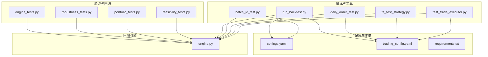
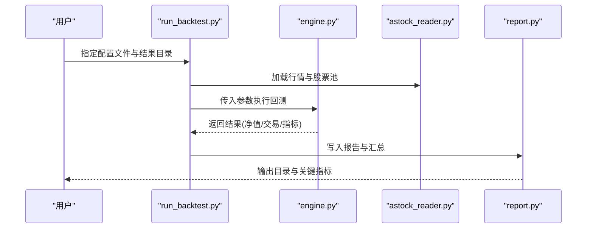
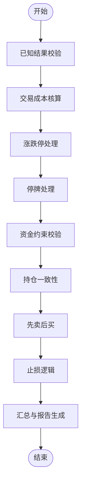
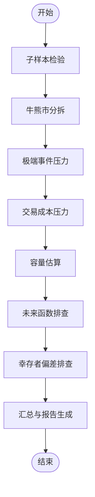
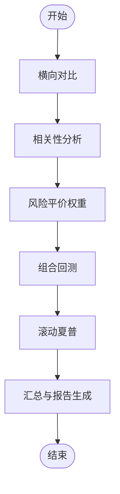
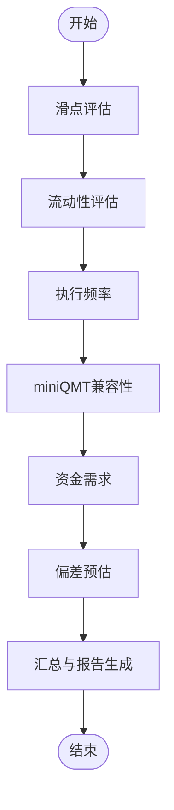
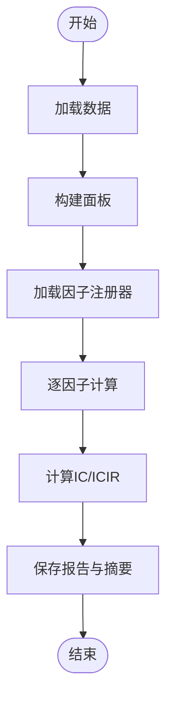
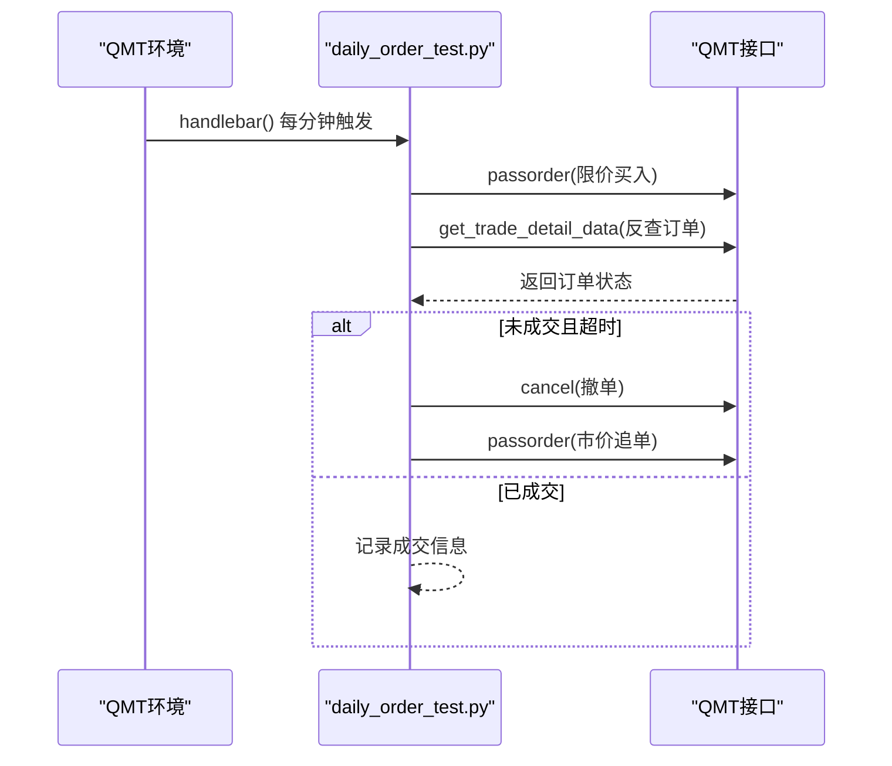
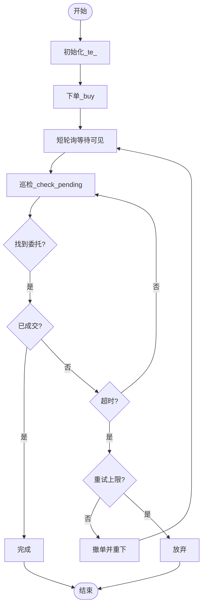
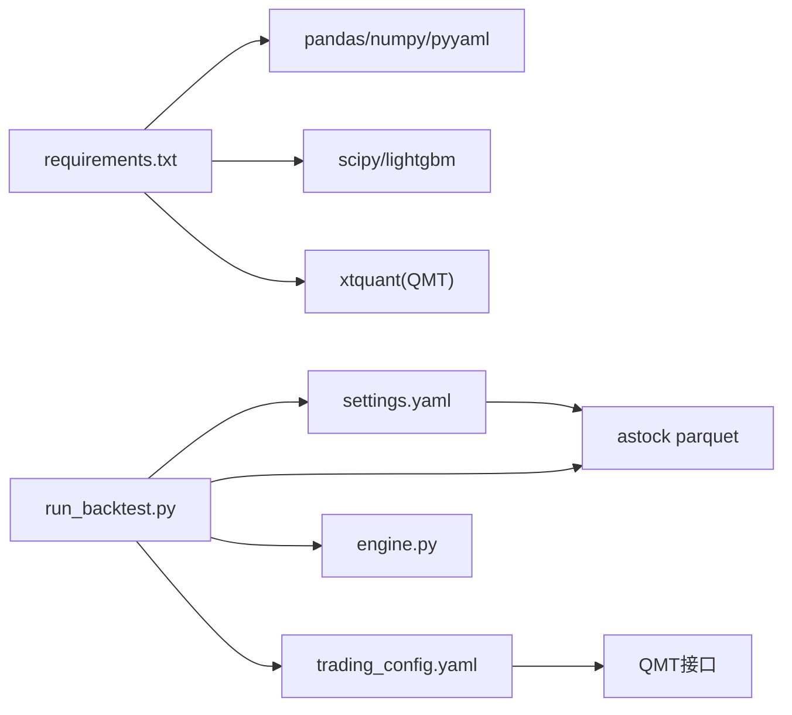

# 测试框架组织

<cite>
**本文引用的文件**   
- [engine_tests.py](file://projects/verification/engine_tests.py)
- [robustness_tests.py](file://projects/verification/robustness_tests.py)
- [portfolio_tests.py](file://projects/verification/portfolio_tests.py)
- [feasibility_tests.py](file://projects/verification/feasibility_tests.py)
- [run_backtest.py](file://scripts/run_backtest.py)
- [batch_ic_test.py](file://scripts/batch_ic_test.py)
- [daily_order_test.py](file://scripts/daily_order_test.py)
- [te_test_strategy.py](file://projects/Project_10_价值小盘V2/te_test_strategy.py)
- [test_trade_executor.py](file://projects/Project_10_价值小盘V2/test_trade_executor.py)
- [settings.yaml](file://config/settings.yaml)
- [trading_config.yaml](file://config/trading_config.yaml)
- [requirements.txt](file://requirements.txt)
- [engine.py](file://backtest/engine.py)
</cite>

## 目录
1. [引言](#引言)
2. [项目结构](#项目结构)
3. [核心组件](#核心组件)
4. [架构总览](#架构总览)
5. [详细组件分析](#详细组件分析)
6. [依赖关系分析](#依赖关系分析)
7. [性能考量](#性能考量)
8. [故障排查指南](#故障排查指南)
9. [结论](#结论)
10. [附录](#附录)

## 引言
本文件面向 QuantLab 测试框架的组织与使用，系统化阐述单元测试、集成测试、回测验证测试与鲁棒性测试的分类与职责；说明测试用例组织结构（命名规范、数据管理、环境配置）；解释自动化测试流程（执行、结果收集、报告生成）；介绍性能基准测试的实现与监控；给出覆盖率统计与质量门禁建议；并提供 TDD 实践指南与完整策略测试套件示例。

## 项目结构
QuantLab 的测试相关代码主要分布在以下位置：
- 验证与回归测试：projects/verification/*（引擎、组合、稳健性、可行性）
- 批量因子 IC 测试：scripts/batch_ic_test.py
- 实盘下单与委托链路测试：scripts/daily_order_test.py、projects/Project_10_价值小盘V2/te_test_strategy.py、test_trade_executor.py
- 回测运行入口：scripts/run_backtest.py
- 配置与环境：config/settings.yaml、config/trading_config.yaml、requirements.txt
- 回测引擎核心：backtest/engine.py

图示来源 
- [engine_tests.py:1-309](file://projects/verification/engine_tests.py#L1-L309)
- [robustness_tests.py:1-267](file://projects/verification/robustness_tests.py#L1-L267)
- [portfolio_tests.py:1-232](file://projects/verification/portfolio_tests.py#L1-L232)
- [feasibility_tests.py:1-178](file://projects/verification/feasibility_tests.py#L1-L178)
- [run_backtest.py:1-132](file://scripts/run_backtest.py#L1-L132)
- [batch_ic_test.py:1-266](file://scripts/batch_ic_test.py#L1-L266)
- [daily_order_test.py:1-227](file://scripts/daily_order_test.py#L1-L227)
- [te_test_strategy.py:1-289](file://projects/Project_10_价值小盘V2/te_test_strategy.py#L1-L289)
- [test_trade_executor.py:1-85](file://projects/Project_10_价值小盘V2/test_trade_executor.py#L1-L85)
- [settings.yaml:1-69](file://config/settings.yaml#L1-L69)
- [trading_config.yaml:1-62](file://config/trading_config.yaml#L1-L62)
- [requirements.txt:1-29](file://requirements.txt#L1-L29)
- [engine.py:479-522](file://backtest/engine.py#L479-L522)

章节来源
- [engine_tests.py:1-309](file://projects/verification/engine_tests.py#L1-L309)
- [robustness_tests.py:1-267](file://projects/verification/robustness_tests.py#L1-L267)
- [portfolio_tests.py:1-232](file://projects/verification/portfolio_tests.py#L1-L232)
- [feasibility_tests.py:1-178](file://projects/verification/feasibility_tests.py#L1-L178)
- [run_backtest.py:1-132](file://scripts/run_backtest.py#L1-L132)
- [batch_ic_test.py:1-266](file://scripts/batch_ic_test.py#L1-L266)
- [daily_order_test.py:1-227](file://scripts/daily_order_test.py#L1-L227)
- [te_test_strategy.py:1-289](file://projects/Project_10_价值小盘V2/te_test_strategy.py#L1-L289)
- [test_trade_executor.py:1-85](file://projects/Project_10_价值小盘V2/test_trade_executor.py#L1-L85)
- [settings.yaml:1-69](file://config/settings.yaml#L1-L69)
- [trading_config.yaml:1-62](file://config/trading_config.yaml#L1-L62)
- [requirements.txt:1-29](file://requirements.txt#L1-L29)
- [engine.py:479-522](file://backtest/engine.py#L479-L522)

## 核心组件
- 回测引擎验证（B模块）：覆盖已知结果、交易成本、涨跌停/停牌处理、资金约束、持仓一致性、先卖后买、止损等关键逻辑。
- 稳健性验证（D模块）：子样本检验、牛熊市分拆、极端事件压力、交易成本压力、容量估算、未来函数排查、幸存者偏差排查。
- 组合优化（E模块）：策略横向对比、相关性分析、风险平价权重、组合回测、滚动夏普稳定性。
- 实盘可行性评估（F模块）：滑点真实性、流动性评估、执行频率、miniQMT兼容性、资金需求、回测vs实盘偏差预估。
- 批量因子 IC 测试：全量因子 IC/ICIR 计算与筛选，输出报告与摘要。
- 实盘下单链路测试：限价单→反查→超时撤单→市价追单全流程验证。
- 交易模块测试：最小化策略验证 _te_ 函数的下单→反查→超时→撤单→重试闭环。

章节来源
- [engine_tests.py:15-257](file://projects/verification/engine_tests.py#L15-L257)
- [robustness_tests.py:35-218](file://projects/verification/robustness_tests.py#L35-L218)
- [portfolio_tests.py:36-181](file://projects/verification/portfolio_tests.py#L36-L181)
- [feasibility_tests.py:15-131](file://projects/verification/feasibility_tests.py#L15-L131)
- [batch_ic_test.py:95-186](file://scripts/batch_ic_test.py#L95-L186)
- [daily_order_test.py:106-227](file://scripts/daily_order_test.py#L106-L227)
- [te_test_strategy.py:138-206](file://projects/Project_10_价值小盘V2/te_test_strategy.py#L138-L206)
- [test_trade_executor.py:20-85](file://projects/Project_10_价值小盘V2/test_trade_executor.py#L20-L85)

## 架构总览
测试框架围绕“回测引擎 + 验证脚本 + 报告输出”的闭环构建。验证脚本通过读取历史数据或已有净值曲线，构造断言并生成 Markdown 报告；回测运行脚本负责加载配置、数据与策略，调用引擎执行并统一输出结果；因子 IC 测试脚本对因子库进行批量评估；实盘下单链路测试在 QMT 环境中模拟真实委托流程。

图示来源 
- [run_backtest.py:42-131](file://scripts/run_backtest.py#L42-L131)
- [engine.py:479-522](file://backtest/engine.py#L479-L522)

章节来源
- [run_backtest.py:42-131](file://scripts/run_backtest.py#L42-L131)
- [engine.py:479-522](file://backtest/engine.py#L479-L522)

## 详细组件分析

### 回测引擎验证（B模块）
- 目标：确保回测引擎在基础规则上的正确性（成本、涨跌停/停牌、资金约束、持仓一致性、先卖后买、止损）。
- 实现要点：
  - 已知结果校验：以等权全A近似指数收益作为参考。
  - 交易成本：佣金、印花税、滑点的逐项核算与阈值判定。
  - 涨跌停/停牌：逻辑断言与注释引用引擎实现位置。
  - 资金约束：不足时自动缩减数量并校验剩余现金非负。
  - 持仓一致性：现金+持仓市值=总权益恒等式。
  - 先卖后买：调仓日卖出后再买入的资金流顺序。
  - 止损：基于前一日收盘触发次日开盘卖出。
- 报告：汇总 PASS/FAIL 并保存为 Markdown。

图示来源 
- [engine_tests.py:15-257](file://projects/verification/engine_tests.py#L15-L257)

章节来源
- [engine_tests.py:15-257](file://projects/verification/engine_tests.py#L15-L257)

### 稳健性验证（D模块）
- 目标：从多时间窗口、市场环境与极端事件中评估策略稳健性，排查未来函数与幸存者偏差。
- 实现要点：
  - 子样本检验：三段区间年化收益与回撤阈值。
  - 牛熊市分拆：不同市场环境下的收益与回撤。
  - 极端事件压力：特定时间段内最大损失阈值。
  - 交易成本压力：提高佣金与滑点后的影响评估。
  - 容量估算：基于成交额与持仓数估算可容纳资金范围。
  - 未来函数排查：财务公告日、当日估值、涨跌停判断、行业分类、成分股历史等检查。
  - 幸存者偏差：退市标记与股票数量变化检查。
- 报告：按测试项生成表格或键值对，输出 Markdown。

图示来源 
- [robustness_tests.py:35-218](file://projects/verification/robustness_tests.py#L35-L218)

章节来源
- [robustness_tests.py:35-218](file://projects/verification/robustness_tests.py#L35-L218)

### 组合优化（E模块）
- 目标：多策略横向对比、相关性分析、风险平价权重分配、组合回测与滚动夏普稳定性。
- 实现要点：
  - 横向对比：手动输入或读取各策略净值 CSV 计算指标。
  - 相关性：日收益率矩阵与相关系数。
  - 风险平价：波动率倒数归一化为权重。
  - 组合回测：归一化净值加权求和，计算年化收益、回撤、夏普。
  - 滚动夏普：60日滚动均值/标准差，统计负值天数占比。
- 报告：字典与列表混合格式，输出 Markdown。

图示来源 
- [portfolio_tests.py:36-181](file://projects/verification/portfolio_tests.py#L36-L181)

章节来源
- [portfolio_tests.py:36-181](file://projects/verification/portfolio_tests.py#L36-L181)

### 实盘可行性评估（F模块）
- 目标：滑点真实性、流动性、执行频率、miniQMT 兼容性、资金需求、回测vs实盘偏差预估。
- 实现要点：
  - 滑点评估：回测假设 vs 真实预估偏差倍数与影响等级。
  - 流动性评估：全 A 日均成交额中位数/均值与建议阈值。
  - 执行频率：调仓频率、单次交易数、日均交易上限。
  - miniQMT 兼容性：函数调用、参数、编码、Python 版本、文件格式。
  - 资金需求：最低资金与建议资金范围。
  - 偏差预估：折扣系数与偏差来源说明。
- 报告：表格与键值对混合，输出 Markdown。

图示来源 
- [feasibility_tests.py:15-131](file://projects/verification/feasibility_tests.py#L15-L131)

章节来源
- [feasibility_tests.py:15-131](file://projects/verification/feasibility_tests.py#L15-L131)

### 批量因子 IC 测试
- 目标：对 alpha101 与 gtja191 全量因子计算 IC/ICIR，筛选高 alpha 因子。
- 实现要点：
  - 数据准备：读取 parquet 并过滤有效股票与日期。
  - Panel 构建：宽表形式（日期×股票代码）。
  - 因子计算：通过注册器 compute 获取因子序列。
  - IC 计算：月度重平衡日 Spearman 秩相关，统计均值、标准差与正比例。
  - 结果输出：CSV 全量报告、Top 因子、Markdown 摘要。
- 报告：包含 Top 20 因子排名与当前策略因子 ICIR 对照。

图示来源 
- [batch_ic_test.py:95-186](file://scripts/batch_ic_test.py#L95-L186)

章节来源
- [batch_ic_test.py:95-186](file://scripts/batch_ic_test.py#L95-L186)

### 实盘下单链路测试（QMT）
- 目标：验证限价单→反查→超时撤单→市价追单的完整链路。
- 实现要点：
  - 定时下单：每日固定时间限价买入。
  - 状态监控：查询委托状态，区分已成交/废单/已撤。
  - 超时处理：超过阈值自动撤单并以卖1价市价追单。
  - 日志记录：增量写入本地日志文件。
- 报告：控制台打印与日志文件。

图示来源 
- [daily_order_test.py:106-227](file://scripts/daily_order_test.py#L106-L227)

章节来源
- [daily_order_test.py:106-227](file://scripts/daily_order_test.py#L106-L227)

### 交易模块测试（_te_ 函数）
- 目标：最小化策略验证 _te_ 函数的下单→反查→超时→撤单→重试闭环。
- 实现要点：
  - 初始化：设置账户、待成交队列、巡检节流。
  - 下单：passorder 发送委托，短轮询等待可见。
  - 巡检：每分钟反查一次，查找委托状态与成交进度。
  - 超时与重试：达到阈值后撤单并重下，计数限制。
  - 报告：阶段化日志与最终报告。
- 报告：控制台与日志文件。

图示来源 
- [te_test_strategy.py:138-206](file://projects/Project_10_价值小盘V2/te_test_strategy.py#L138-L206)

章节来源
- [te_test_strategy.py:138-206](file://projects/Project_10_价值小盘V2/te_test_strategy.py#L138-L206)

## 依赖关系分析
- 外部依赖：pandas、numpy、pyyaml、scipy、lightgbm（可选）、xtquant（QMT 实盘）。
- 数据源：astock parquet（只读），benchmark DuckDB（可选）。
- 配置：全局 settings.yaml 与实盘 trading_config.yaml。
- 回测引擎：engine.py 提供 run_backtest 与指标计算。

图示来源 
- [requirements.txt:1-29](file://requirements.txt#L1-L29)
- [settings.yaml:1-69](file://config/settings.yaml#L1-L69)
- [trading_config.yaml:1-62](file://config/trading_config.yaml#L1-L62)
- [run_backtest.py:42-131](file://scripts/run_backtest.py#L42-L131)
- [engine.py:479-522](file://backtest/engine.py#L479-L522)

章节来源
- [requirements.txt:1-29](file://requirements.txt#L1-L29)
- [settings.yaml:1-69](file://config/settings.yaml#L1-L69)
- [trading_config.yaml:1-62](file://config/trading_config.yaml#L1-L62)
- [run_backtest.py:42-131](file://scripts/run_backtest.py#L42-L131)
- [engine.py:479-522](file://backtest/engine.py#L479-L522)

## 性能考量
- 数据读取：parquet 列裁剪与分区过滤可减少 IO；避免重复加载。
- 因子计算：Panel 构建与向量化运算优先，减少循环；必要时分块计算。
- 回测引擎：日历对齐与基准数据预取，避免频繁磁盘访问。
- 报告生成：批量写入与压缩归档，降低 I/O 开销。
- 监控：在关键路径加入耗时统计与内存峰值采样，便于定位瓶颈。

[本节为通用指导，不直接分析具体文件]

## 故障排查指南
- 回测引擎问题：
  - 基准数据缺失或起点价格为 0：检查 benchmark_db_path 与数据完整性。
  - 样本期过短：确认 start_date/end_date 与实际交易日对齐。
  - 指标异常：核对 performance 计算与 benchmark_available 标志。
- 因子 IC 测试：
  - 因子结果为空：检查 panel 字段映射与因子注册器可用性。
  - IC 日期不足：调整月度重平衡筛选条件。
- 实盘下单链路：
  - 反查接口不可用：确认 QMT 环境与支持情况。
  - 委托状态异常：核对 order_id 分配延迟与轮询次数。
- 配置与环境：
  - 路径错误：检查 astock 路径与缓存目录权限。
  - 依赖缺失：安装 requirements.txt 所列依赖。

章节来源
- [engine.py:479-522](file://backtest/engine.py#L479-L522)
- [batch_ic_test.py:95-186](file://scripts/batch_ic_test.py#L95-L186)
- [daily_order_test.py:106-227](file://scripts/daily_order_test.py#L106-L227)
- [settings.yaml:1-69](file://config/settings.yaml#L1-L69)
- [requirements.txt:1-29](file://requirements.txt#L1-L29)

## 结论
QuantLab 测试框架以验证脚本为核心，覆盖回测引擎、稳健性、组合优化与实盘可行性等多维度测试；通过统一的报告输出与清晰的依赖管理，形成从数据到策略再到实盘的闭环验证体系。建议在 CI 中集成批量 IC 测试与回测验证，结合覆盖率统计与质量门禁，持续提升策略质量与系统可靠性。

[本节为总结，不直接分析具体文件]

## 附录

### 测试用例组织结构与命名规范
- 文件命名：按模块划分，如 engine_tests.py、robustness_tests.py、portfolio_tests.py、feasibility_tests.py。
- 函数命名：test_X_Y 或 eX_y、fX_y，体现模块与序号。
- 数据管理：集中读取 parquet/CSV，统一路径常量与异常处理。
- 环境配置：settings.yaml 定义全局路径与默认参数；trading_config.yaml 定义实盘参数。

章节来源
- [engine_tests.py:1-309](file://projects/verification/engine_tests.py#L1-L309)
- [robustness_tests.py:1-267](file://projects/verification/robustness_tests.py#L1-L267)
- [portfolio_tests.py:1-232](file://projects/verification/portfolio_tests.py#L1-L232)
- [feasibility_tests.py:1-178](file://projects/verification/feasibility_tests.py#L1-L178)
- [settings.yaml:1-69](file://config/settings.yaml#L1-L69)
- [trading_config.yaml:1-62](file://config/trading_config.yaml#L1-L62)

### 自动化测试流程
- 执行：scripts/run_backtest.py 作为 CLI 入口，解析 YAML 配置并调用 engine.run_backtest。
- 结果收集：report.write_all 统一输出 equity_curve.csv、trades.csv、summary.json、report.md。
- 报告生成：Markdown 表格与键值对混合格式，便于审阅与归档。

章节来源
- [run_backtest.py:42-131](file://scripts/run_backtest.py#L42-L131)

### 性能基准测试与监控
- 基准框架：batch_ic_test.py 对全量因子进行 IC/ICIR 计算，输出 Top 因子与摘要。
- 监控建议：在关键步骤添加计时与日志，记录失败与跳过原因，便于持续优化。

章节来源
- [batch_ic_test.py:95-186](file://scripts/batch_ic_test.py#L95-L186)

### 测试覆盖率统计与质量门禁
- 覆盖率：建议使用 pytest-cov 对验证脚本与核心模块进行覆盖率采集，设定阈值（如行覆盖率≥80%）。
- 质量门禁：CI 中集成覆盖率与关键测试（引擎验证、稳健性、IC 筛选）的通过条件，失败则阻断合并。

[本节为通用指导，不直接分析具体文件]

### 测试驱动开发（TDD）实践指南
- 测试优先：先编写断言明确的测试用例（如已知结果、成本核算、涨跌停/停牌），再实现策略与引擎逻辑。
- 重构策略：保持测试稳定，逐步替换实现细节；引入 Mock 隔离外部依赖（QMT 接口、数据源）。
- 迭代验证：每次改动后运行 B/D/E/F 模块测试，确保回归通过。

[本节为通用指导，不直接分析具体文件]

### 策略模块完整测试套件示例
- 单元层：针对策略信号生成函数进行输入输出断言（价格、成交量、因子值）。
- 集成层：串联数据读取、因子计算、信号生成与仓位控制，验证端到端流程。
- 回测层：使用 run_backtest.py 执行回测，校验净值曲线、交易明细与指标。
- 鲁棒性层：子样本、牛熊市、压力测试与容量估算，确保策略在不同环境下稳定。
- 实盘层：daily_order_test.py 与 te_test_strategy.py 验证下单与反查链路。

章节来源
- [run_backtest.py:42-131](file://scripts/run_backtest.py#L42-L131)
- [daily_order_test.py:106-227](file://scripts/daily_order_test.py#L106-L227)
- [te_test_strategy.py:138-206](file://projects/Project_10_价值小盘V2/te_test_strategy.py#L138-L206)