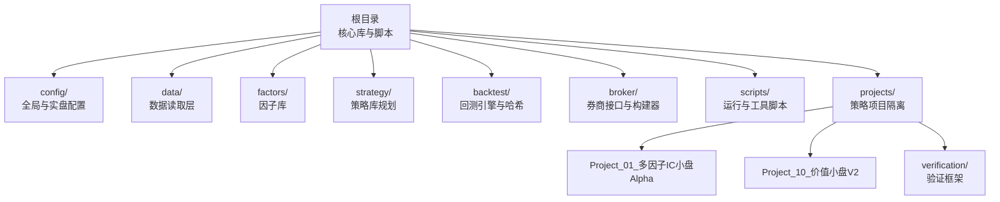
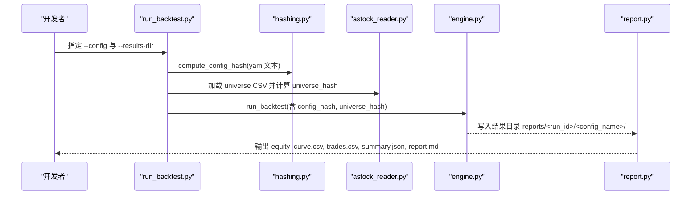
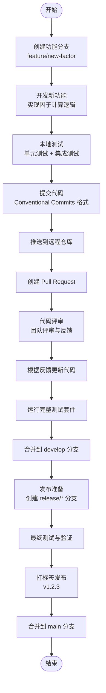
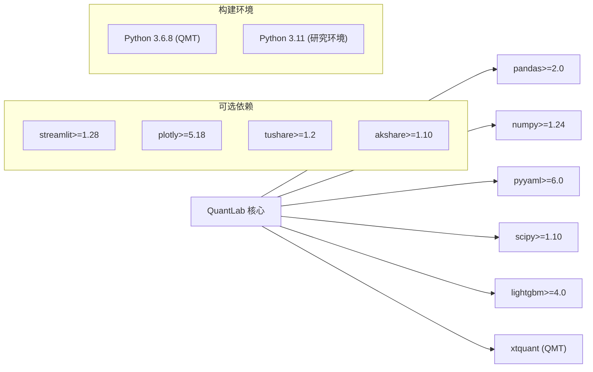

# 版本控制策略

<cite>
**本文引用的文件**   
- [.gitignore](file://.gitignore)
- [AGENTS.md](file://AGENTS.md)
- [requirements.txt](file://requirements.txt)
- [setup.py](file://setup.py)
- [config/settings.yaml](file://config/settings.yaml)
- [config/trading_config.yaml](file://config/trading_config.yaml)
- [projects/Project_01_多因子IC小盘Alpha/config/strategy.yaml](file://projects/Project_01_多因子IC小盘Alpha/config/strategy.yaml)
- [projects/verification/results/production_config.yaml](file://projects/verification/results/production_config.yaml)
- [backtest/hashing.py](file://backtest/hashing.py)
- [scripts/run_backtest.py](file://scripts/run_backtest.py)
- [main.py](file://main.py)
- [projects/Project_10_价值小盘V2/build.py](file://projects/Project_10_价值小盘V2/build.py)
- [scripts/update_astock.py](file://scripts/update_astock.py)
- [全局复利与踩坑日志.md](file://全局复利与踩坑日志.md)
</cite>

## 目录
1. [引言](#引言)
2. [项目结构](#项目结构)
3. [核心组件](#核心组件)
4. [架构总览](#架构总览)
5. [详细组件分析](#详细组件分析)
6. [依赖分析](#依赖分析)
7. [性能考虑](#性能考虑)
8. [故障排查指南](#故障排查指南)
9. [结论](#结论)
10. [附录](#附录)

## 引言
本文件为 QuantLab 的版本控制策略提供系统化、可操作的规范，覆盖分支模型、提交信息、标签约定、配置文件与敏感信息管理、数据版本化、Git hooks、大型数据集管理（LFS）、协作冲突解决与合并策略，以及端到端工作流示例。目标是确保代码、配置与数据的可追溯性、可复现性与团队协作效率。

## 项目结构
QuantLab 采用“核心库 + 策略项目隔离”的组织方式：
- 核心库：回测引擎、因子库、数据读取层、Broker 接口等位于根目录模块中。
- 策略项目：每个策略在 projects/ 下独立目录，包含策略源码、配置、结果与文档，便于隔离与复用。
- 配置体系：三级级联（全局 settings.yaml → 实盘 trading_config.yaml → 项目级 strategy.yaml）。
- 构建产物：QMT 部署文件按项目自包含于 build/ 子目录，避免跨项目污染。

**图表来源** 
- [AGENTS.md](file://AGENTS.md)
- [config/settings.yaml](file://config/settings.yaml)
- [config/trading_config.yaml](file://config/trading_config.yaml)
- [backtest/hashing.py](file://backtest/hashing.py)
- [scripts/run_backtest.py](file://scripts/run_backtest.py)
- [main.py](file://main.py)
- [projects/Project_10_价值小盘V2/build.py](file://projects/Project_10_价值小盘V2/build.py)

**章节来源**
- [AGENTS.md](file://AGENTS.md)
- [config/settings.yaml](file://config/settings.yaml)
- [config/trading_config.yaml](file://config/trading_config.yaml)

## 核心组件
- 配置系统（三级级联）
  - 全局配置：settings.yaml（项目信息、数据源、回测参数、因子预处理、策略默认股票池、日志）
  - 实盘配置：trading_config.yaml（账号、交易参数、风控阈值、委托管理、调度计划、通知）
  - 项目级配置：projects/*/config/strategy.yaml（项目独立参数）
- 构建与产物
  - QMT 构建器生成 GBK 编码单文件策略，置于各项目的 build/ 目录，自包含部署。
- 数据与哈希
  - 回测入口通过 scripts/run_backtest.py 加载 YAML 并计算配置与宇宙哈希，保证结果可复现。
  - backtest/hashing.py 提供 universe/data/config 的哈希计算函数。
- 主入口与运行
  - main.py 作为回测模式入口，支持不同策略路由与参数注入。

**章节来源**
- [AGENTS.md](file://AGENTS.md)
- [config/settings.yaml](file://config/settings.yaml)
- [config/trading_config.yaml](file://config/trading_config.yaml)
- [projects/Project_01_多因子IC小盘Alpha/config/strategy.yaml](file://projects/Project_01_多因子IC小盘Alpha/config/strategy.yaml)
- [backtest/hashing.py](file://backtest/hashing.py)
- [scripts/run_backtest.py](file://scripts/run_backtest.py)
- [main.py](file://main.py)
- [projects/Project_10_价值小盘V2/build.py](file://projects/Project_10_价值小盘V2/build.py)

## 架构总览
下图展示从配置到回测执行与结果输出的关键流程，体现版本控制的关键点：配置哈希、宇宙哈希、数据路径与时间戳参与结果标识。

**图表来源** 
- [scripts/run_backtest.py](file://scripts/run_backtest.py)
- [backtest/hashing.py](file://backtest/hashing.py)
- [main.py](file://main.py)

## 详细组件分析

### 分支管理模型
- 推荐采用 Git Flow 或简化版分支模型：
  - main：稳定发布线，仅接受经过验证的变更（含标签 vX.Y.Z）。
  - develop：集成开发主线，日常功能迭代在此进行。
  - feature/*：新功能分支，命名如 feature/factor-vwap-volume-corr。
  - release/*：预发布分支，用于回归测试与发布准备。
  - hotfix/*：紧急修复分支，快速修复后合并至 main 与 develop。
- 分支命名与提交信息需遵循统一规范（见下文提交信息规范）。

[本节为概念性说明，不直接分析具体文件]

### 提交信息规范
- 使用 Conventional Commits 风格：type(scope): subject
  - type：feat/fix/docs/style/refactor/test/chore等
  - scope：模块或项目名，如 config/backtest/broker/projects/Project_XX
  - subject：简洁描述变更内容
- 示例：
  - feat(config): 新增项目级策略参数模板
  - fix(backtest): 修正回测成本计算边界条件
  - docs(specs): 更新因子权重变更说明
- 强制要求：
  - 每次提交必须关联需求或问题编号（如 SPEC-001、ISSUE-123）
  - 涉及配置或参数的变更需在提交信息中注明影响范围与验证方法

[本节为概念性说明，不直接分析具体文件]

### 标签使用约定
- 语义化版本控制（SemVer）：v主版本.次版本.修订号
  - 主版本：破坏性变更（如 API 重构、数据格式变更）
  - 次版本：新功能（向后兼容）
  - 修订号：bug 修复与小改进
- 标签命名：v1.2.3
- 标签创建时机：
  - 发布前在 release/* 分支完成所有测试与审计
  - 合并至 main 后打标签并推送至远程仓库
- 标签内容应包含：
  - 变更摘要
  - 已知限制与注意事项
  - 回测结果与验证报告链接

[本节为概念性说明，不直接分析具体文件]

### 配置文件版本控制最佳实践
- 分级管理：
  - 全局配置（settings.yaml）：存储非敏感的环境无关参数
  - 实盘配置（trading_config.yaml）：敏感信息（账号、路径）需加密或外部化管理
  - 项目配置（projects/*/config/strategy.yaml）：策略参数与回测设置
- 敏感信息管理：
  - 禁止将明文密码、API Key、账号ID等敏感信息直接提交到仓库
  - 使用环境变量或密钥管理服务（如 Vault、AWS Secrets Manager）
  - 本地开发使用 .env 文件（加入 .gitignore），生产环境通过安全配置中心注入
- 配置加密存储：
  - 对敏感配置文件使用 gpg 或 sops 加密
  - 解密流程应在 CI/CD 管道中自动化，避免人工操作失误
- 配置变更追踪：
  - 每次配置变更需附带变更理由与影响评估
  - 重大配置变更需经过评审与测试验证

**章节来源**
- [config/settings.yaml](file://config/settings.yaml)
- [config/trading_config.yaml](file://config/trading_config.yaml)
- [projects/Project_01_多因子IC小盘Alpha/config/strategy.yaml](file://projects/Project_01_多因子IC小盘Alpha/config/strategy.yaml)
- [projects/verification/results/production_config.yaml](file://projects/verification/results/production_config.yaml)

### 数据版本管理方案
- 原始数据：
  - 使用 LFS（Large File Storage）管理大型数据集（如 parquet 文件）
  - 数据更新时创建新版本标签（如 data/v20260803）
  - 保持数据不可变性，任何修改都应生成新文件而非覆盖
- 中间数据：
  - 缓存目录（data/cache/）不应纳入版本控制
  - 中间处理结果使用唯一 ID 命名，便于追踪与清理
- 结果数据：
  - 回测结果存储在 reports/ 目录下，按运行时间与配置命名
  - 结果文件包含哈希信息（config_hash、universe_hash）确保可复现
- 数据快照策略：
  - 定期创建数据快照（如每日凌晨）
  - 快照文件压缩存储，保留最近 N 个版本
  - 数据恢复流程需文档化并定期演练

**章节来源**
- [backtest/hashing.py](file://backtest/hashing.py)
- [scripts/run_backtest.py](file://scripts/run_backtest.py)
- [.gitignore](file://.gitignore)

### Git Hooks 使用规范
- 预提交检查（pre-commit）：
  - 代码格式检查（flake8、black、isort）
  - 导入顺序检查（pylint-imports）
  - 配置文件语法验证（yaml.safe_load）
  - 敏感信息扫描（detect-secrets）
- 提交消息钩子（commit-msg）：
  - 验证提交信息格式是否符合 Conventional Commits
  - 强制包含变更类型与作用域
- 推送前检查（pre-push）：
  - 运行单元测试与集成测试
  - 执行代码覆盖率检查（覆盖率不低于 80%）
  - 构建验证（QMT 策略构建成功）
- 自动化测试：
  - 单元测试：针对因子计算、数据处理逻辑
  - 集成测试：回测引擎与数据读取器集成
  - 端到端测试：完整回测流程验证

**章节来源**
- [AGENTS.md](file://AGENTS.md)
- [全局复利与踩坑日志.md](file://全局复利与踩坑日志.md)

### 大型数据集版本管理解决方案
- LFS 配置：
  - 在 .gitattributes 中定义大文件规则（*.parquet filter=lfs diff=lfs merge=lfs -text）
  - 配置 LFS 服务器地址与认证信息
- 数据上传策略：
  - 增量更新：只上传变更的数据块
  - 批量上传：夜间定时任务处理大量数据更新
  - 断点续传：网络中断后自动恢复上传
- 数据快照策略：
  - 每周创建全量快照，保留 4 周历史
  - 每月归档旧快照到冷存储（如 S3 Glacier）
  - 快照元数据记录数据来源、更新时间、文件大小等信息
- 数据访问优化：
  - 使用 Parquet 列式存储提升查询性能
  - 分区策略按日期与股票代码组织
  - 索引常用查询字段加速筛选

**章节来源**
- [.gitignore](file://.gitignore)
- [scripts/update_astock.py](file://scripts/update_astock.py)

### 协作开发中的冲突解决流程
- 冲突预防：
  - 频繁同步 develop 分支，减少长期分支差异
  - 小步提交，避免大改动累积
  - 使用特性开关（feature flags）隔离未完成功能
- 冲突解决步骤：
  1. 识别冲突文件（git status 显示 CONFLICTED）
  2. 分析冲突原因（分支功能重叠或配置冲突）
  3. 手动解决冲突（保留必要变更，删除冗余代码）
  4. 测试验证（运行相关测试用例）
  5. 提交解决结果（git add 冲突文件后 commit）
- 合并策略：
  - 功能分支合并到 develop：使用 rebase 保持线性历史
  - develop 合并到 main：使用 merge 保留分支历史
  - 热修复分支：快速合并到 main 和 develop，打标签发布
- 代码评审：
  - 所有合并请求必须经过至少一名团队成员评审
  - 评审重点：逻辑正确性、性能影响、安全性、可维护性
  - 评审通过后才能合并，避免未经审核的代码进入主干

**章节来源**
- [AGENTS.md](file://AGENTS.md)
- [全局复利与踩坑日志.md](file://全局复利与踩坑日志.md)

### 实际版本控制工作流示例
以下是一个完整的策略开发与发布工作流：

**图表来源** 
- [AGENTS.md](file://AGENTS.md)
- [scripts/run_backtest.py](file://scripts/run_backtest.py)

**章节来源**
- [AGENTS.md](file://AGENTS.md)
- [scripts/run_backtest.py](file://scripts/run_backtest.py)

## 依赖分析
QuantLab 的依赖关系清晰分层：
- 核心依赖：pandas、numpy、pyyaml（requirements.txt 定义）
- 可选依赖：scipy（回测）、lightgbm（ML）、可视化库（streamlit、plotly）
- 外部依赖：xtquant（QMT 实盘，需从安装目录复制）
- 构建依赖：Python 3.6.8 兼容性（QMT 环境限制）

**图表来源** 
- [requirements.txt](file://requirements.txt)
- [setup.py](file://setup.py)
- [AGENTS.md](file://AGENTS.md)

**章节来源**
- [requirements.txt](file://requirements.txt)
- [setup.py](file://setup.py)
- [AGENTS.md](file://AGENTS.md)

## 性能考虑
- 数据加载优化：
  - 使用 Parquet 格式提升 I/O 性能
  - 实现数据缓存机制（data/cache/）减少重复读取
  - 并行处理大数据集（scripts/update_astock.py 使用 ProcessPoolExecutor）
- 内存管理：
  - 及时释放不再使用的 DataFrame 对象
  - 使用生成器处理超大数据集
  - 监控内存使用情况，避免 OOM 错误
- 计算优化：
  - 向量化操作替代循环计算
  - 使用 NumPy 和 Pandas 的高效函数
  - 合理设置多线程/多进程参数
- 磁盘 I/O 优化：
  - 批量写入减少文件系统调用次数
  - 使用临时文件提高写入效率
  - 定期清理缓存和临时文件

[本节为通用性能建议，不直接分析具体文件]

## 故障排查指南
- 常见配置问题：
  - 配置文件路径错误：检查 settings.yaml 中的路径配置
  - 权限问题：确保对 data/、reports/ 目录有读写权限
  - 编码问题：QMT 策略文件必须使用 GBK 编码
- 数据加载失败：
  - 检查 astock 数据路径是否正确
  - 验证 parquet 文件完整性
  - 确认数据版本与代码兼容性
- 回测结果异常：
  - 检查配置哈希是否一致
  - 验证宇宙列表是否更新
  - 确认数据时间范围是否正确
- 构建失败：
  - 检查 Python 版本兼容性（3.6.8 vs 3.11）
  - 验证 GBK 编码转换是否正确
  - 确认 BUILD_TAG 注入是否成功

**章节来源**
- [AGENTS.md](file://AGENTS.md)
- [全局复利与踩坑日志.md](file://全局复利与踩坑日志.md)
- [projects/Project_10_价值小盘V2/build.py](file://projects/Project_10_价值小盘V2/build.py)

## 结论
QuantLab 的版本控制策略通过规范的分支管理、提交信息、标签约定、配置文件管理、数据版本化和 Git hooks 自动化，确保了代码质量、可复现性和团队协作效率。建议团队严格遵守这些规范，持续改进版本控制流程，以支持量化研究的快速迭代和生产环境的稳定运行。

[本节为总结性内容，不直接分析具体文件]

## 附录

### 快速参考清单
- 分支命名：feature/*, bugfix/*, release/*, hotfix/*
- 提交信息：type(scope): subject（feat/fix/docs/style/refactor/test/chore）
- 标签格式：v主版本.次版本.修订号（v1.2.3）
- 配置文件：settings.yaml → trading_config.yaml → strategy.yaml
- 数据管理：LFS + 快照 + 不可变原则
- 构建产物：GBK 编码，build/ 目录自包含

[本节为参考信息，不直接分析具体文件]