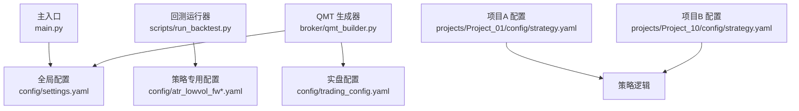
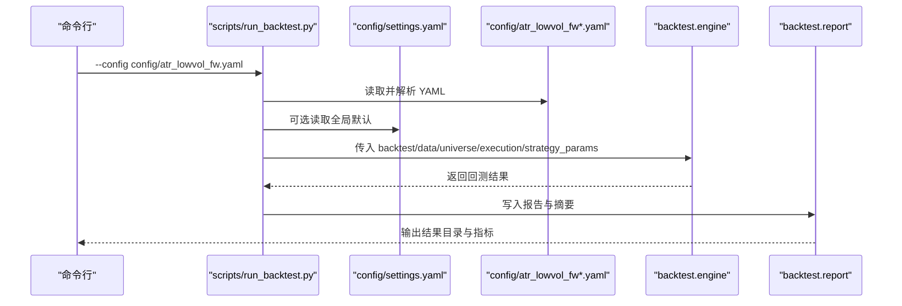
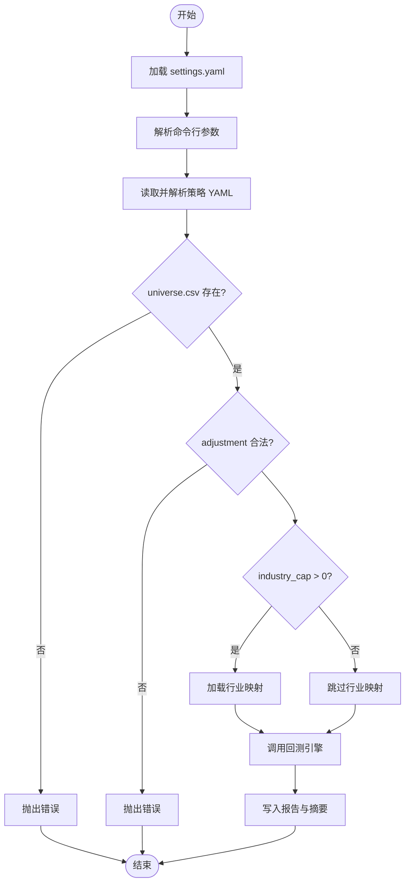
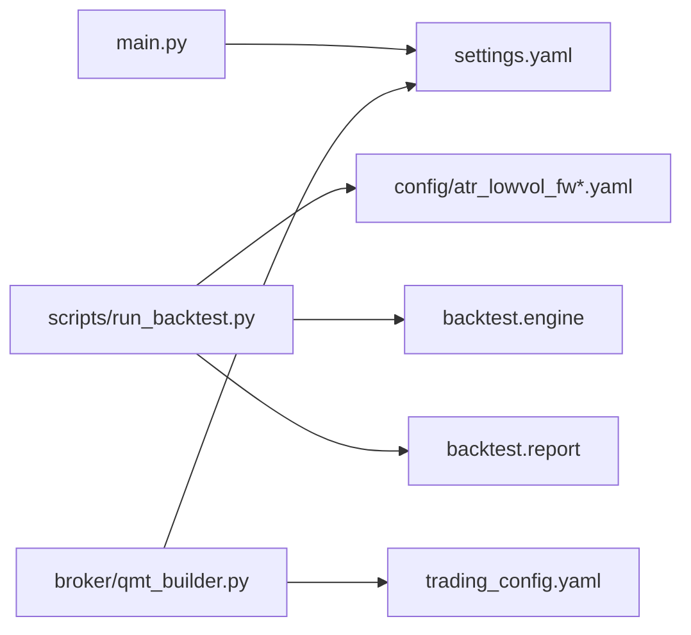

# 配置管理系统

<cite>
**本文引用的文件**   
- [settings.yaml](file://config/settings.yaml)
- [trading_config.yaml](file://config/trading_config.yaml)
- [strategy.yaml（Project_01）](file://projects/Project_01_多因子IC小盘Alpha/config/strategy.yaml)
- [strategy.yaml（Project_10）](file://projects/Project_10_价值小盘V2/config/strategy.yaml)
- [atr_lowvol_fw.yaml](file://config/atr_lowvol_fw.yaml)
- [atr_lowvol_fw_leverage_only.yaml](file://config/atr_lowvol_fw_leverage_only.yaml)
- [atr_lowvol_fw_leveraged.yaml](file://config/atr_lowvol_fw_leveraged.yaml)
- [main.py](file://main.py)
- [run_backtest.py](file://scripts/run_backtest.py)
- [qmt_builder.py](file://broker/qmt_builder.py)
- [AGENTS.md](file://AGENTS.md)
- [miniQMT实盘对接_生产级完善方案.md](file://miniQMT实盘对接_生产级完善方案.md)
</cite>

## 目录
1. [引言](#引言)
2. [项目结构](#项目结构)
3. [核心组件](#核心组件)
4. [架构总览](#架构总览)
5. [详细组件分析](#详细组件分析)
6. [依赖关系分析](#依赖关系分析)
7. [性能考虑](#性能考虑)
8. [故障排查指南](#故障排查指南)
9. [结论](#结论)
10. [附录](#附录)

## 引言
本文件为 QuantLab 配置管理系统的权威文档，聚焦多层次配置架构与最佳实践。系统采用“三级级联”的配置模型：全局配置（settings.yaml）、实盘配置（trading_config.yaml）、项目级配置（各项目的 strategy.yaml）。本文阐述各层职责、继承与覆盖规则、YAML 语法规范、参数校验与默认值处理、环境变量集成策略、热重载机制、典型使用场景（数据源切换、回测参数调整、实盘交易配置），以及版本管理与迁移策略。读者可据此快速搭建、调试与演进配置体系，确保回测与实盘的一致性与可追溯性。

## 项目结构
QuantLab 将配置按层级拆分到不同目录与文件，便于复用与隔离：
- 全局配置：config/settings.yaml
- 实盘配置：config/trading_config.yaml
- 项目级配置：projects/*/config/strategy.yaml
- 策略专用配置：config/*.yaml（如 atr_lowvol_fw*.yaml）
- 入口与加载器：main.py、scripts/run_backtest.py、broker/qmt_builder.py

图表来源
- [main.py:21-34](file://main.py#L21-L34)
- [settings.yaml:1-69](file://config/settings.yaml#L1-L69)
- [run_backtest.py:35-64](file://scripts/run_backtest.py#L35-L64)
- [atr_lowvol_fw.yaml:1-49](file://config/atr_lowvol_fw.yaml#L1-L49)
- [qmt_builder.py:21-24](file://broker/qmt_builder.py#L21-L24)
- [trading_config.yaml:1-59](file://config/trading_config.yaml#L1-L59)

章节来源
- [AGENTS.md:90-94](file://AGENTS.md#L90-L94)
- [settings.yaml:1-69](file://config/settings.yaml#L1-L69)
- [trading_config.yaml:1-59](file://config/trading_config.yaml#L1-L59)
- [run_backtest.py:1-132](file://scripts/run_backtest.py#L1-L132)
- [main.py:1-104](file://main.py#L1-L104)
- [qmt_builder.py:1-200](file://broker/qmt_builder.py#L1-L200)

## 核心组件
- 全局配置（settings.yaml）
  - 定义项目元信息、数据源路径、缓存开关、回测默认参数、日志级别、因子预处理选项、默认股票池、以及指向实盘配置文件的路径与开关。
- 实盘配置（trading_config.yaml）
  - 定义账号、交易费率与滑点、风控阈值、委托超时与重试、调度计划、通知渠道、数据源路径与缓存目录、以及示例策略参数。
- 项目级配置（projects/*/config/strategy.yaml）
  - 定义策略名称与版本、因子权重与过滤条件、回测参数、结果记录、实盘参数、以及与 QMT 的对接参数。
- 策略专用配置（config/atr_lowvol_fw*.yaml）
  - 面向具体策略的回测与执行参数，包括基准、数据路径、调仓频率、组合层约束（杠杆、波动率目标、行业上限等）。

章节来源
- [settings.yaml:1-69](file://config/settings.yaml#L1-L69)
- [trading_config.yaml:1-59](file://config/trading_config.yaml#L1-L59)
- [strategy.yaml（Project_01）:1-62](file://projects/Project_01_多因子IC小盘Alpha/config/strategy.yaml#L1-L62)
- [strategy.yaml（Project_10）:1-62](file://projects/Project_10_价值小盘V2/config/strategy.yaml#L1-L62)
- [atr_lowvol_fw.yaml:1-49](file://config/atr_lowvol_fw.yaml#L1-L49)
- [atr_lowvol_fw_leverage_only.yaml:1-48](file://config/atr_lowvol_fw_leverage_only.yaml#L1-L48)
- [atr_lowvol_fw_leveraged.yaml:1-47](file://config/atr_lowvol_fw_leveraged.yaml#L1-L47)

## 架构总览
配置加载与使用的关键流程如下：
- main.py 读取 settings.yaml，作为全局上下文。
- scripts/run_backtest.py 通过命令行参数指定策略专用 YAML，解析 backtest/data/universe/execution/strategy_params 等键，驱动回测引擎。
- broker/qmt_builder.py 读取 settings.yaml，并参考 trading_config.yaml 组装 QMT 策略源码。

图表来源
- [run_backtest.py:35-132](file://scripts/run_backtest.py#L35-L132)
- [settings.yaml:1-69](file://config/settings.yaml#L1-L69)
- [atr_lowvol_fw.yaml:1-49](file://config/atr_lowvol_fw.yaml#L1-L49)

章节来源
- [run_backtest.py:1-132](file://scripts/run_backtest.py#L1-L132)
- [main.py:21-34](file://main.py#L21-L34)
- [qmt_builder.py:21-24](file://broker/qmt_builder.py#L21-L24)

## 详细组件分析

### 全局配置（settings.yaml）
- 职责
  - 统一项目根路径、数据源路径、缓存目录与过期策略。
  - 提供回测默认时间窗口、初始资金、手续费与滑点、基准代码。
  - 定义因子预处理开关与方法（中性化、标准化、截尾）。
  - 定义默认股票池（small_cap/mid_cap/large_cap）及市值区间。
  - 指向实盘配置文件与是否启用实盘的开关。
- 最佳实践
  - 路径使用正斜杠或转义反斜杠保持一致性。
  - 布尔值使用 true/false；数值避免单位混用（金额用纯数字）。
  - 对可选字段设置合理默认值，避免运行时缺失。
- 校验与默认值
  - 在加载后由上层模块进行必要校验（例如 data.adjustment 枚举校验见 run_backtest.py）。
  - 未提供的字段应使用默认值，保证健壮性。

章节来源
- [settings.yaml:1-69](file://config/settings.yaml#L1-L69)
- [run_backtest.py:75-78](file://scripts/run_backtest.py#L75-L78)

### 实盘配置（trading_config.yaml）
- 职责
  - 账户信息与 QMT 路径、会话 ID。
  - 交易参数：初始资金、单票仓位上限、总仓位上限、佣金、印花税、滑点。
  - 风控阈值：个股止损、组合最大回撤、最长持有天数、单日最大换手。
  - 委托管理：超时、重试次数、价格容差、自动撤单。
  - 调度计划：盘前、开盘、午后检查、尾盘处理、风控检查间隔。
  - 通知：方法（企业微信/钉钉/邮件）与 webhook URL。
  - 数据源与缓存路径、示例策略参数。
- 最佳实践
  - 所有路径使用绝对路径，避免相对路径在不同工作目录下失效。
  - 风控参数需与 AGENTS.md 中的底线一致，不得绕过。
  - 通知 webhook 在未配置时保持关闭，避免误触发。

章节来源
- [trading_config.yaml:1-59](file://config/trading_config.yaml#L1-L59)
- [AGENTS.md:83-88](file://AGENTS.md#L83-L88)
- [miniQMT实盘对接_生产级完善方案.md:26-72](file://miniQMT实盘对接_生产级完善方案.md#L26-L72)

### 项目级配置（projects/*/config/strategy.yaml）
- Project_01（多因子IC小盘Alpha）
  - 因子权重、市值与成交额过滤、回测 top_n、调仓频率、止损线、交易成本、动态股票池开关。
  - 实盘初始资金、单票仓位上限、最大持仓数、止损比例、调仓频率、委托超时与重试。
  - QMT 账户 ID、测试标的与数量。
- Project_10（价值小盘V2）
  - 选股范围（市值上下限、PE/PB 下限、ST/停牌剔除）。
  - 评分方法与权重（BP z-score、历史分位 BP、EP z-score）。
  - 组合构建（持仓数量、权重方法、调仓频率）。
  - 调仓模式（全量重建/信号补仓）与阈值。
  - 风控（止损、回撤、持有天数、换手、ATR 自适应止损、分层降仓）。
  - 质量筛选（每股净资产、ROE、扣非净利润下限）。
  - 交易成本与涨跌停保护。

章节来源
- [strategy.yaml（Project_01）:1-62](file://projects/Project_01_多因子IC小盘Alpha/config/strategy.yaml#L1-L62)
- [strategy.yaml（Project_10）:1-62](file://projects/Project_10_价值小盘V2/config/strategy.yaml#L1-L62)

### 策略专用配置（atr_lowvol_fw*.yaml）
- 共同点
  - 指定回测名称、起止日期、初始资金、基准代码与基准数据库路径。
  - 数据源 astock、parquet 路径、复权方式（hfq）、是否使用基本面。
  - 股票池 CSV 路径。
  - 执行参数：成交价假设、滑点、佣金、税费。
  - 策略名与交易模型（next_open）。
- 差异点
  - atr_lowvol_fw.yaml：基础版，等权或自定义配权，无杠杆。
  - atr_lowvol_fw_leverage_only.yaml：纯杠杆验证（target_leverage=1.5），关闭其他保守叠加层。
  - atr_lowvol_fw_leveraged.yaml：组合层全开（波动率目标、行业上限、两融利息等）。

章节来源
- [atr_lowvol_fw.yaml:1-49](file://config/atr_lowvol_fw.yaml#L1-L49)
- [atr_lowvol_fw_leverage_only.yaml:1-48](file://config/atr_lowvol_fw_leverage_only.yaml#L1-L48)
- [atr_lowvol_fw_leveraged.yaml:1-47](file://config/atr_lowvol_fw_leveraged.yaml#L1-L47)

### 配置加载与校验流程
- main.py
  - 从 PROJECT_ROOT/config/settings.yaml 加载全局配置。
- scripts/run_backtest.py
  - 解析命令行参数 --config，读取 YAML 文本并安全加载。
  - 提取 backtest/data/universe/execution/strategy_params 等键。
  - 校验 universe.csv 必须存在且为绝对路径。
  - 校验 data.adjustment 仅允许 raw/qfq/hfq。
  - 根据 industry_cap > 0 决定是否加载行业映射。
  - 调用 backtest.engine.run_backtest 并写入报告。
- broker/qmt_builder.py
  - 读取 settings.yaml，结合 trading_config.yaml 组装 QMT 策略源码。

图表来源
- [run_backtest.py:35-132](file://scripts/run_backtest.py#L35-L132)

章节来源
- [main.py:21-34](file://main.py#L21-L34)
- [run_backtest.py:35-132](file://scripts/run_backtest.py#L35-L132)
- [qmt_builder.py:21-24](file://broker/qmt_builder.py#L21-L24)

## 依赖关系分析
- 模块耦合
  - main.py 依赖 settings.yaml 提供全局上下文。
  - run_backtest.py 依赖策略专用 YAML 与 backtest 引擎、报告模块。
  - qmt_builder.py 依赖 settings.yaml 与 trading_config.yaml 生成 QMT 策略源码。
- 外部依赖
  - 数据源 astock parquet 文件（只读）。
  - QMT 客户端路径与会话。
  - 行业映射（按需加载）。
- 潜在循环依赖
  - 当前配置加载为单向依赖，未见循环导入。

图表来源
- [main.py:21-34](file://main.py#L21-L34)
- [run_backtest.py:35-132](file://scripts/run_backtest.py#L35-L132)
- [qmt_builder.py:21-24](file://broker/qmt_builder.py#L21-L24)

章节来源
- [run_backtest.py:1-132](file://scripts/run_backtest.py#L1-L132)
- [qmt_builder.py:1-200](file://broker/qmt_builder.py#L1-L200)

## 性能考虑
- 数据读取
  - astock parquet 文件为只读，建议开启缓存（settings.yaml 中 cache.enabled=true）以减少重复 IO。
  - 仅在需要时加载行业映射（industry_cap > 0），避免不必要的内存占用。
- 计算开销
  - 因子预处理（中性化、标准化、截尾）可按需开启，减少不必要计算。
  - 回测时间窗口与股票池规模直接影响性能，建议先小范围验证再扩大。
- 报告与日志
  - 合理设置日志级别与文件大小，避免磁盘压力。
  - 报告输出目录集中管理，便于对比与归档。

[本节为通用指导，不直接分析具体文件]

## 故障排查指南
- 常见问题
  - universe.csv 未设置或路径非法：run_backtest.py 会抛出错误并要求设置为绝对路径。
  - data.adjustment 取值非法：仅允许 raw/qfq/hfq，否则报错。
  - 路径不一致：settings.yaml 与 trading_config.yaml 中的路径需与实际环境一致。
  - 实盘未启用：settings.yaml 中 trading.enabled=false 时需手动开启。
- 定位步骤
  - 检查命令行参数 --config 是否正确。
  - 确认 YAML 语法无误（缩进、引号、布尔值）。
  - 查看日志目录（settings.yaml logging.dir）与 reports 目录输出。
  - 对于 QMT 相关错误，核对 qmt_builder.py 生成的源码与 trading_config.yaml 的账户与路径。

章节来源
- [run_backtest.py:66-78](file://scripts/run_backtest.py#L66-L78)
- [settings.yaml:65-69](file://config/settings.yaml#L65-L69)
- [qmt_builder.py:21-24](file://broker/qmt_builder.py#L21-L24)

## 结论
QuantLab 的配置系统以“三级级联”为核心，兼顾灵活性与一致性。全局配置提供默认与基础设施，实盘配置保障交易与风控，项目级配置实现策略独立定制。通过严格的校验与合理的默认值，系统在回测与实盘中均具备高可靠性。建议遵循本文的最佳实践与故障排查指南，持续优化配置结构与版本管理，提升研发效率与生产稳定性。

[本节为总结，不直接分析具体文件]

## 附录

### YAML 语法规范与最佳实践
- 基本语法
  - 使用空格缩进表示层级，禁止混合制表符。
  - 字符串建议使用双引号，避免特殊字符解析歧义。
  - 布尔值使用 true/false，数值不带单位。
- 命名约定
  - 键名使用小写+下划线（如 initial_capital、max_drawdown）。
  - 路径统一使用正斜杠或转义反斜杠，避免跨平台问题。
- 注释与可读性
  - 每段配置添加简要注释，说明用途与单位。
  - 将相关键分组（如 risk、order、schedule）。

[本节为通用指导，不直接分析具体文件]

### 参数验证与默认值处理
- 验证规则
  - universe.csv 必须存在且为绝对路径。
  - data.adjustment 仅允许 raw/qfq/hfq。
  - industry_cap > 0 时才加载行业映射。
- 默认值策略
  - 未提供的字段使用合理默认值（如 trading_model 默认为 next_open）。
  - 对可选功能（如缓存、通知）提供开关与默认关闭。

章节来源
- [run_backtest.py:66-78](file://scripts/run_backtest.py#L66-L78)
- [run_backtest.py:59-61](file://scripts/run_backtest.py#L59-L61)

### 环境变量集成与优先级
- 建议优先级
  - 最高：命令行参数（如 --config、--results-dir）。
  - 次之：环境变量（如 DATA_PATH、CACHE_DIR、LOG_LEVEL）。
  - 再次：项目级 strategy.yaml。
  - 最低：全局 settings.yaml。
- 实现建议
  - 在加载 YAML 后，用 os.environ 覆盖敏感或动态路径。
  - 对关键路径与开关增加校验，防止误覆盖。

[本节为通用指导，不直接分析具体文件]

### 配置热重载原理与使用场景
- 原理
  - 在长生命周期进程（如 QMT 策略）中，定期检测配置文件修改时间戳。
  - 当检测到变更时，重新加载 YAML 并更新运行时参数。
- 使用场景
  - 盘中微调风控阈值（止损、回撤、换手）。
  - 临时调整委托超时与重试次数。
  - 切换通知渠道或 webhook URL。
- 注意事项
  - 热重载需原子更新，避免部分字段生效导致状态不一致。
  - 对关键参数（如初始资金、基准）不建议热重载。

[本节为通用指导，不直接分析具体文件]

### 常见配置场景示例
- 数据源切换
  - 修改 settings.yaml 的 data.source 与 astock 路径。
  - 在策略专用 YAML 中调整 data.path 与 adjustment。
- 回测参数调整
  - 在 atr_lowvol_fw*.yaml 中调整 start_date、end_date、initial_cash、benchmark_code。
  - 调整 strategy_params 中的 n_hold、rebalance_freq、stop_loss、position_sizing、target_leverage。
- 实盘交易配置
  - 在 trading_config.yaml 中设置 account.id、path、session_id。
  - 调整 trading.risk.stop_loss_pct、max_drawdown、max_holding_days、max_daily_turnover。
  - 配置 order.timeout_seconds、max_retry、price_tolerance、cancel_unfilled。
  - 设置 schedule.pre_market、morning_open、afternoon_check、risk_check_interval、end_of_day。
  - 配置 notification.enabled、method、webhook_url。

章节来源
- [settings.yaml:10-28](file://config/settings.yaml#L10-L28)
- [atr_lowvol_fw.yaml:3-27](file://config/atr_lowvol_fw.yaml#L3-L27)
- [atr_lowvol_fw_leverage_only.yaml:29-47](file://config/atr_lowvol_fw_leverage_only.yaml#L29-L47)
- [atr_lowvol_fw_leveraged.yaml:28-46](file://config/atr_lowvol_fw_leveraged.yaml#L28-L46)
- [trading_config.yaml:4-41](file://config/trading_config.yaml#L4-L41)

### 版本管理与迁移策略
- 版本标记
  - 在 settings.yaml 中维护 project.version。
  - 在项目 strategy.yaml 中维护 version 与 results 记录。
- 迁移策略
  - 新增字段时保持向后兼容，提供默认值。
  - 废弃字段保留注释并标注替代键。
  - 每次重大变更更新 AGENTS.md 与 miniQMT 文档。
- 审计与回溯
  - 使用 config_hash 与 universe_hash 关联回测结果与配置快照。
  - 报告目录包含 summary.json 与 equity_curve.csv，便于对比。

章节来源
- [settings.yaml:4-7](file://config/settings.yaml#L4-L7)
- [strategy.yaml（Project_01）:7-9](file://projects/Project_01_多因子IC小盘Alpha/config/strategy.yaml#L7-L9)
- [strategy.yaml（Project_10）:5-8](file://projects/Project_10_价值小盘V2/config/strategy.yaml#L5-L8)
- [run_backtest.py:63-64](file://scripts/run_backtest.py#L63-L64)