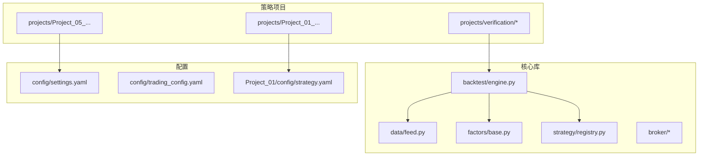
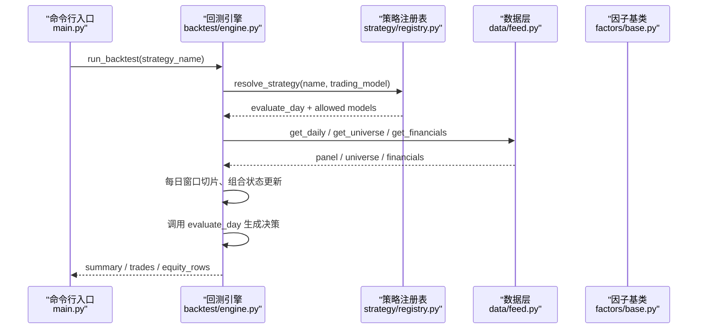
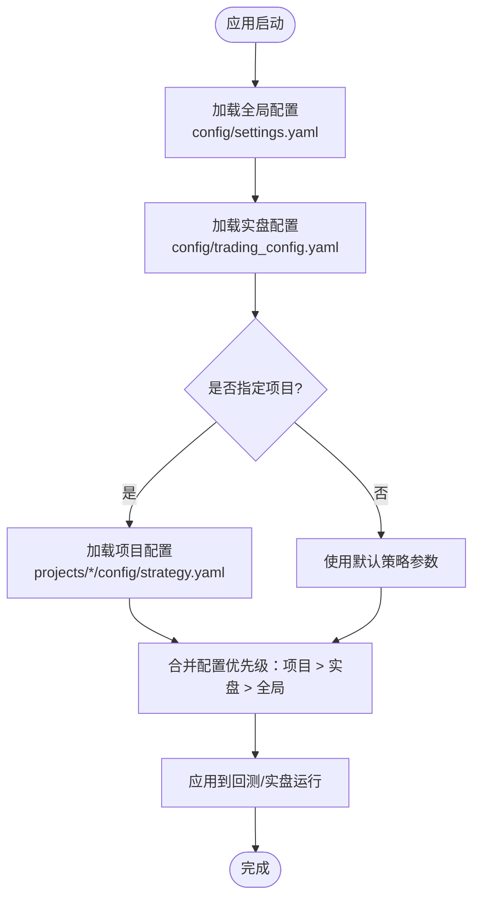
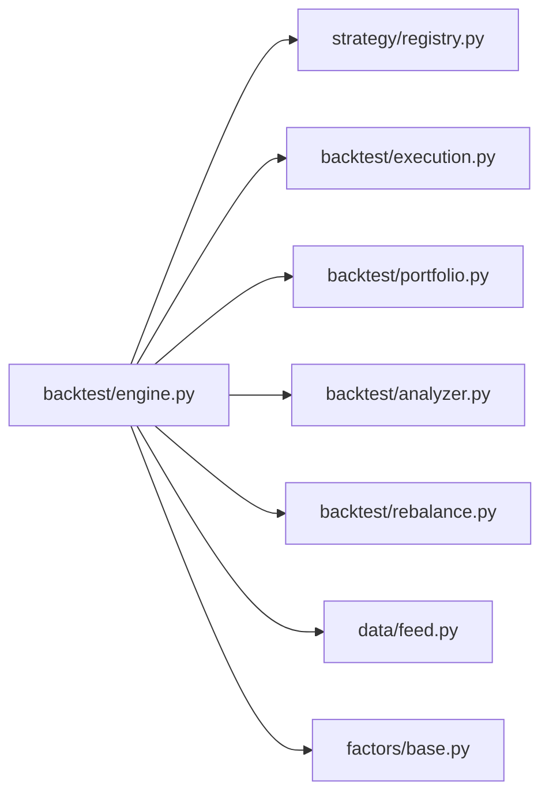

# 项目管理与组织

<cite>
**本文引用的文件**   
- [main.py](file://main.py)
- [setup.py](file://setup.py)
- [requirements.txt](file://requirements.txt)
- [.gitignore](file://.gitignore)
- [AGENTS.md](file://AGENTS.md)
- [config/settings.yaml](file://config/settings.yaml)
- [config/trading_config.yaml](file://config/trading_config.yaml)
- [projects/Project_01_多因子IC小盘Alpha/config/strategy.yaml](file://projects/Project_01_多因子IC小盘Alpha/config/strategy.yaml)
- [projects/Project_05_红利低波/run_dividend.py](file://projects/Project_05_红利低波/run_dividend.py)
- [strategy/registry.py](file://strategy/registry.py)
- [factors/base.py](file://factors/base.py)
- [data/feed.py](file://data/feed.py)
- [backtest/engine.py](file://backtest/engine.py)
- [projects/verification/engine_tests.py](file://projects/verification/engine_tests.py)
</cite>

## 目录
1. [引言](#引言)
2. [项目结构](#项目结构)
3. [核心组件](#核心组件)
4. [架构总览](#架构总览)
5. [详细组件分析](#详细组件分析)
6. [依赖分析](#依赖分析)
7. [性能考虑](#性能考虑)
8. [故障排查指南](#故障排查指南)
9. [结论](#结论)
10. [附录](#附录)

## 引言
本文件面向 QuantLab 的项目管理与组织，目标是帮助团队以一致、可复现的方式开展策略研究、回测验证与实盘部署。文档覆盖：
- 项目结构设计理念与每个策略独立目录的管理方式
- 多层次配置系统（全局、项目级、环境变量）
- 版本控制策略（代码、配置、数据）
- 团队协作规范（代码风格、命名约定、文档编写）
- 项目模板与脚手架使用方法
- 测试框架组织（单元、集成、回测验证）
- 从零开始创建新策略项目的实操案例

## 项目结构
QuantLab 采用“核心库 + 策略项目隔离”的组织方式：
- 核心库位于根目录的 backtest、data、factors、strategy、broker、scripts 等模块，提供数据、因子、回测引擎、策略注册、券商接口等能力
- 策略项目位于 projects/ 下，每个策略一个独立目录，包含策略源码、配置、结果与说明文档
- 公共配置集中在 config/ 目录，支持全局与实盘两类配置
- 验证与审计集中在 projects/verification/ 与 research_audit/

图表来源
- [backtest/engine.py:237-320](file://backtest/engine.py#L237-L320)
- [data/feed.py:17-42](file://data/feed.py#L17-L42)
- [strategy/registry.py:24-44](file://strategy/registry.py#L24-L44)
- [config/settings.yaml:1-69](file://config/settings.yaml#L1-L69)
- [config/trading_config.yaml:1-59](file://config/trading_config.yaml#L1-L59)
- [projects/Project_01_多因子IC小盘Alpha/config/strategy.yaml:1-62](file://projects/Project_01_多因子IC小盘Alpha/config/strategy.yaml#L1-L62)

章节来源
- [AGENTS.md:1-194](file://AGENTS.md#L1-L194)
- [main.py:1-104](file://main.py#L1-L104)

## 核心组件
- 回测引擎：统一调度数据读取、策略评估、执行撮合、组合管理、指标计算与报告输出
- 数据层：统一 DataFeed 接口，支持 astock parquet 与 DuckDB 双引擎，提供日线、财务、宇宙选择等能力
- 因子层：FactorBase 抽象基类，封装预处理（截尾、标准化、排序），供各因子实现复用
- 策略注册：扁平化 registry，装饰器注册 evaluate_day，自动发现 strategy/ 包下的策略模块
- 配置系统：三级级联（全局 settings.yaml、实盘 trading_config.yaml、项目级 strategy.yaml）
- 验证框架：engine_tests、robustness_tests 等，覆盖已知结果、成本、涨跌停/停牌、资金约束、一致性、先卖后买、止损等

章节来源
- [backtest/engine.py:237-619](file://backtest/engine.py#L237-L619)
- [data/feed.py:17-197](file://data/feed.py#L17-L197)
- [factors/base.py:9-52](file://factors/base.py#L9-L52)
- [strategy/registry.py:1-115](file://strategy/registry.py#L1-L115)
- [config/settings.yaml:1-69](file://config/settings.yaml#L1-L69)
- [config/trading_config.yaml:1-59](file://config/trading_config.yaml#L1-L59)
- [projects/verification/engine_tests.py:1-200](file://projects/verification/engine_tests.py#L1-L200)

## 架构总览
QuantLab 的回测主流程由 main.py 驱动，加载全局配置并调用 Project_01 的研究管线；backtest/engine.py 作为核心循环，串联数据读取、策略评估、执行与组合更新；strategy/registry.py 负责策略发现与解析；data/feed.py 提供统一数据接口；factors/base.py 定义因子基类与预处理。

图表来源
- [main.py:28-93](file://main.py#L28-L93)
- [backtest/engine.py:237-320](file://backtest/engine.py#L237-L320)
- [strategy/registry.py:204-234](file://strategy/registry.py#L204-L234)
- [data/feed.py:28-64](file://data/feed.py#L28-L64)
- [factors/base.py:9-52](file://factors/base.py#L9-L52)

## 详细组件分析

### 配置管理系统（三级级联）
- 全局配置（settings.yaml）：项目信息、数据源路径、缓存开关、回测默认参数、因子预处理、策略默认股票池、日志级别与路径、实盘配置指向
- 实盘配置（trading_config.yaml）：账号、QMT路径、交易参数（佣金、印花税、滑点）、风控阈值（止损、回撤、持有天数、换手率）、委托超时与重试、调度计划、通知、数据源路径
- 项目级配置（Project_XX/config/strategy.yaml）：策略名称与版本、因子权重、市值过滤、成交额过滤、回测参数（top_n、调仓频率、止损、交易成本、动态宇宙）、回测结果记录、实盘参数、QMT账户与测试标的

图表来源
- [config/settings.yaml:1-69](file://config/settings.yaml#L1-L69)
- [config/trading_config.yaml:1-59](file://config/trading_config.yaml#L1-L59)
- [projects/Project_01_多因子IC小盘Alpha/config/strategy.yaml:1-62](file://projects/Project_01_多因子IC小盘Alpha/config/strategy.yaml#L1-L62)

章节来源
- [AGENTS.md:90-110](file://AGENTS.md#L90-L110)
- [config/settings.yaml:1-69](file://config/settings.yaml#L1-L69)
- [config/trading_config.yaml:1-59](file://config/trading_config.yaml#L1-L59)
- [projects/Project_01_多因子IC小盘Alpha/config/strategy.yaml:1-62](file://projects/Project_01_多因子IC小盘Alpha/config/strategy.yaml#L1-L62)

### 策略项目结构与独立目录优点
- 隔离性：每个策略拥有独立的 strategy/、config/、results/、specs/ 等目录，避免相互污染
- 可追溯：回测结果与参数一一对应，便于审计与复现实验
- 构建自包含：QMT 产物在各自 build/ 子目录，不共享或拷贝到公共目录，降低部署风险
- 验证前置：新项目必须通过引擎验证与鲁棒性测试才能进入候选

章节来源
- [AGENTS.md:127-134](file://AGENTS.md#L127-L134)

### 版本控制策略（代码、配置、数据）
- 代码版本管理：使用 Git，遵循 .gitignore 忽略缓存、日志、临时文件；提交前运行相关测试
- 配置版本控制：settings.yaml、trading_config.yaml、项目级 strategy.yaml 纳入版本控制，变更需附带说明
- 数据版本管理：数据哈希（data_hash）与覆盖统计写入回测摘要，确保可复现；缓存目录 data/cache/ 被忽略，按天过期
- QMT 生产约束：GBK 编码、Python 3.6.8 兼容、禁止未来函数、硬编码账号 ID 等红线

章节来源
- [.gitignore:1-22](file://.gitignore#L1-L22)
- [backtest/engine.py:524-537](file://backtest/engine.py#L524-L537)
- [AGENTS.md:50-82](file://AGENTS.md#L50-L82)

### 团队协作规范（代码风格、命名约定、文档编写）
- 代码风格：保持最小改动，优先修根因；新增因子/策略需有 IC 分析与回测验证
- 命名约定：策略注册名即扁平模块名（如 atr_lowvol），策略模块 ALLOWED_TRADING_MODELS 声明支持的模型
- 文档编写：需求与设计放在 specs/，项目 README 与审计结果归档于项目目录内
- QMT 红线：严格遵循编码、语法、字段与生命周期要求，禁止 MOCK 混入生产

章节来源
- [strategy/registry.py:1-115](file://strategy/registry.py#L1-L115)
- [AGENTS.md:175-183](file://AGENTS.md#L175-L183)
- [AGENTS.md:50-82](file://AGENTS.md#L50-L82)

### 项目模板与脚手架工具
- 一键配置脚本 setup.py：查找 xtquant 源路径、复制到系统 Python、验证导入、创建必要目录（logs、data、data/cache）
- 快速启动：根据 AGENTS.md 指引，启动 QMT、登录账号、测试连接、启动实盘
- 依赖管理：requirements.txt 列出核心依赖与可选依赖（ML、可视化、数据源、QMT）

章节来源
- [setup.py:1-82](file://setup.py#L1-L82)
- [requirements.txt:1-29](file://requirements.txt#L1-L29)
- [AGENTS.md:157-166](file://AGENTS.md#L157-L166)

### 测试框架组织（单元、集成、回测验证）
- 引擎验证（B 模块）：已知结果、交易成本、涨跌停/停牌处理、资金约束、持仓一致性、先卖后买、止损等
- 鲁棒性验证（D 模块）：子样本、牛熊分割、压力测试、成本压力、容量、未来函数、幸存者偏差
- 本地 miniQMT 验证：通过 LocalContext 适配器快速验证选股管线与信号逻辑

章节来源
- [projects/verification/engine_tests.py:1-200](file://projects/verification/engine_tests.py#L1-L200)
- [AGENTS.md:135-156](file://AGENTS.md#L135-L156)

### 从零开始创建新策略项目（实操案例）
步骤概览：
1. 新建项目目录：projects/Project_XX_策略名称/
2. 初始化配置：
   - 复制项目级 strategy.yaml 到 projects/Project_XX_*/config/strategy.yaml
   - 在全局 settings.yaml 中确认数据源与缓存设置
   - 在 trading_config.yaml 中核对账号与交易参数
3. 编写策略逻辑：
   - 在 strategy/ 下新增模块并使用 @register_strategy("name") 注册 evaluate_day
   - 如需因子，继承 factors/base.py 的 FactorBase 实现 compute()
4. 编写回测入口：
   - 参考 projects/Project_05_红利低波/run_dividend.py 的结构，加载数据、执行回测、保存结果
5. 运行与验证：
   - 使用 main.py 或项目入口脚本运行回测
   - 运行 verification 中的引擎验证与鲁棒性测试
6. 构建与部署（QMT）：
   - 在项目 build/ 目录下生成 GBK 单文件策略，遵守 QMT 红线
7. 文档与审计：
   - 在 specs/ 与项目 README 中记录需求、设计与审计结果

章节来源
- [projects/Project_05_红利低波/run_dividend.py:1-204](file://projects/Project_05_红利低波/run_dividend.py#L1-L204)
- [strategy/registry.py:24-44](file://strategy/registry.py#L24-L44)
- [factors/base.py:9-52](file://factors/base.py#L9-L52)
- [AGENTS.md:127-134](file://AGENTS.md#L127-L134)

## 依赖分析
- 回测引擎依赖策略注册表、执行模块、组合管理、指标计算与基准读取
- 数据层依赖 astock parquet 或 DuckDB，提供统一接口
- 因子层依赖 pandas/numpy，提供通用预处理方法
- 配置系统依赖 yaml，支持多级合并

图表来源
- [backtest/engine.py:20-26](file://backtest/engine.py#L20-L26)
- [data/feed.py:17-42](file://data/feed.py#L17-L42)
- [strategy/registry.py:1-115](file://strategy/registry.py#L1-L115)
- [factors/base.py:9-52](file://factors/base.py#L9-L52)

章节来源
- [backtest/engine.py:20-26](file://backtest/engine.py#L20-L26)
- [data/feed.py:17-42](file://data/feed.py#L17-L42)
- [strategy/registry.py:1-115](file://strategy/registry.py#L1-L115)
- [factors/base.py:9-52](file://factors/base.py#L9-L52)

## 性能考虑
- 数据窗口切片优化：使用预计算的 cut_index 进行 O(1) 切片，避免重复搜索
- 基准序列对齐：提前加载并填充缺失值，减少运行时开销
- 因子预处理：winsorize/zscore/rank_normalize 在基类中实现，避免重复计算
- 缓存机制：data/cache/ 启用时按天过期，减少重复 IO
- 回测摘要：记录 data_hash、universe_hash、config_hash，便于定位性能差异

章节来源
- [backtest/engine.py:121-147](file://backtest/engine.py#L121-L147)
- [backtest/engine.py:38-100](file://backtest/engine.py#L38-L100)
- [factors/base.py:30-52](file://factors/base.py#L30-L52)
- [data/feed.py:16-19](file://data/feed.py#L16-L19)
- [backtest/engine.py:524-537](file://backtest/engine.py#L524-L537)

## 故障排查指南
- 数据路径错误：检查 astock 路径与 parquet 文件是否存在，确认 DataFeed.source 配置
- 基准数据缺失：确认 benchmark_db_path 与代码存在，检查日期对齐与缺失填充
- 策略未注册：检查 strategy/ 模块是否正确使用 @register_strategy，并确保 autodiscover 未被跳过
- 配置冲突：确认项目级配置优先级高于全局与实盘配置，避免覆盖错误
- QMT 连接失败：使用 test_connection.py 与 test_connection_qmt.py 分别验证外部与 QMT 环境

章节来源
- [data/feed.py:71-104](file://data/feed.py#L71-L104)
- [backtest/engine.py:38-100](file://backtest/engine.py#L38-L100)
- [strategy/registry.py:96-115](file://strategy/registry.py#L96-L115)
- [AGENTS.md:146-156](file://AGENTS.md#L146-L156)

## 结论
QuantLab 通过清晰的分层架构与严格的配置与版本管理，为策略研究与实盘提供了稳定、可复现的基础设施。建议团队在新增策略时严格遵循项目模板与验证流程，确保质量与可维护性。

## 附录
- 快速启动与部署：参考 AGENTS.md 的实盘调度与 QMT 红线
- 依赖与环境：使用 requirements.txt 安装依赖，setup.py 完成一键配置
- 测试与审计：运行 verification 与 research_audit 脚本，产出报告与审计结果

章节来源
- [AGENTS.md:157-194](file://AGENTS.md#L157-L194)
- [requirements.txt:1-29](file://requirements.txt#L1-L29)
- [setup.py:1-82](file://setup.py#L1-L82)