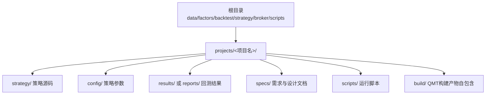
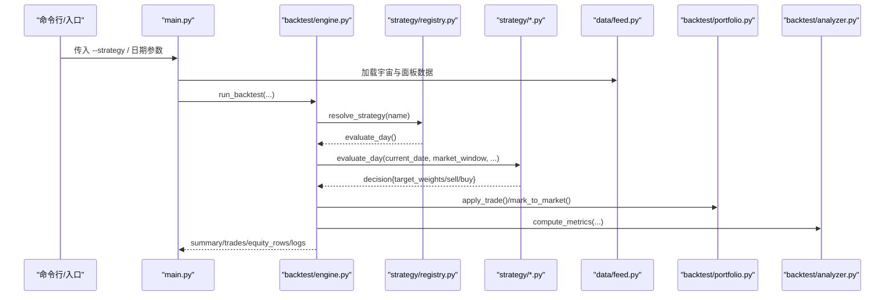
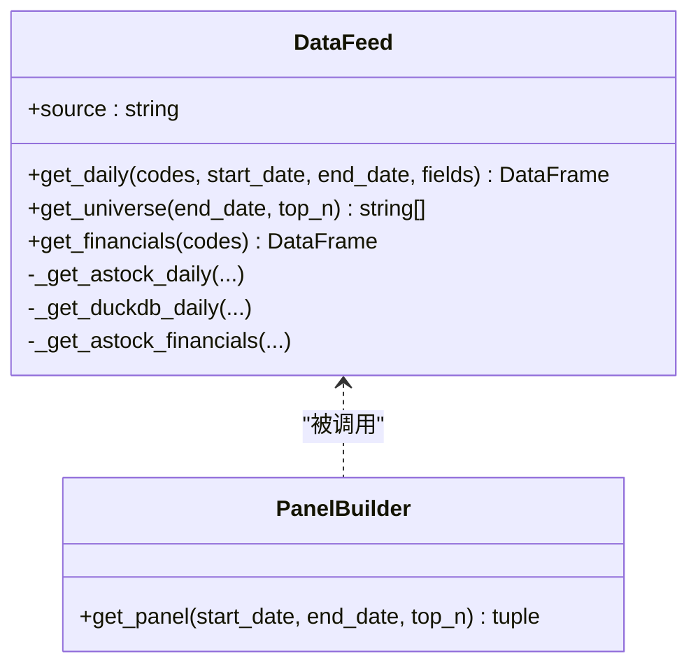
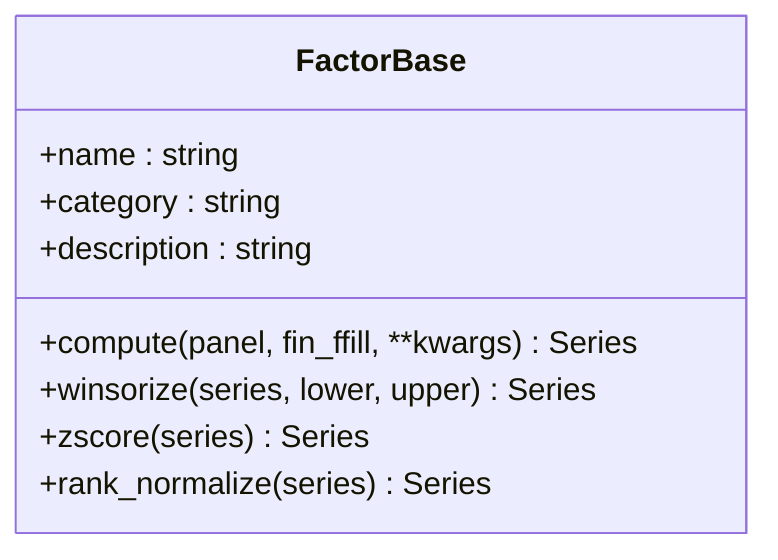
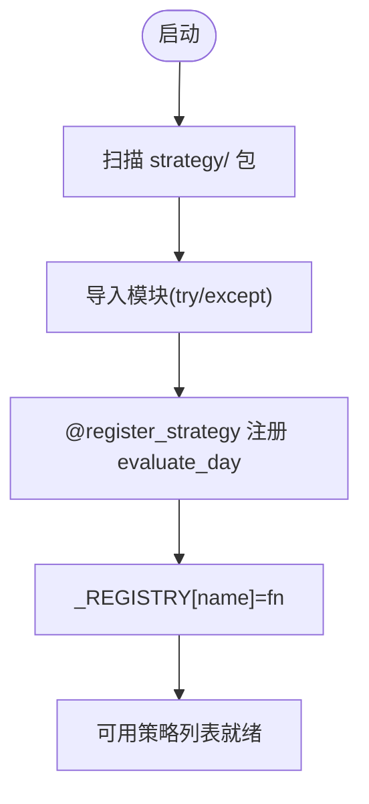
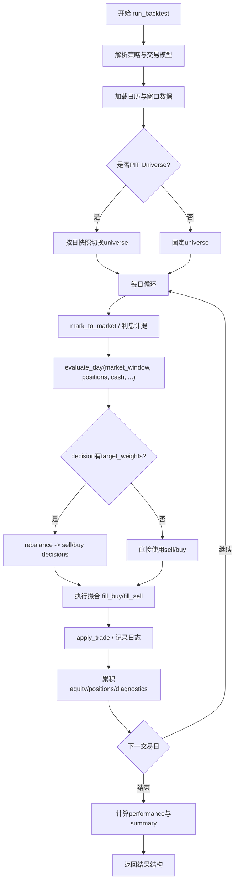
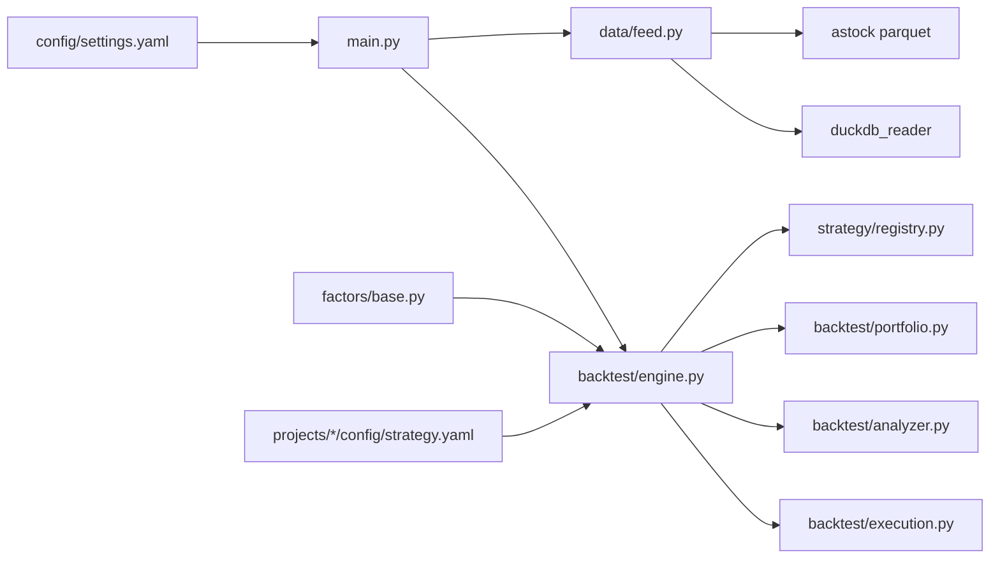

# 项目结构设计

<cite>
**本文引用的文件**   
- [main.py](file://main.py)
- [setup.py](file://setup.py)
- [requirements.txt](file://requirements.txt)
- [AGENTS.md](file://AGENTS.md)
- [快速启动.md](file://快速启动.md)
- [config/settings.yaml](file://config/settings.yaml)
- [projects/Project_01_多因子IC小盘Alpha/config/strategy.yaml](file://projects/Project_01_多因子IC小盘Alpha/config/strategy.yaml)
- [projects/Project_05_红利低波/run_dividend.py](file://projects/Project_05_红利低波/run_dividend.py)
- [projects/Project_10_价值小盘V2/PROJECT_README.md](file://projects/Project_10_价值小盘V2/PROJECT_README.md)
- [strategy/registry.py](file://strategy/registry.py)
- [factors/base.py](file://factors/base.py)
- [data/feed.py](file://data/feed.py)
- [backtest/engine.py](file://backtest/engine.py)
</cite>

## 目录
1. [引言](#引言)
2. [项目结构总览](#项目结构总览)
3. [核心组件与职责](#核心组件与职责)
4. [架构总览](#架构总览)
5. [详细组件分析](#详细组件分析)
6. [依赖关系分析](#依赖关系分析)
7. [性能与可扩展性](#性能与可扩展性)
8. [故障排查指南](#故障排查指南)
9. [结论](#结论)
10. [附录：项目模板与创建流程](#附录项目模板与创建流程)

## 引言
本文件面向 QuantLab 的项目结构设计，聚焦“策略独立目录”的组织方式、标准模板、版本隔离与团队协作机制，并给出从初始化到配置落地的完整流程。文档同时覆盖数据层、因子层、回测引擎、策略注册与构建产物等关键模块的协作关系，帮助读者在理解代码级实现的同时，把握整体架构与最佳实践。

## 项目结构总览
QuantLab 采用“根框架 + 策略项目隔离”的双层组织：
- 根目录提供统一的数据接口、因子库、回测引擎、策略注册、券商对接与通用脚本。
- projects 目录下每个策略一个独立项目，拥有自己的 strategy、config、results/reports、specs、scripts 等子目录，确保回测、配置、结果与文档完全隔离，便于版本管理与团队协作。

**图示来源** 
- [AGENTS.md:128-133](file://AGENTS.md#L128-L133)
- [快速启动.md:40-57](file://快速启动.md#L40-L57)

**章节来源**
- [AGENTS.md:128-133](file://AGENTS.md#L128-L133)
- [快速启动.md:40-57](file://快速启动.md#L40-L57)

## 核心组件与职责
- 数据层 data/feed.py：统一 DataFeed 接口，支持 astock parquet 与 DuckDB 双引擎，提供日线、股票池、财务数据读取与面板构建。
- 因子层 factors/base.py：FactorBase 抽象基类，封装 winsorize/zscore/rank_normalize 预处理；配合 engine 完成注册与批量计算。
- 策略注册 strategy/registry.py：装饰器式注册 evaluate_day，自动扫描 strategy/ 包下模块，避免重依赖与慢导入。
- 回测引擎 backtest/engine.py：主循环串联 reader → strategy.evaluate_day → execution → portfolio → metrics，输出内存结果与汇总信息。
- 全局配置 config/settings.yaml：项目信息、数据源路径、回测默认参数、日志与因子预处理开关。
- 项目级配置 projects/*/config/strategy.yaml：策略名称、因子权重、市值过滤、调仓频率、止损、实盘与 QMT 参数。
- 构建与部署 broker/qmt_builder.py 与各项目的 build.py：UTF-8 源码 → GBK 单文件构建，注入 BUILD_TAG，语法检查与验证。

**章节来源**
- [data/feed.py:17-135](file://data/feed.py#L17-L135)
- [factors/base.py:9-52](file://factors/base.py#L9-L52)
- [strategy/registry.py:24-115](file://strategy/registry.py#L24-L115)
- [backtest/engine.py:237-619](file://backtest/engine.py#L237-L619)
- [config/settings.yaml:1-69](file://config/settings.yaml#L1-L69)
- [projects/Project_01_多因子IC小盘Alpha/config/strategy.yaml:1-62](file://projects/Project_01_多因子IC小盘Alpha/config/strategy.yaml#L1-L62)

## 架构总览
下图展示从入口到回测执行的关键调用链与数据流，体现“策略项目隔离 + 统一引擎”的设计。

**图示来源** 
- [main.py:28-93](file://main.py#L28-L93)
- [backtest/engine.py:237-619](file://backtest/engine.py#L237-L619)
- [strategy/registry.py:96-115](file://strategy/registry.py#L96-L115)
- [data/feed.py:137-181](file://data/feed.py#L137-L181)

## 详细组件分析

### 数据层：DataFeed 与面板构建
- 统一接口：get_daily/get_universe/get_financials，内部按 source 分发到 astock 或 duckdb 读取器。
- 面板构建：将日线与财务数据对齐，生成 MultiIndex(date, code) 面板与财务前向填充表，供因子与策略使用。
- 缓存与路径：默认 astock parquet 路径与 DuckDB 路径可配置，支持按日期范围与字段裁剪。

**图示来源** 
- [data/feed.py:17-135](file://data/feed.py#L17-L135)
- [data/feed.py:137-181](file://data/feed.py#L137-L181)

**章节来源**
- [data/feed.py:17-135](file://data/feed.py#L17-L135)
- [data/feed.py:137-181](file://data/feed.py#L137-L181)

### 因子层：FactorBase 与预处理
- FactorBase 定义 compute 抽象方法，并提供 winsorize、zscore、rank_normalize 静态工具。
- 新因子继承基类，实现 compute(panel, fin_ffill, **kwargs)，返回 Series(index=(date, code))。
- 预处理顺序遵循：截尾 → 标准化 → 方向控制，保证因子可比性与稳定性。

**图示来源** 
- [factors/base.py:9-52](file://factors/base.py#L9-L52)

**章节来源**
- [factors/base.py:9-52](file://factors/base.py#L9-L52)

### 策略注册与发现
- 使用 @register_strategy("<name>") 装饰器在模块顶层注册 evaluate_day。
- autodiscover 扫描 strategy/ 包下所有模块，跳过已知非目标模块，单个模块导入失败不影响整体。
- get_strategy/list_strategies 提供查询与诊断能力。

**图示来源** 
- [strategy/registry.py:24-115](file://strategy/registry.py#L24-L115)

**章节来源**
- [strategy/registry.py:24-115](file://strategy/registry.py#L24-L115)

### 回测引擎：run_backtest 主循环
- 解析策略：resolve_strategy 校验 trading_model 并获取 evaluate_day。
- 数据准备：reader.coverage/trading_calendar/load_window，预计算 cut_index 加速窗口切片。
- 每日循环：持仓标记、利息计提、评估决策、执行撮合、组合更新、指标统计。
- 基准处理：加载基准序列，补齐缺失，计算基准收益与可用性判断。
- 输出：summary/trades/equity_rows/positions_rows/logs 等内存结构，后续由 report.py 落盘。

**图示来源** 
- [backtest/engine.py:237-619](file://backtest/engine.py#L237-L619)

**章节来源**
- [backtest/engine.py:237-619](file://backtest/engine.py#L237-L619)

### 项目模板与标准结构
- 必需目录：
  - strategy/：策略模块化代码（评分、风控、选股管线）。
  - config/strategy.yaml：策略参数（因子权重、市值过滤、调仓频率、止损、QMT 账号等）。
  - results/ 或 reports/：回测结果（净值曲线、交易明细、指标文本/JSON）。
  - specs/：需求与设计文档（策略逻辑、风控规则、验收标准）。
- 可选目录：
  - scripts/：运行脚本（本地回测、敏感性分析、对比实验）。
  - build/：QMT 构建产物（GBK 单文件，自包含，不共享）。
  - research/：研究代码（如 Project_01 的 multi_factor_ic 子包）。
- 示例差异：
  - Project_01：含 research/multi_factor_ic 与 strategy/scoring，reports/param_matrix_*.csv。
  - Project_05：简单回测脚本 run_dividend.py，results/ 输出 equity/trades/metrics。
  - Project_10：完整开发工作流，build.py 构建 GBK 部署文件，strategy_v2.py 为 UTF-8 维护位。

**章节来源**
- [AGENTS.md:128-133](file://AGENTS.md#L128-L133)
- [projects/Project_01_多因子IC小盘Alpha/config/strategy.yaml:1-62](file://projects/Project_01_多因子IC小盘Alpha/config/strategy.yaml#L1-L62)
- [projects/Project_05_红利低波/run_dividend.py:1-204](file://projects/Project_05_红利低波/run_dividend.py#L1-L204)
- [projects/Project_10_价值小盘V2/PROJECT_README.md:57-97](file://projects/Project_10_价值小盘V2/PROJECT_README.md#L57-L97)

### 项目间依赖与资源共享
- 公共依赖：
  - data/feed.py、factors/base.py、strategy/registry.py、backtest/engine.py 作为根框架被各项目复用。
  - config/settings.yaml 提供全局数据源与回测默认值。
- 项目隔离：
  - 各项目的 strategy/config/results/specs 互不干扰，便于并行开发与版本管理。
  - QMT 构建产物 build/ 自包含，避免跨项目污染。
- 共享机制：
  - 通过 Python 包导入与 sys.path 扩展（如 main.py 添加 Project_01 路径）实现研究代码复用。
  - 文件交换目录 D:/QMT_POOL/ 用于实盘与 QMT 共享预生成 CSV 与状态文件。

**章节来源**
- [main.py:11-18](file://main.py#L11-L18)
- [AGENTS.md:96-109](file://AGENTS.md#L96-L109)

## 依赖关系分析
下图展示关键模块间的依赖与调用关系，突出“策略项目隔离 + 统一引擎”的解耦设计。

**图示来源** 
- [main.py:28-93](file://main.py#L28-L93)
- [backtest/engine.py:237-619](file://backtest/engine.py#L237-L619)
- [data/feed.py:17-135](file://data/feed.py#L17-L135)
- [factors/base.py:9-52](file://factors/base.py#L9-L52)
- [config/settings.yaml:1-69](file://config/settings.yaml#L1-L69)

**章节来源**
- [main.py:28-93](file://main.py#L28-L93)
- [backtest/engine.py:237-619](file://backtest/engine.py#L237-L619)
- [data/feed.py:17-135](file://data/feed.py#L17-L135)
- [factors/base.py:9-52](file://factors/base.py#L9-L52)
- [config/settings.yaml:1-69](file://config/settings.yaml#L1-L69)

## 性能与可扩展性
- 数据层：
  - astock parquet 一次性加载与缓存，减少重复 IO；DuckDB 适合复杂查询与增量更新。
  - 面板构建时仅保留必要字段，降低内存占用。
- 因子层：
  - 预处理函数均为向量化操作，避免逐行循环；建议对大面板分块计算。
- 回测引擎：
  - 预计算 cut_index 实现 O(1) 窗口切片，显著提升每日循环效率。
  - 基准序列前向填充与断点检测，避免无效 IR/excess 计算。
- 可扩展性：
  - 新增因子只需继承 FactorBase 并注册；新增策略通过 @register_strategy 装饰器即可接入。
  - 数据源可通过 DataFeed.source 切换，无需改动上层逻辑。

[本节为通用指导，不直接分析具体文件]

## 故障排查指南
- 数据路径错误：
  - 检查 config/settings.yaml 中 astock/duckdb 路径是否存在与可读。
  - 确认 data/cache 目录权限与磁盘空间。
- 策略未注册：
  - 确认 strategy/*.py 模块顶层存在 @register_strategy("name")。
  - 查看 strategy/registry.py 的 autodiscover 日志，确认模块未被跳过。
- 回测无数据或基准不可用：
  - 检查 calendar 是否为空、benchmark_db_path 是否存在且包含有效序列。
  - 关注 engine 输出的 benchmark_note 与 sample_period_warning。
- QMT 构建失败：
  - 确认 build.py 生成的 GBK 文件头为 # coding=gbk，BUILD_TAG 已替换。
  - 验证 Python 3.6.8 兼容语法，避免 f-string、类型注解等不支持特性。

**章节来源**
- [config/settings.yaml:1-69](file://config/settings.yaml#L1-L69)
- [strategy/registry.py:96-115](file://strategy/registry.py#L96-L115)
- [backtest/engine.py:237-619](file://backtest/engine.py#L237-L619)
- [projects/Project_10_价值小盘V2/build.py:44-68](file://projects/Project_10_价值小盘V2/build.py#L44-L68)

## 结论
QuantLab 通过“根框架 + 策略项目隔离”的架构，实现了数据、因子、策略与回测的清晰分层与高内聚低耦合。每个策略项目拥有独立的配置、代码与结果目录，便于版本管理、团队协作与审计追溯。统一的 DataFeed、FactorBase、Strategy Registry 与 Backtest Engine 降低了重复开发成本，提升了可扩展性与可维护性。结合严格的 QMT 构建规范与 PIT 安全约定，确保了从研究到实盘的稳健落地。

[本节为总结性内容，不直接分析具体文件]

## 附录：项目模板与创建流程

### 标准模板结构
- 必需：
  - strategy/：策略模块化代码（评分、风控、选股）。
  - config/strategy.yaml：策略参数（因子权重、市值过滤、调仓频率、止损、QMT 账号）。
  - results/ 或 reports/：回测结果（净值、交易、指标）。
  - specs/：需求与设计文档。
- 可选：
  - scripts/：运行脚本（回测、敏感性分析）。
  - build/：QMT 构建产物（GBK 单文件，自包含）。
  - research/：研究代码（如 multi_factor_ic 子包）。

**章节来源**
- [AGENTS.md:128-133](file://AGENTS.md#L128-L133)
- [projects/Project_10_价值小盘V2/PROJECT_README.md:57-97](file://projects/Project_10_价值小盘V2/PROJECT_README.md#L57-L97)

### 从零创建项目流程
1. 初始化环境：
   - 安装依赖：pip install -r requirements.txt。
   - 一键配置：python setup.py（复制 xtquant、创建 logs/data/cache 目录）。
2. 创建项目目录：
   - 新建 projects/Project_XX_名称/，创建 strategy/config/results/specs 子目录。
3. 编写策略与配置：
   - 在 strategy/ 中实现评分与风控逻辑，并在 config/strategy.yaml 中设置参数。
4. 运行回测：
   - 在项目根或 scripts/ 中编写 run_xxx.py，调用 backtest.engine.run_backtest。
   - 或通过 main.py --strategy 指定策略名称运行。
5. 构建 QMT 部署文件：
   - 编辑 UTF-8 源码（如 strategy_v2.py），运行 python build.py 生成 build/strategy_v2.py（GBK）。
6. 验证与提交：
   - 本地 miniQMT 验证（broker/local_context.LocalContext），模拟盘跑 1 个交易日核对日志。
   - 提交代码与构建产物至版本库，记录变更与测试结果。

**章节来源**
- [setup.py:1-82](file://setup.py#L1-L82)
- [requirements.txt:1-29](file://requirements.txt#L1-L29)
- [快速启动.md:1-67](file://快速启动.md#L1-L67)
- [main.py:95-104](file://main.py#L95-L104)
- [projects/Project_10_价值小盘V2/PROJECT_README.md:76-97](file://projects/Project_10_价值小盘V2/PROJECT_README.md#L76-L97)