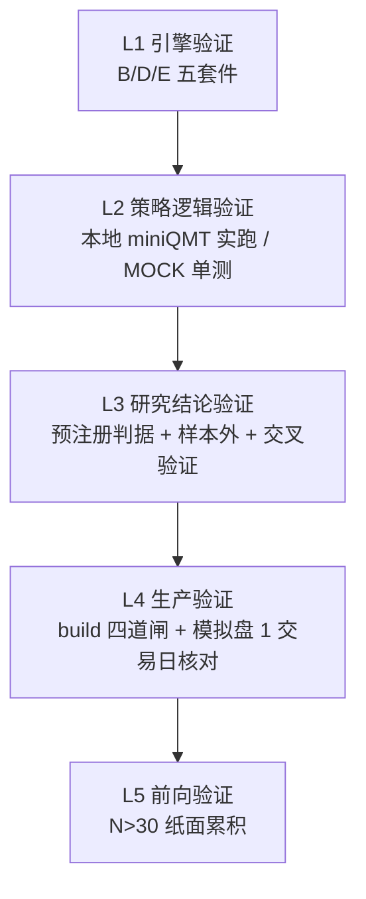

# 验证框架设计

<cite>
**本文档引用的文件**
- [projects/verification/engine_tests.py](file://projects/verification/engine_tests.py) — B-1~B-8 引擎机制
- [projects/verification/robustness_tests.py](file://projects/verification/robustness_tests.py) — D-1~D-7 鲁棒性
- [projects/verification/execution_tests.py](file://projects/verification/execution_tests.py) — E-1~E-5 执行层
- [projects/verification/feasibility_tests.py](file://projects/verification/feasibility_tests.py)
- [projects/verification/portfolio_tests.py](file://projects/verification/portfolio_tests.py)
- [projects/Project_ATR_lowvol/validate_build.py](file://projects/Project_ATR_lowvol/validate_build.py) — build 四道验证闸
- [scripts/check_capital_allocation.py](file://scripts/check_capital_allocation.py) — 资金分配校验器
- [research_audit/factor_health.py](file://research_audit/factor_health.py) — 因子健康监控
</cite>

## 目录
1. [引言](#引言)
2. [五套测试套件](#五套测试套件)
3. [分层验证策略](#分层验证策略)
4. [研究验证方法论](#研究验证方法论)
5. [生产侧质量闸](#生产侧质量闸)
6. [自动化工作流](#自动化工作流)
7. [测试用例规范](#测试用例规范)
8. [章节来源](#章节来源)

## 引言

QuantLab 的验证分两条线：**引擎验证**（保证框架本身没错）与**研究验证**（保证策略结论可信）。前者靠五个测试套件，后者靠预注册 + 样本外 + 交叉验证的方法论纪律。

> 核心判断：**本仓的重大事故极少来自引擎 bug，绝大多数来自「结论可信度」——口径虚高、幸存者偏差、前视污染、样本内选优**。因此研究验证的纪律性比测试覆盖率更关键。

## 五套测试套件

| 套件 | 用例 | 覆盖 |
|---|---|---|
| `engine_tests.py` | **B-1 ~ B-8** | 引擎机制（信号→撮合→组合→指标主链路） |
| `robustness_tests.py` | **D-1 ~ D-7** | 鲁棒性（参数扰动/随机种子/子区间稳定性） |
| `execution_tests.py` | **E-1 ~ E-5** | 执行层（容量约束 `max_adv_pct` 等，2026-08-11 新增） |
| `feasibility_tests.py` | — | 可行性（数据可得性/候选池规模） |
| `portfolio_tests.py` | — | 组合层（权重归一化/现金约束） |

**当前状态（2026-08-16 全量回归）**：

```
B-1~B-8 (8/8) + D-1~D-7 + E-1~E-5 (5/5) + feasibility + portfolio  全绿
```

**运行注意**：

- 需 pyarrow / duckdb。
- pandas 3.0 下 `datetime64 vs date` 比较会报错，需去掉 `.date()`（`engine_tests.py:25` / `feasibility_tests.py:59`）。
- 无需 py3.11，py3.13 / pandas 3.0 环境可全量跑通。

## 分层验证策略



| 层 | 目的 | 失败代价 |
|---|---|---|
| L1 | 框架无 bug | 全部结论作废 |
| L2 | 选股/下单管线通 | 实盘空转 |
| L3 | 结论不是假象 | 亏钱 |
| L4 | 部署版本对得上 | 幽灵运行/废单 |
| L5 | 真实 alpha 有证据 | 运气被当能力 |

## 研究验证方法论

### 1. 预注册（Pre-registration）

**所有新方向在跑之前冻结判据，跑完零改判**。这是 2026-08 月三条线（P17 情绪周期 / P18 买卖点 / 菜场大妈风控栈）能干净证伪的关键。

```
specs/任务书_vN.md  →  冻结判据与门槛  →  执行  →  按判据裁决  →  归档结题
                            ↑ 中途禁止修改
```

**实例**：菜场大妈预注册判据「回撤减半（≤-16.3%）**且** CAGR>20%」→ 两条件无交集 → 干净证伪，不做任何事后解释。

### 2. 逐级归因消融（A0 → A4）

用于定位「高收益」的真实来源，标准五级阶梯：

| 层级 | 口径 | 量化对象 |
|---|---|---|
| A0 | 模拟器复现（幸存者池 + 前视财务 + 零成本 + 涨停可买） | 复刻原声称 |
| A1 | 全池 | 幸存者偏差 |
| A2 | 财务 PIT | 前视偏差 |
| A3 | 涨跌停/停牌 | 可交易性 |
| A4 | 引擎全设施裁决（next_open + 成本） | 干净口径终裁 |

**实测（菜场大妈）**：

```
A0 = +53.03%  →  A1 = +53.09%  （幸存者偏差可忽略，六步过滤本身即排雷器）
              →  A2 = +47.64%  （财务前视 -5.45pp，最大虚高源）
              →  A3 = +45.66%  （可交易性 -1.98pp）
              →  A4 = +37.73%  （引擎干净口径，MDD -32.6%）
```

### 3. 交叉验证

- **数据源对拍**：P18 用 gpsj 对拍 astock，2020 单年 600 只信号数/统计量完全一致（85=85），证明结论非数据口径假象。
- **锚回归**：重跑基线必须与原 KPI 逐位一致，否则说明复现环境有偏（菜场大妈 14 变体 R0 锚回归 PASS）。
- **⚠️ 已知坑**：`data/gpsj_reader.py` 的 `is_st` 语义与 astock/tushare **相反**（gpsj `ST`=0 是 ST、1 正常），凡用 gpsj_reader 的 is_st 做 ST 过滤结果会反转。**状态：待修（T-20260827-003）**。

### 4. 反事实与对照组

| 方法 | 实例 | 揭示的假象 |
|---|---|---|
| **恒定仓位对照** | P17 方向 B：恒定 30% 仓 CAGR +0.98% / MDD -13.31% **全面碾压**覆盖层 -0.02% / -31.65% | 弱阳性纯属 72% 时间空仓的现金拖累假象 |
| **剔一字板对照** | P17 V3：M1 PASS（+1.97%）→ M1′ 剔一字板后 **-2.32%**（p=1.0） | 名义超额 100% 由**买不到的一字板**贡献 |
| **反事实卖出规则** | P13 模拟已校准 ±0.02pp，验证 trail15 是唯一正优化 | 主观"感觉有效"的卖出规则多为负贡献 |
| **PIT 修复前后对照** | Trae：orig 2026H1 +54.2% → pitfix 后只剩 +6.8% | 原收益来自恰好全仓买了 002636（当季 +298%）等数笔，路径依赖刀锋级 |

### 5. 分年度与子窗口

**任何全期数字都必须拆年份看**。典型失效模式：全期漂亮但近 3 年亏钱（收益来自前段遗产）。

| 检查项 | 门槛 |
|---|---|
| 分年度符号一致性 | delta 符号不能来回翻转 |
| 近段（2023-2026）表现 | 不得显著劣于全期 |
| 样本外（2015-2018 或 2024+） | 必须与样本内同号 |

### 6. 容量与可执行性

> **流动性是策略的死刑判决线**。菜场大妈在 100 万本金下 3840 笔买入 100% 被拒，CAGR 归零——**IC 再高，买不进就是 0**。

立项前必须评估：`max_adv_pct` 约束下的可捕获收益，而非纸面收益。

## 生产侧质量闸

### build 四道验证闸（`validate_build.py`）

| 闸 | 检查项 | 失败后果 |
|---|---|---|
| 静态 | GBK 可解码、首行 `# coding=gbk`、`ast.parse(feature_version=(3,6))`、无 f-string/walrus/match/新式标注 | QMT 直接崩 |
| 关键标记 | 策略名、账号、BUILD_TAG、风控阈值全在 | 跑错版本 |
| 腐蚀 | `?` 乱码计数 | 中文语义丢失（曾 4168 个 U+FFFD） |
| 功能 | 模块整体 exec + 核心函数单测 | 运行时炸 |

> 事故教训：2026-08-19 GLM 审计发现 Fix4 build 编码腐蚀 4168 个 `?`（`沪深A股`→`????A??`、`买入/卖出`→`????`），**从未真正部署远程**。此后所有部署必须跑 `validate_build.py` + **字节级 identical 校验**。

### 其他校验器

| 校验器 | 触发时机 | 失败行为 |
|---|---|---|
| `scripts/check_capital_allocation.py` | 改 `capital_base` 后 | 非零退出 = **禁止部署** |
| `verify_model_panel_sync.py`（P16） | 每日 + retrain | 面板最新日 ≠ 模型绑定日 → exit 1（fail-loud） |
| MOCK 单测套件 | 每次改 build | ATR 45/45、V2 36/36、P13 34/34 |
| `research_audit/factor_health.py` | 每周五 19:30 | FAILED/DEGRADED/WATCH 衰减告警 |

### 模拟盘 1 交易日核对清单

部署后必须核对（模板 `projects/Project_10_价值小盘V2/specs/模拟盘复跑核对清单_*.md`）：

- [ ] 新 `build=` TAG 出现在日志
- [ ] 筛选候选 > 0
- [ ] 真实买入（非纸面建仓）
- [ ] 无刷屏/无死循环
- [ ] 对账无异常
- [ ] 持仓数 ≤ 上限、无孤儿、无重复下单

## 自动化工作流

| 计划任务 | 频率 | 内容 |
|---|---|---|
| `QuantLab_FactorHealth_Monitor` | 每周五 19:30 | 因子 IC 健康度扫描 |
| `P13_529_signal_daily` | 周一至周五 15:40 | 529 信号日更 CSV |
| P16 `run_scheduled.ps1` daily | 每日 16:30/16:45 | `xtdata_update → merge_live_features → deploy_predict → reconcile_trades → verify_model_panel_sync` |
| P16 `paper_forward_daily` | 每日 16:45 | V2.0 g2 前向候选累积 |
| P16 retrain | 周一 17:00 | `refresh_panel_v3 → train_optuna` |

> ⚠️ **P16 调度环境坑（2026-08-28 修复）**：`run_scheduled.ps1` 需注入 `$env:PYTHONIOENCODING = "utf-8"`，否则 Python 子脚本打印 ✅ 等字符时 stdout GBK `UnicodeEncodeError` → exit=1，且 reconcile 的「持仓不一致需人工核查」实为**编码崩溃假警报**。

## 测试用例规范

**编号约定**：

- `B-n` — Backtest engine（引擎机制）
- `D-n` — robustness（鲁棒性）
- `E-n` — execution（执行层）
- `F-n` / `M-n` — 项目级功能/主循环状态机单测（如 ATR F10-F12 account guard、M9 主循环）

**fail-loud 原则**：所有校验器在异常时**必须非零退出并报警**，禁止静默降级。

**快照/回归**：重跑基线必须与原 KPI 逐位一致（锚回归），否则先查环境而非改判据。

## 章节来源

- [projects/verification/engine_tests.py](file://projects/verification/engine_tests.py)
- [projects/verification/execution_tests.py](file://projects/verification/execution_tests.py)
- [projects/Project_ATR_lowvol/validate_build.py](file://projects/Project_ATR_lowvol/validate_build.py)
- [全局控制台.md:200-330](file://全局控制台.md#L200-L330)
- [研究总览与路线图.md:126-135](file://研究总览与路线图.md#L126-L135)
